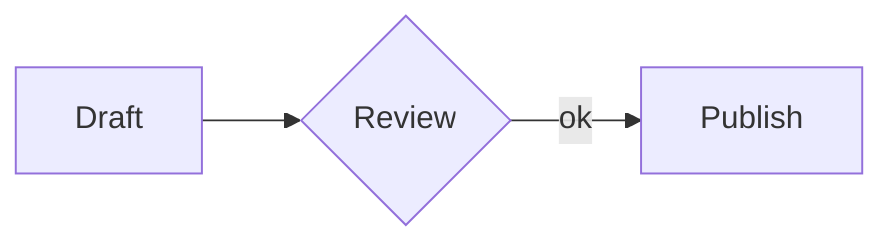
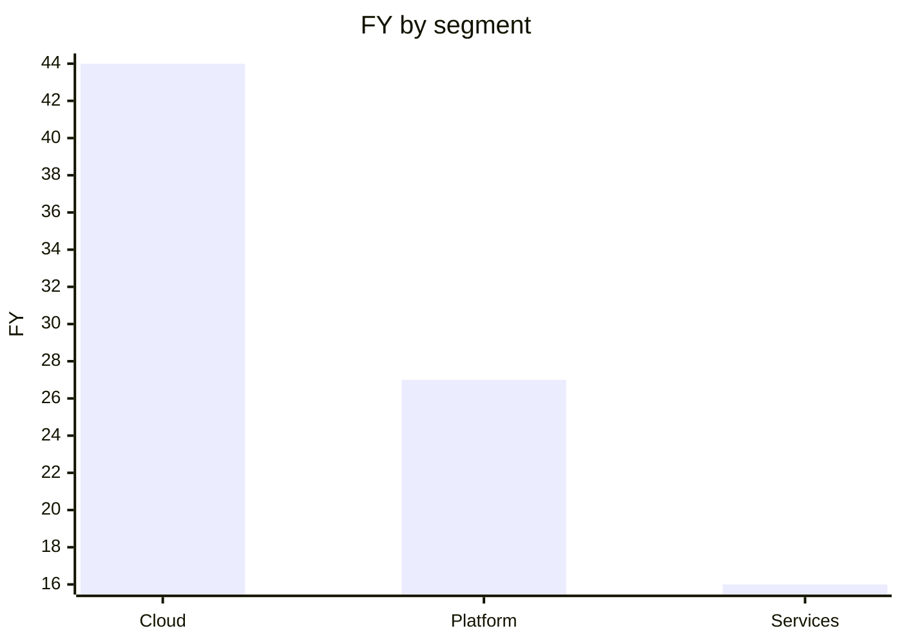
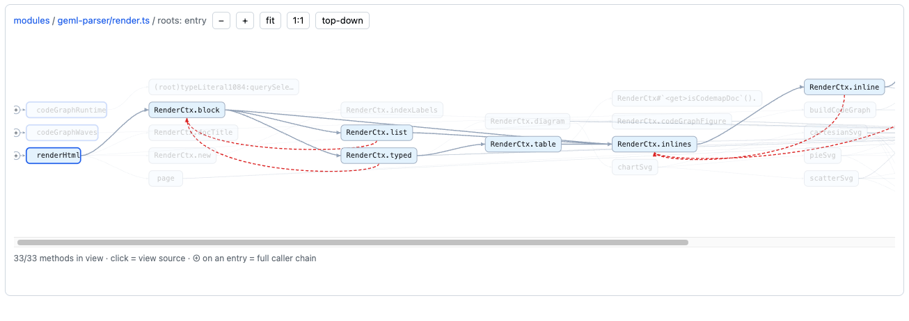

<p align="center">
  <picture>
    <source media="(prefers-color-scheme: dark)" srcset="docs/assets/logo/geml-logo-dark.svg">
    
  </picture>
</p>

# GEML — General Expressive Markup Language

*English | [中文](README_CN.md)*

**One format, two readers.**<br>
People *and* AI agents now co-write the same document.<br>
Legible for people; addressable, verifiable, and versioned for machines.

GEML is plain text — organized by **one typed block for everything**, remembered by a **`.gemlhistory` sidecar**.

`1.0`


---

GEML is a markup language for structured documents. A `.geml` file reads as plain text, so you never need a renderer to read it. And instead of a separate mini-syntax for each kind of content, GEML puts everything on one construct: the **typed block**.

```
=== code {#hello lang=python}
print("hi")
===
```

Code is a block. So are tables, diagrams, math, callouts, and document metadata. The shape is the same every time, which makes the format easy to learn and hard to get wrong.

## Why a new format now

Markdown was designed for documents that **people hand-write and people read**. Today the same documents are also written, edited, reviewed, and queried by **AI agents and CI pipelines** — and that shift asks three things of a format that Markdown was never built to give:

- **Predictable structure**, so a model emits valid output instead of guessing among a pile of per-feature special cases.
- **References that can be verified**, so an automated edit that breaks a link fails loudly instead of rotting silently.
- **History that travels with the document**, so a reader — human or agent — can see how and why it changed, offline and with no external service.

GEML is built around those three. The goal wasn't to bolt "AI features" onto a document format. It was to pick a format that is both simpler for people and more dependable for machines.

## What's different about GEML

Plenty of formats do one or two of these. What's unusual about GEML is that one plain-text format does all three:

1. **One primitive for every structured block.** Code, tables, diagrams, math, callouts, metadata — all the same `=== type {…}` typed block. One grammar to learn, one grammar to generate correctly: no per-feature syntax, no HTML fallback.
2. **References checked at build time.** Put an `#id` on any block and reference it anywhere; a dangling reference or a broken cross-document link is a build **error**, not a silent 404. Automated edits can't quietly rot.
3. **Self-contained version history.** A sibling `.gemlhistory` file reconstructs any past revision and rolls the document back — offline, with no git and no service — and it's plain text an agent can read to understand how the document evolved.

For a fuller side-by-side across **Markdown, HTML, CommonMark, AsciiDoc, and Org-mode**, see the [format comparison](docs/COMPARISON.md).

## The format in 5 minutes

### Typed blocks

**One shape, every type.** A block is always `=== type {#id .class key=val}` … `===` — only the `type` (and how its body is read) changes:

```
=== code {lang=python}
print("hi")
===

=== note {.intro}
Parsed prose with *emphasis* and a [[#budget]] reference.
===

=== meta
title = "Budget plan"
===
```

A run of `=` (three or more) opens a block; an equal-length run closes it; longer fences nest inside shorter ones. The type decides how the body is read — `raw` (verbatim: `code`, `diagram`, `math`, `table`), `flow` (parsed prose with inline markup: `note`), or `data` (one `key=val` per line: `meta`) — and every block may carry an attribute object `{#id .class key=val}`, where a `.class` is a *semantic* label, never a styling hook. The full inline grammar (emphasis, links, `[[#id]]` auto-references, media, footnotes, inline `$math$`) is in the [spec](spec/GEML-spec.md).

### Tables — two bodies, one model

Write a table visually:

```
=== table {#budget caption="Annual cost"}
| Plan  | Months | Rate |
|-------|-------:|-----:|
| Basic |      1 |   30 |
| Pro   |      2 |   30 |
===
```

…or as data, with **computed columns** and a **summary row**:

```
=== table {#fy25 format=csv header=1 compute="FY [%.1f] = Q1 + Q2 + Q3 + Q4" summary="Segment = 'Total'; FY [%.1f] = sum(FY)"}
Segment,  Q1, Q2, Q3, Q4
Cloud,     8, 10, 12, 14
Platform,  5,  6,  7,  9
Services,  3,  4,  4,  5
===
```

*Both forms describe the same model. The `FY` column and `Total` row are computed at build time:*

| Segment   | Q1 | Q2 | Q3 | Q4 |   FY |
|-----------|---:|---:|---:|---:|-----:|
| Cloud     |  8 | 10 | 12 | 14 | 44.0 |
| Platform  |  5 |  6 |  7 |  9 | 27.0 |
| Services  |  3 |  4 |  4 |  5 | 16.0 |
| **Total** |    |    |    |    | **87.0** |

`compute` runs `+ - * / ( )` per row over columns; `summary` adds a foot row from the aggregates `sum / avg / min / max / count` (with arithmetic over them, e.g. weighted ratios); a trailing `[printf]` sets numeric display.

Tables can also pull their data from an external CSV via `src="regions.csv"`.

### Math

```
=== math {#gauss caption="Gaussian integral"}
\int_{-\infty}^{\infty} e^{-x^2} dx = \sqrt{\pi}
===
```

$$\int_{-\infty}^{\infty} e^{-x^2} dx = \sqrt{\pi}$$

### Diagrams & charts — host a DSL, or chart a table

GEML never interprets a diagram body; it routes it to a pluggable renderer (an unknown `format` is a warning, body preserved):

```
=== diagram {#flow format=mermaid caption="Review flow"}
graph LR
  A[Draft] --> B{Review} -->|ok| C[Publish]
===
```



A diagram can also **chart a table** — single source of truth, with the column references checked at build time and no data copied:

```
=== diagram {format=geml-chart data=#fy25 type=bar x=Segment y=FY}
===
```

*Drawn from the `#fy25` table above:*



## A gift for programmers — geml-code-graph

To feel how far a single GEML primitive stretches, try the programmer's version — a familiar but demanding case: 
**your whole codebase's call graph, written as GEML.** `geml codemap build` lays the call graph out as a tree of GEML documents — every method an `#id` block, with `#calls` / `#called-by` edges both ways. The **downstream chain** (what a method calls) for troubleshooting, the **upstream chain** (who calls it) for the blast radius — all visible in a second;



```sh
npm i -g @geml/geml
geml codemap build --root .     # auto-detect languages, index, and merge into one graph
geml codemap serve              # opens your browser on the graph (defaults to .geml-code-graph/)
```

`build` detects the languages itself: **TS/JS** via scip (auto-fetched, zero setup); **Java / C / Python / Go / Kotlin** via [Joern](https://docs.joern.io/installation) (unzip its release package onto PATH, or point at it with `--joern <install-dir>`). A mixed front-end + back-end repo merges into **one graph**.

geml-code-graph is itself a diagram format: one line — `=== diagram {format=geml-code-graph src=.geml-code-graph/index.geml} ===` — embeds it in any GEML document. Every change to the project's code automatically triggers a codegraph update, so the graph never falls out of sync.

And it holds up at scale. The graph is *data tables*, not a file per node — so tens of thousands of source files and hundreds of thousands of edges stay instant to open and query, `verify` runs sub-second, all of it grep-able, diff-able, `.gemlhistory`-versioned plain text.

**Next:** read the [full spec](spec/GEML-spec.md) (EN / [中文](spec/GEML-spec_CN.md)), or write a few blocks yourself in the ▶ **[Playground](https://geml-spec.github.io/geml/playground/)** and feel how simple and uniform GEML is — get anything wrong, and the build tells you on the spot.

## Why this works for humans and AI

The same shape that makes GEML pleasant to read directly is what makes it reliable under automation:

- **Plain text, no rendering step.** A model reads and writes `.geml` directly. What it sees is the document.
- **One uniform primitive.** There's far less to get wrong when generating or parsing than with Markdown's special cases.
- **Build-time reference checking.** A broken cross-reference is a hard error, so an automated edit either resolves its references or fails.
- **Structured content stays textual.** Tables, math, diagrams, and metadata all live in plain text; an agent edits them right in the text, without writing HTML (guess how the logo at the top of this very README is embedded in its Markdown?).
- **Machine-readable feedback.** The parser emits a document-model JSON with a `diagnostics` array, so agents and CI get a structured pass/fail signal.


## Using GEML with an LLM

GEML is meant to be **written and edited by models** — precisely. To change one
thing, an agent needn't re-read and re-emit the whole document: it addresses a
single block by id, then validates.

```sh
npm i -g @geml/geml                          # installs the `geml` command
geml get file.geml '#plan'                   # print ONE block by id — read a section, not the file
geml set file.geml '#plan' --from new.geml   # replace just that block; re-parsed, refused if it breaks the doc
geml check file.geml                         # exit 0 = valid; --json for a machine-readable agent loop
```

Read-and-patch by id keeps each edit small and precise — a fraction of the tokens
of shipping the whole file, and `set` never lands a change that would break the
document.

- **Claude Code / Claude CLI.** Install the package above, then copy
  [`.claude/skills/geml/`](.claude/skills/geml/SKILL.md) into `~/.claude/skills/`.
  Claude auto-loads the authoring rules and runs `geml check` whenever it touches
  a `.geml` file — no prompting needed.
- **ChatGPT, Gemini, or any model.** Paste the primer below so the model emits
  valid GEML, then run `geml check` on the output for a hard pass/fail.

> **GEML primer.** Write the document as GEML. Every block is
> `=== type {#id .class key=val}` … `===`; the closing fence is a run of `=` of
> the *exact* opening length, and a longer fence nests a shorter one. Block types:
> `code`/`diagram`/`math`/`table` (verbatim body), `note` (prose with
> inline markup), `meta` (one `key=val` per line). Headings are ATX `#` only — no
> `---` frontmatter (use `=== meta`). Every `#id` is unique and every reference
> (`[[#id]]`, `[text](#id)`, `[^id]`, chart `data=#id`) must resolve. No raw HTML.
> Inline: `*em*`, `**strong**`, `` `code` ``, `$math$`, `[text](url)`. The
> normative spec is [`GEML-spec.md`](spec/GEML-spec.md).

## Ecosystem

- **The `geml` CLI** — one command for the whole document lifecycle ([`@geml/geml`](https://www.npmjs.com/package/@geml/geml) on npm; source: [`geml-parser/`](geml-parser/)):
  ```sh
  npm i -g @geml/geml
  geml check doc.geml               # validate: broken refs are errors, non-zero exit — CI-ready
  geml render doc.geml -o doc.html  # one self-contained, interactive page
  geml convert notes.md             # come from Markdown; `geml export` goes back
  ```
  Everything parses to a **document-model JSON** with a `diagnostics` array, so scripts and agents get a structured pass/fail — the block editor (`get`/`set`), versioning, formatter, and code graph below are all the same command.
- **Browser extension** — [`integrations/geml-viewer/`](integrations/geml-viewer/) renders `.geml` locally (`file://`) and on the web: tables with computed columns, `geml-chart` as inline SVG, Mermaid diagrams, KaTeX math, and the build-time diagnostics shown as a banner. Install: build it, then `chrome://extensions` → **Load unpacked** ([steps](integrations/geml-viewer/README.md#load-in-chrome)).
- **Addressable blocks** — `geml get <file.geml> #id` prints one block by id; `geml set <file.geml> #id` swaps just that block, re-parsing and refusing the write if it would break the document. An agent edits one section without re-reading or re-emitting the whole file.
- **Versioned History** — `geml history <commit | verify | show | restore | log> <file.geml>` over the self-contained [`.gemlhistory`](spec/GEML-history-spec.md) sidecar, plus `geml revert <file.geml> #id [--to -1]` to roll a single block back to an earlier revision (by `-N` offset, `latest`, or id). Addressable _and_ versioned — the substrate for an agent that revises a document step by step and can rewind any one section.
- **Canonical formatter** — `geml fmt <file.geml> [-o out.geml]` re-serializes the document model back to canonical GEML (the inverse of the parser). `parse(serialize(parse(x)))` is the same model — a round-trip property checked across the test suite — and the output is idempotent.
- **Markdown → GEML converter** — `geml convert <file.md> [-o out.geml]`. Maps frontmatter → `meta`, fenced code → `code`, ` ```mermaid/graphviz/… ` → `diagram`, `$$` → `math`, blockquote → `note`, GFM tables → `table`, footnotes, autolinks, and setext → ATX.
- **GEML → Markdown export** — `geml export <file.geml> [-o out.md]` projects a document to GFM: frontmatter from `meta`, computed tables as GFM tables, `note` as blockquotes, footnotes, fenced code/mermaid, `$$` math. Lossy by nature — Markdown has no typed-block primitive — so each unmappable construct (`geml-chart`, `{hidden}`, block ids) is reported as a note.
- **HTML render** — `geml render <file.geml> -o out.html` turns a document into one self-contained, interactive HTML file: sortable/filterable tables, `geml-chart` as inline SVG drawn from its table, rendered diagrams, and the build-time checks carried through to a non-zero exit. See [`docs/examples/`](docs/examples/).

## Status, scope & contributing

GEML is **`1.0`** — stable, and used to write real documents (this repo's own spec is one).

**Maturity signals.** A complete core spec (§1–§8) plus a history-extension spec, both EN / 中文; a working reference parser, renderer + CLI; a [conformance suite](geml-parser/test/conformance/) (`input → projected document model`) that a **second, independently-written parser must reproduce exactly** — two separate implementations agreeing case-for-case is what keeps subtle rules like emphasis and lists from drifting — backed by 300+ unit and conformance checks (~93% line coverage, CI-gated at ≥90%); and **self-hosting** — [`GEML-spec.geml`](spec/GEML-spec.geml) is the specification written in GEML, parsed clean on every test run.

**Design boundaries (non-goals).** GEML stays small on purpose:

- **No raw-HTML escape hatch** — semantics stay portable, tied to no backend or renderer.
- **Hosts external diagram DSLs** (Mermaid, Graphviz, D2, …) rather than inventing one.
- **Tables compute, but aren't a spreadsheet engine** — per-row formulas and summary aggregates, not cell addressing, lookups, or macros.
- **ATX headings only** — no setext, no `---` frontmatter, no thematic-break guesswork.

**Contributing.** Contributions of every kind are welcome — bug reports, tooling and integrations, broader conformance coverage, and the spec itself. GEML is 1.0, but the format can still evolve: substantive spec changes are discussed and land through a [GEP](CONTRIBUTING.md), each with its conformance case. The reference parser's test suite is the contract, so code changes should keep `npm test` green and the dogfood spec parsing clean. **The most valuable contribution is an independent parser in another language** — a portable conformance suite makes it a weekend project; see [docs/WRITING-A-PARSER.md](docs/WRITING-A-PARSER.md).

| Document | English | 中文 |
|----------|---------|------|
| Core spec | [`GEML-spec.md`](spec/GEML-spec.md) | [`GEML-spec_CN.md`](spec/GEML-spec_CN.md) |
| History extension | [`GEML-history-spec.md`](spec/GEML-history-spec.md) | [`GEML-history-spec_CN.md`](spec/GEML-history-spec_CN.md) |

## Repository layout

```
spec/                  Core spec + .gemlhistory extension (EN / 中文), the dogfood
                       GEML-spec.geml, the CC-BY spec license, and proposals/ (GEPs)
geml-parser/           Reference parser, renderer, CLI + codemap toolkit (TypeScript, Node 22)
integrations/          Everywhere GEML plugs in: geml-viewer (browser extension),
                       geml-check-action (CI), vscode, obsidian, tree-sitter (brief)
playground/            In-browser playground (+ a live geml-code-graph of this repo)
docs/                  Guides, design notes, the format COMPARISON (EN / 中文),
                       assets, and an example .geml document to render
```

## License & governance

Code (`geml-parser/`, `integrations/geml-viewer/`, `integrations/geml-check-action/`) is **MIT** ([`LICENSE`](LICENSE)). The specification documents are **CC-BY-4.0** ([`LICENSE-spec.md`](spec/LICENSE-spec.md)) — a spec is not software, and anyone may build a conformant implementation. See [`GOVERNANCE.md`](GOVERNANCE.md) for how decisions are made and [`CONTRIBUTING.md`](CONTRIBUTING.md) to get involved — **writing an independent implementation in another language is the most valuable contribution you can make.**
