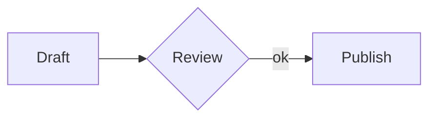
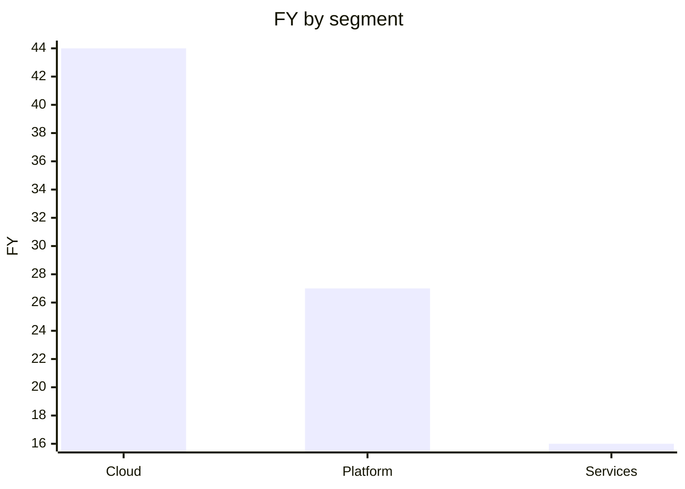

[](https://mcptoplist.com/server/io.github.geml-spec%2Fgeml) 


<p align="center">
  <picture>
    <source media="(prefers-color-scheme: dark)" srcset="docs/assets/logo/geml-logo-dark.svg">
    
  </picture>
</p>

# GEML — General Expressive Markup Language
[](https://www.npmjs.com/package/@geml/geml) [](https://github.com/geml-spec/geml/actions/workflows/ci.yml) [](https://github.com/geml-spec/geml/actions/workflows/geml-check.yml) [](spec/GEML-spec.md) [](LICENSE) [](spec/LICENSE-spec.md)

*English | [中文](README_CN.md)*

GEML is a markup language people and AI agents can write in the same document.<br>
**One format, two readers.** For people, plain text that reads clean; for agents, a **["Doc-as-a-Base"](docs/MANIFESTO.md)** powered by fine-grained, operable primitives.

---

**GEML is minimal.**
It is dead simple — one block syntax for the whole language;
it is plain text — still clean with no renderer in sight;
it is machine-friendly — addressable, verifiable, referenceable structure, natively.

A `.geml` file is plain text, so you never need a renderer to read it. And instead of a separate mini-syntax for each kind of content, GEML carries every kind in one container: the **typed block**. Code is a block. So are tables, diagrams, math, callouts, even metadata — and a run of prose can be one too (`=== text`), whenever you want it addressable. Extending it later is just as plain. The shape is the same every time, which makes the language easy enough to learn that it's hard to get wrong.

```
=== code {#hello lang=python}
print("hi")
===
```

```sh
geml get doc.geml '#hello'   # by name, just this block
```

Blocks have names so the verbs have somewhere to land — the full syntax is in
[the format in 1 minute](#one-minute).

**Contents:** [Why now](#why-now) · [What's different](#whats-different) ·
[The format in 1 minute](#one-minute) · [A gift for programmers](#code-graph) ·
[Get hands-on](#hands-on) · [With an LLM](#with-an-llm) ·
[Maturity & versions](#maturity) · [The design](#challenge) · [Take part](#contributing) ·
[License](#license)

<a id="why-now"></a>
## Why a new format now

Because **both the producer and the consumer of a document have changed**.

For decades, a text format was either optimized for people to read and lay out (Markdown, Word) or designed and optimized for machines to parse (JSON, Schema). But in the LLM era, humans and agents are **co-reading, co-authoring, and rewriting** the same document together for the first time. The old ways of working are breaking down: every time we provide context or prompts, we manufacture copies. The engineering Source of Truth gets infinitely duplicated, fragmented, and eventually drifts away — and every edit still works at whole-file granularity: one block changes, the whole document is rewritten.

> 💡 **Deep Dive:**
> If you are interested in the dilemma of engineering documents in the LLM era and why we need to redesign a plain-text format from the ground up, read our full article on the blog: [**"Why Do We Need a New Text Format in the Era of LLMs?"**](https://geml-spec.github.io/geml/blog/2026/08/03/why-do-we-need-a-new-text-format-in-the-era-of-llms/)

To solve this crisis of "coarse-grained operations," "copy explosion" and "broken dependencies," we need to ensure that knowledge fragments in plain text can be precisely held and verified by machines. Therefore, the format carrying the text must provide **four core capabilities** at the syntax level:

1. **Block-level Addressing**: Every block has a unique `#id`; we no longer address just the whole file.
2. **Reference-based Projection (Transclusion)**: Assembling context by looking up values, not copying them (`embed`).
3. **Build-time Verification**: Any broken link causes an immediate build error instead of decaying silently.
4. **Block-level Revert**: Fine-grained, single-block history rollbacks, independent of Git.

This is exactly why GEML was created. We are not asking anyone to abandon their existing formats; instead, we are adding this missing network to the existing ecosystem.

---

<a id="whats-different"></a>
## What's different about GEML

GEML stays small on purpose — the thinking, what it refuses, and what is still open are in [how we thought about the design](#challenge).

The four capabilities were established a chapter ago — addressing, projection, verification, revert. This chapter is where each format lands against them, and where GEML draws its boundaries.

### How other formats compare

Each of the four has mature solutions in its own field; what's unusual is meeting all four in one plain-text format:

| Family | What the state really is | Addressable / referenceable | Projectable / embeddable | Verifiable | History / traceability |
| :--- | :--- | :--- | :--- | :--- | :--- |
| **Word / Docs** | Opaque state | ❌ No block-level keys; access via platform APIs | ❌ Copy-paste only | ❌ No checking at all | ⚠️ Platform server-side, not in the file |
| **Markdown / AsciiDoc** | A stream of characters | ⚠️ Heading anchors or dialect ids; no read/write verbs | ⚠️ Dialect embeds (Obsidian `![[…]]`, `include::`) — break silently | ❌ Broken links fail silently | ❌ None in-format — external git required |
| **JSON / XML** | Data serialization | ✔️ (id / schema) | ⚠️ XML only (XInclude, external) | ✔️ Via an external toolchain | ❌ None in-format — external git required |
| **GEML** | **Plain text + block structure** | **✔️ A unique `#id` per block (referenceable natively)** | **✔️ `=== embed`: a reference is a lookup (native)** | **✔️ A build-time error** | **✔️ `.gemlhistory` next to the file (traceable natively)** |

Item by item: [vs. CommonMark](docs/comparisons/GEML-vs-CommonMark.md) · [vs. XML and JSON](docs/comparisons/GEML-vs-XML-and-JSON.md) · [a 7-format capability matrix](docs/comparisons/COMPARISON.md).

Coexisting with Markdown: GEML is the **editing source of truth**, Markdown is the delivered artifact. Project one way with `geml <file> --to md|html` and ship `.md` or `.html` as before. **Collaboration, not lock-in.** *(Projection is lossy: block ids and table-bound charts don't survive it.)*

**Don't take the table's word for it — re-run it.** This is what I asked the model:

> Based on your own experience editing the READMEs just now, describe the command steps you go through on a document (I saw you using grep and such), and whether you cache documents to save tokens — let's compare, and from that see which parts of GEML would actually earn their place.

What came back: **[what one edit costs](docs/benchmarks/addressing-cost.md)** and **[a real day replayed](docs/benchmarks/mixed-toolchain.md)**. Paste the question to your own model and see what it tells you.
PS: I am still trying to work out whether the upstream chain (who calls this) and the downstream chain (what it calls) that `codemap` produces can pin down functions and call sites — and change project code — the same way. I will post a report when I have one.

<a id="one-minute"></a>
## The format in 1 minute

### Typed blocks

**One shape, every type.** A block's basic syntax is `=== type [attributes]` … `===` (where attributes like `{#id .class key=val}` are optional) — only the `type` (and how its body is read) changes:

```
=== code {lang=python}
print("hi")
===

=== note {.intro}
Parsed prose with *emphasis* and a [[#budget]] reference.
===

=== meta
title = "Budget plan"
===
```

A run of `=` (three or more) opens a block; an equal-length run closes it; longer fences nest inside shorter ones. A block that carries an `#id` can also close with the **labeled fence** `=== #id` — no fence-length counting, which makes long blocks much harder to get wrong (nesting still requires a longer outer fence: a same-length bare `===` in the body closes the block early, labeled or not). The type decides how the body is read — `raw` (verbatim: `code`, `diagram`, `math`, `table`), `flow` (parsed prose with inline markup: `note`, `text`), or `data` (one `key=val` per line: `meta`); `embed` carries no body at all — its `src=` names the block it stands for — and every block may carry an attribute object `{#id .class key=val}`, where a `.class` is a *semantic* label, never a styling hook. The full inline grammar (emphasis, links, `[[#id]]` auto-references, media, footnotes, inline `$math$`) is in the [spec](spec/GEML-spec.md).

### Tables — two bodies, one model

Write a table visually:

```
=== table {#budget caption="Annual cost"}
| Plan  | Months | Rate |
|-------|-------:|-----:|
| Basic |      1 |   30 |
| Pro   |      2 |   30 |
===
```

…or as data, with **computed columns** and a **summary row**:

```
=== table {#fy25 format=csv header=1 compute="FY [%.1f] = Q1 + Q2 + Q3 + Q4" summary="Segment = 'Total'; FY [%.1f] = sum(FY)"}
Segment,  Q1, Q2, Q3, Q4
Cloud,     8, 10, 12, 14
Platform,  5,  6,  7,  9
Services,  3,  4,  4,  5
===
```

*Both forms describe the same model. The `FY` column and `Total` row are computed at build time:*

| Segment   | Q1 | Q2 | Q3 | Q4 |   FY |
|-----------|---:|---:|---:|---:|-----:|
| Cloud     |  8 | 10 | 12 | 14 | 44.0 |
| Platform  |  5 |  6 |  7 |  9 | 27.0 |
| Services  |  3 |  4 |  4 |  5 | 16.0 |
| **Total** |    |    |    |    | **87.0** |

`compute` runs `+ - * / ( )` per row over columns; `summary` adds a foot row from the aggregates `sum / avg / min / max / count` (with arithmetic over them, e.g. weighted ratios); a trailing `[printf]` sets numeric display.

Tables can also pull their data from an external CSV via `src="regions.csv"`.

> ❓ **Up for discussion:** should computed columns and the summary row stay? [Keep, freeze, or drop — say which](https://github.com/geml-spec/geml/discussions/19).

### Math

```
=== math {#gauss caption="Gaussian integral"}
\int_{-\infty}^{\infty} e^{-x^2} dx = \sqrt{\pi}
===
```

$$\int_{-\infty}^{\infty} e^{-x^2} dx = \sqrt{\pi}$$

### Diagrams & charts — host a DSL, or chart a table

GEML never interprets a diagram body; it routes it to a pluggable renderer (an unknown `format` is a warning, body preserved):

```
=== diagram {#flow format=mermaid caption="Review flow"}
graph LR
  A[Draft] --> B{Review} -->|ok| C[Publish]
===
```


```mermaid
graph LR
  A[Draft] --> B{Review} -->|ok| C[Publish]
```

A diagram can also **chart a table** — single source of truth, with the column references checked at build time and no data copied:

```
=== diagram {format=geml-chart data=#fy25 type=bar x=Segment y=FY}
===
```

*Drawn from the `#fy25` table above:*


```mermaid
xychart-beta
  title "FY by segment"
  x-axis [Cloud, Platform, Services]
  y-axis "FY"
  bar [44, 27, 16]
```

### Data — a value, not just text

Every block type names what it holds: `code` a region of code, `table` a grid, `math` a formula. `data` holds a **data value**, and it is where the data formats live — `json` (the default) and `jsonl` today, `yaml`/`toml` reserved. Being typed means the body is read, not just displayed: a missing comma fails the build, `geml get --json` returns the value itself, and a chart can read it directly.

```
=== data {#log format=jsonl}
{"ts":"09:00","p95":41}
{"ts":"09:10","p95":58}
===

=== diagram {format=geml-chart data=#log type=line x=ts y=p95}
===
```

A `jsonl` body holds one record per line, which a program can blind-append at end-of-file. Records can also stay in their own file: `src=ops/latency.jsonl#L900-999` names the file and, optionally, a line window — so the log keeps being appended and tailed as before, while the document is its **verified, addressable, chartable view** of it.

### Embeds — reference, don't copy

One block can stand for another — in the same document by `#id`, or across documents by `src=other.geml#id` — and renders that block's **current** state in place:

```
=== embed {src=#fy25}
===
```

The body stays empty (the target lives in `src=`), and the target is checked like any reference: if it goes missing, `geml check` fails the build.

<a id="code-graph"></a>
## A gift for programmers — geml-code-graph

To really feel how powerful and flexible a single GEML primitive is, let's try it on a code graph — a familiar but demanding case for programmers:
**your whole codebase's call graph, written as GEML.** `geml codemap build` lays the call graph out as a tree of GEML documents — every method an `#id` block, with `#calls` / `#called-by` edges both ways. The **downstream chain** (what a method calls) for troubleshooting, the **upstream chain** (who calls it) for the blast radius — all visible in a second;


```sh
npm i -g @geml/geml
geml codemap build              # --root defaults to . : detect languages -> index -> one merged graph in ./.geml-code-graph/
geml codemap serve              # opens your browser on the graph
```

> [!NOTE]
> **Requirements.** Node **22+** for the CLI (`npm i -g @geml/geml`). Everything
> below is optional and used only where noted: [Joern](https://docs.joern.io/installation)
> for non-TS/JS languages in the code graph, and Chrome for the
> [viewer extension](https://chromewebstore.google.com/detail/opmhfphgoidpnipphfgkhhjhmnmaenie).

> [!TIP]
> **TS/JS** — zero setup: `build` fetches the scip indexer by itself.
> **Java / C / Python / Go / Kotlin** — one extra download, [Joern](https://docs.joern.io/installation): unzip its release package and pass that folder to build, e.g. `--joern ~/joern/joern-cli` (`--joern C:\joern\joern-cli` on Windows), or put it on PATH and skip the flag.
> Mixed front-end + back-end repo — everything merges into **one graph**.

geml-code-graph is itself a diagram format — one line embeds it in any GEML document (`=== diagram {format=geml-code-graph src=.geml-code-graph/index.geml} ===`), and an optional per-commit hook (bundled with the Claude skill) rebuilds it as the code moves, so the graph doesn't drift.

Scale is measured, not promised: on Apache Flink's codebase — **13,585 Java source
files, ~81,000 methods, 266,821 call edges** — the plain-text *data tables* still
open and query instantly, and you can grep any method name to trace its call chain.
Reproduce it yourself: clone `apache/flink` and run `geml codemap build --joern …` at
its root.

<a id="hands-on"></a>
## Next — get hands-on now

▶ **[Try writing GEML in the Playground](https://geml-spec.github.io/geml/playground/)** — edit on the left, rendered live on the right, and the build verdict flips red the moment a reference breaks. No install, nothing to read first.

Then, in the order that suits you:

1. **See it render in your browser.** Install the **[extension](https://chromewebstore.google.com/detail/opmhfphgoidpnipphfgkhhjhmnmaenie)** and open a raw `.geml` link *(the raw file, not the GitHub blob page — that one is HTML)*: the **[GEML spec itself](https://raw.githubusercontent.com/geml-spec/geml/main/spec/in_geml_format/GEML-spec.geml)** (dogfood — the spec is a GEML document, rendered at scale), the **[showcase](https://raw.githubusercontent.com/geml-spec/geml/main/docs/examples/showcase.geml)** (a computed table, four charts, a Mermaid flow, and math), or **[playground/sample.geml](https://raw.githubusercontent.com/geml-spec/geml/main/playground/sample.geml)** for the interactive code-graph.
2. **Run it locally.** `npm i -g @geml/geml` (Node 22+), then `geml check` a document, or point it at your own repo with `geml codemap build`.
3. **Set up Claude Code — one command.** `npx -y @geml/geml skill install` puts the authoring skill, the CLI and the MCP server in place, user-global, for every project. It edits no settings and installs no hooks. [Details](#with-an-llm).
4. **Read the grammar.** The **[full spec](spec/GEML-spec.md)** (EN / [中文](spec/GEML-spec_CN.md)) is normative and short enough to read in a sitting.

<a id="with-an-llm"></a>
## Using GEML with an LLM

The goal is one thing: your model **edits a block at a time, and verifies** —
never re-reads and re-emits a whole file to change one paragraph. Getting there
takes one step, and which step depends on what you use.

### Using Claude Code — run this

```sh
npx -y @geml/geml skill install
```

It installs the authoring skill, the `geml` CLI and the MCP server, user-global,
for every project. No `settings.json` edits, no hooks; re-run after an upgrade.
*(Prefer plugins? `claude plugin marketplace add geml-spec/geml`, then
`/plugin install geml@geml` — same skill, MCP server bundled.)*

Then say it once in a session, and the project has switched:

> This project uses GEML as its base document format; generate other formats
> from it as needed.

The skill takes it from there. New documents are written as `.geml` with an id
on every section — that id is what later lets one section be replaced instead
of the file. Documents that already exist are left where they are: adopting the
format is not licence to convert or delete anything. And `geml <file> --to
md|html` produces whatever still has to ship as something else.

### Using anything else — paste this, then check the output

A model with no skill to read needs the rules once. Paste the prompt below, and
keep `geml check` as the gate on whatever it writes back — the CLI is
`npm i -g @geml/geml` (Node 22+).

> Write the document as GEML: every block is `=== type [attributes]` … `===`
> ([the format in 1 minute](#one-minute) lists the types). Four rules are the
> ones models get wrong: the closing fence is a `=` run of the *exact* opening
> length, and a body containing `===` needs a longer outer fence; headings are
> ATX `#` only, with no `---` frontmatter (metadata is `=== meta`); every `#id`
> is unique and every reference (`[[#id]]`, `[text](#id)`, `[^id]`, `data=#id`)
> must resolve; there is no raw HTML. The normative spec is
> [`GEML-spec.md`](spec/GEML-spec.md).

### What it will do with it

```sh
geml list   doc.geml                                     # CALL FIRST: every block, its address, kind, lines
geml find   "words" doc.geml                             # search block content -> an address, not a line number
geml get    doc.geml '#hello'                            # read ONE block (a heading id = its whole section)
geml get    doc.geml '#hello' --intro                    # a section cuts three ways: --head | --intro | --body
geml set    doc.geml '#license' --in template.geml#mit   # replace that block, forking another
geml add    doc.geml --after '#intro' --in snippet.geml  # insert a fragment (keeps its own ids)
geml revert doc.geml '#plan' --rev -1                    # roll ONE block back
geml check  doc.geml                                     # validate only: diagnostics + exit code
```

Any section cuts three ways, on `get` and `set` alike: `--head` is the heading
line, `--intro` what it says before its first subheading, `--body` everything
under it — so `--body` always contains `--intro`, and equals it when there is no
subheading. A section's opening can be edited without pulling its subsections
into context.

Every mutation is re-parsed before it writes and refused if it would break the
document — which is what makes editing unattended safe. The rest of the verbs
(`delete`, `rename`, `history`, `--to md|html|geml` conversion, addressing a
block by type or content hash) are in the
[parser README](geml-parser/README.md).

### MCP Server

A standard Model Context Protocol server ships with the package, so your agent
edits **one block at a time** instead of rewriting whole files. It runs locally on
Windows, macOS, and Linux; `--root` is the directory holding your `.geml` files.

**Claude Code / any CLI client** — one command:

```sh
claude mcp add geml -- npx -y @geml/geml@latest mcp --root /absolute/path/to/your/docs
```

**Claude Desktop** — add to `claude_desktop_config.json`:

```json
{
  "mcpServers": {
    "geml": {
      "command": "npx",
      "args": [
        "-y",
        "@geml/geml@latest",
        "mcp",
        "--root",
        "/absolute/path/to/your/docs"
      ]
    }
  }
}
```

Then just ask for the change you want — "fix the Q3 row in the FY26 table" — and
the agent addresses that one block. You never learn a tool name: each mirrors a
CLI verb (`geml set` → `geml_set`), so one vocabulary covers the terminal and the
agent.

Two guarantees make this better than letting a model rewrite the file: a write is
parsed **before** it reaches disk and refused with its diagnostics if it would
break the document, and every write first records a `.gemlhistory` revision — so a
bad edit is both *prevented* and *undoable* (`geml_revert` restores one block, the
rest of the file byte-identical). Paths stay confined to `--root`, which a client
cannot widen.

Point `--root` at a repository that has a code graph (`geml codemap build`) and the
same server also answers "who calls this" — four read-only `geml_codemap_*` tools,
one client entry instead of two. Every tool and option:
[docs/mcp-guide.md](docs/mcp-guide.md).

<a id="maturity"></a>
## Ecosystem and maturity

GEML is a small, young spec — but a **stable** one: **`1.0`** is released and usable for real documents (this repo's own spec is one), with a strict conformance suite, a reference implementation that passes it **(versioned independently of the spec)**, and an open proposal process.

Both specs are bilingual:

| Document | English | 中文 |
|----------|---------|------|
| Core spec | [`GEML-spec.md`](spec/GEML-spec.md) | [`GEML-spec_CN.md`](spec/GEML-spec_CN.md) |
| History extension | [`GEML-history-spec.md`](spec/GEML-history-spec.md) | [`GEML-history-spec_CN.md`](spec/GEML-history-spec_CN.md) |

### Versions and compatibility

- **Self-hosting** — [`GEML-spec.geml`](spec/in_geml_format/GEML-spec.geml) is the specification written in GEML, required to parse clean on every test run.
- **A [conformance suite](geml-parser/test/conformance/)** is what holds separate implementations compatible.
- **A reference implementation of the parser.** **1,200+** unit tests today, plus the conformance corpus, round-trip serialization and end-to-end CLI runs, with coverage CI-gated at ≥**95%** lines / statements / functions / branches.
- **Forward compatibility is in the grammar.** A processor must degrade gracefully on constructs it does not recognize (spec §8.2), which is why adding a block type or a diagram format is **not** a breaking change. The type registry is open: an unregistered type name should contain a hyphen (`acme-invoice`), leaving hyphen-free names to future versions of the spec (§8.5).
- **Claiming conformance.** An implementation may call itself *conformant to GEML 1.0* once it reproduces the conformance suite case for case (§8.5). No permission needed, and no sign-off from this repo.
- **On the wire.** Extension `.geml` (version sidecar `.gemlhistory`), media type `text/geml`, or `text/vnd.geml` where a registered type is required — `text/geml` is not registered with IANA yet.
- A fragment identifier on a `.geml` URL names the block bearing that id (§0.6) — which is not what `#tag` means on an HTML page.

<a id="challenge"></a>
## How we thought about the design

### What the design follows

**It is plain text meant for people to read.** Fully readable with no renderer — which is why there is no raw-HTML escape hatch, and why a style may never change what a document says.

**One primitive, a few models.** Every kind of content is the same typed block; extending the format means **registering a type, not inventing syntax**. The type says what it **becomes**: `meta` is key–value shared across the document, `code` is a region of code at a location, `data` is a data value, `table` is a grid waiting to be worked, `diagram` is a hosted external DSL, `embed` is a view onto a source of content

**A reference is a window, not a navigation.** An HTML link navigates: the target is not in the document you are holding, so people copy it in anyway. What is being designed out is not dead links; it is the incentive to copy. *Cost: rendering may need to read several files, and must degrade gracefully when it can't.*

**Prefer subtraction.** Where a rule breeds edge cases, the feature goes rather than the edge cases getting specified: no underscore emphasis, no setext headings, no indented code blocks, no raw HTML. The ambiguity is deleted at the source instead of enumerated in test cases. *Cost: some things you can write in Markdown you cannot write here.*

**No broken windows.** Markdown's ethos is never to fail — render something. GEML's is the opposite: verified at build time rather than tolerated at render time. A dangling `#id` is an error with a non-zero exit. Stable ids, `geml check` and the diagnostic catalogue all follow from that one decision. *Cost: a document that "looks fine" can fail your build.*

**A sidecar travels with the document without getting into it.** The `.geml` file is the source of content and stays deliberately small. Anything else is not pushed into it but points back at it — a version history in `.gemlhistory`, say — and deleting that leaves the document perfectly valid. *Cost: a convention, explicit or implied, and two files that travel together.*

**The command line is built for an agent.** The fewest verbs that cover everything, kept orthogonal, with pipeable input and output and options that stay consistent across them.

### What it therefore refuses

| Refused | Why |
|---|---|
| A diagram language of its own | External DSLs are hosted (Mermaid, Graphviz, D2, …); the format defines only the hosting protocol |
| A raw-HTML escape hatch | Semantics stay portable, tied to no backend or renderer |
| Setext headings / `---` frontmatter | ATX `#` only, so nothing collides with a thematic break |
| A full spreadsheet engine | Per-row formulas and summary aggregates are enough; no cell addressing, lookups, or macros |

<a id="contributing"></a>
## Take part

GEML is `1.0`, but "stable" means **the rules already there won't shift under you**,
not that the design is settled. There is exactly **one implementation** so far, and
**one set of opinions** behind the spec. Your thinking can still change the spec itself.
If you want a hand in it:

**Come argue about these**:

- [Should the format keep computed columns and summary rows?](https://github.com/geml-spec/geml/discussions/19)
- [If styling is supported, how should it be designed?](https://github.com/geml-spec/geml/discussions/17)
- [Is the GEML history file a made-up need?](https://github.com/geml-spec/geml/discussions/18)
- [`--view` reads through an embed. Flag, or its own verb?](https://github.com/geml-spec/geml/discussions/21)

<a id="integrations"></a>
Or **claim a piece**:

| Gap | Where it stands | What it takes |
|---|---|---|
| **Skill installation for more agent tools** | Gemini CLI, Qwen Code and AGENTS.md are installed by detection already; the MCP server works with any client | Add the rest the same way: **Cursor**, **GitHub Copilot**, **Cline** — their rule-file conventions move fast, so check the current docs before writing one in |
| **How well the primer holds on other models** | Only exercised on Claude | Have GPT / Gemini / a local model each write a batch of GEML from the primer, count how many pass `geml check` first time, and report the rules they keep getting wrong — those are the ones the primer should name |
| **Deeper Obsidian integration** | Renders, but not in the community store yet | Editing at the CodeMirror layer and seamless two-way rendering, plus the store submission itself. Wants someone who knows the Obsidian API. |
| **The viewer on other browsers** | Chrome works | Firefox / Safari ports. |
| **Packaging the RAG integrations** | LangChain / LlamaIndex are reference implementations | Publishing to PyPI; and wiring up other frameworks (Haystack, DSPy, …). |

- **Write a second implementation of the spec** — a new GEML parser in whatever language you like ([how to write a parser](docs/WRITING-A-PARSER.md))
- **Finding the places where the spec is ambiguous is itself the contribution**, whether or not that parser ever ships.

Or **propose something new**:

- A GEP: the proposal, the spec edit and the conformance cases land together ([process](spec/proposals/README.md))

Or **put it to use**:

| Scenario | Where | State |
|---|---|---|
| **From the command line** — validate, convert, edit by block, version history, all in one command | [`@geml/geml`](https://www.npmjs.com/package/@geml/geml) (source [`geml-parser/`](geml-parser/)) | Available |
| **Read it in the browser** — open any raw `.geml` link and it renders in place: computed tables, charts, Mermaid, math, with diagnostics as a banner | [Chrome Web Store](https://chromewebstore.google.com/detail/opmhfphgoidpnipphfgkhhjhmnmaenie) · [source](integrations/geml-viewer/) | Available |
| **Let an agent edit by block** — an MCP server; the agent changes one block instead of rewriting the file, and every write is validated before it reaches disk | [`docs/mcp-guide.md`](docs/mcp-guide.md) | Available |
| **Turn a codebase into a document** — the whole call graph as a tree of GEML documents, browsable | `geml codemap build` ([design](docs/design/specs/codemap/DESIGN-geml-code-graph.md)) | Available |
| **Write it in your editor** — syntax highlighting + build-time reference checking | [`integrations/vscode/`](integrations/vscode/) | Built — install from source; not on the Marketplace yet |
| **Render it in Obsidian** — the reference parser + the viewer's renderer, the same code path as the web | [`integrations/obsidian/`](integrations/obsidian/) | Built, not in the community store |
| **Feed a RAG / agent framework** — block-level loaders (one chunk per block, carrying `block_id`) + agent editing tools | [`integrations/langchain+llamaindex/`](integrations/langchain+llamaindex/) | Reference implementation |
| **Try it without installing anything** — edit on the left, live render on the right | [Playground](https://geml-spec.github.io/geml/playground/) | Available |

Three files to read first: [`GOVERNANCE.md`](GOVERNANCE.md) for how decisions get
made, [`CONTRIBUTING.md`](CONTRIBUTING.md) for how to send work, and
[`CODE_OF_CONDUCT.md`](CODE_OF_CONDUCT.md) for the one rule about people —
disagree with the design as sharply as you like, not with the person.

## Repository layout

```
spec/                  Core spec + .gemlhistory extension as .md (EN / 中文), the
                       CC-BY spec license, and proposals/ (GEPs)
spec/in_geml_format/   The dogfood: those same specs written in GEML, with their
                       .gemlhistory sidecars
geml-parser/           Reference parser, renderer, CLI + codemap toolkit (TypeScript, Node 22)
integrations/          Everywhere GEML plugs in: geml-viewer (browser extension),
                       geml-check-action (CI), vscode, obsidian, tree-sitter (brief)
playground/            In-browser playground (+ a live geml-code-graph of this repo)
docs/                  Guides, design notes, comparisons/ (COMPARISON + vs-CommonMark +
                       vs-XML-and-JSON), assets (logos, used by the Pages site below),
                       and an example .geml to render
.claude/skills/        Claude skills: GEML authoring, and the code graph
.github/               CI + geml-check workflows, MCP registry publish, and issue
                       templates (bug, GEP, new implementation)
site/                  The geml-spec.github.io/geml Pages site: a project homepage
                       (index.md) plus a Jekyll blog (blog/, posts in _posts/) —
                       the long-form "why a new format" article (EN / 中文) lives
                       there as its first post. `cd site && bundle exec jekyll
                       serve` builds it locally; .github/workflows/pages.yml
                       builds and deploys it (grafting in playground/ as static
                       output) on push to main.
```

<a id="license"></a>
## License & governance

**Code is MIT** ([`LICENSE`](LICENSE)): everything in this repository —
`geml-parser/`, all of `integrations/`, `playground/`, `.claude/skills/`, the GEPs
in `spec/proposals/` — except the specification documents.

**The specification documents are CC-BY-4.0** ([`LICENSE-spec.md`](spec/LICENSE-spec.md),
which lists them exactly): `spec/GEML-spec*`, `spec/GEML-history-spec*`, `spec/in_geml_format/*`, and
`docs/comparisons/COMPARISON*`. A spec is not software, so anyone may build a conformant
implementation without permission — and call it *conformant to GEML 1.0* once it
passes the [conformance suite](geml-parser/test/conformance/).

**Using the name.** You need no permission to implement GEML, to name an
implementation after the format (`geml-rs`, `pygeml`, a `geml` package on your
language's registry), or to state that your tool reads and writes GEML. Two
requests, neither of them a legal restriction: call an implementation *conformant to
GEML 1.0* only once it passes the conformance suite, and don't imply that this
project wrote, endorses, or maintains it. Attribution for the specification text
itself is what CC-BY-4.0 already asks for.
