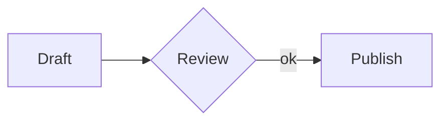
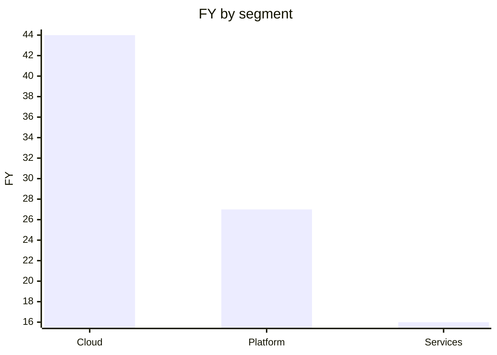

[](https://mcptoplist.com/server/io.github.geml-spec%2Fgeml)

<p align="center">
  <picture>
    <source media="(prefers-color-scheme: dark)" srcset="docs/assets/logo/geml-logo-dark.svg">
    
  </picture>
</p>

# GEML — General Expressive Markup Language

*English | [中文](README_CN.md)*

GEML is a markup language people and AI agents can write in the same document.<br>
**One format, two readers.** For people, plain text that reads clean; for agents, a **"Doc-as-a-Base"** — addressable, verifiable, traceable, revertible.<br>

[](https://www.npmjs.com/package/@geml/geml)
[](https://github.com/geml-spec/geml/actions/workflows/ci.yml)
[](https://github.com/geml-spec/geml/actions/workflows/geml-check.yml)
[](LICENSE)
[](spec/LICENSE-spec.md)

---

**GEML is minimal.**
It is dead simple — one block syntax for the whole language;
it is plain text — still clean with no renderer in sight;
it is machine-friendly — addressable, verifiable, referenceable structure, natively.

A `.geml` file is plain text, so you never need a renderer to read it. And instead of a separate mini-syntax for each kind of content, GEML carries every kind in one container: the **typed block**. A paragraph is a block. Code is a block. So are tables, diagrams, math, callouts, and even metadata. Extending it later is just as plain. The shape is the same every time, which makes the language easy enough to learn that it's hard to get wrong.

```
=== code {#hello lang=python}
print("hi")
===
```

## Why a new format now

Everyone asks this.
Here's my answer.

**Text is the one universal medium for knowledge production and engineering collaboration — people think and express in it, machines parse and execute it.**

The problem is that the same text has to serve two very different readers at once, and what they want is mutually exclusive: machines want precision, people want comprehension. Precision comes from formal constraints and tool-enforced checking; comprehension comes from natural structure and expression. The two fight by nature.

**Precision and comprehension are an inherent contradiction.**

Model the collaboration from a "producer → consumer" angle and four patterns fall out:

* **Human writing for humans** — Office 365 / Google Docs / Markdown, optimized for reading comfort — at the cost of the precision a machine wants, or else too much added complexity.
* **Human writing for machines** — programming languages / wire protocols / interface definitions / schemas, so machines execute precisely — at the cost of a person first learning the profession of translating intent into the machine's language, and building every kind of tool to help do it.
* **Machine writing for humans** — making it look right across every endpoint and medium — at the cost of an enormous rendering toolchain built just to fit them all.
* **Machine writing for machines** — JSON / XML / Protobuf, efficient machine to machine — human readability abandoned outright.

All four start from the same place: the consumer's point of view. Machine consumption wants precision, and precision needs formal constraints and tool-enforced checking; human consumption wants comprehension, and comprehension needs structure and expression that help understanding. The two conflict by nature — the more precise a format is, the less friendly it is to people; the easier it is for people to read, the harder it is for a machine to parse exactly. The cost lands on the producer either way: whoever is writing either gives up structure or first goes and learns a profession. It's one or the other. So each pattern can only optimize for its own consumer, and splitting apart is the only solution to this contradiction.

**Any engineering deliverable is only a version snapshot, frozen at one moment.**

A report, a piece of code, a product — all the same. Every deliverable is a projection of every intermediate, frozen at one point in time. Behind the snapshot sit countless intermediates: requirement drafts, data, structural experiments, review comments, abandoned options, one diff after another — fragments scattered across the four patterns' different formats, finally distilled into one version snapshot. Fragmentation is unavoidable, and every new version, v2.0, v3.0, builds on the snapshot before it — with more fragments each time. The cognitive load of holding that whole panoramic map in your head keeps growing, until it turns into a complexity that even the people responsible for the deliverable can no longer understand.

**In the past, the person with the professional skill was the mind holding that network of fragments together.**

To drive a machine you had to understand its runtime first; to convince a person you had to understand what the reader cared about — and to calibrate output at all, you had to understand what precision each stage's consumer, human or machine, demanded. That **forced understanding** is exactly where the global mental map came from: which fragment is authoritative, which reference still holds, which path leads to the next version snapshot. One person, or one team, held that network together with professional skill and a great deal of mental effort. Changes were infrequent, fragments were few, and the engineering loop from one deliverable to the next held.

**Bring in an LLM or an agent, and that net gives way completely.**

AI dropped the barrier to working with machines almost to nothing — no profession required, anyone can drive a machine to produce content. But that comes with a fundamental cost: the engineering process went from a white box to a black box. Nobody needs to understand the machine's runtime any more, and with that goes the thing that used to sustain the global mental map. The machine's output turns unpredictable, unreproducible.

What AI engineering is, underneath, is the attempt to get those two back — context engineering, evals, guardrails, replay all do the same thing: predict the black box, calibrate the black box. But calibrating is itself what manufactures fragments: every calibration pass means piling more into the context, and every pile makes another copy — the same fact summarized once, restated once, patched once, pasted into a prompt once. The chain breaks where nobody is looking: a chart cites a number from a table, a section cites another section's conclusion, the agent moved the structure, the human rewrote the prose, and nobody knows when the dependency broke. The cost is state drift — the single source of truth gets fragmented, copied, converted, snapshotted, until it's no longer single. Meanwhile what people expect from AI and the complexity of what they hand it only keep climbing; copies keep piling up until they exceed what the model can hold in one pass, so the work gets broken down finer and another layer goes on top. Fragmentation snowballs into a vicious circle on its own, state drifts, and the source of truth collapses with it.

**Which makes the direction of the fix clear: less inflation, fewer fragments, less drift.**

All three point at the same thing — hold a single source of truth, cut the illusions, and project the whole view.

A copy manufactures an illusion — what you think you're seeing is the current, real state, but it's actually an afterimage frozen at some earlier moment. The fix isn't making a person or an AI fully understand every fragment across every dimension and every moment — that only produces more copies, more afterimages. The fix is building a reference mechanism: every fragment knows where its own source of truth is, and the panoramic view projected from that single source always reflects the current state — no full memorization, no accumulated copies, no illusions. The burden on the mental map becomes manageable, and the dependency network between fragments becomes something a machine itself can hold and check. Precision, predictability, reproducibility — and the engineering loop closes again.

In all this, what text can do as the medium that carries truth matters enormously. To close the loop across human → machine → human, being simple, readable, precise, and structured are obviously non-negotiable basics. But as AI engineering and the age of massive fragmentation arrive, the medium carrying information across those stages is increasingly under pressure to have these capabilities built into its syntax: finer-grained precise addressing, projection (piecing fragments together), verifiability, and evolvable, revertible history.

**But existing formats, by their fundamental design, cannot fully support this.**

It's not that the industry hasn't tried — Markdown and HTML both have links pointing at a source of truth, and wikis even have bidirectional page links. But the fundamental gap in existing formats is this: those are only navigation. What's on the other end can change quietly, and there's no way to detect the gap between what you believe and what's actually there. Copy-paste is the only way to reuse content, and a copy starts drifting the moment it's made — versions diverge, each one straying from the source of truth on its own. And the granularity is too coarse: the finest it reaches is a document, never one column in a table. A reference is different — it's a lookup, not a pointer to somewhere else. There's exactly one truth; change the source and everything follows; delete the source and it fails loudly, right then, instead of quietly pointing at nothing. Without a single source of truth, all you can do is manufacture copies — you can never project the whole view.

GEML isn't trying to get anyone to give up their existing formats. It's a complement to that ecosystem — supplying, at minimal cost, the ability to carry fragments across stages of collaboration, adding the missing network at the format layer. Its answer to these problems:

1. **Block-level addressing** — the unit of operation is the block. Every block has a unique `#id`; changing one doesn't touch the rest of the document, and the context only ever holds that one block, not another copy of the whole thing.
2. **Block-level projection** — link navigation is not a substitute for a reference. Reference, not copy: whoever references a block always sees the current state of its source of truth, as a full embedded reference rather than a fragmentary link. Checked hard at build time.
3. **Block-level history and revert** — remembers how each block changed and into what; reverting rolls back only that block, not a whole-file snapshot the way git takes them. The version snapshot becomes reproducible, and the evolution loop has a paper trail.

**How GEML does it**

The three requirements map to three concrete things. No extra dependencies — GEML delivers exactly those three capabilities with three specific designs, all in plain text:

**① One unified typed block + native `#id` (delivers: precise addressing)**

The whole language has exactly one block syntax: `=== type {#id .class key=val}` … `===` — code, tables, diagrams, math, callouts, and metadata are all this, differing only in `type`. Any block can carry a globally unique `#id`, and that `#id` is **a block-level reference handle, not a document-level navigation link**: `[[#id]]`, chart `data=#id`, footnotes — each one declares "I depend on this block's current, real state," not on "that document," but on that block. The granularity is exact down to the block, truth exists in exactly one place, and whoever references it always sees its current state. The projection of a final deliverable is therefore a block-grained distillation too — not the whole document carried over, but exactly the blocks needed, picked from wherever they live and assembled together. `geml get`/`set` recognize the same handle: read one block, change one block, without touching the rest.

**② Hard checks at build time, `geml check` (delivers: build-time verification)**

`geml check` turns a reference that doesn't resolve into a **build error**, not a silent 404. Dependencies between fragments — a chart bound to table data, a cross-document reference — are checked hard at build time; a broken link stops the build right there, instead of surfacing only at render time.

**③ A sidecar history file, `.gemlhistory` (delivers: sidecar traceability at block level)**

A plain-text sidecar file sits next to the document natively, remembering how every block evolved. `geml history` commits, inspects, and rolls back; `geml revert` rolls back a single block — offline, not tied to git, no service required, and it's readable in its own right, so an agent can follow it to understand how the document evolved. It doesn't just make v1.0 reproducible; it gives v2.0 and v3.0 a traceable source and a paper trail for continuity — **the question you ask is "who changed this block, and to what," and the revert only touches that one block.**

---

## What's different about GEML

First what any fix has to satisfy, then where each format lands, and only then how GEML does it.

### The design brief: what actually fixes fragmentation

Fragmentation isn't fixed by forcing everything into one giant monolith. It's fixed by **block references built on `#id`**.

Projection to many surfaces only has something to draw from when the source itself is precisely addressable:

1. **Precise addressing (block references).** Every block must carry a unique `#id`, so an agent or a person can name a part, cite it, and rewrite it atomically — without moving the rest of the document.
2. **Hard checks at build time.** References between fragments are checked hard at build time; a dangling or broken link fails on the spot.
3. **Revertible and traceable.** A `.gemlhistory` sidecar remembers past revisions, so every block's change is traceable and revertible at block level. Granularity is the point: a document wants history **per block**, not the line-level snapshots git was designed to take of code — the question you ask is "who changed this block, and to what", and the undo should move only that block.

Those three are the floor for human-agent co-editing. No existing format meets all three at the very low cost of plain text, which is why GEML exists.

### How other formats compare

Each of the three has mature solutions in its own field; what's unusual is that GEML meets all three in a plain-text format:

| Family | What the state really is | Addressable / referenceable | Verifiable | History / traceability |
| :--- | :--- | :--- | :--- | :--- |
| **Word / Docs** | Opaque state | ❌ Machines can't get in | ❌ No checking at all | Platform server-side, not in the file |
| **Markdown / AsciiDoc** | A stream of characters | ⚠️ Headings only (matched by text) | ❌ Broken links fail silently | None — external git required |
| **JSON / XML** | Data serialization | ✔️ (id / schema) | ✔️ Via an external toolchain | None — external git required |
| **GEML** | **Plain text + block structure** | **✔️ A unique `#id` per block (referenceable natively)** | **✔️ A build-time error** | **✔️ `.gemlhistory` next to the file (traceable natively)** |

Item by item: [vs. CommonMark](docs/GEML-vs-CommonMark.md) · [vs. XML and JSON](docs/GEML-vs-XML-and-JSON.md) · [a 7-format capability matrix](docs/COMPARISON.md).

### Design boundaries (non-goals)

GEML stays small on purpose:

- **No raw-HTML escape hatch** — semantics stay portable, tied to no backend or renderer.
- **Hosts external diagram DSLs** (Mermaid, Graphviz, D2, …) rather than inventing one.
- **Tables compute, but aren't a spreadsheet engine** — per-row formulas and summary aggregates, not cell addressing, lookups, or macros.
- **ATX headings only** — no setext, no `---` frontmatter, no thematic-break guesswork.

The same restraint governs the command set. It is honed against one bar — can a single agent run a document's whole life from the shell? — so its verbs aim to be **complete** (a verb for every step, so nothing forces a whole-file rewrite to change one block), **ergonomic** (few flags, sensible defaults, pipeline-friendly I/O), and **consistent** (name a target `#id` and the content adopts it; a file is edited in place while `-` streams to stdout; every write is guarded).

### The trade-offs

- **No ecosystem to start from.** Markdown owns the mainstream surfaces; GEML doesn't. So GEML positions itself as the **editing source of truth**, not the delivered artifact: project one way with `geml <file> --to md|html` and ship `.md` or `.html` as before — **collaboration, not lock-in**. *(Note: projection is lossy — block ids and table-bound charts don't survive it.)*
- **Models are less fluent in it than in Markdown.** No LLM has been pre-trained on GEML at scale. The uniform block syntax and `--json` diagnostics let an agent check and repair its own output, but the starting fluency really is lower, and we won't pretend otherwise.

### Think the design falls short? Come argue with it

The most valuable contribution isn't code. GEML is `1.0`, but "stable" means **the rules already there won't shift under you** — not that the design is settled: there is exactly **one implementation**, and **one set of opinions** behind the spec. An objection you raise now can still change the format itself, not just its tooling.

**Read the argument before you object** — how each decision was fought out at the time:

- **What the spec is bound by** — [`GOVERNANCE.md`](GOVERNANCE.md): the spec is defined by its conformance suite, so a change is only real once it has conformance cases.
- **How the CLI's verb set was derived** — [block-mutation design](docs/design/specs/2026-07-24-geml-block-mutation-cli-design.md) and [the undo half](docs/design/specs/2026-07-24-geml-revert-history-phase-design.md). Working notes, written to implement from, not polished prose.
- **Why a code graph is expressed as GEML** — [DESIGN-geml-code-graph.md](docs/DESIGN-geml-code-graph.md), with [GEP 0002](spec/proposals/0002-code-graph-representation.md) / [0003](spec/proposals/0003-geml-code-graph-format.md).
- **Writing a second parser yourself** — [docs/WRITING-A-PARSER.md](docs/WRITING-A-PARSER.md).

**The conformance suite is the contract.** A spec change lands together with its conformance cases, never without them — that is what makes two implementations hold each other in check. See [`GOVERNANCE.md`](GOVERNANCE.md).

**Two questions that are genuinely open**, if you want something concrete to chew on:

- **Reverting across a `rename`.** The history sidecar indexes blocks by `#id`, so a rename is recorded as a *delete + an add*, and `geml revert` can't follow a block across that boundary. Today it is a **documented limitation**; a "rename lineage log" would fix it without rewriting stored revisions — and rewriting would break the hash chain that makes history verifiable.
- **Projection is lossy.** `--to md` / `--to html` drop block ids and a chart's binding to its table, because neither target format has anywhere to put them. Fine as delivery, bad as a round trip. Is a lossless projection worth having — and where would it encode any of this?

An objection that arrives with a case we can run is worth more than agreement.

## The format in 5 minutes

### Typed blocks

**One shape, every type.** A block is always `=== type {#id .class key=val}` … `===` — only the `type` (and how its body is read) changes:

```
=== code {lang=python}
print("hi")
===

=== note {.intro}
Parsed prose with *emphasis* and a [[#budget]] reference.
===

=== meta
title = "Budget plan"
===
```

A run of `=` (three or more) opens a block; an equal-length run closes it; longer fences nest inside shorter ones. A block that carries an `#id` can also close with the **labeled fence** `=== #id` — no fence-length counting, which makes long or nested blocks much harder to get wrong. The type decides how the body is read — `raw` (verbatim: `code`, `diagram`, `math`, `table`), `flow` (parsed prose with inline markup: `note`), or `data` (one `key=val` per line: `meta`) — and every block may carry an attribute object `{#id .class key=val}`, where a `.class` is a *semantic* label, never a styling hook. The full inline grammar (emphasis, links, `[[#id]]` auto-references, media, footnotes, inline `$math$`) is in the [spec](spec/GEML-spec.md).

### Tables — two bodies, one model

Write a table visually:

```
=== table {#budget caption="Annual cost"}
| Plan  | Months | Rate |
|-------|-------:|-----:|
| Basic |      1 |   30 |
| Pro   |      2 |   30 |
===
```

…or as data, with **computed columns** and a **summary row**:

```
=== table {#fy25 format=csv header=1 compute="FY [%.1f] = Q1 + Q2 + Q3 + Q4" summary="Segment = 'Total'; FY [%.1f] = sum(FY)"}
Segment,  Q1, Q2, Q3, Q4
Cloud,     8, 10, 12, 14
Platform,  5,  6,  7,  9
Services,  3,  4,  4,  5
===
```

*Both forms describe the same model. The `FY` column and `Total` row are computed at build time:*

| Segment   | Q1 | Q2 | Q3 | Q4 |   FY |
|-----------|---:|---:|---:|---:|-----:|
| Cloud     |  8 | 10 | 12 | 14 | 44.0 |
| Platform  |  5 |  6 |  7 |  9 | 27.0 |
| Services  |  3 |  4 |  4 |  5 | 16.0 |
| **Total** |    |    |    |    | **87.0** |

`compute` runs `+ - * / ( )` per row over columns; `summary` adds a foot row from the aggregates `sum / avg / min / max / count` (with arithmetic over them, e.g. weighted ratios); a trailing `[printf]` sets numeric display.

Tables can also pull their data from an external CSV via `src="regions.csv"`.

### Math

```
=== math {#gauss caption="Gaussian integral"}
\int_{-\infty}^{\infty} e^{-x^2} dx = \sqrt{\pi}
===
```

$$\int_{-\infty}^{\infty} e^{-x^2} dx = \sqrt{\pi}$$

### Diagrams & charts — host a DSL, or chart a table

GEML never interprets a diagram body; it routes it to a pluggable renderer (an unknown `format` is a warning, body preserved):

```
=== diagram {#flow format=mermaid caption="Review flow"}
graph LR
  A[Draft] --> B{Review} -->|ok| C[Publish]
===
```


```mermaid
graph LR
  A[Draft] --> B{Review} -->|ok| C[Publish]
```

A diagram can also **chart a table** — single source of truth, with the column references checked at build time and no data copied:

```
=== diagram {format=geml-chart data=#fy25 type=bar x=Segment y=FY}
===
```

*Drawn from the `#fy25` table above:*


```mermaid
xychart-beta
  title "FY by segment"
  x-axis [Cloud, Platform, Services]
  y-axis "FY"
  bar [44, 27, 16]
```

## A gift for programmers — geml-code-graph

To really feel how powerful and flexible a single GEML primitive is, let's try it on a code graph — a familiar but demanding case for programmers: 
**your whole codebase's call graph, written as GEML.** `geml codemap build` lays the call graph out as a tree of GEML documents — every method an `#id` block, with `#calls` / `#called-by` edges both ways. The **downstream chain** (what a method calls) for troubleshooting, the **upstream chain** (who calls it) for the blast radius — all visible in a second;


```sh
npm i -g @geml/geml             # needs Node 22+
geml codemap build              # --root defaults to . : detect languages -> index -> one merged graph in ./.geml-code-graph/
geml codemap serve              # opens your browser on the graph
```

> **TS/JS** — zero setup: `build` fetches the scip indexer by itself.
> **Java / C / Python / Go / Kotlin** — one extra download, [Joern](https://docs.joern.io/installation): unzip its release package and pass that folder to build, e.g. `--joern C:\joern\joern-cli` (or put it on PATH and skip the flag).
> Mixed front-end + back-end repo — everything merges into **one graph**.

geml-code-graph is itself a diagram format — one line embeds it in any GEML document (`=== diagram {format=geml-code-graph src=.geml-code-graph/index.geml} ===`), and every code change auto-triggers a rebuild, so the graph never drifts. Scale is no obstacle: the graph is plain-text *data tables* — tens of thousands of files and hundreds of thousands of edges stay instant to open and query (pan across the whole thing and its dense, web-like symmetry is genuinely striking), and you can grep any method name to trace its call chain.

## Next — get hands-on

▶ **[Try writing GEML in the Playground](https://geml-spec.github.io/geml/playground/)** — edit on the left, rendered live on the right, and the build verdict flips red the moment a reference breaks. No install.

1. Install the **[browser extension](https://chromewebstore.google.com/detail/opmhfphgoidpnipphfgkhhjhmnmaenie)**, then open a raw `.geml` link *(the raw file, not the GitHub blob page — that one is HTML)* and watch it render — the **[GEML spec itself](https://raw.githubusercontent.com/geml-spec/geml/main/spec/GEML-spec.geml)** (dogfood — the spec is a GEML document, rendered at scale), the **[showcase](https://raw.githubusercontent.com/geml-spec/geml/main/docs/examples/showcase.geml)** (a computed table, four charts, a Mermaid flow, and math), or **[playground/sample.geml](https://raw.githubusercontent.com/geml-spec/geml/main/playground/sample.geml)** for the interactive code-graph.
2. Or write your own right now in the ▶ **[Playground](https://geml-spec.github.io/geml/playground/)** — no install.
3. Then read the **[full spec](spec/GEML-spec.md)** (EN / [中文](spec/GEML-spec_CN.md)) for the whole grammar.

## Using GEML with an LLM

GEML is meant to be **written and edited by models** — precisely. To change one
thing, an agent needn't re-read and re-emit the whole document: it addresses a
single block by id, then validates.

```sh
npm i -g @geml/geml                 # installs the `geml` command
geml doc.geml                       # document-model JSON (default --to json)
geml doc.geml --to md|html|geml     # convert (geml notes.md -> GEML; -o writes a file)
geml get    doc.geml ['#id']        # list every id, or print ONE block (a heading id = its section)
geml set    doc.geml '#license' --in template.geml#mit   # replace a block, forking another (id adopts #license)
geml add    doc.geml --after '#intro' --in snippet.geml  # insert a fragment (keeps its own ids)
geml delete doc.geml '#draft' '#tmp'           # remove one or more blocks
geml rename doc.geml '#old' '#new'             # rename an id + every reference to it
geml revert doc.geml '#plan' --rev -1          # roll ONE block back to an earlier revision
```

Every mutation writes the whole updated document — in place for a file, to stdout
for `-` — so edits pipe cleanly; each is re-parsed before the write and refused if
it would break the document. Option by option: [parser README](geml-parser/README.md).

- **Claude Code / Claude CLI.** Install the package above, then copy the skills
  in [`.claude/skills/`](.claude/skills/) — `geml/` for authoring,
  [`geml-code-graph/`](.claude/skills/geml-code-graph/SKILL.md) for the call
  graph — into `~/.claude/skills/`. Claude auto-loads them: it runs `geml check`
  whenever it touches a `.geml` file, and builds/opens the code graph when you
  ask "show me the code graph" or "who calls X" — no CLI or prompting needed.
- **ChatGPT, Gemini, or any model.** Paste the primer below so the model emits
  valid GEML, then run `geml check` on the output for a hard pass/fail.

> **GEML primer.** Write the document as GEML. Every block is
> `=== type {#id .class key=val}` … `===`; the closing fence is a run of `=` of
> the *exact* opening length, and a longer fence nests a shorter one — or, when
> the block has an `#id`, close it with the labeled fence `=== #id` (no length
> counting; prefer this for long or nested blocks). Block types:
> `code`/`diagram`/`math`/`table` (verbatim body), `note` (prose with
> inline markup), `meta` (one `key=val` per line). Headings are ATX `#` only — no
> `---` frontmatter (use `=== meta`). Every `#id` is unique and every reference
> (`[[#id]]`, `[text](#id)`, `[^id]`, chart `data=#id`) must resolve. No raw HTML.
> Inline: `*em*`, `**strong**`, `` `code` ``, `$math$`, `[text](url)`. The
> normative spec is [`GEML-spec.md`](spec/GEML-spec.md).

### MCP Server

A standard Model Context Protocol server ships with the package, so your assistant
edits **one block at a time** instead of rewriting whole files. It runs locally on
Windows, macOS, and Linux; `--root` is the directory holding your `.geml` files.

**Claude Code / any CLI client** — one command:

```sh
claude mcp add geml -- npx -y @geml/geml@latest mcp --root /absolute/path/to/your/docs
```

**Claude Desktop** — add to `claude_desktop_config.json`:

```json
{
  "mcpServers": {
    "geml": {
      "command": "npx",
      "args": [
        "-y",
        "@geml/geml@latest",
        "mcp",
        "--root",
        "/absolute/path/to/your/docs"
      ]
    }
  }
}
```

Then just ask for the change you want — "fix the Q3 row in the FY26 table" — and
the assistant addresses that one block. You never learn a tool name: each mirrors a
CLI verb (`geml set` → `geml_set`), so one vocabulary covers the terminal and the
assistant.

Two guarantees make this better than letting a model rewrite the file: a write is
parsed **before** it reaches disk and refused with its diagnostics if it would
break the document, and every write first records a `.gemlhistory` revision — so a
bad edit is both *prevented* and *undoable* (`geml_revert` restores one block, the
rest of the file byte-identical). Paths stay confined to `--root`, which a client
cannot widen.

Point `--root` at a repository that has a code graph (`geml codemap build`) and the
same server also answers "who calls this" — four read-only `geml_codemap_*` tools,
one client entry instead of two. Every tool and option:
[docs/mcp-guide.md](docs/mcp-guide.md).

## Ecosystem and maturity

GEML is a small, young spec — but a **stable** one: **`1.0`** is released and usable for real documents (this repo's own spec is one), with a strict conformance suite, a reference implementation that passes it, and an open proposal process.

Both specs are bilingual:

| Document | English | 中文 |
|----------|---------|------|
| Core spec | [`GEML-spec.md`](spec/GEML-spec.md) | [`GEML-spec_CN.md`](spec/GEML-spec_CN.md) |
| History extension | [`GEML-history-spec.md`](spec/GEML-history-spec.md) | [`GEML-history-spec_CN.md`](spec/GEML-history-spec_CN.md) |

**Maturity signals.** A complete core spec (§1–§8) plus a history-extension spec, both EN / 中文; a working reference implementation, **renderer** + CLI; a [conformance suite](geml-parser/test/conformance/) (`input → projected document model`) that a **second, independently-written parser must reproduce case for case** — two separate implementations agreeing on every case is what keeps subtle rules like emphasis and lists from drifting — backed by 600+ unit and conformance checks (~99% line coverage in the reference implementation; CI-gated at ≥95% lines / statements / functions / branches); and **self-hosting** — [`GEML-spec.geml`](spec/GEML-spec.geml) is the specification written in GEML, parsed clean on every test run.

Where a `.geml` file can land — every one of these is in this repo, ready to use or read:

| Scenario | Where | State |
|---|---|---|
| **From the command line** — validate, convert, edit by block, version history, all in one command | [`@geml/geml`](https://www.npmjs.com/package/@geml/geml) (source [`geml-parser/`](geml-parser/)) | Available |
| **Read it in the browser** — open any raw `.geml` link and it renders in place: computed tables, charts, Mermaid, math, with diagnostics as a banner | [Chrome Web Store](https://chromewebstore.google.com/detail/opmhfphgoidpnipphfgkhhjhmnmaenie) · [source](integrations/geml-viewer/) | Available |
| **Let an assistant edit by block** — an MCP server; the assistant changes one block instead of rewriting the file, and every write is validated before it reaches disk | [`docs/mcp-guide.md`](docs/mcp-guide.md) | Available |
| **Turn a codebase into a document** — the whole call graph as a tree of GEML documents, browsable | `geml codemap build` ([design](docs/DESIGN-geml-code-graph.md)) | Available |
| **Write it in your editor** — syntax highlighting + build-time reference checking | [`integrations/vscode/`](integrations/vscode/) | Available |
| **Render it in Obsidian** — the reference parser + the viewer's renderer, the same code path as the web | [`integrations/obsidian/`](integrations/obsidian/) | Built, not in the community store |
| **Stop bad documents in CI** — dangling `[[#id]]`, broken cross-document links, duplicate ids, and parse errors all fail the build | [`integrations/geml-check-action/`](integrations/geml-check-action/) | Available |
| **Feed a RAG / agent framework** — block-level loaders (one chunk per block, carrying `block_id`) + agent editing tools | [`integrations/langchain+llamaindex/`](integrations/langchain+llamaindex/) | Reference implementation |
| **Try it without installing anything** — edit on the left, live render on the right, and the build verdict flips red the moment a reference breaks | [Playground](https://geml-spec.github.io/geml/playground/) | Available |

Conversion between formats is collected behind one entry, `geml <file> [--to json|html|md|geml]`: in and out of Markdown, projected to self-contained HTML, re-serialized back to canonical GEML, or emitted as document-model JSON with its `diagnostics` — which is how scripts and agents get a structured pass/fail signal.

## Status & contributing

**Contributing.** Contributions of every kind are welcome — bug reports, tooling and integrations, broader conformance coverage, and the spec itself. GEML is 1.0, but the format can still evolve: substantive spec changes are discussed and land through a [GEP](CONTRIBUTING.md), each with its conformance case. The reference parser's test suite is the contract, so code changes should keep `npm test` green and the dogfood spec parsing clean. For what is actually open: [Build an integration](#build-an-integration) below is what's *missing*, and [Think the design falls short?](#think-the-design-falls-short-come-argue-with-it) above lists the design questions still on the table. **The most valuable contribution is an independent parser in another language** — a portable conformance suite makes it a weekend project; see [docs/WRITING-A-PARSER.md](docs/WRITING-A-PARSER.md).

### Build an integration

The scenario table above is what **already exists**; this is what's **missing** — every row is a piece you can claim:

| Gap | Where it stands | What it takes |
|---|---|---|
| **Deeper Obsidian integration** | Renders, but not in the community store yet | Editing at the CodeMirror layer and seamless two-way rendering, plus the store submission itself. Wants someone who knows the Obsidian API. |
| **A tree-sitter grammar** | A design brief, nothing more | Writing the grammar — one of them lights up **Neovim, Helix, and Zed** at once. |
| **An LSP** | VS Code has highlighting + build-time checks only | Rename-aware refactoring, go-to-block, live diagnostics while editing. |
| **Logseq plugin / Notion import-export** | Blank | All of it. |
| **A Pandoc reader / writer** | Blank | Once it exists, GEML reaches every pipeline Pandoc already serves. |
| **The viewer on other browsers** | Chrome works | Firefox / Safari ports. |
| **Packaging the RAG integrations** | LangChain / LlamaIndex are reference implementations | Publishing to PyPI; and wiring up other frameworks (Haystack, DSPy, …). |
| **MCP client verification** | Only exercised end-to-end on Claude | Verify against other MCP clients and report the differences back. |

The rendering core is reusable: the viewer, the Obsidian plugin, and `--to html` all go through the **same** renderer, so wiring up a new host is mostly glue, not a new parser.

**Smaller, well-bounded work** — more languages in the code graph, the parked D2 / Graphviz engines, symbol visibility, incremental emit, broader conformance coverage — is claimed the same way: [open an issue](https://github.com/geml-spec/geml/issues/new) saying which piece you want.

### Write a parser in another language

Two implementations, written independently and agreeing anyway, are what turn a *spec* into a *standard*. There is a portable [conformance suite](geml-parser/test/conformance/) to self-certify against, and a build-order guide: **[docs/WRITING-A-PARSER.md](docs/WRITING-A-PARSER.md)**.

Rust, Go, Python, Java, C — any of them. **Finding the places where the spec is ambiguous is itself the contribution**, whether or not that parser ever ships.

And if "why not just use Markdown" seems obvious to you — in either direction — we would rather hear you say it.

## Repository layout

```
spec/                  Core spec + .gemlhistory extension (EN / 中文), the dogfood
                       GEML-spec.geml, the CC-BY spec license, and proposals/ (GEPs)
geml-parser/           Reference parser, renderer, CLI + codemap toolkit (TypeScript, Node 22)
integrations/          Everywhere GEML plugs in: geml-viewer (browser extension),
                       geml-check-action (CI), vscode, obsidian, tree-sitter (brief)
playground/            In-browser playground (+ a live geml-code-graph of this repo)
docs/                  Guides, design notes, the format COMPARISON (EN / 中文),
                       assets, and an example .geml document to render
```

## License & governance

Code (`geml-parser/`, `integrations/geml-viewer/`, `integrations/geml-check-action/`) is **MIT** ([`LICENSE`](LICENSE)). The specification documents are **CC-BY-4.0** ([`LICENSE-spec.md`](spec/LICENSE-spec.md)) — a spec is not software, and anyone may build a conformant implementation. See [`GOVERNANCE.md`](GOVERNANCE.md) for how decisions are made and [`CONTRIBUTING.md`](CONTRIBUTING.md) to get involved.
