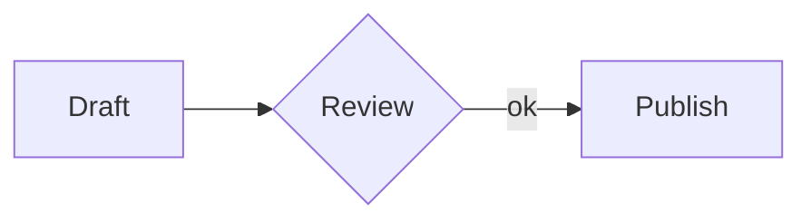
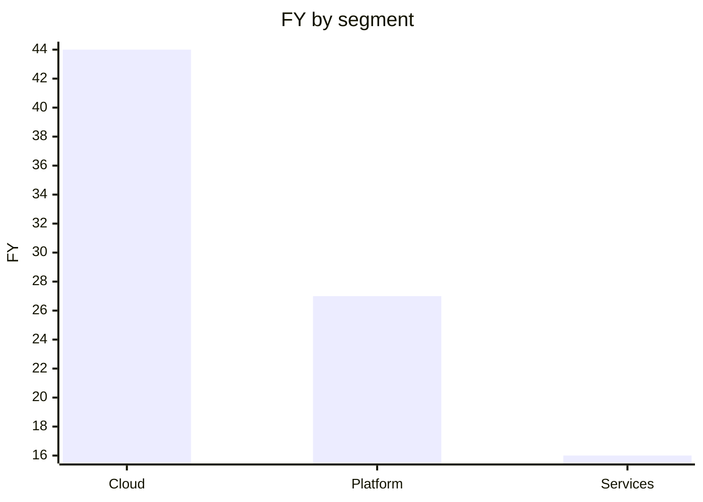
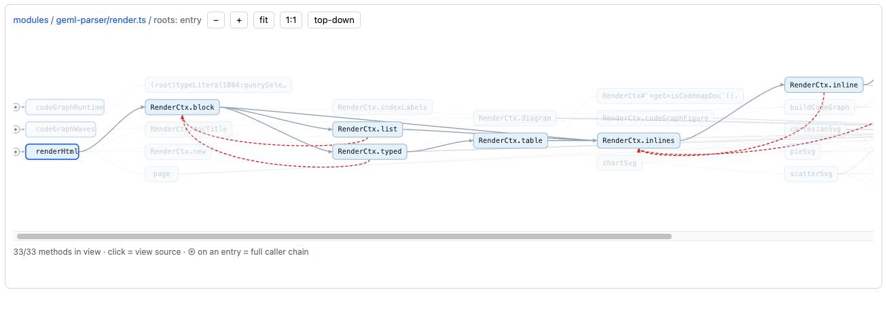

[](https://mcptoplist.com/server/io.github.geml-spec%2Fgeml) [](https://www.npmjs.com/package/@geml/geml) [](https://github.com/geml-spec/geml/actions/workflows/ci.yml) [](https://github.com/geml-spec/geml/actions/workflows/geml-check.yml) [](LICENSE) [](spec/LICENSE-spec.md)

<p align="center">
  <picture>
    <source media="(prefers-color-scheme: dark)" srcset="docs/assets/logo/geml-logo-dark.svg">
    
  </picture>
</p>

# GEML — General Expressive Markup Language

*English | [中文](README_CN.md)*

GEML is a markup language people and AI agents can write in the same document.<br>
**One format, two readers.** For people, plain text that reads clean; for agents, a **"Doc-as-a-Base"** — addressable, verifiable, traceable, revertible.

---

**GEML is minimal.**
It is dead simple — one block syntax for the whole language;
it is plain text — still clean with no renderer in sight;
it is machine-friendly — addressable, verifiable, referenceable structure, natively.

A `.geml` file is plain text, so you never need a renderer to read it. And instead of a separate mini-syntax for each kind of content, GEML carries every kind in one container: the **typed block**. Code is a block. So are tables, diagrams, math, callouts, even metadata — and a run of prose can be one too (`=== text`), whenever you want it addressable. Extending it later is just as plain. The shape is the same every time, which makes the language easy enough to learn that it's hard to get wrong.

```
=== code {#hello lang=python}
print("hi")
===
```

## Why a new format now

Everyone asks. Start with something small: you ask an agent to change one parameter in section 3. It gets that right — and in the same commit, a number in the table on page 7 gets "helpfully aligned". You find out three weeks later, after the document has been cited downstream four times.

**Text is the most universal medium of knowledge work and engineering collaboration** — people think and express in it; machines read it, edit it, act on it. And one piece of text has to serve two readers whose needs pull opposite ways: machines want precision, which comes from formal constraints and tool-enforced checking; people want comprehension, which comes from natural structure and expression.

**For decades, the only workable answer was separation** — every format optimized for its own consumer:

* **People writing for people** — Word / Google Docs / Markdown: optimized for comfortable reading, giving up the precision machines want;
* **People writing for machines** — programming languages / protocols / schemas: precise execution, at the cost of first learning a profession;
* **Machines writing for people** — a rendering pipeline per device and medium;
* **Machines writing for machines** — JSON / Protobuf: efficient interchange, readability an afterthought.

Separation worked because of a hidden premise: **each text had one kind of author and one primary kind of reader.** Whoever was writing knew who they were writing for.

**LLMs cancelled that premise.** The same document is now read, written, and rewritten by people and agents together — for the first time, both readers sit at the two ends of the same text, and "optimize for your one consumer" has nobody left to point at. That is what *now* means: the text didn't change; the readers did.

Once the readers change, the old way of working gives out at both ends.

**At one end, the person holding the net is gone.** Any engineering deliverable is only a version snapshot frozen at one moment, and behind the snapshot sit countless intermediates: requirement drafts, data, structural experiments, review comments, abandoned options, one diff after another — fragments scattered across the formats of those four patterns. That fragment network used to be held together by a person: to drive a machine you had to understand the machine, to persuade a reader you had to understand the reader, and that forced understanding — plus infrequent change — let one person or a small team remember which fragment was authoritative and which reference still held. AI dropped the barrier to driving machines to zero — nobody has to understand the machine anymore, so the global mental map loses its source; and the model's output is stochastic on top of that. No understanding, stacked on no reproducibility: the process goes from white box to black box.

**At the other end, the fragments are exploding.** What we call AI engineering — context engineering, evals, guardrails, replay — is all calibration of that black box (the professional skill didn't disappear; it changed seats). And **calibration itself manufactures copies**: every pass piles more into the context, and the same fact gets summarized once, restated once, locally patched once, pasted into a prompt once. The chain snaps where nobody is looking: a chart cites a number in a table, a section cites another section's conclusion, the agent moves the structure, the human rewrites the prose — and nobody knows when a dependency broke. A copy is drift from the moment it is made: the single source of truth gets copied, converted, scattered into stale shards — no longer single. Copies pile up past what a model can hold in one pass, so the work gets split finer and another layer goes on top — fragmentation snowballs on its own.

**Which points straight at the fix: let fragments reference the truth instead of copying it.** Every fragment knows where its source is and *looks the value up* when needed — the slice it takes is small and short-lived, refetched when stale, never a long-lived copy; and the dependency network between fragments becomes something a machine can hold and verify. With state pinned down — predictable, reproducible — the engineering loop can close again.

To do that, the format carrying the text has to provide four capabilities at the syntax level: **block-level addressing, reference-based projection, build-time verification, and block-level revert.**

**Existing formats don't cover the set.** Not for lack of trying: Markdown and HTML have links, wikis have backlinks, Obsidian has `![[…]]` embeds, AsciiDoc has includes. But they are either navigation only — the far end can change quietly, and you will never know — or embedding without verification: the source disappears and the reference keeps pointing serenely at nothing. Granularity mostly stops at the document or the heading. And none of them treats a broken link as a build error. For a reference to be a **lookup** rather than a signpost, the missing piece is the gate: change the source and every reference follows; delete the source and the build goes red.

GEML doesn't ask anyone to abandon their formats. It adds the missing net to the existing ecosystem — four capabilities, matched by four concrete designs, all in plain text:

**① One typed block + native `#id` (addressing)** — the whole language has one block syntax: `=== type {#id .class key=val}` … `===` — code, tables, diagrams, math, callouts, and metadata are all this block, differing only in `type`. Any block can carry a globally unique `#id`: a **block-level reference handle, not a document-level navigation link**. Change one block without touching the rest; feed the model just that one block — a slice as small as you like, refetched from the source whenever it goes stale.

**② Block embedding, `=== embed {src=doc.geml#id}` (projection)** — a reference is a lookup: what renders in place is that block's **current** state, not a hand-made copy. A deliverable becomes block-grained assembly — exactly the blocks you need, taken from wherever they live, instead of whole documents carried over.

**③ Build-time checking, `geml check` (verification)** — a reference that doesn't resolve is a **build error**, not a silent 404 discovered at render time. Chart-to-table bindings (`data=#id`), cross-document references, embed targets — all pass the same gate, and a broken link stops the build right there.

**④ A sidecar history, `.gemlhistory` (revert)** — a plain-text sidecar next to the document remembers how every block evolved, and `geml revert` rolls back just the block that went wrong. Git's granularity is files and commits: when an agent breaks one block while a person has edited elsewhere in the same file, a file-level rollback throws the person's work away — **that granularity is structurally beyond Git, and this is where it lives.** It works offline, and an agent can read the history itself to understand how the document came to be what it is.

---

## What's different about GEML

The four capabilities were established a chapter ago — addressing, projection, verification, revert. This chapter is where each format lands against them, where GEML draws its boundaries, and what it concedes.

### How other formats compare

Each of the four has mature solutions in its own field; what's unusual is meeting all four in one plain-text format:

| Family | What the state really is | Addressable / referenceable | Projectable / embeddable | Verifiable | History / traceability |
| :--- | :--- | :--- | :--- | :--- | :--- |
| **Word / Docs** | Opaque state | ❌ Machines can't get in | ❌ Copy-paste only | ❌ No checking at all | Platform server-side, not in the file |
| **Markdown / AsciiDoc** | A stream of characters | ⚠️ Headings only (matched by text) | ⚠️ Dialect embeds (Obsidian `![[…]]`, `include::`) — break silently | ❌ Broken links fail silently | None — external git required |
| **JSON / XML** | Data serialization | ✔️ (id / schema) | ⚠️ XML only (XInclude, external) | ✔️ Via an external toolchain | None — external git required |
| **GEML** | **Plain text + block structure** | **✔️ A unique `#id` per block (referenceable natively)** | **✔️ `=== embed`: a reference is a lookup (native)** | **✔️ A build-time error** | **✔️ `.gemlhistory` next to the file (traceable natively)** |

Item by item: [vs. CommonMark](docs/GEML-vs-CommonMark.md) · [vs. XML and JSON](docs/GEML-vs-XML-and-JSON.md) · [a 7-format capability matrix](docs/COMPARISON.md).

### Design boundaries (non-goals)

GEML stays small on purpose:

- **No raw-HTML escape hatch** — semantics stay portable, tied to no backend or renderer.
- **Hosts external diagram DSLs** (Mermaid, Graphviz, D2, …) rather than inventing one.
- **Tables compute, but aren't a spreadsheet engine** — per-row formulas and summary aggregates, not cell addressing, lookups, or macros.
- **ATX headings only** — no setext, no `---` frontmatter, no thematic-break guesswork.

The same restraint governs the command set. It is honed against one bar — can a single agent run a document's whole life from the shell? — so its verbs aim to be **complete** (a verb for every step, so nothing forces a whole-file rewrite to change one block), **ergonomic** (few flags, sensible defaults, pipeline-friendly I/O), and **consistent** (name a target `#id` and the content adopts it; a file is edited in place while `-` streams to stdout; every write is guarded).

### The trade-offs

- **No ecosystem to start from.** Markdown owns the mainstream surfaces; GEML doesn't. So GEML positions itself as the **editing source of truth**, not the delivered artifact: project one way with `geml <file> --to md|html` and ship `.md` or `.html` as before — **collaboration, not lock-in**. *(Note: projection is lossy — block ids and table-bound charts don't survive it.)*
- **Models are less fluent in it than in Markdown.** No LLM has been pre-trained on GEML at scale. The uniform block syntax and `--json` diagnostics let an agent check and repair its own output, but the starting fluency really is lower, and we won't pretend otherwise.

### Think the design falls short? Come argue with it

The most valuable contribution isn't code. GEML is `1.0`, but "stable" means **the rules already there won't shift under you** — not that the design is settled: there is exactly **one implementation**, and **one set of opinions** behind the spec. An objection you raise now can still change the format itself, not just its tooling.

**Read the argument before you object** — how each decision was fought out at the time:

- **What the spec is bound by** — [`GOVERNANCE.md`](GOVERNANCE.md): the spec is defined by its conformance suite, so a change is only real once it has conformance cases.
- **How the CLI's verb set was derived** — [block-mutation design](docs/design/specs/2026-07-24-geml-block-mutation-cli-design.md) and [the undo half](docs/design/specs/2026-07-24-geml-revert-history-phase-design.md). Working notes, written to implement from, not polished prose.
- **Why a code graph is expressed as GEML** — [DESIGN-geml-code-graph.md](docs/DESIGN-geml-code-graph.md), with [GEP 0002](spec/proposals/0002-code-graph-representation.md) / [0003](spec/proposals/0003-geml-code-graph-format.md).
- **Writing a second parser yourself** — [docs/WRITING-A-PARSER.md](docs/WRITING-A-PARSER.md).

**The conformance suite is the contract.** A spec change lands together with its conformance cases, never without them — that is what makes two implementations hold each other in check. See [`GOVERNANCE.md`](GOVERNANCE.md).

**Two questions that are genuinely open**, if you want something concrete to chew on:

- **Projection is lossy.** `--to md` / `--to html` drop block ids and a chart's binding to its table, because neither target format has anywhere to put them. Fine as delivery, bad as a round trip. Is a lossless projection worth having — and where would it encode any of this?
- **Heading levels inside an embed.** An embedded section keeps its source heading levels, which can invert the host's hierarchy — render as-is, or remap? The [transclusion design](docs/design/specs/2026-07-30-block-transclusion-design.md) deliberately leaves this open (S10).

An objection that arrives with a case we can run is worth more than agreement.

## The format in 5 minutes

### Typed blocks

**One shape, every type.** A block is always `=== type {#id .class key=val}` … `===` — only the `type` (and how its body is read) changes:

```
=== code {lang=python}
print("hi")
===

=== note {.intro}
Parsed prose with *emphasis* and a [[#budget]] reference.
===

=== meta
title = "Budget plan"
===
```

A run of `=` (three or more) opens a block; an equal-length run closes it; longer fences nest inside shorter ones. A block that carries an `#id` can also close with the **labeled fence** `=== #id` — no fence-length counting, which makes long or nested blocks much harder to get wrong. The type decides how the body is read — `raw` (verbatim: `code`, `diagram`, `math`, `table`), `flow` (parsed prose with inline markup: `note`, `text`), or `data` (one `key=val` per line: `meta`); `embed` carries no body at all — its `src=` names the block it stands for — and every block may carry an attribute object `{#id .class key=val}`, where a `.class` is a *semantic* label, never a styling hook. The full inline grammar (emphasis, links, `[[#id]]` auto-references, media, footnotes, inline `$math$`) is in the [spec](spec/GEML-spec.md).

### Tables — two bodies, one model

Write a table visually:

```
=== table {#budget caption="Annual cost"}
| Plan  | Months | Rate |
|-------|-------:|-----:|
| Basic |      1 |   30 |
| Pro   |      2 |   30 |
===
```

…or as data, with **computed columns** and a **summary row**:

```
=== table {#fy25 format=csv header=1 compute="FY [%.1f] = Q1 + Q2 + Q3 + Q4" summary="Segment = 'Total'; FY [%.1f] = sum(FY)"}
Segment,  Q1, Q2, Q3, Q4
Cloud,     8, 10, 12, 14
Platform,  5,  6,  7,  9
Services,  3,  4,  4,  5
===
```

*Both forms describe the same model. The `FY` column and `Total` row are computed at build time:*

| Segment   | Q1 | Q2 | Q3 | Q4 |   FY |
|-----------|---:|---:|---:|---:|-----:|
| Cloud     |  8 | 10 | 12 | 14 | 44.0 |
| Platform  |  5 |  6 |  7 |  9 | 27.0 |
| Services  |  3 |  4 |  4 |  5 | 16.0 |
| **Total** |    |    |    |    | **87.0** |

`compute` runs `+ - * / ( )` per row over columns; `summary` adds a foot row from the aggregates `sum / avg / min / max / count` (with arithmetic over them, e.g. weighted ratios); a trailing `[printf]` sets numeric display.

Tables can also pull their data from an external CSV via `src="regions.csv"`.

### Math

```
=== math {#gauss caption="Gaussian integral"}
\int_{-\infty}^{\infty} e^{-x^2} dx = \sqrt{\pi}
===
```

$$\int_{-\infty}^{\infty} e^{-x^2} dx = \sqrt{\pi}$$

### Diagrams & charts — host a DSL, or chart a table

GEML never interprets a diagram body; it routes it to a pluggable renderer (an unknown `format` is a warning, body preserved):

```
=== diagram {#flow format=mermaid caption="Review flow"}
graph LR
  A[Draft] --> B{Review} -->|ok| C[Publish]
===
```


```mermaid
graph LR
  A[Draft] --> B{Review} -->|ok| C[Publish]
```

A diagram can also **chart a table** — single source of truth, with the column references checked at build time and no data copied:

```
=== diagram {format=geml-chart data=#fy25 type=bar x=Segment y=FY}
===
```

*Drawn from the `#fy25` table above:*


```mermaid
xychart-beta
  title "FY by segment"
  x-axis [Cloud, Platform, Services]
  y-axis "FY"
  bar [44, 27, 16]
```

### Embeds — reference, don't copy

One block can stand for another — in the same document by `#id`, or across documents by `src=other.geml#id` — and renders that block's **current** state in place:

```
=== embed {src=#fy25}
===
```

The body stays empty (the target lives in `src=`), and the target is checked like any reference: if it goes missing, `geml check` fails the build.

## A gift for programmers — geml-code-graph

To really feel how powerful and flexible a single GEML primitive is, let's try it on a code graph — a familiar but demanding case for programmers: 
**your whole codebase's call graph, written as GEML.** `geml codemap build` lays the call graph out as a tree of GEML documents — every method an `#id` block, with `#calls` / `#called-by` edges both ways. The **downstream chain** (what a method calls) for troubleshooting, the **upstream chain** (who calls it) for the blast radius — all visible in a second;



```sh
npm i -g @geml/geml             # needs Node 22+
geml codemap build              # --root defaults to . : detect languages -> index -> one merged graph in ./.geml-code-graph/
geml codemap serve              # opens your browser on the graph
```

> [!TIP]
> **TS/JS** — zero setup: `build` fetches the scip indexer by itself.
> **Java / C / Python / Go / Kotlin** — one extra download, [Joern](https://docs.joern.io/installation): unzip its release package and pass that folder to build, e.g. `--joern C:\joern\joern-cli` (or put it on PATH and skip the flag).
> Mixed front-end + back-end repo — everything merges into **one graph**.

geml-code-graph is itself a diagram format — one line embeds it in any GEML document (`=== diagram {format=geml-code-graph src=.geml-code-graph/index.geml} ===`), and an optional per-commit hook (bundled with the Claude skill) rebuilds it as the code moves, so the graph doesn't drift. Scale is measured, not promised: on Apache Flink's codebase — **13,585 Java source files, 81k methods, 266,821 call edges** — the plain-text *data tables* still open and query instantly (pan across the whole thing and its dense, web-like symmetry is genuinely striking), and you can grep any method name to trace its call chain.

## Next — get hands-on

▶ **[Try writing GEML in the Playground](https://geml-spec.github.io/geml/playground/)** — edit on the left, rendered live on the right, and the build verdict flips red the moment a reference breaks. No install.

1. Install the **[browser extension](https://chromewebstore.google.com/detail/opmhfphgoidpnipphfgkhhjhmnmaenie)**, then open a raw `.geml` link *(the raw file, not the GitHub blob page — that one is HTML)* and watch it render — the **[GEML spec itself](https://raw.githubusercontent.com/geml-spec/geml/main/spec/GEML-spec.geml)** (dogfood — the spec is a GEML document, rendered at scale), the **[showcase](https://raw.githubusercontent.com/geml-spec/geml/main/docs/examples/showcase.geml)** (a computed table, four charts, a Mermaid flow, and math), or **[playground/sample.geml](https://raw.githubusercontent.com/geml-spec/geml/main/playground/sample.geml)** for the interactive code-graph.
2. Or write your own right now in the ▶ **[Playground](https://geml-spec.github.io/geml/playground/)** — no install.
3. Then read the **[full spec](spec/GEML-spec.md)** (EN / [中文](spec/GEML-spec_CN.md)) for the whole grammar.

## Using GEML with an LLM

GEML is meant to be **written and edited by models** — precisely. To change one
thing, an agent needn't re-read and re-emit the whole document: it addresses a
single block by id, then validates.

```sh
npm i -g @geml/geml                 # installs the `geml` command
geml doc.geml                       # document-model JSON (default --to json)
geml doc.geml --to md|html|geml     # convert (geml notes.md -> GEML; -o writes a file)
geml get    doc.geml ['#id']        # list every id, or print ONE block (a heading id = its section)
geml set    doc.geml '#license' --in template.geml#mit   # replace a block, forking another (id adopts #license)
geml add    doc.geml --after '#intro' --in snippet.geml  # insert a fragment (keeps its own ids)
geml delete doc.geml '#draft' '#tmp'           # remove one or more blocks
geml rename doc.geml '#old' '#new'             # rename an id + every reference to it
geml revert doc.geml '#plan' --rev -1          # roll ONE block back to an earlier revision
```

Every mutation writes the whole updated document — in place for a file, to stdout
for `-` — so edits pipe cleanly; each is re-parsed before the write and refused if
it would break the document. Option by option: [parser README](geml-parser/README.md).

- **Claude Code / Claude CLI.** Install the package above, then copy the skills
  in [`.claude/skills/`](.claude/skills/) — `geml/` for authoring,
  [`geml-code-graph/`](.claude/skills/geml-code-graph/SKILL.md) for the call
  graph — into `~/.claude/skills/`. Claude auto-loads them: the skill has it
  run `geml check` after it touches a `.geml` file, and build/open the code graph when you
  ask "show me the code graph" or "who calls X" — no CLI or prompting needed.
- **ChatGPT, Gemini, or any model.** Paste the primer below so the model emits
  valid GEML, then run `geml check` on the output for a hard pass/fail.

> **GEML primer.** Write the document as GEML. Every block is
> `=== type {#id .class key=val}` … `===`; the closing fence is a run of `=` of
> the *exact* opening length, and a longer fence nests a shorter one — or, when
> the block has an `#id`, close it with the labeled fence `=== #id` (no length
> counting; prefer this for long or nested blocks). Block types:
> `code`/`diagram`/`math`/`table` (verbatim body), `note`/`text` (prose with
> inline markup), `meta` (one `key=val` per line), `embed` (empty body;
> `src=doc.geml#id` renders that block in place). Headings are ATX `#` only — no
> `---` frontmatter (use `=== meta`). Every `#id` is unique and every reference
> (`[[#id]]`, `[text](#id)`, `[^id]`, chart `data=#id`) must resolve. No raw HTML.
> Inline: `*em*`, `**strong**`, `` `code` ``, `$math$`, `[text](url)`. The
> normative spec is [`GEML-spec.md`](spec/GEML-spec.md).

### MCP Server

A standard Model Context Protocol server ships with the package, so your assistant
edits **one block at a time** instead of rewriting whole files. It runs locally on
Windows, macOS, and Linux; `--root` is the directory holding your `.geml` files.

**Claude Code / any CLI client** — one command:

```sh
claude mcp add geml -- npx -y @geml/geml@latest mcp --root /absolute/path/to/your/docs
```

**Claude Desktop** — add to `claude_desktop_config.json`:

```json
{
  "mcpServers": {
    "geml": {
      "command": "npx",
      "args": [
        "-y",
        "@geml/geml@latest",
        "mcp",
        "--root",
        "/absolute/path/to/your/docs"
      ]
    }
  }
}
```

Then just ask for the change you want — "fix the Q3 row in the FY26 table" — and
the assistant addresses that one block. You never learn a tool name: each mirrors a
CLI verb (`geml set` → `geml_set`), so one vocabulary covers the terminal and the
assistant.

Two guarantees make this better than letting a model rewrite the file: a write is
parsed **before** it reaches disk and refused with its diagnostics if it would
break the document, and every write first records a `.gemlhistory` revision — so a
bad edit is both *prevented* and *undoable* (`geml_revert` restores one block, the
rest of the file byte-identical). Paths stay confined to `--root`, which a client
cannot widen.

Point `--root` at a repository that has a code graph (`geml codemap build`) and the
same server also answers "who calls this" — four read-only `geml_codemap_*` tools,
one client entry instead of two. Every tool and option:
[docs/mcp-guide.md](docs/mcp-guide.md).

## Ecosystem and maturity

GEML is a small, young spec — but a **stable** one: **`1.0`** is released and usable for real documents (this repo's own spec is one), with a strict conformance suite, a reference implementation that passes it, and an open proposal process.

Both specs are bilingual:

| Document | English | 中文 |
|----------|---------|------|
| Core spec | [`GEML-spec.md`](spec/GEML-spec.md) | [`GEML-spec_CN.md`](spec/GEML-spec_CN.md) |
| History extension | [`GEML-history-spec.md`](spec/GEML-history-spec.md) | [`GEML-history-spec_CN.md`](spec/GEML-history-spec_CN.md) |

**Maturity signals.** A complete core spec (§1–§8) plus a history-extension spec, both EN / 中文; a working reference implementation, **renderer** + CLI; a [conformance suite](geml-parser/test/conformance/) (`input → projected document model`) that a **second, independently-written parser must reproduce case for case** — two separate implementations agreeing on every case is what keeps subtle rules like emphasis and lists from drifting — backed by 600+ unit and conformance checks (~99% line coverage in the reference implementation; CI-gated at ≥95% lines / statements / functions / branches); and **self-hosting** — [`GEML-spec.geml`](spec/GEML-spec.geml) is the specification written in GEML, parsed clean on every test run.

Where a `.geml` file can land — every one of these is in this repo, ready to use or read:

| Scenario | Where | State |
|---|---|---|
| **From the command line** — validate, convert, edit by block, version history, all in one command | [`@geml/geml`](https://www.npmjs.com/package/@geml/geml) (source [`geml-parser/`](geml-parser/)) | Available |
| **Read it in the browser** — open any raw `.geml` link and it renders in place: computed tables, charts, Mermaid, math, with diagnostics as a banner | [Chrome Web Store](https://chromewebstore.google.com/detail/opmhfphgoidpnipphfgkhhjhmnmaenie) · [source](integrations/geml-viewer/) | Available |
| **Let an assistant edit by block** — an MCP server; the assistant changes one block instead of rewriting the file, and every write is validated before it reaches disk | [`docs/mcp-guide.md`](docs/mcp-guide.md) | Available |
| **Turn a codebase into a document** — the whole call graph as a tree of GEML documents, browsable | `geml codemap build` ([design](docs/DESIGN-geml-code-graph.md)) | Available |
| **Write it in your editor** — syntax highlighting + build-time reference checking | [`integrations/vscode/`](integrations/vscode/) | Built — install from source; not on the Marketplace yet |
| **Render it in Obsidian** — the reference parser + the viewer's renderer, the same code path as the web | [`integrations/obsidian/`](integrations/obsidian/) | Built, not in the community store |
| **Stop bad documents in CI** — dangling `[[#id]]`, broken cross-document links, duplicate ids, and parse errors all fail the build | [`integrations/geml-check-action/`](integrations/geml-check-action/) | Available |
| **Feed a RAG / agent framework** — block-level loaders (one chunk per block, carrying `block_id`) + agent editing tools | [`integrations/langchain+llamaindex/`](integrations/langchain+llamaindex/) | Reference implementation |
| **Try it without installing anything** — edit on the left, live render on the right, and the build verdict flips red the moment a reference breaks | [Playground](https://geml-spec.github.io/geml/playground/) | Available |

Conversion between formats is collected behind one entry, `geml <file> [--to json|html|md|geml]`: in and out of Markdown, projected to self-contained HTML, re-serialized back to canonical GEML, or emitted as document-model JSON with its `diagnostics` — which is how scripts and agents get a structured pass/fail signal.

## Status & contributing

**Three ways in — pick by the kind of mark you want to leave:**

- **The standard's path — write the second parser.** Two independent implementations agreeing is what turns a spec into a standard, and this is the contribution the project needs most. The portable [conformance suite](geml-parser/test/conformance/) lets you self-certify; [docs/WRITING-A-PARSER.md](docs/WRITING-A-PARSER.md) is the build order. Any language.
- **The toolchain's path — write the tree-sitter grammar.** One grammar lights up **Neovim, Helix, and Zed** at once. The [design brief](integrations/tree-sitter/) is written; the grammar isn't.
- **The ecosystem's path — write the Pandoc reader / writer.** One integration, and GEML reaches every pipeline Pandoc already serves.

And one standing provocation: if "why not just Markdown" seems obvious to you — **in either direction** — we would rather hear you say it than have you agree quietly.

**Contributing.** Contributions of every kind are welcome — bug reports, tooling and integrations, broader conformance coverage, and the spec itself. GEML is 1.0, but the format can still evolve: substantive spec changes are discussed and land through a [GEP](CONTRIBUTING.md), each with its conformance case. The reference parser's test suite is the contract, so code changes should keep `npm test` green and the dogfood spec parsing clean. For what is actually open: [Build an integration](#build-an-integration) below is what's *missing*, and [Think the design falls short?](#think-the-design-falls-short-come-argue-with-it) above lists the design questions still on the table.

### Build an integration

The scenario table above is what **already exists**; this is what's **missing** — every row is a piece you can claim:

| Gap | Where it stands | What it takes |
|---|---|---|
| **Deeper Obsidian integration** | Renders, but not in the community store yet | Editing at the CodeMirror layer and seamless two-way rendering, plus the store submission itself. Wants someone who knows the Obsidian API. |
| **A tree-sitter grammar** | A design brief, nothing more | Writing the grammar — one of them lights up **Neovim, Helix, and Zed** at once. |
| **An LSP** | VS Code has highlighting + build-time checks only | Rename-aware refactoring, go-to-block, live diagnostics while editing. |
| **Block-level revert across `rename`** | A documented limitation with a sketched fix (a rename lineage log) | History-layer design + implementation; the hash chain that makes history verifiable must survive it. |
| **Logseq plugin / Notion import-export** | Blank | All of it. |
| **A Pandoc reader / writer** | Blank | Once it exists, GEML reaches every pipeline Pandoc already serves. |
| **The viewer on other browsers** | Chrome works | Firefox / Safari ports. |
| **Packaging the RAG integrations** | LangChain / LlamaIndex are reference implementations | Publishing to PyPI; and wiring up other frameworks (Haystack, DSPy, …). |
| **MCP client verification** | Only exercised end-to-end on Claude | Verify against other MCP clients and report the differences back. |

The rendering core is reusable: the viewer, the Obsidian plugin, and `--to html` all go through the **same** renderer, so wiring up a new host is mostly glue, not a new parser.

**Smaller, well-bounded work** — more languages in the code graph, the parked D2 / Graphviz engines, symbol visibility, incremental emit, broader conformance coverage — is claimed the same way: [open an issue](https://github.com/geml-spec/geml/issues/new) saying which piece you want.

### Write a parser in another language

Two implementations, written independently and agreeing anyway, are what turn a *spec* into a *standard*. There is a portable [conformance suite](geml-parser/test/conformance/) to self-certify against, and a build-order guide: **[docs/WRITING-A-PARSER.md](docs/WRITING-A-PARSER.md)**.

Rust, Go, Python, Java, C — any of them. **Finding the places where the spec is ambiguous is itself the contribution**, whether or not that parser ever ships.

## Repository layout

```
spec/                  Core spec + .gemlhistory extension (EN / 中文), the dogfood
                       GEML-spec.geml, the CC-BY spec license, and proposals/ (GEPs)
geml-parser/           Reference parser, renderer, CLI + codemap toolkit (TypeScript, Node 22)
integrations/          Everywhere GEML plugs in: geml-viewer (browser extension),
                       geml-check-action (CI), vscode, obsidian, tree-sitter (brief)
playground/            In-browser playground (+ a live geml-code-graph of this repo)
docs/                  Guides, design notes, the format COMPARISON (EN / 中文),
                       assets, and an example .geml document to render
```

## License & governance

Code (`geml-parser/`, `integrations/geml-viewer/`, `integrations/geml-check-action/`) is **MIT** ([`LICENSE`](LICENSE)). The specification documents are **CC-BY-4.0** ([`LICENSE-spec.md`](spec/LICENSE-spec.md)) — a spec is not software, and anyone may build a conformant implementation. See [`GOVERNANCE.md`](GOVERNANCE.md) for how decisions are made and [`CONTRIBUTING.md`](CONTRIBUTING.md) to get involved.
