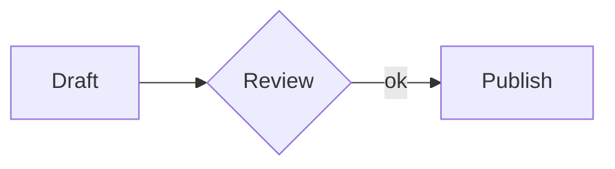
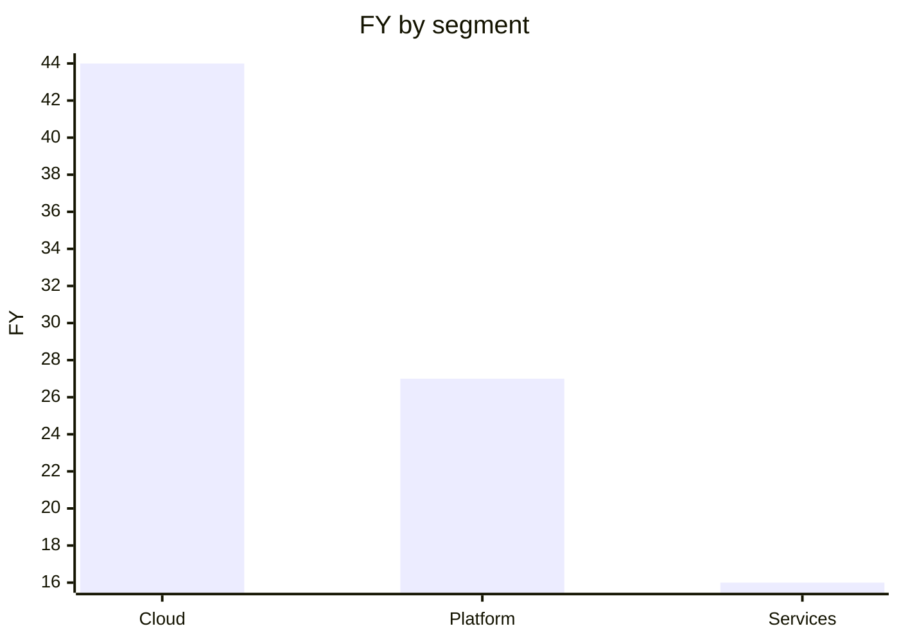

[](https://mcptoplist.com/server/io.github.geml-spec%2Fgeml) [](https://glama.ai/mcp/servers/geml-spec/geml) [](https://github.com/hashgraph-online/awesome-ai-plugins#development--workflow) [](https://github.com/mundimark/awesome-markdown#beyond-markdown---lets-fix-markdown-quirks--oddities-and-lets-fill-in--add-the-missing-parts-tables-footnotes-generic-blocks-etc) 


<p align="center">
  <picture>
    <source media="(prefers-color-scheme: dark)" srcset="docs/assets/logo/geml-logo-dark.svg">
    
  </picture>
</p>

# GEML — General Expressive Markup Language
[](https://www.npmjs.com/package/@geml/geml) [](https://modelcontextprotocol.io) [](https://github.com/geml-spec/geml/actions/workflows/ci.yml) [](https://github.com/geml-spec/geml/actions/workflows/geml-check.yml) [](spec/GEML-spec.md) [](LICENSE) [](spec/LICENSE-spec.md)

*English | [中文](README_CN.md)*

GEML is **a lightweight, Agent-Native markup language**, designed for people and AI agents to read and write the same document.<br>
**One format, two readers.**
In agent-driven development and knowledge work, plain text and Markdown have no deterministic block boundaries: a program and a model trade the whole file in and the whole file back out — at best probing for it with line windows, and restating the original verbatim to rewrite it. Token cost grows with the length of the document, and the operation turns bloated. After a few rounds of rewriting, the copies excerpted elsewhere start to drift.

**You can start without changing a thing.** `geml list`, `geml find` and `geml get` address the Markdown you already have — nothing is converted, no new files, your `.md` stays `.md`:

```sh
geml list    README.md                          # every section, as an address
geml get     README.md '#key-features'          # read ONE section, not the file
geml set     README.md '#key-features' --body   # write one section back
geml replace README.md 'old text' 'new text'    # swap a string, told which block held it
```

Only that section enters the agent’s context — a couple of KB, not the whole ~48 KB file.

Need finer than a section — one block, one chart, one table? Let `.geml` stand in the middle ground: edit at that grain, and the `--to md` you ship never drifts from it.

**A block has a name; the things inside it have a coordinate.** A table's cell, a
`data` block's leaf, a key in `meta` — each has a coordinate the structure already
gives it, and `get` and `set` land on exactly that value.

```sh
geml get doc.geml '#fy[2]["Q1"]'                     # one cell
geml set doc.geml '#intake["fields"][1]["name"]'     # one leaf in the JSON
```

For people, it is plain text that reads clean; for agents, it is an addressable, verifiable, traceable, revertible **["Doc-as-a-Base"](https://geml-spec.github.io/manifesto)**.

---

**GEML is minimal.**
It is plain text — still clean with no renderer in sight;
one block syntax for the whole language;
addressable, verifiable, referenceable structure, natively.

Instead of a separate mini-syntax for each kind of content, GEML carries every kind in one container: the typed block. Code is a block. So are tables, diagrams, math, callouts, even metadata — and a run of prose can be one too (`=== text`), whenever you want it addressable. Extending it later is just as plain. The shape is the same every time, which makes the language easy enough to learn that it's hard to get wrong.

```
=== code {#hello lang=python}
print("hi")
===
```

```sh
geml get doc.geml '#hello'   # by name, just this block
```

Blocks have names so the verbs have somewhere to land — the full syntax is in
[the format in 1 minute](#one-minute).

**Contents:** [What it solves](#problems) · [Why now](#why-now) · [What's different](#whats-different) ·
[The format in 1 minute](#one-minute) · [Profiles](#profiles) ·
[Get hands-on](#hands-on) · [With an LLM](#with-an-llm) ·
[Maturity & versions](#maturity) · [The design](#challenge) · [Roadmap](#roadmap) · [Take part](#contributing) ·
[License](#license)

<a id="problems"></a>
## What it solves

### Problems solved

1. **Context load and token bloat**
   * **Status quo**: data formats like JSON/XML carry heavy wrapper tags and syntax symbols; Markdown lacks strict structural metadata and a reference mechanism.
   * **Approach**: tuned markup density and syntax overhead, reading and writing only the target block — context cost no longer grows with document length, keeping **agent reads and writes lightweight**.

2. **AST-level precision and parsing determinism**
   * **Status quo**: unstructured text degrades over multiple rounds of LLM reads and writes — broken formatting, semantic drift, parsing hallucinations.
   * **Approach**: a deterministic grammar that maps directly to an abstract syntax tree (AST), so programs and LLMs perform atomic block-level create/read/update/delete.

3. **Document copy fragmentation**
   * **Status quo**: multi-agent collaboration and shared pipelines pass content around by copy-paste, leaving multiple disconnected copies.
   * **Approach**: **Single Source of Truth** by design — standardized module references and data binding eliminate redundant copies and version divergence.

### Key features

#### 1. AST-level structured operations
* Uniform node definitions; a document parses directly into a typed document tree (AST).
* Agents pinpoint the target section, attribute or component; partial patches and idempotent updates replace whole-file rewrites. Writes land as byte splices with whole-document re-validation — the tree serves reading and validation, and every untouched byte is guaranteed unchanged.

#### 2. Low-token reads and writes
* What is saved is not markup characters — it is the part never read: `#id` hits one semantically complete block, and the rest never enters the context.
* For the same semantics, markedly lower prompt-token cost: better model throughput, lower inference cost.

#### 3. Single source of truth, modular references
* Native cross-document, cross-fragment component references.
* Change the source node once and every reference follows — no version skew.

#### 4. Robust two-way reads and writes
* One block shape for the whole language — easy to generate and hard to get wrong, a good match for mainstream LLM output distributions.
* A strict validator with precise error locations and actionable repair feedback.

#### 5. Profile-based domain extensibility
* Zero dialect chaos: extend domain vocabularies (e.g. design styles, interactive forms, code graphs, media timelines) through declarative `profile` metadata without inventing new syntax or breaking parsers.
* Static type and constraint checking with safe fallback to standard blocks in unknown environments.

### Comparison

| Dimension | Markdown | JSON / YAML | GEML |
| :--- | :--- | :--- | :--- |
| **Context cost (block-wise I/O)** | High (whole file in and out) | High (whole file + syntax noise) | **Minimal (only the target block)** |
| **Precise AST operations** | Weak (no strict semantic nodes) | Strong | **Strong (built for agent reads and writes)** |
| **Human readability** | High | Medium | **High** |
| **Single-source references** | Unsupported | Needs protocol extensions | **Native (modular embeds)** |
| **Domain extensibility** | Fractured (proprietary syntax hacks) | Schema-dependent | **Native Profiles (zero new syntax + verified)** |
| **Write safety** | Weak | Medium | **Strong (a bad write is refused before landing + single-block revert)** |

---

<a id="why-now"></a>
## Why the LLM era needs a brand-new text format

Because **both the producer and the consumer of a document have changed**.

In traditional software engineering, a document was either a static explanation for people to read, or a serialized data file for programs.

Today, people and AI agents collaborate on the same document at high frequency. When the agent becomes the document's "second reader and co-author", the old balance breaks for good:

1. **Context is scarce compute**: every whole-document read or write burns an agent's limited attention window and reasoning budget;
2. **Human–machine collaboration needs an isomorphic carrier**: people need to read it at a glance, agents need to read and write it precisely, block by block;
3. **Knowledge must have a single source of truth**: scattered prompts and copy-pasted Markdown are destined to decay with every iteration.

Yet none of our existing text infrastructure was designed for this scene:

* **Markdown (typeset for people)**: no stable structural blocks, no machine keys. To change one parameter, an agent must read and write the whole text — **wasting context budget** across multi-turn loops, and inviting drift in both format and meaning.
* **JSON / XML (serialized for machines)**: full of wrapper syntax and structural noise — blocking natural human reading, while quietly eating expensive tokens in long contexts.
* **Scratch memory and scattered files (no single source of truth)**: context is torn across chat history and Markdown copies everywhere; a copy is drift from the moment it is made, and version skew and hallucinated distortion follow.

The root of all three failures is each tool's own virtue: Markdown's "never error, write anything" is what gives people their freedom to write — and exactly why a machine cannot trust the structure it reads back; JSON/XML's strict schema is what gives machines their certainty — and exactly why nobody writes prose in it. **The virtue is the defect, which is why patches cannot fix this**: bolting "a broken reference must fail the build" onto Markdown betrays its contract, and stripping the wrapper syntax from JSON denies its nature. When people and agents start co-writing the same text at high frequency, what is needed is not a compromise between the two poles, but a format that treats "readable by people" and "operable by machines" as **one design constraint from day one**.

### The answer: **["Doc-as-a-Base"](https://geml-spec.github.io/manifesto)**

GEML invents no heavy new runtime. Borrowing from the **[REST](https://www.ics.uci.edu/~fielding/pubs/dissertation/rest_arch_style.htm)** architectural style of Dr. Roy Fielding's dissertation, it gives plain-text documents one standard set of operational semantics:

| Old pain | The matching capability (the four laws) | What it buys developers and agents |
| :--- | :--- | :--- |
| **Changing one spot means rewriting the whole text** | **The Law of Addressing** | Every block carries an `#id`; `get/set` reads and writes that block alone. **What is never loaded cannot be broken** — the context window stays yours. |
| **Copies everywhere, all drifting** | **The Law of Projection** | `=== embed` evaluates dynamically instead of copy-pasting; one definition at the source ends the labor of syncing copies. |
| **Bad formats / broken references pollute downstream** | **The Law of Validation** | References and syntax are checked at build time; **a bad write is stopped before it lands**, with no waiting for human review. |
| **One bad edit forces a whole-file rollback** | **The Law of Rollback** | The companion `.gemlhistory` reverts **a single block atomically** — no tearing down the page; a lightweight version safety net for agents. |

> **A document no longer needs just a format — it needs a set of verbs.** GEML keeps plain-text readability and adds deterministic block-level operations.

> 💡 **Deep Dive:**
> If you are interested in the dilemma of engineering documents in the LLM era and why we need to redesign a plain-text format from the ground up, read our full article on the blog: [**"Why Do We Need a New Text Format in the Era of LLMs?"**](https://geml-spec.github.io/blog/2026/08/03/why-do-we-need-a-new-text-format-in-the-era-of-llms)

---

<a id="whats-different"></a>
## What's different about GEML

GEML stays small on purpose — the thinking, what it refuses, and what is still open are in [how we thought about the design](#challenge).

The four capabilities were established a chapter ago — addressing, projection, validation, rollback. This chapter is where each format lands against them, and where GEML draws its boundaries.

### How other formats compare

Each of the four has mature solutions in its own field; what's unusual is meeting all four in one plain-text format:

| Family | What the state really is | Addressable / referenceable | Projectable / embeddable | Verifiable | History / traceability |
| :--- | :--- | :--- | :--- | :--- | :--- |
| **Word / Docs** | Opaque state | ❌ No block-level keys; access via platform APIs | ❌ Copy-paste only | ❌ No checking at all | ⚠️ Platform server-side, not in the file |
| **Markdown / AsciiDoc** | A stream of characters | ⚠️ Heading anchors or dialect ids; no read/write verbs | ⚠️ Dialect embeds (Obsidian `![[…]]`, `include::`) — break silently | ❌ Broken links fail silently | ❌ None in-format — external git required |
| **JSON / XML** | Data serialization | ✔️ (id / schema) | ⚠️ XML only (XInclude, external) | ✔️ Via an external toolchain | ❌ None in-format — external git required |
| **GEML** | **Plain text + block structure** | **✔️ A unique `#id` per block (referenceable natively)** | **✔️ `=== embed`: a reference is a lookup (native)** | **✔️ A build-time error** | **✔️ `.gemlhistory` next to the file (traceable natively)** |

Item by item: [vs. CommonMark](https://geml-spec.github.io/compare/commonmark) · [vs. XML and JSON](https://geml-spec.github.io/compare/xml-and-json) · [a 7-format capability matrix](https://geml-spec.github.io/compare/matrix) · [the Markdown variants and tools in awesome-markdown](https://geml-spec.github.io/illustrated/geml-vs-markdown-variants_CN.html) (Chinese, an HTML page).

Coexisting with Markdown: GEML is the **editing source of truth**, Markdown is the delivered artifact. Project one way with `geml <file> --to md|html` and ship `.md` or `.html` as before. **Collaboration, not lock-in.** *(Projection is lossy: block ids and table-bound charts don't survive it.)*

**Don't take the table's word for it — re-run it.** This is what I asked the model:

> Based on your own experience editing the READMEs just now, describe the command steps you go through on a document (I saw you using grep and such), and whether you cache documents to save tokens — let's compare, and from that see which parts of GEML would actually earn their place.

What came back: **[what one edit costs](https://geml-spec.github.io/benchmarks/addressing-cost)** and **[a real day replayed](https://geml-spec.github.io/benchmarks/mixed-toolchain)**. Paste the question to your own model and see what it tells you.
PS: I am still trying to work out whether the upstream chain (who calls this) and the downstream chain (what it calls) that `codemap` produces can pin down functions and call sites — and change project code — the same way. I will post a report when I have one.

<a id="one-minute"></a>
## The format in 1 minute

### Typed blocks

**One shape, every type.** A block's basic syntax is `=== type [attributes]` … `===` (where attributes like `{#id .class key=val}` are optional) — only the `type` (and how its body is read) changes:

```
=== code {lang=python}
print("hi")
===

=== note {.intro}
Parsed prose with *emphasis* and a [[#budget]] reference.
===

=== meta
title = "Budget plan"
===
```

A run of `=` (three or more) opens a block; an equal-length run closes it; longer fences nest inside shorter ones. A block that carries an `#id` can also close with the **labeled fence** `=== #id` — no fence-length counting, which makes long blocks much harder to get wrong (nesting still requires a longer outer fence: a same-length bare `===` in the body closes the block early, labeled or not). The type decides how the body is read — `raw` (verbatim: `code`, `diagram`, `math`, `table`), `flow` (parsed prose with inline markup: `note`, `text`), or `data` (one `key=val` per line: `meta`); `embed` carries no body at all — its `src=` names the block it stands for — and every block may carry an attribute object `{#id .class key=val}`, where a `.class` is a *semantic* label, never a styling hook. The full inline grammar (emphasis, links, `[[#id]]` auto-references, media, footnotes, inline `$math$`) is in the [spec](spec/GEML-spec.md).

### Tables — two bodies, one model

Write a table visually:

```
=== table {#budget caption="Annual cost"}
| Plan  | Months | Rate |
|-------|-------:|-----:|
| Basic |      1 |   30 |
| Pro   |      2 |   30 |
===
```

…or as data. A table holds the facts; a **`view`** over it derives the
**computed columns** and the **summary row**:

```
=== table {#fy25 format=csv header=1}
Segment,  Q1, Q2, Q3, Q4
Cloud,     8, 10, 12, 14
Platform,  5,  6,  7,  9
Services,  3,  4,  4,  5
===

=== view {#fy25-report src=#fy25 compute="FY [%.1f] = Q1 + Q2 + Q3 + Q4; n = 1" summary="Segment = 'Total'; FY [%.1f] = sum(FY); n = sum(n)"}
===
```

*Both table forms describe the same model. The `FY` column and `Total` row are computed at build time, by the view:*

| Segment   | Q1 | Q2 | Q3 | Q4 |   FY | n |
|-----------|---:|---:|---:|---:|-----:|--:|
| Cloud     |  8 | 10 | 12 | 14 | 44.0 | 1 |
| Platform  |  5 |  6 |  7 |  9 | 27.0 | 1 |
| Services  |  3 |  4 |  4 |  5 | 16.0 | 1 |
| **Total** |    |    |    |    | **87.0** | **3** |

`compute` runs `+ - * / ( )` per row over columns; `summary` adds a foot row from the aggregates `sum / avg / min / max / count` (with arithmetic over them, e.g. weighted ratios); a trailing `[printf]` sets numeric display. `n` above is the row-count idiom — `count` tallies non-empty cells in one column, so a constant column summed is what counts rows.


Tables can also pull their data from an external CSV via `src="regions.csv"`.

### Math

```
=== math {#gauss caption="Gaussian integral"}
\int_{-\infty}^{\infty} e^{-x^2} dx = \sqrt{\pi}
===
```

$$\int_{-\infty}^{\infty} e^{-x^2} dx = \sqrt{\pi}$$

### Diagrams & charts — host a DSL, or chart a table

GEML never interprets a diagram body; it routes it to a pluggable renderer (an unknown `format` is a warning, body preserved):

```
=== diagram {#flow format=mermaid caption="Review flow"}
graph LR
  A[Draft] --> B{Review} -->|ok| C[Publish]
===
```


```mermaid
graph LR
  A[Draft] --> B{Review} -->|ok| C[Publish]
```

A diagram can also **chart a table** — single source of truth, with the column references checked at build time and no data copied:

```
=== diagram {format=geml-chart data=#fy25-report type=bar x=Segment y=FY}
===
```

*Drawn from the `#fy25-report` view above — `FY` is a computed column, so the
chart binds to the view that derives it, not to the base table:*


```mermaid
xychart-beta
  title "FY by segment"
  x-axis [Cloud, Platform, Services]
  y-axis "FY"
  bar [44, 27, 16]
```

### Data — a value, not just text

Every block type names what it holds: `code` a region of code, `table` a grid, `math` a formula. `data` holds a **data value**, and it is where the data formats live — `json` (the default), `jsonl`, and `yaml` for a declared subset; `toml` reserved. Being typed means the body is read, not just displayed: a missing comma fails the build, `geml get --json` returns the value itself, and a chart can read it directly.

```
=== data {#log format=jsonl}
{"ts":"09:00","p95":41}
{"ts":"09:10","p95":58}
===

```

A `jsonl` body holds one record per line, which a program can blind-append at end-of-file. Records can also stay in their own file: `src=ops/latency.jsonl#L900-999` names the file and, optionally, a line window — so the log keeps being appended and tailed as before, while the document is its **verified, addressable, chartable view** of it.

### Embeds — a dynamic reference, not a copy

One block can stand for another: in the same document by `src=#id`, across documents by `src=other.geml#id`. An embed is a **dynamic lookup** of the source at render time — change the source once and every embed follows; delete it and `geml check` fails the build on the spot.

```
=== embed {src=#fy25}
===
```

The body stays empty; the target lives in `src=`.
 
Markdown can't show you the projection. To see it live: install the [browser extension](https://chromewebstore.google.com/detail/opmhfphgoidpnipphfgkhhjhmnmaenie), open the [raw link to sample.geml](https://raw.githubusercontent.com/geml-spec/geml-spec.github.io/main/public/playground/sample.geml), and scroll to the **Transclusion** section — a same-document projection (`src=#roadmap`), cross-document projections, and even chained resolution (an embed pulls a chart, which itself binds to a table in another file) all render in place: nothing is written there, yet edit the source once and the projection follows.
 
<a id="profiles"></a>
## Profiles — domain vocabularies, assembled like Lego bricks

Want to author interactive forms, define a design token system, or map an entire codebase's call graph inside your documents?
In traditional Markdown, this requires proprietary plugins (`:::note`, custom JSX tags), inevitably fracturing into incompatible dialect silos.

GEML solves this with **Profiles (Application-layer vocabularies, spec §8.6)**: **A single-line declaration that unlocks domain-specific structured superpowers on demand.**

```geml
=== meta
profile = "geml-style/v1 geml-form/v1"
===

==== form {#signup handler=subscribe}
=== form-field {name=email label="Work email" type=text required pattern="[^@]+@acme\\.com"}
===
====

=== style-rule {#cta match="button.cta" bg="{{brand}}" radius="6px"}
===
```

### Extension without fragmentation

• 🧩 **Mix & match like Lego bricks**
The core syntax stays minimal and frozen, while domain capabilities expand infinitely. Call graphs, design tokens, form validation, version history... compose multiple domain vocabularies with one `profile = "..."` line.

• ⚡ **Zero-plugin overhead with instant tooling support**
Adding a new domain block **requires zero parser forks or custom plugins**. Custom blocks instantly inherit the entire infrastructure: deterministic `#id` addressing, `geml get/set` blockwise mutation, CLI verbs, MCP protocol, and autonomous AI Agent control.

• 🛡️ **Naturally portable, never locked in**
Extend capabilities without breaking interoperability. In any third-party or unfamiliar processor, documents maintain 100% structural integrity and block-level addressability, ending the nightmare of broken formatting when switching tools.

### Standard Published Profiles

| Profile (guide) | Status | What it's for | Superpowers Admitted | CLI | Live Demo / Example |
| :--- | :--- | :--- | :--- | :--- | :--- |
| [`geml-codemap/v1`](spec/profiles/geml-codemap/geml-codemap-guide.md) | stable | Generates your codebase's call graph as GEML documents: one block per method, so you can see who calls it and what it calls; front-end and back-end merge into one graph | `code` blocks: `anchor`, `name`, `entry-via` | `geml codemap build\|verify\|serve` | [Interactive Call Graph](https://geml-spec.github.io/playground/) · [`sample.geml`](https://geml-spec.github.io/playground/#ch=visual) |
| [`geml-media/v1`](spec/profiles/geml-media/geml-media-guide.md) | draft | Describes a video timeline in one document: assets, clips, subtitle and voice tracks; export it as a web player, or render an MP4 with ffmpeg | `media`, `media-asset`, `media-clip`, `media-text` | `geml media build\|export\|lay\|todo` | [Doc-to-Video (Doc to MP4 via ffmpeg)](https://github.com/geml-spec/geml-spec.github.io/blob/main/public/examples/geml-media-demo/README.md) |
| [`geml-style/v1`](spec/profiles/geml-style/geml-style-guide.md) | draft | Colours, spacing and layout live in a separate stylesheet document whose rules apply to your content; the content document itself stays unchanged | `style-rule`, `style-state`, `style-screen`, `style-frame` | `geml style check` | [GitHub Blob Page 1:1 Replica](https://github.com/geml-spec/geml-spec.github.io/blob/main/public/examples/style-demo/) |
| [`geml-history/v1`](spec/profiles/geml-history/geml-history-guide.md) | stable | Keeps past versions in a `.gemlhistory` file beside the document: read any old version, put back a single block, or roll back the whole file | `history-revision`, `history-keyframe`, `history-blob` | `geml history save\|get\|restore` | [Atomic Block Rollback Workflow](spec/profiles/geml-history/geml-history-profile.md#4-the-history-workflow) |
| [`geml-form/v1`](spec/profiles/geml-form/geml-form-guide.md) | draft | Describes a form in a document: its fields, their types, which are required, allowed ranges; the browser extension and the playground draw a preview | `form`, `form-field`, `form-group`, `form-options`, `form-note`; constraint attributes `pattern`, `min`, `max`… on `form-field` | — | [Interactive Complex Form Example](spec/proposals/0008-form-block-example/) |
| [`geml-translator/v1`](spec/profiles/geml-translator/geml-translator-guide.md) | draft | A translation document holds no translated text: it embeds the source and names the target language, and the browser extension machine-translates it on open, so it follows every change to the source | `embed` and `meta` attribute `translate-to` | — | — |

> 💡 **Want to see Profiles in action?**
> • **`geml-media` live demo**: One cut document and one command (`geml media build ep01-cut.geml --out ep01.mp4 --burn-subs`) orchestrates ffmpeg to align audio/video, mix tracks, and burn subtitles into a finished video ([see it](https://geml-spec.github.io/demos/media-cut)).
> • **`geml-style` live demo**: Content stays pure text in `page.geml`, while styles and layout live in `github.style.geml` — rendering a 1:1 pixel-accurate replica of GitHub's blob page without CSS lock-in ([see it](https://geml-spec.github.io/demos/style)).
> • **Every profile name in the table opens its one-page guide** — what it does, the first command, everyday use. If you write code, start with `geml-codemap`. You can also easily [create your own custom domain profile](spec/profiles/README.md).

<a id="hands-on"></a>
## Next — get hands-on now

▶ **[Try writing GEML in the Playground](https://geml-spec.github.io/playground/)** — edit on the left, rendered live on the right, and the build verdict flips red the moment a reference breaks. No install, nothing to read first.

Then, in the order that suits you:

1. **See it render in your browser.** Install the **[extension](https://chromewebstore.google.com/detail/opmhfphgoidpnipphfgkhhjhmnmaenie)** and open a raw `.geml` link *(the raw file, not the GitHub blob page — that one is HTML)*: the **[GEML spec itself](https://raw.githubusercontent.com/geml-spec/geml/main/spec/in_geml_format/GEML-spec.geml)** (dogfood — the spec is a GEML document, rendered at scale), the **[showcase](https://raw.githubusercontent.com/geml-spec/geml-spec.github.io/main/public/examples/showcase.geml)** (a computed table, four charts, a Mermaid flow, and math), or **[playground/sample.geml](https://raw.githubusercontent.com/geml-spec/geml-spec.github.io/main/public/playground/sample.geml)** for the interactive code-graph.
2. **See a whole *page* laid out from a document.** [The style demo](https://geml-spec.github.io/demos/style) is a 1:1 replica of a GitHub blob page — top bar, file tree, breadcrumb, Preview/Code/Blame, dropdown menus — where `page.geml` holds every string and `github.style.geml` holds every colour and length, and the viewer knows about neither. It opens in any browser — the viewer's own code draws it — with the GEML that makes it right below.
3. **Run it locally.** `npm i -g @geml/geml` (Node 22+), then `geml check` a document, or point it at your own repo with `geml codemap build`.
4. **Set up Claude Code — one command.** `npx -y @geml/geml skill install` puts the authoring skill, the CLI and the MCP server in place, user-global, for every project. It edits no settings and installs no hooks. [Details](#with-an-llm).
5. **Read the grammar.** The **[full spec](spec/GEML-spec.md)** (EN / [中文](spec/GEML-spec_CN.md)) is normative and short enough to read in a sitting.
6. **Or see it worked through, rule by rule.** **[GEML, illustrated](https://geml-spec.github.io/demos#illustrated-syntax)** (EN and 中文) — eleven self-contained pages, one per block type, per profile, and for the CLI: GEML on the left, what the processor *actually* does on the right (`geml check` diagnostics, `geml list` addresses, `--to html` markup), each rule tagged with its source and status.

<a id="with-an-llm"></a>
## Using GEML with an LLM

The goal is one thing: your model **edits a block at a time, and verifies** —
never re-reads and re-emits a whole file to change one paragraph. Getting there
takes one step, and which step depends on what you use.

### Using Claude Code — run this

```sh
npx -y @geml/geml skill install
```

It installs the authoring skill, the `geml` CLI and the MCP server, user-global,
for every project. No `settings.json` edits, no hooks; re-run after an upgrade.
*(Prefer plugins? `claude plugin marketplace add geml-spec/geml`, then
`/plugin install geml@geml` — same skill, MCP server bundled.)*

### Using DeepSeek Harness — add this bundle

The same setup, packaged as a dsh bundle — the geml MCP server plus the authoring and code-graph skills:

```sh
dsh plugin --profile web add @geml/dsh-plugin   # web = the profile dsh boots by default; use your own profile name if you run another
```

Listed on [dshmarket](https://dshmarket.com/p/geml-spec/geml--integrations-dsh-plugin/) and [awesome-dsh-plugin](https://awesome-dsh-plugin.com/p/geml-spec/geml--integrations-dsh-plugin/); source in [integrations/dsh-plugin/](integrations/dsh-plugin/).

### Using Codex — install the plugin

The same payload once more, packaged for Codex: both skills, the MCP server, and
a `SessionStart` hook. Start Codex in a checkout of this repo and it shows up in
`/plugins` (the marketplace source is committed at
`.agents/plugins/marketplace.json`); to add it without cloning, the `git-subdir`
entry is in [integrations/codex-plugin/](integrations/codex-plugin/).

Then say it once in a session, and the project has switched:

> This project uses GEML as its base document format; generate other formats
> from it as needed.

### Using anything else — paste this, then check the output

A model with no skill to read needs the rules once. Paste the prompt below, and
keep `geml check` as the gate on whatever it writes back — the CLI is
`npm i -g @geml/geml` (Node 22+).

> Write the document as GEML: every block is `=== type [attributes]` … `===`
> ([the format in 1 minute](#one-minute) lists the types). Four rules are the
> ones models get wrong: the closing fence is a `=` run of the *exact* opening
> length, and a body containing `===` needs a longer outer fence; headings are
> ATX `#` only, with no `---` frontmatter (metadata is `=== meta`); every `#id`
> is unique and every reference (`[[#id]]`, `[text](#id)`, `[^id]`, `data=#id`)
> must resolve; there is no raw HTML. The normative spec is
> [`GEML-spec.md`](spec/GEML-spec.md).

### What it will do with it

```sh
geml list   doc.geml                                     # CALL FIRST: every block, its address, kind, lines
geml find   "words" doc.geml                             # search block content -> an address, not a line number
geml get    doc.geml '#hello'                            # read ONE block (a heading id = its whole section)
geml get    doc.geml '#hello' --intro                    # a section cuts three ways: --head | --intro | --body
geml set    doc.geml '#license' --in template.geml#mit   # replace that block, forking another
geml add    doc.geml --after '#intro' --in snippet.geml  # insert a fragment (keeps its own ids)
geml revert doc.geml '#plan' --rev -1                    # roll ONE block back
geml check  doc.geml                                     # validate only: diagnostics + exit code
```

Any section cuts three ways, on `get` and `set` alike: `--head` is the heading
line, `--intro` what it says before its first subheading, `--body` everything
under it — so `--body` always contains `--intro`, and equals it when there is no
subheading. A section's opening can be edited without pulling its subsections
into context.

Every mutation is re-parsed before it writes and refused if it would break the
document — which is what makes editing unattended safe. The rest of the verbs
(`delete`, `rename`, `history`, `--to md|html|geml` conversion, addressing a
block by type or content hash) are in the
[parser README](geml-parser/README.md).

### MCP Server

A standard Model Context Protocol server ships with the package, so your agent
edits **one block at a time** instead of rewriting whole files — on Markdown and
GEML alike. It runs locally on Windows, macOS, and Linux; `--root` is the
directory the server is confined to (use `.` or `${workspaceFolder}` to bind to
the active project).

**Claude Code** — one-command setup (installs skill, CLI, and MCP server):

```sh
npx -y @geml/geml skill install
```

*(Or register manually via CLI: `claude mcp add --scope user geml -- npx -y @geml/geml mcp --root .`)*

**Cursor** — add `.cursor/mcp.json` to your project:

```json
{
  "mcpServers": {
    "geml": {
      "command": "npx",
      "args": ["-y", "@geml/geml", "mcp", "--root", "${workspaceFolder}"]
    }
  }
}
```

*(Or in Cursor Settings → Features → MCP: name `geml`, command `npx -y @geml/geml mcp --root .`)*

**Claude Desktop** — add to `claude_desktop_config.json`:

```json
{
  "mcpServers": {
    "geml": {
      "command": "npx",
      "args": [
        "-y",
        "@geml/geml",
        "mcp",
        "--root",
        "/absolute/path/to/your/docs"
      ]
    }
  }
}
```

Then just ask for the change you want — "fix the Q3 row in the FY26 table" — and
the agent addresses that one block. You never learn a tool name: each mirrors a
CLI verb (`geml set` → `geml_set`), so one vocabulary covers the terminal and the
agent.

Two guarantees make this better than letting a model rewrite the file: a write is
parsed **before** it reaches disk and refused with its diagnostics if it would
break the document, and every write first records a `.gemlhistory` revision — so a
bad edit is both *prevented* and *undoable* (`geml_revert` restores one block, the
rest of the file byte-identical). Paths stay confined to `--root`, which a client
cannot widen.

Point `--root` at a repository that has a code graph (`geml codemap build`) and the
same server also answers "who calls this" — four read-only `geml_codemap_*` tools,
one client entry instead of two. Every tool and option:
[docs/mcp-guide.md](docs/mcp-guide.md).

<a id="maturity"></a>
## Ecosystem and maturity

GEML is a small, young spec — but a **stable** one: **`1.0`** is released and usable for real documents (this repo's own spec is one), with a strict conformance suite, a reference implementation that passes it **(versioned independently of the spec)**, and an open proposal process.

There is **one** specification, and it is bilingual. The `.gemlhistory` sidecar
is defined by the `geml-history/v1` **profile** — an application layer on top of
the spec rather than part of it, which is also why it is MIT and the spec is
CC-BY ([`LICENSE-spec.md`](spec/LICENSE-spec.md) says why):

| Document | English | 中文 |
|----------|---------|------|
| The specification | [`GEML-spec.md`](spec/GEML-spec.md) | [`GEML-spec_CN.md`](spec/GEML-spec_CN.md) |
| `geml-history/v1` profile | [`geml-history-profile.md`](spec/profiles/geml-history/geml-history-profile.md) | [`geml-history-profile_CN.md`](spec/profiles/geml-history/geml-history-profile_CN.md) |

Every profile this project publishes: [`spec/profiles/`](spec/profiles/README.md).

### Versions and compatibility

- **Self-hosting** — [`GEML-spec.geml`](spec/in_geml_format/GEML-spec.geml) is the specification written in GEML, required to parse clean on every test run.
- **A [conformance suite](geml-parser/test/conformance/)** is what holds separate implementations compatible.
- **A reference implementation of the parser.** **1,700+** unit tests today, plus the conformance corpus, round-trip serialization and end-to-end CLI runs, with coverage CI-gated at ≥**95%** lines / statements / functions / branches.
- **Forward compatibility is in the grammar.** A processor must degrade gracefully on constructs it does not recognize (spec §8.2), which is why adding a block type or a diagram format is **not** a breaking change. The type registry is open: an unregistered type name should contain a hyphen (`acme-invoice`), leaving hyphen-free names to future versions of the spec (§8.5).
- **Claiming conformance.** An implementation may call itself *conformant to GEML 1.0* once it reproduces the conformance suite case for case (§8.5). No permission needed, and no sign-off from this repo.
- **On the wire.** Extension `.geml` (version sidecar `.gemlhistory`), media type `text/vnd.geml` — a vendor-tree name; the standards-tree `text/geml` can be applied for if the spec is ever published through the IETF.
- A fragment identifier on a `.geml` URL names the block bearing that id (§0.6) — which is not what `#tag` means on an HTML page.

<a id="challenge"></a>
## How we thought about the design

### What the design follows

1. **Human–Agent Isomorphism, Not a Compromise**
   Instead of splitting the difference between human-readable Markdown and machine-readable JSON, GEML treats human readability and machine determinism as a single, uncompromising constraint. Humans get clean, distraction-free prose; agents get a strongly typed AST—eliminating translation loss between two separate formats.

2. **Doc-as-a-Base, Not a Stream of Characters**
   Traditional documents are fragile streams of characters where editing one sentence often forces a full-file rewrite. GEML treats a document as an addressable database of structured records with stable primary keys (`#id`). Every block has an independent lifecycle, spatial coordinate, and atomic CRUD interface suited for O(1) agent reads and writes.

3. **One Syntax Primitive, Infinite Domain Vocabularies**
   Refuse to invent syntax patches for every new kind of content. GEML uses a single **typed-block primitive** (`=== type`) to carry code, data, tables, math, and layout. Domain capabilities expand infinitely through **Profiles** (`profile = "..."`): the grammar stays 100% frozen, while vocabularies remain open—ending dialect fragmentation at the root.

4. **Transclusion over Duplication: Kill the Incentive to Copy**
   Traditional hyperlinks are signposts pointing elsewhere, encouraging copy-pasting that inevitably causes copies to drift out of sync. GEML references are dynamic viewports (`=== embed`): define once at the source, and project live everywhere. Maintain a single source of truth by removing the motivation to copy.

5. **Compiler-Grade Integrity: Treat Documentation Like Code**
   Markdown's ethos is "never fail, render something"—the primary breeding ground for agent hallucinations and silent documentation decay. GEML enforces strict build-time static validation. Broken `#id`s, invalid attributes, and cyclic references fail the build with a non-zero exit code. Catch errors before they pollute downstream systems.

6. **Local-First History, Not Cloud Lock-in or Git Overhead**
   Data belongs on the local filesystem, and versioning belongs at block granularity. GEML refuses to lock version history behind proprietary cloud platforms (like Notion or Google Docs), while avoiding the heavy whole-repo commit overhead of Git for micro-edits. The companion `.gemlhistory` gives plain text **local-first atomic snapshots and surgical rollback** (`geml revert #id`), ensuring true data sovereignty and safety.

### What it therefore refuses

| Refused | Why |
|---|---|
| A diagram language of its own | External DSLs are hosted (Mermaid, Graphviz, D2, …); the format defines only the hosting protocol |
| A raw-HTML escape hatch | Semantics stay portable, tied to no backend or renderer |
| Setext headings / `---` frontmatter | ATX `#` only, so nothing collides with a thematic break |
| A full spreadsheet engine | Per-row formulas and summary aggregates are enough; no cell addressing, lookups, or macros |

<a id="roadmap"></a>
## Roadmap

- [x] The GEML `1.0` specification, in English and Chinese, with a conformance suite — plus the `geml-history/v1` profile that defines the `.gemlhistory` sidecar
- [x] Reference implementation `@geml/geml`: parser, CLI, block-level `.gemlhistory` tracking
- [x] Official MCP server (`geml mcp`) for Claude Code, Cursor, Codex and other MCP hosts
- [x] codemap — a whole codebase's call graph, written as GEML
- [x] The VS Code extension published on the Visual Studio Marketplace (publisher `geml`)
- [x] Ecosystem integrations: VS Code highlighting and reference checking, tree-sitter, Obsidian, Logseq (two-way sync against a live DB graph), the browser viewer, a GitHub Action, LangChain / LlamaIndex, and the agent-harness plugins — Claude Code, Codex, Grok, DeepSeek Harness, plus root manifests for Gemini CLI and Kimi Code
- [ ] The Logseq plugin listed in the Logseq marketplace ([PR #893](https://github.com/logseq/marketplace/pull/893)) and the Grok plugin listed in `xai-org/plugin-marketplace`
- [ ] Parsers in other languages (Rust / Python) — the spec and the conformance suite are public, so community implementations are welcome; we are glad to help line them up

---

<a id="contributing"></a>
## Take part

GEML is `1.0`, but "stable" means **the rules already there won't shift under you**,
not that the design is settled. There is exactly **one implementation** so far, and
**one set of opinions** behind the spec. Your thinking can still change the spec itself.
If you want a hand in it:

**Come argue about these**, the proposals still in draft:

- [GEP-0008 · A `form` typed block — addressable fields, an inert destination](spec/proposals/0008-form-block.md)
- [GEP-0010 · Projections along the language axis — a translated document is a view, not a copy](spec/proposals/0010-language-projections.md)

Something else on your mind? [Start a discussion](https://github.com/geml-spec/geml/discussions/new/choose).

<a id="integrations"></a>
Or **claim a piece**:

| Gap | Where it stands | What it takes |
|---|---|---|
| **Skill installation for more agent tools** | Gemini CLI, Qwen Code and AGENTS.md are installed by detection already; the MCP server works with any client | Add the rest the same way: **Cursor**, **GitHub Copilot**, **Cline** — their rule-file conventions move fast, so check the current docs before writing one in |
| **How well the primer holds on other models** | Only exercised on Claude | Have GPT / Gemini / a local model each write a batch of GEML from the primer, count how many pass `geml check` first time, and report the rules they keep getting wrong — those are the ones the primer should name |
| **Deeper Obsidian integration** | Renders, but not in the community store yet | Editing at the CodeMirror layer and seamless two-way rendering, plus the store submission itself. Wants someone who knows the Obsidian API. |
| **The viewer on other browsers** | Chrome works | Firefox / Safari ports. |
| **Packaging the RAG integrations** | LangChain / LlamaIndex are reference implementations | Publishing to PyPI; and wiring up other frameworks (Haystack, DSPy, …). |

- **Write a second implementation of the spec** — a new GEML parser in whatever language you like ([how to write a parser](docs/WRITING-A-PARSER.md))
- **Finding the places where the spec is ambiguous is itself the contribution**, whether or not that parser ever ships.

Or **propose something new**:

- A GEP: the proposal, the spec edit and the conformance cases land together ([process](spec/proposals/README.md))

Or **put it to use**:

| Scenario | Where | State |
|---|---|---|
| **From the command line** — validate, convert, edit by block, version history, all in one command | [`@geml/geml`](https://www.npmjs.com/package/@geml/geml) (source [`geml-parser/`](geml-parser/)) | Available |
| **Read it in the browser** — open any raw `.geml` link and it renders in place: computed tables, charts, Mermaid, math, with diagnostics as a banner | [Chrome Web Store](https://chromewebstore.google.com/detail/opmhfphgoidpnipphfgkhhjhmnmaenie) · [source](integrations/geml-viewer/) | Available |
| **Let an agent edit by block** — an MCP server; the agent changes one block instead of rewriting the file, and every write is validated before it reaches disk | [`docs/mcp-guide.md`](docs/mcp-guide.md) | Available |
| **Use it from DeepSeek Harness** — the geml MCP server plus the authoring and code-graph skills, one installable bundle | [`@geml/dsh-plugin`](https://www.npmjs.com/package/@geml/dsh-plugin) · [dshmarket](https://dshmarket.com/p/geml-spec/geml--integrations-dsh-plugin/) · [source](integrations/dsh-plugin/) | Available |
| **Use it from Codex** — the same payload again: both skills, the MCP server, and a `SessionStart` hook, installable from `/plugins` | [`integrations/codex-plugin/`](integrations/codex-plugin/) | Available from this repo; not in the public plugin directory yet |
| **Use it from Grok** — the same payload once more: both skills and the MCP server | [`integrations/grok-plugin/`](integrations/grok-plugin/) | Available from this repo; the `xai-org/plugin-marketplace` PR is not opened yet |
| **Sync a Logseq graph to plain text** — a Logseq 2.0 DB graph as continuously synced GEML files, addressable and git-friendly, with `restore` as the way back | [`@geml/logseq-sync`](https://www.npmjs.com/package/@geml/logseq-sync) · [source](integrations/logseq/) | Watcher on npm; the plugin installs from a release zip — the marketplace listing ([PR #893](https://github.com/logseq/marketplace/pull/893)) is not merged yet |
| **Turn a codebase into a document** — the whole call graph as a tree of GEML documents, browsable | `geml codemap build` ([guide](spec/profiles/geml-codemap/geml-codemap-guide.md) · [design](docs/design/specs/geml-codemap/DESIGN-geml-code-graph.md)) | Available |
| **Write it in your editor** — syntax highlighting + build-time reference checking | [Visual Studio Marketplace](https://marketplace.visualstudio.com/items?itemName=geml.geml) · [source](integrations/vscode/) | Available |
| **Render it in Obsidian** — the reference parser + the viewer's renderer, the same code path as the web | [`integrations/obsidian/`](integrations/obsidian/) | Built, not in the community store |
| **Feed a RAG / agent framework** — block-level loaders (one chunk per block, carrying `block_id`) + agent editing tools | [`integrations/langchain+llamaindex/`](integrations/langchain+llamaindex/) | Reference implementation |
| **Try it without installing anything** — edit on the left, live render on the right | [Playground](https://geml-spec.github.io/playground/) | Available |

Three files to read first: [`GOVERNANCE.md`](GOVERNANCE.md) for how decisions get
made, [`CONTRIBUTING.md`](CONTRIBUTING.md) for how to send work, and
[`CODE_OF_CONDUCT.md`](CODE_OF_CONDUCT.md) for the one rule about people —
disagree with the design as sharply as you like, not with the person.

## Repository layout

```
spec/                  The specification as .md (EN / 中文) and the CC-BY spec
                       license, with profiles/ (application layers — geml-history,
                       geml-codemap, geml-style, geml-form, geml-media,
                       geml-translator — each a reference beside a one-page usage
                       guide) and proposals/ (GEPs), both MIT
spec/in_geml_format/   The dogfood: the specification written in GEML, with its
                       .gemlhistory sidecar
geml-parser/           Reference parser, renderer, CLI + codemap toolkit (TypeScript, Node 22)
integrations/          Everywhere GEML plugs in: geml-viewer (browser extension),
                       geml-check-action (CI), vscode, obsidian, logseq (two-way
                       vault sync + the watcher), tree-sitter (brief),
                       langchain+llamaindex (RAG loaders), windows-icon
                       (Explorer file icons), the agent-harness plugins —
                       claude-plugin, codex-plugin, grok-plugin, dsh-plugin — and
                       website (what this repository pushes to the site)
.agents/, .claude-plugin/   Plugin marketplace manifests, so the plugins show up
                       from a checkout (Codex `/plugins`, Claude Code `/plugin`)
docs/                  Guides (MCP, writing a parser), design records, the release
                       runbook, assets (logos)
.claude/skills/        Claude skills: GEML authoring, and the code graph
.github/               CI + geml-check workflows, MCP registry publish, and issue
                       templates (bug, GEP, new implementation)
(website)              The homepage, playground, demos, blog, comparisons,
                       benchmarks, manifesto and illustrated pages live in their
                       own repository, geml-spec/geml-spec.github.io, which links
                       here for the spec and guides; the website workflow pushes it
                       the playground bundle, code graph and logos. What
                       this repository publishes at geml-spec.github.io/geml/ is
                       site/ — a forward to the same path on the new site.
```

<a id="license"></a>
## License & governance

**Code is MIT** ([`LICENSE`](LICENSE)): everything in this repository —
`geml-parser/`, all of `integrations/`, `.claude/skills/`, the GEPs
in `spec/proposals/` — except the specification documents.

**The specification documents are CC-BY-4.0** ([`LICENSE-spec.md`](spec/LICENSE-spec.md),
which lists them exactly): `spec/GEML-spec*` and `spec/in_geml_format/*`. There is one
specification; the profiles under `spec/profiles/` are application layers and are MIT.
A spec is not software, so anyone may build a conformant
implementation without permission — and call it *conformant to GEML 1.0* once it
passes the [conformance suite](geml-parser/test/conformance/).

**Using the name.** You need no permission to implement GEML, to name an
implementation after the format (`geml-rs`, `pygeml`, a `geml` package on your
language's registry), or to state that your tool reads and writes GEML. Two
requests, neither of them a legal restriction: call an implementation *conformant to
GEML 1.0* only once it passes the conformance suite, and don't imply that this
project wrote, endorses, or maintains it. Attribution for the specification text
itself is what CC-BY-4.0 already asks for.
