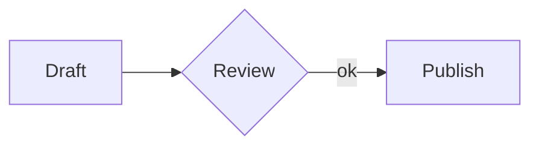
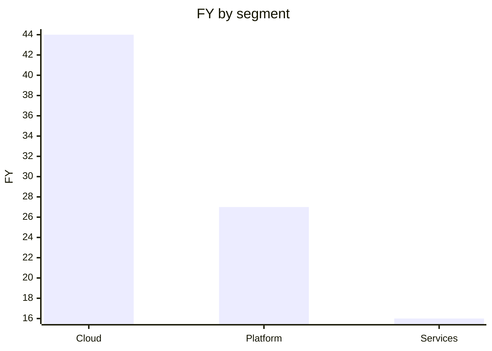

<p align="center">
  <picture>
    <source media="(prefers-color-scheme: dark)" srcset="docs/assets/logo/geml-logo-dark.svg">
    
  </picture>
</p>

# GEML — General Expressive Markup Language（通用表达型标记语言）

*[English](README.md) | 中文*

GEML 是一种人与AI智能体能共同书写同一篇章的标记语言。<br>
**一种格式，两类读者。**对人，是清晰可读的纯文本；对智能体，是可寻址、可校验、可溯源、可回退的**“Doc-as-a-Base”**。<br>

[](https://www.npmjs.com/package/@geml/geml)
[](https://github.com/geml-spec/geml/actions/workflows/ci.yml)
[](https://github.com/geml-spec/geml/actions/workflows/geml-check.yml)
[](LICENSE)
[](spec/LICENSE-spec.md)

---

**GEML**极简。
它极度简单——全语言只有一种块语法；
它是纯文本——脱离渲染器依然清爽；
它对机器友好——原生提供可寻址、可校验、可引用的结构化表达。

GEML文件本身就是纯文本，读它不需要任何渲染器。它也不为每种内容单独设一套迷你语法，而是把所有类型内容都以一个**类型块（typed block）**容器承载。段落是块，代码是块，表格、图形、公式、提示框、乃至元数据，也都是块。未来要扩展也简单至极。形态都一样，所以这门语言好学到想写错都难。

```
=== code {#hello lang=python}
print("hi")
===
```


## 为什么现在需要一种新格式

每个人都会这么问。
看看我的回答。

**文字是知识生产与工程协作唯一的通用介质——人类用它思考和表达，机器用它解析和执行。**

问题是，文字要同时服务这两类截然不同的读者，而它们要的东西互斥：机器要精确，人要好懂。精确靠形式约束和工具校验，好懂靠自然的结构和表达，两者天然打架。

**精确性与易理解性，是一对内在矛盾。**

以「生产者 → 消费者」为视角给协作过程建模，可以抽象出四个模式：

* **人写给人**——Office 365 / Google Docs / Markdown，优化阅读舒适性——代价是牺牲机器希望的精确性，或者引入太多的复杂性。
* **人写给机器**——编程语言 / 通信协议 / 接口定义 / Schema，让机器精准执行——代价是人得先学会把意图翻译成机器语言的专业技能，还要造出各种各样的辅助工具。
* **机器写给人**——让人在各种终端与介质上看得顺眼——代价是为适配造出极其庞大的渲染工具链。
* **机器写给机器**——JSON / XML / Protobuf，让机器高效对机器——彻底摒弃人类可读性。

四个模式的共同出发点都是消费者视角：机器消费要精确，而精确需要形式约束与工具校验；人类消费要易懂，而易懂需要有利于理解的结构与表达。两者天然冲突——越精确的格式对人越不友好，越便于人阅读的格式越难被机器精确解析。代价则一律转嫁给生产端：写的人要么牺牲结构，要么先去习得一门专业技能。只能二选一。于是只能根据不同模式下的消费者要求分别进行优化，分开是这对矛盾唯一的解。

**任何工程的最终交付物，都只是某一刻的版本快照。**

报告、代码、产品都一样。每一个交付物，都是在某个时间点对所有中间产物的一次投射与定格。快照背后是无数中间产物：需求草稿、数据、结构实验、评审意见、废弃方案、一次次 diff——这些碎片散落在上面四种模式的不同格式里，最终被蒸馏为一次版本快照。碎片化是不可避免的，而每一次新版本 v2.0、v3.0，都是在上一个快照的基础上继续演进，碎片也越来越多，这张心智的全景大拼图的认知负担越来越庞大，最终变成负责这个最终产物的制作者们无法理解的复杂性。

**过去，拥有专业技能的人类角色是撑住这张碎片网络的心智中枢。**

要驱动机器，得先搞懂它的 runtime 运行逻辑；要说服人，得先搞懂读者在意什么——也必须理解不同阶段消费者（人或机器）的精确性要求才能校准输出。正是这种「强迫理解」成了全局心智图的来源：哪个碎片是权威的、哪个引用当前有效、哪条路径通向下一个版本快照。由一个人或一群人用专业技能和大量心智投入维持住这张网，变更是低频的，碎片是小量的，交付物工程化的演化闭环得以成立。

**LLM / Agent 的接入，让这张网彻底撑不住了。**

AI 大幅降低了人与机器协作的门槛——不再需要专业技能，人人都能驱动机器生成内容。但这带来一个根本性的代价：工程化过程从白盒变成了黑盒。人不再需要理解机器的运行逻辑，也因此失去了维持全局心智图的来源。机器的输出变得不可预测、不可复现。

所谓 AI 工程化，本质上就是在把这两样找回来——上下文工程、评测、护栏、重放，做的都是同一件事：预知这个黑盒，校准这个黑盒。可校准的过程本身在制造碎片：每一次校准都要往上下文里堆东西，而每堆一次都在造一份副本——同一个事实被摘要一次、重述一次、局部修改一次、贴进 prompt 一次。链条断在没人看见的地方：图引用了表格里的数字，章节引用了另一节的结论，Agent 动了结构，人改了文本，没人知道依赖何时已经断裂。代价是状态漂移，真相源（Single Source of Truth）被碎片、被复制、被转换、被快照，变得不再唯一。与此同时，人对 AI 的期望和问题的复杂度只会一路走高，副本持续累积，直到超出模型这一轮吃得下的范围，于是只能拆得更碎、再堆一层。碎片化自己滚成了恶性循环的雪球，状态漂移，真相源跟着崩溃。

**解法的方向因此清晰：减少膨胀，减少碎片，减少漂移。**

三件事指向同一样东西——保持唯一真相源，减少幻象，投射全景。

副本制造的是幻象——你以为看到的是当前真实状态，实际上是某个时刻的残像。解法不是让人或 AI 对不同维度、不同时刻的所有碎片做全量理解，那只会产生更多副本、更多残像。解法是建立引用机制：每个碎片知道自己的真相源在哪，从唯一真相源投射出来的全景图永远反映当前状态，不靠全量记忆，不积累副本，不产生幻象。心智图的负担变得可控，让碎片之间的依赖网络本身可被机器持有、可被机器校验。精确性、可预测、可复现，工程化的演化闭环得以重新成立。

这里头，文本作为真相的传递介质，其能力至关重要。为了打通人 → 机器 → 人四者闭环，够简单、可阅读、精确性、结构化，这些当然是必不可少的核心基本特性。但随着 AI 工程化和海量碎片时代来临，在跨阶段协作模式下的信息传递载体，越来越迫切需要在语法上具备这些必要能力：更细粒度的精确寻址、投射（碎片拼图化）、可校验、可演进可回退。

**但现有格式的根本设计，无法提供完整的支撑。**

行业里不是没有格式试图解决这些问题——Markdown 和 HTML 都有链接指向真相源，Wiki 甚至也有页面的双链引用。但现有格式的根本缺口在于：这些只是导航，那头的内容可以悄悄改变，你的认知与实际内容之间的分歧无从感知；复制粘贴是复用内容的唯一办法，这副本造出来就是漂移的起点，版本各异，各自偏离真相源；而且粒度太粗，只能指到文档，指不到一张表里的一列。引用不一样，它是取值，不是指路——真相只有一份，源头一改全部跟着改，源头没了当场报错，不是安静地指向空气。没有唯一真相源，只能制造副本，无法投射全景。

GEML 并不试图让大家放弃原来的格式，而是对现有格式生态的一种补充——在跨阶段协作模式下，以最小代价提供碎片之间的传递能力，在格式层面补上那张缺失的网。它提供对这些问题的解法：

1. **块级可寻址**——操作粒度到块。每块有唯一 `#id`，改一块不用动全文，上下文里也只装那一块，不是整篇文档的又一份副本。
2. **块级可投射**——链接导航代替不了引用。引用而非复制，引用方永远看到真相源当前状态，完整的嵌入引用而不是碎片化的链接。构建期强校验。
3. **块级历史可回退**——记住每块怎么改的、改成了什么，回退只退那一块，不是 Git 那种整文件的重量级快照。版本快照可复现，演化闭环传承有据可查。

**GEML 的做法**

三条要求对应三样具体的东西，无需额外依赖，GEML 用纯文本里的三样具体设计，精准兑现上述三项能力，：

**① 统一类型块 + 原生 `#id`（兑现：精确可寻址）**

全语言只有一种块语法：`=== type {#id .class key=val}` … `===`——代码、表格、图形、公式、提示框、元数据都是它，只是 `type` 不同。每一个块都可以标上全局唯一的 `#id`，它是**块级引用把手，而非文档级导航链接**：`[[#id]]`、图表 `data=#id`、脚注——每一处都在声明「我依赖这一块的当前真实状态」，不是"那份文档"，而是那一块。粒度精确到块，真相只有一份，引用方永远看到它的当前状态。最终交付物的投射也因此是块粒度的蒸馏——不是把整份文档搬过来，而是从各处选取恰好需要的那一块组合而成。`geml get`/`set` 也认同这个把手：只读、只改那一块，不搬动全文。

**② 构建期强校验 `geml check`（兑现：构建期编译校验）**

`geml check` 把解析不到的引用变成**构建错误**，不是静默的 404。碎片之间的引用依赖（如表格数据与图表绑定、跨文档引用）在构建期进行硬检查，断链当场卡住，不等到渲染时才暴露。

**③ 紧邻伴生历史 `.gemlhistory`（兑现：伴生块级溯源）**

在文件旁原生放置一个纯文本伴生文件，记住每个块的版本演进。`geml history` 提交 / 查看 / 回滚，`geml revert` 只退一块——离线、不绑 Git、不依赖任何服务，而且它本身可读，Agent 能顺着它理解文档如何演变。不仅能稳定产出 v1.0 交付物，更让 v2.0 / v3.0 的迭代有源可溯、传承有据可查——**你问的是「这一块被谁改成了什么」，回退也只退这一块**。

---

## GEML 有何不同？

先说这个解法必须满足什么，再看各家格式落在哪，最后才是 GEML 具体怎么做。

### 设计考量：碎片的解法

解决碎片化，不是把所有内容强行塞成一个庞大的单体，而是**建立基于 `#id` 的块引用**。

只要源头支持精确可寻址，多端“投影（Projection）”才是有源之水：
1. **精确可寻址（块引用）**：每一个块必须有唯一的 `#id`，允许 Agent 和人类指名道姓地引用与原子化修改局部，不搬动全文。
2. **构建期强校验**：碎片与碎片之间的引用依赖在构建期进行硬检查，死链或断链当场报错中断。
3. **可回退与可溯源**：一个 `.gemlhistory` 伴生文件记住历史版本，每一块的改动来源皆可追溯、随时块级回退。粒度是关键：文档要的是**按块**的历史，而不是 Git 那种为代码设计的行级快照——你问的是「这一块被谁改成了什么」，回退也该只退这一块。

这三条是人机协同编辑的基础。现有格式无法在“纯文本”的极低成本下同时满足这三条，所以GEML应运而生。

### 与其它格式的比较

上述三点在各自领域都有成熟方案；不寻常的是，GEML 在纯文本格式下同时满足三条：

| 流派 | 状态本质 | 可寻址 / 可引用 | 可校验 | 历史管理 / 可溯源 |
| :--- | :--- | :--- | :--- | :--- |
| **Word / Docs** | 状态黑盒 | ❌ 机器无法接入 | ❌ 无校验机制 | 依赖平台服务端，不在文件内 |
| **Markdown / AsciiDoc** | 字符串流 | ⚠️ 仅标题可寻址（按文本匹配） | ❌ 死链无声失效 | 无，必须依赖外部 Git |
| **JSON / XML** | 数据序列化 | ✔️ (id / schema) | ✔️ 依赖外部工具链 | 无，必须依赖外部 Git |
| **GEML** | **纯文本 + 块结构** | **✔️ 每块独立 `#id`（原生可引用）** | **✔️ 构建期强校验报错** | **✔️ `.gemlhistory` 紧邻文件（原生可溯源）** |

逐项对比：[对比 CommonMark](docs/GEML-vs-CommonMark_CN.md) · [对比 XML 与 JSON](docs/GEML-vs-XML-and-JSON_CN.md) · [7 种格式能力矩阵](docs/COMPARISON_CN.md)。

### 设计边界（非目标）

GEML 刻意保持小：

- **没有 raw-HTML 逃生舱**——语义保持可移植，不绑定任何后端或渲染器。
- **托管外部图形 DSL**（Mermaid、Graphviz、D2…），而非自创一套。
- **表格能计算，但不是电子表格引擎**——逐行公式与汇总聚合，没有单元格寻址、查表或宏。
- **只用 ATX 标题**——无 setext、无 `---` frontmatter、无分隔线的歧义。

同样的克制也用在命令集上：它只对着一条标尺打磨——一个 agent 能否单靠命令行跑完一篇文档的全生命周期？——所以动词力求**够全**（每个环节都有对应动词，不必为改一块而重写整篇）、**够顺手**（参数少、默认合理、I/O 可管道化）、**够一致**（指定目标 `#id`，内容便归到它名下；输入是文件就地改、是 `-` 就走 stdout；每次写入都有守卫）。

### 必要的取舍（Trade-offs）

- **零初始生态**：Markdown 统治了主流平台，GEML 还没有。因此 GEML 的定位是**编辑源（Source of Truth）**而非交付产物。通过 `geml <file> --to md|html` 进行单向投影，交付照旧是 `.md` 或 `.html`——**只协同，不锁定**。*(注：投影是有损的，块 id 与绑表图表不会跟过去。)*
- **模型初始熟悉度不如 Markdown**：LLM 尚未针对 GEML 进行大规模预训练。虽然统一的块语法与 `--json` 诊断日志能让 Agent 实现自查自修，但初始熟悉度确实不如 Markdown，这一点不隐瞒。


### 觉得设计还不够好？来挑战它

最有价值的贡献不是代码。GEML 已是 `1.0`，但「稳定」的意思是**已有的规则不会在你脚下变动**，不是说设计已经定死：它只有**一个实现**，规范背后也只有**一套意见**——你此刻提出的反对，还能改动格式本身，而不只是它的工具链。

**先读论证再反对**——每个决定当初是怎么争的：

- **规范受什么约束** —— [`GOVERNANCE.md`](GOVERNANCE.md)：规范由它的 conformance suite 定义，所以一个改动只有配上 conformance 用例才算真的成立。
- **CLI 那套动词是怎么推导出来的** —— [按块编辑设计](docs/design/specs/2026-07-24-geml-block-mutation-cli-design.md) 与 [撤销那一半](docs/design/specs/2026-07-24-geml-revert-history-phase-design.md)。是写给实现用的工作笔记，不是打磨过的文章。
- **为什么把代码图用 GEML 表达** —— [DESIGN-geml-code-graph.md](docs/DESIGN-geml-code-graph.md)，配 [GEP 0002](spec/proposals/0002-code-graph-representation.md) / [0003](spec/proposals/0003-geml-code-graph-format.md)。
- **想自己写第二个解析器** —— [docs/WRITING-A-PARSER.md](docs/WRITING-A-PARSER.md)。

**一致性测试集就是契约。** 规范改动必须连同它的 conformance 用例一起落地，绝不单独落——这是让两个实现互相制约的东西。见 [`GOVERNANCE.md`](GOVERNANCE.md)。

**两个确实开放的问题**，如果你想找个具体的啃：

- **跨 `rename` 的回退。** 历史伴生文件按 `#id` 索引块，所以一次改名被记成*删除 + 新增*，`geml revert` 没法跟着一个块穿过这道边界。今天它是一条**写明的限制**；一份「改名谱系日志」能修好它，而不必改写已存的修订——改写会撞坏那条让历史可验证的哈希链。
- **投影出去是有损的。** `--to md` / `--to html` 会丢掉块 id 与图表绑表的引用，因为这两个目标格式根本没地方放它们。作为交付没问题，作为往返就糟了。一个无损投影值得做吗？它又该把这些信息编码到哪去？

带着一个我们能跑的用例来反对，比赞同更有价值。


## 五分钟看懂这个格式

### 类型块

**一种形态，通吃所有类型。** 每个块永远是 `=== type {#id .class key=val}` … `===`——变的只有 `type`（以及正文怎么读）：

```
=== code {lang=python}
print("hi")
===

=== note {.intro}
解析过的散文，可用 *强调* 与 [[#budget]] 引用。
===

=== meta
title = "Budget plan"
===
```

连续的 `=`（≥3 个）开块，等长的一串闭块；更长的围栏可嵌套更短的。带 `#id` 的块还可以用**带标签围栏** `=== #id` 闭合——不必数围栏长度，长块、嵌套块因此更难写错。类型决定正文如何解读——`raw`（原样：`code`、`diagram`、`math`、`table`）、`flow`（带内联标记的散文：`note`）、或 `data`（每行一个 `key=val`：`meta`）；每个块都可携带属性对象 `{#id .class key=val}`，其中 `.class` 是*语义*标签，绝不作样式钩子。完整的内联语法（强调、链接、`[[#id]]` 自动引用、媒体、脚注、行内 `$公式$`）见[规范](spec/GEML-spec_CN.md)。

### 表格 —— 两种正文，一个模型

可视化写法：

```
=== table {#budget caption="年度成本"}
| Plan  | Months | Rate |
|-------|-------:|-----:|
| Basic |      1 |   30 |
| Pro   |      2 |   30 |
===
```

……或写成数据，带**计算列**与**汇总行**：

```
=== table {#fy25 format=csv header=1 compute="FY [%.1f] = Q1 + Q2 + Q3 + Q4" summary="Segment = 'Total'; FY [%.1f] = sum(FY)"}
Segment,  Q1, Q2, Q3, Q4
Cloud,     8, 10, 12, 14
Platform,  5,  6,  7,  9
Services,  3,  4,  4,  5
===
```

*两种形态描述同一个模型。`FY` 列与 `Total` 行在构建期算出：*

| Segment   | Q1 | Q2 | Q3 | Q4 |   FY |
|-----------|---:|---:|---:|---:|-----:|
| Cloud     |  8 | 10 | 12 | 14 | 44.0 |
| Platform  |  5 |  6 |  7 |  9 | 27.0 |
| Services  |  3 |  4 |  4 |  5 | 16.0 |
| **Total** |    |    |    |    | **87.0** |

`compute` 对各列逐行做 `+ - * / ( )` 运算；`summary` 用聚合 `sum / avg / min / max / count`（并可对聚合结果再做算术，如加权比率）生成表尾一行；列名后的 `[printf]` 控制数字显示。

表格还支持用 `src="regions.csv"` 引入外部 CSV。

### 公式

```
=== math {#gauss caption="高斯积分"}
\int_{-\infty}^{\infty} e^{-x^2} dx = \sqrt{\pi}
===
```

$$\int_{-\infty}^{\infty} e^{-x^2} dx = \sqrt{\pi}$$

### 图形与图表 —— 托管 DSL，或为表格作图

GEML 从不解释图形正文，而是把它交给可插拔渲染器（未知 `format` 仅告警、正文原样保留）：

```
=== diagram {#flow format=mermaid caption="评审流程"}
graph LR
  A[Draft] --> B{Review} -->|ok| C[Publish]
===
```



图形还能**为一张表作图**——单一真相，列引用在构建期受校验，数据零拷贝：

```
=== diagram {format=geml-chart data=#fy25 type=bar x=Segment y=FY}
===
```

*取自上面的 `#fy25` 表：*



## 一份给程序员的礼物：geml-code-graph

为了更好地体会 GEML 格式的强大与灵活，我们拿程序员最熟悉、也最有挑战性的场景之一——代码图——来试一试。
**把整个代码库的调用图，写成 GEML。** `geml codemap build` 把调用图落成一棵 GEML 文档树——每个方法一个 `#id` 块，`#calls` / `#called-by` 正反向边。正向调用的**下游链**做问题排查、反向被调用的**上游链**查看影响面，全都秒速得见；


```sh
npm i -g @geml/geml             # 需要 Node 22+
geml codemap build              # --root 默认当前目录：识别语言 → 索引 → 合并成一张图，落在 ./.geml-code-graph/
geml codemap serve              # 自动打开浏览器看图
```
> [!TIP]
> **TS/JS**——零前置，`build` 会自己拉取 scip 索引器。
> **Java / C / Python / Go / Kotlin**——多下载一个 [Joern](https://docs.joern.io/installation)：release 包解压后把目录传给 build，例如 `--joern C:\joern\joern-cli`（放进 PATH 也行，可省掉这个参数）。
> 前端 + 后端混合仓库——会并进**同一张图**。

geml-code-graph 本身就是一个 diagram 格式——一行就能把它嵌进任何 GEML 文档（`=== diagram {format=geml-code-graph src=.geml-code-graph/index.geml} ===`），且每次代码变更都会自动触发重建，代码图永不脱节。规模不是问题：图是纯文本**数据表**——上万源文件、几十万条边仍秒开秒查（去感受下全局密如蛛网的对称美感带来的震撼吧），随意搜方法名可以定位调用链路。

## 下一步——快点上手用一下：

▶ **[到 Playground 试写 GEML](https://geml-spec.github.io/geml/playground/)**——左边编辑、右边实时渲染，引用一断，构建判定当场翻红。无需安装。

1. 装上**[浏览器扩展](https://chromewebstore.google.com/detail/opmhfphgoidpnipphfgkhhjhmnmaenie)**，打开任一 raw `.geml` 链接看它渲染——**[GEML 规范本身](https://raw.githubusercontent.com/geml-spec/geml/main/spec/GEML-spec.geml)**（dogfood——规范本身就是一份 GEML，规模化渲染）、**[showcase](https://raw.githubusercontent.com/geml-spec/geml/main/docs/examples/showcase.geml)**（计算表、四张图、一条 Mermaid 流程、公式），或把 **[playground/sample.geml](https://raw.githubusercontent.com/geml-spec/geml/main/playground/sample.geml)** 打开看交互式代码图。
2. 或现在就到 ▶ **[Playground](https://geml-spec.github.io/geml/playground/)** 自己当场试着编辑下——无需安装。
3. 想了解完整语法，读**[完整规范](spec/GEML-spec_CN.md)**（中 / [English](spec/GEML-spec.md)）。

## 在大模型里使用 GEML

GEML 的设计目标是**让模型来写、也来改**——而且改得精确。要改一处，agent 不必重读、
重发整篇文档，而是**按 id 定位到单个块**，改完再校验：

```sh
npm i -g @geml/geml                 # 安装 geml 命令
geml doc.geml                       # 文档模型 JSON（默认 --to json）
geml doc.geml --to md|html|geml     # 转换（geml notes.md -> GEML；-o 写文件）
geml get    doc.geml ['#id']        # 列出全部 id，或打印单个块（标题 id = 整节）
geml set    doc.geml '#license' --in template.geml#mit   # 替换一个块，fork 另一文件（id 归一到 #license）
geml add    doc.geml --after '#intro' --in snippet.geml  # 在某位置插入片段（保留其自身 id）
geml delete doc.geml '#draft' '#tmp'           # 删除一个或多个块
geml rename doc.geml '#old' '#new'             # 重命名一个 id 及其全部引用
geml revert doc.geml '#plan' --rev -1          # 把单个块回退到某历史修订
```

每个变更都写出整篇更新后的文档——输入是文件就地改、输入是 `-` 走 stdout——所以编辑天然可管道化；写前都会重新解析，若会破坏文档则拒写。逐个参数见 [parser README](geml-parser/README.md)。

- **Claude Code / Claude CLI。** 装上上面的包，再把
  [`.claude/skills/`](.claude/skills/) 下的技能——`geml/` 管写作、
  [`geml-code-graph/`](.claude/skills/geml-code-graph/SKILL.md) 管调用图——
  拷到 `~/.claude/skills/`。之后 Claude 会自动加载：一碰 `.geml` 文件就跑
  `geml check`，而你说「看下 code-graph」或「谁调用了 X」时它会自动构建并打开
  调用图，无需记 CLI、也无需额外提示。
- **ChatGPT、Gemini 或任意模型。** 把下面这段 primer 贴给模型让它产出合法 GEML，
  再对输出跑 `geml check` 拿硬性通过/失败信号。

> **GEML primer。** 把文档写成 GEML。每个块都是 `=== type {#id .class key=val}` …
> `===`；闭合围栏是与开围栏**等长**的一串 `=`，更长的围栏可嵌套更短的——块若带
> `#id`，也可以用带标签围栏 `=== #id` 闭合（不必数长度，长块或嵌套块优先用它）。
> 块类型：`code`/`diagram`/`math`/`table`（原样正文）、`note`（带内联标记的散文）、
> `meta`（每行一个 `key=val`）。标题只用 ATX `#`——没有 `---` frontmatter（用
> `=== meta`）。每个 `#id` 唯一，且每个引用（`[[#id]]`、`[text](#id)`、`[^id]`、
> 图表 `data=#id`）都必须能解析。不允许 raw HTML。内联：`*强调*`、`**加粗**`、
> `` `代码` ``、`$公式$`、`[文本](url)`。规范见 [`GEML-spec_CN.md`](spec/GEML-spec_CN.md)。

### MCP 服务器

包里自带一个标准的 Model Context Protocol 服务器——让你的助手**一次只改一个块**，而不是
重写整个文件。本地运行，支持 Windows、macOS、Linux；`--root` 就是放 `.geml` 文件的目录。

**Claude Code / 任意 CLI 客户端** —— 一条命令：

```sh
claude mcp add geml -- npx -y @geml/geml@latest mcp --root /absolute/path/to/your/docs
```

**Claude Desktop** —— 加到 `claude_desktop_config.json`：

```json
{
  "mcpServers": {
    "geml": {
      "command": "npx",
      "args": [
        "-y",
        "@geml/geml@latest",
        "mcp",
        "--root",
        "/absolute/path/to/your/docs"
      ]
    }
  }
}
```

然后你照常提需求就行——「把 FY26 表里 Q3 那行改掉」——助手会精确定位到那一个块。**你不用
记任何工具名**：每个都镜像一个 CLI 动词（`geml set` → `geml_set`），终端和助手共用同一套
词汇。

比「让模型直接重写文件」强的地方有两条保证：写入**落盘之前**先解析，若会破坏文档就带着
诊断被拒；而且每次写入**先记一条 `.gemlhistory` 修订**——所以一次坏编辑既*拦得住*、又
*撤得回*（`geml_revert` 只还原那一个块，文件其余部分逐字节不变）。所有路径都被限制在
`--root` 内，客户端无法放宽。

把 `--root` 指向一个建过代码图（`geml codemap build`）的仓库，同一个服务器还能回答「谁调
用了这个」——四个只读的 `geml_codemap_*` 工具，一个客户端入口而不是两个。全部工具与参数见
[docs/mcp-guide.md](docs/mcp-guide.md)。

## 生态成熟度

GEML 是一份小而年轻的规范，但已经**稳定**：已发布 **`1.0`**，可用来写真实文档（本仓库的规范本身就是一例）；有一套严格的一致性测试集、一个已通过它的参考实现，以及一个开放的提案流程。

两份规范都是中英双语：


| 文档 | English | 中文 |
|------|---------|------|
| 核心规范 | [`GEML-spec.md`](spec/GEML-spec.md) | [`GEML-spec_CN.md`](spec/GEML-spec_CN.md) |
| 历史扩展 | [`GEML-history-spec.md`](spec/GEML-history-spec.md) | [`GEML-history-spec_CN.md`](spec/GEML-history-spec_CN.md) |

**成熟度信号。** 完整的核心规范（§1–§8）外加历史扩展规范，均有中英两版；可用的参考实现、**渲染器** + CLI；一套[一致性测试集](geml-parser/test/conformance/)（`输入 → 投影出的文档模型`），还要由**第二个、独立编写的解析器逐用例复刻出完全相同的结果**——两个各自独立的实现在每个用例上都一致，才是让强调、列表这类微妙规则不漂移的东西；另有 600+ 项单元与一致性检查兜底（参考实现约 99% 行覆盖，CI 门槛：行/语句/函数/分支均 ≥95%）；以及**自举**——[`GEML-spec.geml`](spec/GEML-spec.geml) 是用 GEML 写成的规范本身，每次测试都被干净解析。

一份 `.geml` 能落到哪些场景里——每一项都在本仓库，可直接用或直接读：

| 场景 | 在哪 | 状态 |
|---|---|---|
| **命令行** —— 校验、转换、按块编辑、版本历史，一条命令管完 | [`@geml/geml`](https://www.npmjs.com/package/@geml/geml)（源码 [`geml-parser/`](geml-parser/)） | 可用 |
| **在浏览器里读** —— 打开任一 raw `.geml` 链接就地渲染：计算表格、图表、Mermaid、公式，诊断以横幅呈现 | [Chrome 应用商店](https://chromewebstore.google.com/detail/opmhfphgoidpnipphfgkhhjhmnmaenie) · [源码](integrations/geml-viewer/) | 可用 |
| **让助手按块改** —— MCP 服务器，助手改一个块而不是重写整个文件；写入落盘前先校验 | [`docs/mcp-guide.md`](docs/mcp-guide.md) | 可用 |
| **把代码库变成文档** —— 整个调用图写成 GEML 文档树，可交互浏览 | `geml codemap build`（[设计](docs/DESIGN-geml-code-graph.md)） | 可用 |
| **在编辑器里写** —— 语法高亮 + 构建期引用校验 | [`integrations/vscode/`](integrations/vscode/) | 可用 |
| **在 Obsidian 里渲染** —— 用参考解析器 + viewer 的渲染器，与网页同一条代码路径 | [`integrations/obsidian/`](integrations/obsidian/) | 已构建，未上架社区商店 |
| **进 CI 卡住坏文档** —— 悬空 `[[#id]]`、跨文档断链、重复 id、解析错误一律让构建失败 | [`integrations/geml-check-action/`](integrations/geml-check-action/) | 可用 |
| **喂给 RAG / agent 框架** —— 按块切分的加载器（每块一个 chunk，带 `block_id`）+ agent 编辑工具 | [`integrations/langchain+llamaindex/`](integrations/langchain+llamaindex/) | 参考实现 |
| **不装任何东西先试** —— 左边编辑、右边实时渲染，引用一断构建判定当场翻红 | [Playground](https://geml-spec.github.io/geml/playground/) | 可用 |

格式互转都收在同一个入口 `geml <file> [--to json|html|md|geml]`：进出 Markdown、投影成自包含 HTML、重排回规范 GEML、或吐出带 `diagnostics` 的文档模型 JSON——脚本与智能体由此拿到结构化的通过/失败信号。

## 状态与贡献

**贡献。** 各种贡献都欢迎——报 bug、工具与集成、更广的一致性覆盖，以及规范本身讨论。GEML 已是 1.0，但仍可演进：实质性的规范改动通过 [GEP](CONTRIBUTING.md) 讨论并落地，每项都附带对应的一致性用例。参考实现的测试套件就是契约——代码改动应保持 `npm test` 通过、且 dogfood 规范解析无误。想知道有哪些活真正开放：下面的[做一个集成](#做一个集成)是**缺什么**，上面的[觉得设计还不够好？来挑战它](#觉得设计还不够好来挑战它)是仍在桌面上的设计问题。**最有价值的贡献是用另一种语言写一个独立实现**——可移植的一致性测试集让它成为一个周末的活儿，见 [docs/WRITING-A-PARSER.md](docs/WRITING-A-PARSER.md)。

### 做一个集成

上面那张场景表说的是**已经有什么**；这里说的是**缺什么**——每一行都是一件可以认领的活：

| 缺口 | 现状 | 要做的事 |
|---|---|---|
| **Obsidian 深度集成** | 能渲染，但尚未上架社区商店 | CodeMirror 层面的编辑与无缝双向渲染，以及上架本身。需要熟悉 Obsidian API 的人。 |
| **tree-sitter 语法** | 只有一份设计稿 | 写出语法本身——一份就能同时点亮 **Neovim、Helix、Zed**。 |
| **一个 LSP** | VS Code 现在只有高亮 + 构建期校验 | 改名感知的重构、跳到块、编辑时实时诊断。 |
| **Logseq 插件 / Notion 导入导出** | 空白 | 全部。 |
| **Pandoc reader / writer** | 空白 | 一旦有它，GEML 就能进入 Pandoc 已经服务的每一条流水线。 |
| **viewer 的其它浏览器** | Chrome 可用 | Firefox / Safari 移植。 |
| **RAG 集成打包** | LangChain / LlamaIndex 是参考实现 | 发到 PyPI；以及接其它框架（Haystack、DSPy…）。 |
| **MCP 客户端验证** | 只在 Claude 上端到端跑过 | 在别的 MCP 客户端上验一遍，把差异报回来。 |

渲染核心是可复用的：viewer、Obsidian 插件、`--to html` 走的是**同一份**渲染代码，所以接一个新宿主主要是写胶水，而不是写一个新解析器。


**更小、边界更清楚的活**（代码图接更多语言、被搁置的 D2 / Graphviz 引擎、符号可见性、增量 emit、更广的一致性覆盖）认领方式相同：[开一个 issue](https://github.com/geml-spec/geml/issues/new) 说你想做哪块。

### 用另一种语言写一个解析器

两个互不相干却彼此吻合的实现，才是把「规范」变成「标准」的东西。这里有一套可移植的[一致性测试集](geml-parser/test/conformance/)供你自证，还有一份构建顺序指南：**[docs/WRITING-A-PARSER.md](docs/WRITING-A-PARSER.md)**。

Rust、Go、Python、Java、C 都行。**找出规范里有歧义的地方，这件事本身就是贡献**——不管那个解析器最后有没有发布。


如果「为什么不直接用 Markdown」在你看来答案很明显——不论是哪个方向——我们宁愿听你说出来。

## 仓库结构

```
spec/                  核心规范 + .gemlhistory 扩展（英 / 中）、dogfood 的
                       GEML-spec.geml、CC-BY 规范许可证、proposals/（GEP）
geml-parser/           参考实现、渲染器、CLI + codemap 工具集（TypeScript, Node 22）
integrations/          GEML 接入的所有地方：geml-viewer（浏览器扩展）、
                       geml-check-action（CI）、vscode、obsidian、tree-sitter（简报）
playground/            浏览器内 playground（含本仓库的实时 geml-code-graph）
docs/                  指南、设计笔记、格式 COMPARISON（英 / 中）、图片资产，
                       以及一个可自行渲染的示例 .geml 文档
```

## 许可与治理

代码（`geml-parser/`、`integrations/geml-viewer/`、`integrations/geml-check-action/`）为 **MIT**（[`LICENSE`](LICENSE)）。规范文档为 **CC-BY-4.0**（[`LICENSE-spec.md`](spec/LICENSE-spec.md)）——规范不是软件，任何人都可以构建一个兼容实现。决策方式见 [`GOVERNANCE.md`](GOVERNANCE.md)，参与方式见 [`CONTRIBUTING.md`](CONTRIBUTING.md)
