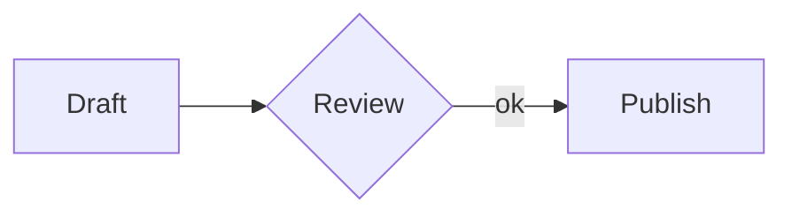
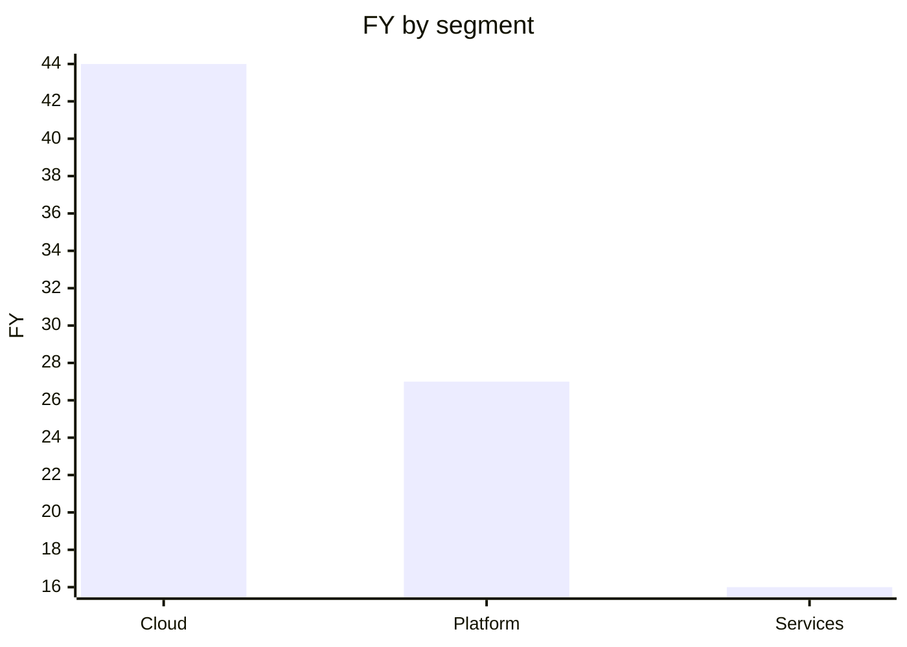

[](https://mcptoplist.com/server/io.github.geml-spec%2Fgeml) [](https://www.npmjs.com/package/@geml/geml) [](https://github.com/geml-spec/geml/actions/workflows/ci.yml) [](https://github.com/geml-spec/geml/actions/workflows/geml-check.yml) [](spec/GEML-spec_CN.md) [](LICENSE) [](spec/LICENSE-spec.md)

<p align="center">
  <picture>
    <source media="(prefers-color-scheme: dark)" srcset="docs/assets/logo/geml-logo-dark.svg">
    
  </picture>
</p>

# GEML — General Expressive Markup Language（通用表达型标记语言）

*[English](README.md) | 中文*

GEML 是一种人与 AI agent（智能体，下文统称 agent）能共同书写同一篇章的标记语言。<br>
**一种格式，两类读者。**对人，是清晰可读的纯文本；对 agent，是可寻址、可校验、可溯源、可回退的**[“Doc-as-a-Base”](docs/MANIFESTO_CN.md)**。

---

**GEML 极简。**
它极度简单，全语言只有一种块语法；
它是纯文本，脱离渲染器依然清爽；
它对机器友好，原生提供可寻址、可校验、可引用的结构化表达。

GEML 文件本身就是纯文本，读它不需要任何渲染器。它也不为每种内容单独设一套迷你语法，而是把所有类型内容都以一个**类型块（typed block）**容器承载。代码是块，表格、图形、公式、提示框、乃至元数据，都是块；一段散文也可以成块（`=== text`），只要你想按 id 指到它。未来要扩展也简单至极。形态都一样，所以这门语言好学到很难写错。

```
=== code {#hello lang=python}
print("hi")
===
```

```sh
geml get doc.geml '#hello'   # 按名字，只取这一块
```

块有名字，动词才有落点。完整语法见[五分钟看懂这个格式](#five-minutes)。

**目录：**[为什么是现在](#why-now) · [GEML 有何不同](#whats-different) ·
[五分钟看懂这个格式](#five-minutes) · [代码图](#code-graph) ·
[上手试试](#hands-on) · [配合模型使用](#with-an-llm) ·
[成熟度与版本](#maturity) · [参与贡献](#contributing) · [许可](#license)

<a id="why-now"></a>
## 为什么现在需要一种新格式

每个人都会这么问。先从一件小事说起：你让 agent 改文档第 3 节的一个参数。它改对了，同一次提交
里，第 7 节表格里的一个数字也被「顺手对齐」了。三周后你才发现，而这三周里，这份文档已经被下游
引用了四次。

**文本是知识生产与工程协作最通用的介质**——人用它思考和表达，机器读它、改它、照它行动。而同一段文本要同时服务这两类读者，它们要的东西天然相反：机器要精确，精确靠形式约束和工具校验；人要好懂，好懂靠自然的结构和表达。

**过去，「分开」是这对矛盾唯一可行的解**：每种格式只为自己的消费者优化——

* **人写给人**——Word / Google Docs / Markdown，为阅读舒适优化，让出机器要的精确；
* **人写给机器**——编程语言 / 协议 / Schema，为精确执行优化，代价是人得先学一门专业；
* **机器写给人**——为各种终端与介质分别建一条渲染管线；
* **机器写给机器**——JSON / Protobuf，高效对传，可读性只是顺带。

分开行得通，靠的是一个隐含前提：**一份文本只有一类作者、一类主要读者**，写的人清楚自己在为谁写。

**LLM 把这个前提取消了。** 同一份文档，人和 agent 共读、共写、反复改写——两类读者第一次同时坐在同一份文本的两端，「为单一消费者优化」失去了对象。这就是「现在」的含义：不是文本变了，是读者变了。

读者变了之后，旧的工作方式在两头同时垮掉。

**一头是撑网的人不在了。** 任何工程交付物都只是某一刻的版本快照，快照背后是海量中间产物：需求草稿、数据、结构实验、评审意见、废弃方案、一次次 diff——碎片散落在上面四种模式的各种格式里。过去这张碎片网靠人撑住：要驱动机器得先懂机器，要说服人得先懂读者，这种被迫的理解加上低频的变更，让一个人或一小群人记得住哪个碎片是权威的、哪条引用还有效。AI 把驱动机器的门槛降到了零——人不再需要懂机器，全局心智图随之失去来源；而模型的输出本身又是随机的。不理解，叠加不可复现，工程过程从白盒变成黑盒。

**另一头是碎片在爆炸。** 所谓 AI 工程化——上下文工程、评测、护栏、重放——本质都是在校准这个黑盒（专业技能没有消失，只是换了位置）。而**校准本身就在制造副本**：每一次校准都往上下文里堆东西，同一个事实被摘要一次、重述一次、局部修改一次、贴进 prompt 一次。链条断在没人看见的地方：图引用了表格里的数字，章节引用了另一节的结论，agent 动了结构，人改了文本——没人知道依赖何时断裂。副本造出来就是漂移的起点：真相源（Single Source of Truth）被复制、被转换、散落成各处残片，不再唯一。副本越积越多，超出模型一轮吃得下的范围，只好拆得更碎、再堆一层——碎片化自己滚成雪球。

**解法方向因此清晰：让碎片引用真相，而不是复制真相。** 每个碎片知道自己的源在哪，需要时从源头**取值**——取来的切片小而短命，过期就重取，不留长命副本；碎片之间的依赖网络本身可被机器持有、被机器校验。状态确定了，可预测、可复现，工程化的演化闭环才能重新闭合。

做到这件事，承载文本的格式要在语法层面给出四样能力：**块级寻址、引用式投射、构建期校验、块级回退**。

**现有格式给不全。** 不是没人试过：Markdown / HTML 有链接，wiki 有双链，Obsidian 有 `![[…]]` 嵌入，AsciiDoc 有 include。但要么只是导航——那头的内容悄悄变了，你无从感知；要么嵌入没有校验——源头没了，安静地指向空气；粒度普遍到文档或标题为止；而且没有一个把「断链」当成构建错误。引用要成为**取值**而不是指路，缺的正是那道门：源头一改，处处跟着变；源头没了，构建就红。

**以及为什么是语法，而不是一个工具。** 活在 linter 里的约定只是建议；写进语法的约束是每个实现都必须履行的契约。块 id、嵌入、那道校验门都在[规范](spec/GEML-spec_CN.md)里，所以仅凭这份文档写出的第二个解析器，照样会拒绝同一条坏引用。这也是格式与产品的分别。

GEML 不试图让任何人放弃原有格式，它是给现有生态补上这张缺失的网——四样能力，对应纯文本里的四样设计：

**① 统一类型块 + 原生 `#id`（寻址）** —— 全语言只有一种块语法：`=== type {#id .class key=val}` … `===`，代码、表格、图形、公式、提示框、元数据都是它。每块一个全局唯一的 `#id`，它是**块级引用把手，不是文档级导航链接**。改一块不用动全文；喂给模型的也只是这一块——切片要多小有多小，过期随时从源头重取。

**② 块级嵌入 `=== embed {src=doc.geml#id}`（投射）** —— 引用即取值：渲染时嵌入的是那一块的**此刻状态**，不是一份手工拷贝。交付物由此成为块粒度的组装——从各处取恰好需要的那几块拼成，而不是把整篇搬过来。

**③ 构建期校验 `geml check`（校验）** —— 解析不到的引用是**构建错误**，不是渲染时才暴露的静默 404。图表与表格的绑定（`data=#id`）、跨文档引用、嵌入目标，全过同一道门，断链当场卡住。

**④ 伴生历史 `.gemlhistory`（回退）** —— 纯文本伴生文件记住每一块的演进，`geml revert` 只回退出错的那一块。Git 的粒度是文件与提交：当 agent 写坏一块、而人同时在同一文件的别处做了修改，文件级回滚会把人的工作一起丢掉——**这个粒度 Git 在结构上给不了，这里给**。离线可用，agent 也能顺着它读懂文档是如何演变到今天的。

回到第 7 节那个数字。有了 ①，agent 改的就是它被要求改的那一块，diff 会指名哪些块变了；如果
有图表或另一节依赖那张表，③ 会让构建当场失败，而不是让两边悄悄漂移三周；而 ④ 只回退那一块，
不会丢掉你在同一次提交里改好的段落。

---

<a id="whats-different"></a>
## GEML 有何不同？

四样能力上一章已经立好：寻址、投射、校验、回退。这一章直接看各家格式在这四条上落在哪、GEML 划了哪些边界。

### 与其它格式的比较

四样能力在各自领域都有成熟方案；不寻常的是把它们同时装进一种纯文本格式：

| 流派 | 状态本质 | 可寻址 / 可引用 | 可投射 / 引用嵌入 | 可校验 | 历史管理 / 可溯源 |
| :--- | :--- | :--- | :--- | :--- | :--- |
| **Word / Docs** | 状态黑盒 | ❌ 机器无法接入 | ❌ 只能复制粘贴 | ❌ 无校验机制 | ⚠️ 依赖平台服务端，不在文件内 |
| **Markdown / AsciiDoc** | 字符串流 | ⚠️ 仅标题可寻址（按文本匹配） | ⚠️ 方言嵌入（Obsidian `![[…]]`、`include::`），断链无声 | ❌ 死链无声失效 | ❌ 格式内没有，必须依赖外部 Git |
| **JSON / XML** | 数据序列化 | ✔️ (id / schema) | ⚠️ 仅 XML 有（XInclude，外置） | ✔️ 依赖外部工具链 | ❌ 格式内没有，必须依赖外部 Git |
| **GEML** | **纯文本 + 块结构** | **✔️ 每块独立 `#id`（原生可引用）** | **✔️ `=== embed` 引用即取值（原生嵌入）** | **✔️ 构建期强校验报错** | **✔️ `.gemlhistory` 紧邻文件（原生可溯源）** |

逐项对比：[对比 CommonMark](docs/GEML-vs-CommonMark_CN.md) · [对比 XML 与 JSON](docs/GEML-vs-XML-and-JSON_CN.md) · [7 种格式能力矩阵](docs/COMPARISON_CN.md)。

共存方案一句话：Markdown 统治主流平台，所以 GEML 把自己定位成**编辑侧的事实源**而非交付物。用 `geml <file> --to md|html` 单向投影，交付照旧是 `.md` / `.html`。**只协同，不锁定。**（投影有损：块 id 与绑表图表不会跟过去。）

### 设计边界（非目标）

GEML 刻意保持小：

- **没有 raw-HTML 逃生舱**——语义保持可移植，不绑定任何后端或渲染器。
- **托管外部图形 DSL**（Mermaid、Graphviz、D2…），而非自创一套。
- **表格能计算，但不是电子表格引擎**——逐行公式与汇总聚合，没有单元格寻址、查表或宏。
- **只用 ATX 标题**——无 setext、无 `---` frontmatter、无分隔线的歧义。

同样的克制也用在命令集上。它只对着一条标尺打磨：一个 agent 能否单靠命令行跑完一篇文档的全生命周期？所以动词力求**够全**（每个环节都有对应动词，不必为改一块而重写整篇）、**够顺手**（参数少、默认合理、I/O 可管道化）、**够一致**（指定目标 `#id`，内容便归到它名下；输入是文件就地改、是 `-` 就走 stdout；每次写入都有守卫）。

<a id="five-minutes"></a>
## 五分钟看懂这个格式

### 类型块

**一种形态，通吃所有类型。** 每个块永远是 `=== type {#id .class key=val}` … `===`，变的只有 `type`（以及正文怎么读）：

```
=== code {lang=python}
print("hi")
===

=== note {.intro}
解析过的散文，可用 *强调* 与 [[#budget]] 引用。
===

=== meta
title = "Budget plan"
===
```

连续的 `=`（≥3 个）开块，等长的一串闭块；更长的围栏可嵌套更短的。带 `#id` 的块还可以用**带标签围栏** `=== #id` 闭合，不必数围栏长度，长块、嵌套块因此更难写错。类型决定正文如何解读：`raw`（原样：`code`、`diagram`、`math`、`table`）、`flow`（带内联标记的散文：`note`、`text`）、或 `data`（每行一个 `key=val`：`meta`）；`embed` 则根本没有正文，`src=` 指名它所代表的那个块。每个块都可携带属性对象 `{#id .class key=val}`，其中 `.class` 是*语义*标签，绝不作样式钩子。完整的内联语法（强调、链接、`[[#id]]` 自动引用、媒体、脚注、行内 `$公式$`）见[规范](spec/GEML-spec_CN.md)。

### 表格 —— 两种正文，一个模型

可视化写法：

```
=== table {#budget caption="年度成本"}
| Plan  | Months | Rate |
|-------|-------:|-----:|
| Basic |      1 |   30 |
| Pro   |      2 |   30 |
===
```

……或写成数据，带**计算列**与**汇总行**：

```
=== table {#fy25 format=csv header=1 compute="FY [%.1f] = Q1 + Q2 + Q3 + Q4" summary="Segment = 'Total'; FY [%.1f] = sum(FY)"}
Segment,  Q1, Q2, Q3, Q4
Cloud,     8, 10, 12, 14
Platform,  5,  6,  7,  9
Services,  3,  4,  4,  5
===
```

*两种形态描述同一个模型。`FY` 列与 `Total` 行在构建期算出：*

| Segment   | Q1 | Q2 | Q3 | Q4 |   FY |
|-----------|---:|---:|---:|---:|-----:|
| Cloud     |  8 | 10 | 12 | 14 | 44.0 |
| Platform  |  5 |  6 |  7 |  9 | 27.0 |
| Services  |  3 |  4 |  4 |  5 | 16.0 |
| **Total** |    |    |    |    | **87.0** |

`compute` 对各列逐行做 `+ - * / ( )` 运算；`summary` 用聚合 `sum / avg / min / max / count`（并可对聚合结果再做算术，如加权比率）生成表尾一行；列名后的 `[printf]` 控制数字显示。

表格还支持用 `src="regions.csv"` 引入外部 CSV。

### 公式

```
=== math {#gauss caption="高斯积分"}
\int_{-\infty}^{\infty} e^{-x^2} dx = \sqrt{\pi}
===
```

$$\int_{-\infty}^{\infty} e^{-x^2} dx = \sqrt{\pi}$$

### 图形与图表 —— 托管 DSL，或为表格作图

GEML 从不解释图形正文，而是把它交给可插拔渲染器（未知 `format` 仅告警，正文原样保留）：

```
=== diagram {#flow format=mermaid caption="评审流程"}
graph LR
  A[Draft] --> B{Review} -->|ok| C[Publish]
===
```



图形还能**为一张表作图**，单一真相，列引用在构建期受校验，数据零拷贝：

```
=== diagram {format=geml-chart data=#fy25 type=bar x=Segment y=FY}
===
```

*取自上面的 `#fy25` 表：*



### 嵌入 —— 引用，不复制

一个块可以代表另一个块，同文档用 `#id`，跨文档用 `src=other.geml#id`，渲染时就地呈现目标块的**此刻状态**：

```
=== embed {src=#fy25}
===
```

正文保持为空（目标写在 `src=` 里），目标像任何引用一样受校验：源头没了，`geml check` 让构建当场变红。

<a id="code-graph"></a>
## 一份给程序员的礼物：geml-code-graph

为了更好地体会 GEML 格式的强大与灵活，我们拿程序员最熟悉、也最有挑战性的场景之一——代码图——来试一试。
**把整个代码库的调用图，写成 GEML。** `geml codemap build` 把调用图落成一棵 GEML 文档树，每个方法一个 `#id` 块，`#calls` / `#called-by` 正反向边。正向调用的**下游链**做问题排查，反向被调用的**上游链**查看影响面，全都秒速得见；


```sh
npm i -g @geml/geml
geml codemap build              # --root 默认当前目录：识别语言 → 索引 → 合并成一张图，落在 ./.geml-code-graph/
geml codemap serve              # 自动打开浏览器看图
```

> [!NOTE]
> **前置条件。** CLI 需要 Node **22+**（`npm i -g @geml/geml`）。以下都是可选项，仅在用到时才需要：
> 代码图里的非 TS/JS 语言需要 [Joern](https://docs.joern.io/installation)；
> [浏览器扩展](https://chromewebstore.google.com/detail/opmhfphgoidpnipphfgkhhjhmnmaenie)需要 Chrome。

> [!TIP]
> **TS/JS**——零前置，`build` 会自己拉取 scip 索引器。
> **Java / C / Python / Go / Kotlin**——多下载一个 [Joern](https://docs.joern.io/installation)：release 包解压后把目录传给 build，例如 `--joern ~/joern/joern-cli`（Windows 上是 `--joern C:\joern\joern-cli`）；放进 PATH 也行，可省掉这个参数。
> 前端 + 后端混合仓库——会并进**同一张图**。

geml-code-graph 本身就是一个 diagram 格式，一行就能把它嵌进任何 GEML 文档（`=== diagram {format=geml-code-graph src=.geml-code-graph/index.geml} ===`），配套的 Claude 技能还带一个可选的提交钩子，代码一动图就跟着重建，不会脱节。

规模是量出来的，不是许诺的：在 Apache Flink 代码库上实测，**13,585 个 Java 源文件、约 8.1 万
个方法、266,821 条调用边**，纯文本**数据表**依然秒开秒查，随意搜方法名可以定位调用链路。想自己
复现：克隆 `apache/flink`，在仓库根目录跑 `geml codemap build --joern …`。

<a id="hands-on"></a>
## 下一步——上手试试

▶ **[到 Playground 试写 GEML](https://geml-spec.github.io/geml/playground/)**——左边编辑、右边实时渲染，引用一断，构建判定当场翻红。无需安装，也不用先读任何东西。

然后按你顺手的次序：

1. **在浏览器里看它渲染。** 装上**[浏览器扩展](https://chromewebstore.google.com/detail/opmhfphgoidpnipphfgkhhjhmnmaenie)**，打开任一 raw `.geml` 链接*（要 raw 文件本身，不是 GitHub 的 blob 页面，那个是 HTML）*：**[GEML 规范本身](https://raw.githubusercontent.com/geml-spec/geml/main/spec/GEML-spec.geml)**（dogfood，规范本身就是一份 GEML，规模化渲染）、**[showcase](https://raw.githubusercontent.com/geml-spec/geml/main/docs/examples/showcase.geml)**（计算表、四张图、一条 Mermaid 流程、公式），或 **[playground/sample.geml](https://raw.githubusercontent.com/geml-spec/geml/main/playground/sample.geml)** 看交互式代码图。
2. **在本地跑起来。** `npm i -g @geml/geml`（Node 22+），然后 `geml check` 一份文档，或对着你自己的仓库跑 `geml codemap build`。
3. **读语法。** **[完整规范](spec/GEML-spec_CN.md)**（中 / [English](spec/GEML-spec.md)）是规范性文本，短到可以一口气读完。

<a id="with-an-llm"></a>
## 配合模型与 agent 使用 GEML

GEML 的设计目标是**让模型来写、也来改**，而且改得精确。要改一处，agent 不必重读、重发整篇
文档，而是**按 id 定位到单个块**，改完再校验：

```sh
npm i -g @geml/geml                            # 安装 geml 命令（需 Node 22+）
geml doc.geml                                  # 文档模型 JSON（默认 --to json）
geml doc.geml --to md -o doc.md                # 投影出去；也可 --to html、--to geml
geml notes.md --to geml -o notes.geml          # Markdown 反向进来
geml get    doc.geml                           # 列出全部可寻址 id
geml get    doc.geml '#hello'                  # 打印单个块（标题 id = 整节）
geml set    doc.geml '#license' --in template.geml#mit   # 替换一个块，fork 另一文件（id 归一到 #license）
geml add    doc.geml --after '#intro' --in snippet.geml  # 在某位置插入片段（保留其自身 id）
geml delete doc.geml '#draft' '#tmp'           # 删除一个或多个块
geml rename doc.geml '#old' '#new'             # 重命名一个 id 及其全部引用
geml history commit doc.geml                   # 记一条 .gemlhistory 修订
geml revert doc.geml '#plan' --rev -1          # 把单个块回退到某历史修订（需先有 .gemlhistory）
geml check  doc.geml                           # 只校验：诊断 + 退出码
```

上面每一行都可以照抄直接运行。每个变更都写出整篇更新后的文档，输入是文件就地改、输入是 `-` 走
stdout，所以编辑天然可管道化；写前都会重新解析，若会破坏文档则拒写。逐个参数见
[parser README](geml-parser/README.md)。

- **Claude Code / Claude CLI。** 装上上面的包，再把
  [`.claude/skills/`](.claude/skills/) 下的技能——`geml/` 管写作、
  [`geml-code-graph/`](.claude/skills/geml-code-graph/SKILL.md) 管调用图——
  拷到 `~/.claude/skills/`。之后 Claude 会自动加载：技能会让它在动过 `.geml`
  文件后跑 `geml check`，而你说「看下 code-graph」或「谁调用了 X」时它会构建并打开
  调用图，无需记 CLI、也无需额外提示。
- **ChatGPT、Gemini 或任意模型。** 把下面这段 primer 贴给模型让它产出合法 GEML，
  再对输出跑 `geml check` 拿硬性通过/失败信号。

> **GEML primer。** 把文档写成 GEML。每个块都是 `=== type {#id .class key=val}` …
> `===`；闭合围栏是与开围栏**等长**的一串 `=`，更长的围栏可嵌套更短的——块若带
> `#id`，也可以用带标签围栏 `=== #id` 闭合（不必数长度，长块或嵌套块优先用它）。
> 块类型：`code`/`diagram`/`math`/`table`（原样正文）、`note`/`text`（带内联标记的散文）、
> `meta`（每行一个 `key=val`）、`embed`（正文为空；`src=doc.geml#id` 就地渲染那个块）。
> 标题只用 ATX `#`——没有 `---` frontmatter（用
> `=== meta`）。每个 `#id` 唯一，且每个引用（`[[#id]]`、`[text](#id)`、`[^id]`、
> 图表 `data=#id`）都必须能解析。不允许 raw HTML。内联：`*强调*`、`**加粗**`、
> `` `代码` ``、`$公式$`、`[文本](url)`。规范见 [`GEML-spec_CN.md`](spec/GEML-spec_CN.md)。

### MCP 服务器

包里自带一个标准的 Model Context Protocol 服务器，让你的 agent**一次只改一个块**，而不是
重写整个文件。本地运行，支持 Windows、macOS、Linux；`--root` 就是放 `.geml` 文件的目录。

**Claude Code / 任意 CLI 客户端** —— 一条命令：

```sh
claude mcp add geml -- npx -y @geml/geml@latest mcp --root /absolute/path/to/your/docs
```

**Claude Desktop** —— 加到 `claude_desktop_config.json`：

```json
{
  "mcpServers": {
    "geml": {
      "command": "npx",
      "args": [
        "-y",
        "@geml/geml@latest",
        "mcp",
        "--root",
        "/absolute/path/to/your/docs"
      ]
    }
  }
}
```

然后你照常提需求就行，比如「把 FY26 表里 Q3 那行改掉」，agent 会精确定位到那一个块。**你不用
记任何工具名**：每个都镜像一个 CLI 动词（`geml set` → `geml_set`），终端和 agent 共用同一套
词汇。

比「让模型直接重写文件」强的地方有两条保证：写入**落盘之前**先解析，若会破坏文档就带着
诊断被拒；而且每次写入**先记一条 `.gemlhistory` 修订**，所以一次坏编辑既*拦得住*、又
*撤得回*（`geml_revert` 只还原那一个块，文件其余部分逐字节不变）。所有路径都被限制在
`--root` 内，客户端无法放宽。

把 `--root` 指向一个建过代码图（`geml codemap build`）的仓库，同一个服务器还能回答「谁调
用了这个」：四个只读的 `geml_codemap_*` 工具，一个客户端入口而不是两个。全部工具与参数见
[docs/mcp-guide.md](docs/mcp-guide.md)。

<a id="maturity"></a>
## 生态成熟度

GEML 是一份小而年轻的规范，但已经**稳定**：已发布 **`1.0`**，可用来写真实文档（本仓库的规范本身就是一例）；有一套严格的一致性测试集、一个已通过它的参考实现，以及一个开放的提案流程。

两份规范都是中英双语：

| 文档 | English | 中文 |
|------|---------|------|
| 核心规范 | [`GEML-spec.md`](spec/GEML-spec.md) | [`GEML-spec_CN.md`](spec/GEML-spec_CN.md) |
| 历史扩展 | [`GEML-history-spec.md`](spec/GEML-history-spec.md) | [`GEML-history-spec_CN.md`](spec/GEML-history-spec_CN.md) |

### 版本与兼容性

如果你在评估要不要依赖它，下面这几条就是承诺：

- **规范的版本独立于实现。** 本套文档是 **GEML 1.0**。顶部的 npm badge 是
  `@geml/geml` 包的版本，它遵循自己的发布节奏，与规范版本无关；
  `geml --version --json` 会同时打印两者，形如 `{"parser","spec"}`。
- **「稳定」的含义：** 1.0 里已有的规则不会在你脚下变动。破坏性的规范改动会提升规范版本，
  并连同更新后的一致性用例一起发布，绝不只出其中一半（见 [GOVERNANCE](GOVERNANCE.md)）。
- **前向兼容写在语法里。** 处理器遇到不认识的构造必须优雅降级（规范 §8.2），所以新增一种
  块类型或图格式**不算**破坏性变更。类型注册表是开放的：未注册的类型名应包含连字符
  （如 `acme-invoice`），把不含连字符的名字留给规范的未来版本（§8.5）。
- **如何声明合规。** 一个实现逐用例复刻出一致性测试集的结果后，即可声明自己「符合 GEML
  1.0」（§8.5）。不需要许可，也不需要本仓库背书。
- **对外标识。** 扩展名 `.geml`（版本伴生文件 `.gemlhistory`），媒体类型 `text/geml`，
  在必须使用已注册类型的场合用 `text/vnd.geml`——`text/geml` 目前尚未在 IANA 注册。
  `.geml` URL 上的片段标识符指向携带该 id 的那一块（§0.6）。

**成熟度信号。** 完整的核心规范（§1–§8）外加历史扩展规范，均有中英两版；可用的参考实现、**渲染器** + CLI；一套[一致性测试集](geml-parser/test/conformance/)（`输入 → 投影出的文档模型`），还要由**第二个、独立编写的解析器逐用例复刻出完全相同的结果**——两个各自独立的实现在每个用例上都一致，才是让强调、列表这类微妙规则不漂移的东西。其后是 `npm test` 里的 600+ 项检查，覆盖单元测试、一致性语料、那个独立的第二实现、往返序列化，以及端到端 CLI 运行，覆盖率由 CI 卡在行/语句/函数/分支均 ≥95%。另有**自举**——[`GEML-spec.geml`](spec/GEML-spec.geml) 是用 GEML 写成的规范本身，每次测试都被干净解析。

**两句诚实的短板。** 还没有任何主流平台原生渲染 `.geml`，今天它靠 viewer、CI Action 和下面的投影出行。模型对它的熟悉度也不如 Markdown：没有谁在 GEML 上做过大规模预训练；统一块语法与 `--json` 诊断能让 agent 自查自修，但初始熟悉度确实更低。

一份 `.geml` 能落到哪些场景里——每一项都在本仓库，可直接用或直接读：

| 场景 | 在哪 | 状态 |
|---|---|---|
| **命令行** —— 校验、转换、按块编辑、版本历史，一条命令管完 | [`@geml/geml`](https://www.npmjs.com/package/@geml/geml)（源码 [`geml-parser/`](geml-parser/)） | 可用 |
| **在浏览器里读** —— 打开任一 raw `.geml` 链接就地渲染：计算表格、图表、Mermaid、公式，诊断以横幅呈现 | [Chrome 应用商店](https://chromewebstore.google.com/detail/opmhfphgoidpnipphfgkhhjhmnmaenie) · [源码](integrations/geml-viewer/) | 可用 |
| **让 agent 按块改** —— MCP 服务器，agent 改一个块而不是重写整个文件；写入落盘前先校验 | [`docs/mcp-guide.md`](docs/mcp-guide.md) | 可用 |
| **把代码库变成文档** —— 整个调用图写成 GEML 文档树，可交互浏览 | `geml codemap build`（[设计](docs/DESIGN-geml-code-graph.md)） | 可用 |
| **在编辑器里写** —— 语法高亮 + 构建期引用校验 | [`integrations/vscode/`](integrations/vscode/) | 已构建，可从源码安装；未上架商店 |
| **在 Obsidian 里渲染** —— 用参考解析器 + viewer 的渲染器，与网页同一条代码路径 | [`integrations/obsidian/`](integrations/obsidian/) | 已构建，未上架社区商店 |
| **进 CI 卡住坏文档** —— 悬空 `[[#id]]`、跨文档断链、重复 id、解析错误一律让构建失败 | [`integrations/geml-check-action/`](integrations/geml-check-action/) | 可用 |
| **喂给 RAG / agent 框架** —— 按块切分的加载器（每块一个 chunk，带 `block_id`）+ agent 编辑工具 | [`integrations/langchain+llamaindex/`](integrations/langchain+llamaindex/) | 参考实现 |
| **不装任何东西先试** —— 左边编辑、右边实时渲染 | [Playground](https://geml-spec.github.io/geml/playground/) | 可用 |

格式互转都收在同一个入口 `geml <file> [--to json|html|md|geml]`：进出 Markdown、投影成自包含 HTML、重排回规范 GEML、或吐出带 `diagnostics` 的文档模型 JSON，脚本与 agent 由此拿到结构化的通过/失败信号。

<a id="contributing"></a>
## 状态与贡献

这套设计有一份[宣言](docs/MANIFESTO_CN.md)。它不设签名页——以 GEML 格式写出一个文件，就是签名；下面四条路，是把签名写大的方式。

上手前的三份文件：[`CONTRIBUTING.md`](CONTRIBUTING.md) 说怎么把东西交过来，
[`GOVERNANCE.md`](GOVERNANCE.md) 说决策怎么做，
[`CODE_OF_CONDUCT.md`](CODE_OF_CONDUCT.md) 只有一条关于人的规矩：对设计的反对可以多锋利都行，
对人不行。

**四条路进来——按你想留下哪种作品挑：**

- **标准之路——写第二个解析器。** 两个独立实现互相吻合，才是把「规范」变成「标准」的东西，
  这也是项目此刻最需要的贡献。Rust、Go、Python、Java、C 都行：可移植的
  [一致性测试集](geml-parser/test/conformance/)供你自证，
  [docs/WRITING-A-PARSER.md](docs/WRITING-A-PARSER.md) 是构建顺序。
  **找出规范里有歧义的地方，这件事本身就是贡献**，不管那个解析器最后有没有发布。
- **插件之路——把 Obsidian 集成走完。** 渲染已经能用（与网页 viewer 同一条代码路径），缺的是 CodeMirror 层的编辑和社区商店上架。[`integrations/obsidian/`](integrations/obsidian/) 在等一位熟悉 Obsidian API 的人。
- **客户端矩阵——在 Claude 之外验证 MCP 服务器。** 按块编辑的服务器目前只在 Claude 上端到端验证过。用你的客户端跑一遍——Cursor、Windsurf、Cline，任何讲 MCP 的——把差异报回来：[docs/mcp-guide.md](docs/mcp-guide.md) 就是对照用的契约。
- **治理之路——参与规范的治理。** [`GOVERNANCE.md`](GOVERNANCE.md) 写明单维护者只是过渡态：目标是**三名以上、来自多方的维护者**，规范最终交给中立的多方治理。持续的评审者、GEP 作者、实现者，正是这份邀请写给的人。

当前所有开放的活都收在一处：下面的[缺口表](#integrations)。更小、边界更清楚的活（代码图接更多
语言、被搁置的 D2 / Graphviz 引擎、符号可见性、增量 emit、更广的一致性覆盖）认领方式相同：
[开一个 issue](https://github.com/geml-spec/geml/issues/new) 说你想做哪块。

### 觉得设计还不够好？来挑战它

如果「为什么不直接用 Markdown」在你看来答案很明显——**不论哪个方向**——我们宁愿听你说出来，也不要你安静地同意。GEML 已是 `1.0`，但「稳定」的意思是**已有的规则不会在你脚下变动**，不是说设计已经定死：它只有**一个实现**，规范背后也只有**一套意见**。你此刻提出的反对，还能改动格式本身，而不只是它的工具链。

**先读论证再反对**——每个决定当初是怎么争的：

- **规范受什么约束** —— [`GOVERNANCE.md`](GOVERNANCE.md)：规范由它的 conformance suite 定义，所以一个改动只有配上 conformance 用例才算真的成立。规范改动必须连同用例一起落地，绝不单独落——这是让两个实现互相制约的东西。
- **CLI 那套动词是怎么推导出来的** —— [按块编辑设计](docs/design/specs/2026-07-24-geml-block-mutation-cli-design.md) 与 [撤销那一半](docs/design/specs/2026-07-24-geml-revert-history-phase-design.md)。是写给实现用的工作笔记，不是打磨过的文章。
- **为什么把代码图用 GEML 表达** —— [DESIGN-geml-code-graph.md](docs/DESIGN-geml-code-graph.md)，配 [GEP 0002](spec/proposals/0002-code-graph-representation.md) / [0003](spec/proposals/0003-geml-code-graph-format.md)。

**两个确实开放的问题**，如果你想找个具体的啃：

- **投影出去是有损的。** `--to md` / `--to html` 会丢掉块 id 与图表绑表的引用，因为这两个目标格式根本没地方放它们。作为交付没问题，作为往返就糟了。一个无损投影值得做吗？它又该把这些信息编码到哪去？
- **嵌入内容的标题层级。** 被嵌入的小节保留源文档的标题层级，可能倒置宿主的层级结构——原样渲染，还是重映射？[transclusion 设计稿](docs/design/specs/2026-07-30-block-transclusion-design.md)刻意把这条留作开放（S10）。

带着一个我们能跑的用例来反对，比赞同更有价值。

<a id="integrations"></a>
### 做一个集成

上面那张场景表说的是**已经有什么**；这里说的是**缺什么**——每一行都是一件可以认领的活：

| 缺口 | 现状 | 要做的事 |
|---|---|---|
| **Obsidian 深度集成** | 能渲染，但尚未上架社区商店 | CodeMirror 层面的编辑与无缝双向渲染，以及上架本身。需要熟悉 Obsidian API 的人。 |
| **tree-sitter 语法** | 只有一份设计稿 | 写出语法本身——一份就能同时点亮 **Neovim、Helix、Zed**。 |
| **一个 LSP** | VS Code 现在只有高亮 + 构建期校验 | 改名感知的重构、跳到块、编辑时实时诊断。 |
| **跨 `rename` 的块级回退** | 写明的限制，修法有草图（改名谱系日志） | history 层的设计 + 实现；让历史可验证的哈希链必须存活。 |
| **Logseq 插件 / Notion 导入导出** | 空白 | 全部。 |
| **Pandoc reader / writer** | 空白 | 一旦有它，GEML 就能进入 Pandoc 已经服务的每一条流水线。 |
| **viewer 的其它浏览器** | Chrome 可用 | Firefox / Safari 移植。 |
| **RAG 集成打包** | LangChain / LlamaIndex 是参考实现 | 发到 PyPI；以及接其它框架（Haystack、DSPy…）。 |
| **MCP 客户端验证** | 只在 Claude 上端到端跑过 | 在别的 MCP 客户端上验一遍，把差异报回来。 |

渲染核心是可复用的：viewer、Obsidian 插件、`--to html` 走的是**同一份**渲染代码，所以接一个新宿主主要是写胶水，而不是写一个新解析器。

## 仓库结构

```
spec/                  核心规范 + .gemlhistory 扩展（英 / 中）、dogfood 的
                       GEML-spec.geml、CC-BY 规范许可证、proposals/（GEP）
geml-parser/           参考实现、渲染器、CLI + codemap 工具集（TypeScript, Node 22）
integrations/          GEML 接入的所有地方：geml-viewer（浏览器扩展）、
                       geml-check-action（CI）、vscode、obsidian、tree-sitter（简报）
playground/            浏览器内 playground（含本仓库的实时 geml-code-graph）
docs/                  指南、设计笔记、格式 COMPARISON（英 / 中）、图片资产，
                       以及一个可自行渲染的示例 .geml 文档
.claude/skills/        Claude 技能：GEML 写作，以及代码图
.github/               CI 与 geml-check 工作流、MCP 注册表发布，以及 issue 模板
                       （bug、GEP、新实现）
_includes/             GitHub Pages 头部注入（站点统计）
```

<a id="license"></a>
## 许可与治理

**代码为 MIT**（[`LICENSE`](LICENSE)）：本仓库除规范文档之外的一切，包括 `geml-parser/`、
`integrations/` 全部、`playground/`、`.claude/skills/`，以及 `spec/proposals/` 里的 GEP。

**规范文档为 CC-BY-4.0**（[`LICENSE-spec.md`](spec/LICENSE-spec.md) 里逐份列明）：
`spec/GEML-spec*`、`spec/GEML-history-spec*` 与 `docs/COMPARISON*`。规范不是软件，所以任何人
都可以不经许可构建一个兼容实现，并在通过[一致性测试集](geml-parser/test/conformance/)后声明
它「符合 GEML 1.0」。

**关于名字的使用。** 实现 GEML、用格式名给你的实现命名（`geml-rs`、`pygeml`、你所在语言包
管理器里的 `geml` 包），或声明「本工具可读写 GEML」，都不需要任何许可。只有两个请求，都不是
法律限制：一个实现通过一致性测试集之后再自称「符合 GEML 1.0」；以及不要让人误以为这个项目
写了它、为它背书或在维护它。规范正文本身的署名要求，CC-BY-4.0 已经写明。

决策方式见 [`GOVERNANCE.md`](GOVERNANCE.md)，参与方式见 [`CONTRIBUTING.md`](CONTRIBUTING.md)，
怎么吵架见 [`CODE_OF_CONDUCT.md`](CODE_OF_CONDUCT.md)。
