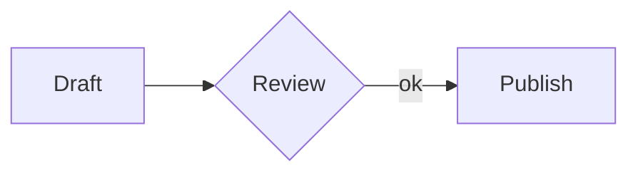
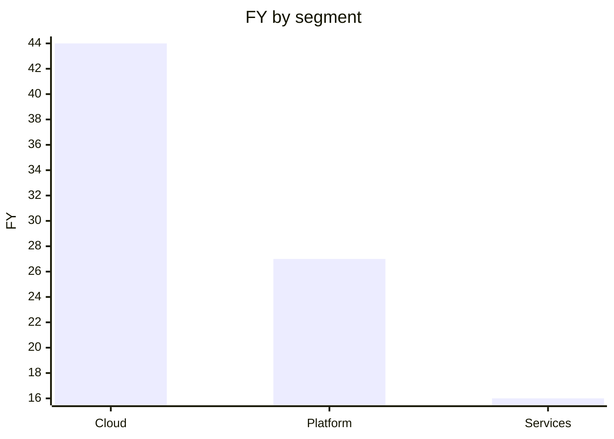

[](https://mcptoplist.com/server/io.github.geml-spec%2Fgeml)


<p align="center">
  <picture>
    <source media="(prefers-color-scheme: dark)" srcset="docs/assets/logo/geml-logo-dark.svg">
    
  </picture>
</p>

# GEML — General Expressive Markup Language（通用表达型标记语言）
[](https://www.npmjs.com/package/@geml/geml) [](https://github.com/geml-spec/geml/actions/workflows/ci.yml) [](https://github.com/geml-spec/geml/actions/workflows/geml-check.yml) [](spec/GEML-spec_CN.md) [](LICENSE) [](spec/LICENSE-spec.md)

*[English](README.md) | 中文*

GEML 是一种人与 AI agent（智能体，下文统称 agent）能共同书写同一篇章的标记语言。<br>
**一种格式，两类读者。**对人，是清晰可读的纯文本；对 agent，是可寻址、可校验、可溯源、可回退的**[“Doc-as-a-Base（文档即真相之源）”](docs/MANIFESTO_CN.md)**。

---

**GEML 极简。**
它极度简单，全语言只有一种块语法；
它是纯文本，脱离渲染器依然清爽；
它对机器友好，原生提供可寻址、可校验、可引用的结构化表达。

GEML 文件本身就是纯文本，读它不需要任何渲染器。它也不为每种内容单独设一套迷你语法，而是把所有类型内容都以一个**类型块（typed block）**容器承载。代码是块，表格、图形、公式、提示框、乃至元数据，都是块；一段散文也可以成块（`=== text`），只要你想按 id 指到它。未来要扩展也简单至极。形态都一样，所以这门语言好学到很难写错。

```
=== code {#hello lang=python}
print("hi")
===
```

```sh
geml get doc.geml '#hello'   # 按名字，只取这一块
```

块有名字，动词才有落点。完整语法见[1分钟学会](#one-minute)。

**目录：**[为什么需要新格式](#why-now) · [GEML有何不同](#whats-different) ·
[1分钟学会](#one-minute) · [给程序员的小礼物](#code-graph) ·
[即刻上手试试](#hands-on) · [搭配大模型使用](#with-an-llm) ·
[生态成熟度](#maturity) · [设计思路](#challenge) · [参与我们](#contributing) · [许可](#license)

<a id="why-now"></a>
## 为什么现在需要一种新格式

因为**文档的生产者和消费者变了**。

过去，一份文本格式要么为人类阅读排版而优化（如 Markdown、Word），要么为机器解析设计和优化（如 JSON、Schema）。但在 LLM 时代，人类与 Agent 第一次开始**共读、共写、反复改写**同一份文档。原有的工作方式正在失效：每次提供上下文和 Prompt 都在制造副本，导致工程真相源（Source of Truth）被无限复制、碎片化并最终偏离；而每次编辑仍以整个文件为单位——明明只改一块，却要重写整篇。

> 💡 **深潜阅读：**
> 如果你对大模型时代工程文档面临的困境、以及我们为什么要重新设计一种纯文本格式感兴趣，请阅读我们博客上的完整文章：[**《为什么大模型时代需要一种全新的文本格式？》**](https://geml-spec.github.io/geml/blog/2026/08/03/why-do-we-need-a-new-text-format-in-the-era-of-llms_CN/)。

为了解决这个“操作粗粒度”、“副本爆炸”与“依赖断裂”的问题，我们需要让纯文本中的知识切片能够被机器精确持有和校验。因此，承载文本的格式必须在语法层面补齐**四项核心能力**：

1. **块级寻址（Addressing）**：每块内容有唯一的 `#id`，不再是整个文件的杂糅。
2. **引用式投射（Transclusion）**：通过取值而非复制来组装上下文（`embed`）。
3. **构建期校验（Validation）**：任何断链在构建时当场报错，而非静默腐烂。
4. **块级回退（Reversion）**：提供独立于 Git 的、细粒度到单块的历史回滚。

这正是 GEML 被创造出来的原因。我们并没有试图让你放弃原有的格式，而是为现有生态补上这张缺失的网络。

---

<a id="whats-different"></a>
## GEML 有何不同？

四样能力上一章已经立好：寻址、投射、校验、回退。这一章直接看各家格式在这四条上落在哪、GEML 划了哪些边界。

### 与其它格式的比较

四样能力在各自领域都有成熟方案；不寻常的是把它们同时装进一种纯文本格式：

| 流派 | 状态本质 | 可寻址 / 可引用 | 可投射 / 引用嵌入 | 可校验 | 历史管理 / 可溯源 |
| :--- | :--- | :--- | :--- | :--- | :--- |
| **Word / Docs** | 状态黑盒 | ❌ 无块级主键，接入靠平台 API | ❌ 只能复制粘贴 | ❌ 无校验机制 | ⚠️ 依赖平台服务端，不在文件内 |
| **Markdown / AsciiDoc** | 字符串流 | ⚠️ 标题锚点或方言 id，无读写动词 | ⚠️ 方言嵌入（Obsidian `![[…]]`、`include::`），断链无声 | ❌ 死链无声失效 | ❌ 格式内没有，必须依赖外部 Git |
| **JSON / XML** | 数据序列化 | ✔️ (id / schema) | ⚠️ 仅 XML 有（XInclude，外置） | ✔️ 依赖外部工具链 | ❌ 格式内没有，必须依赖外部 Git |
| **GEML** | **纯文本 + 块结构** | **✔️ 每块独立 `#id`（原生可引用）** | **✔️ `=== embed` 引用即取值（原生嵌入）** | **✔️ 构建期强校验报错** | **✔️ `.gemlhistory` 紧邻文件（原生可溯源）** |

逐项对比：[对比 CommonMark](docs/comparisons/GEML-vs-CommonMark_CN.md) · [对比 XML 与 JSON](docs/comparisons/GEML-vs-XML-and-JSON_CN.md) · [7 种格式能力矩阵](docs/comparisons/COMPARISON_CN.md)。

与 Markdown 的共存方案：GEML 当作**编辑侧的事实源**，而 Markdown 作为交付物。用 `geml <file> --to md|html` 单向投影，交付照旧是 `.md` / `.html`。**只协同，不锁定。**（投影有损：块 id 与绑表图表不会跟过去。）

<a id="one-minute"></a>
## 1分钟学会

### 类型块

**一种形态，通吃所有类型。** 块的基本语法是 `=== type [属性]` … `===`（属性如 `{#id .class key=val}` 为可选），变的只有 `type`（以及正文怎么读）：

```
=== code {lang=python}
print("hi")
===

=== note {.intro}
解析过的散文，可用 *强调* 与 [[#budget]] 引用。
===

=== meta
title = "Budget plan"
===
```

连续的 `=`（≥3 个）开块，等长的一串闭块；更长的围栏可嵌套更短的。带 `#id` 的块还可以用**带标签围栏** `=== #id` 闭合，不必数围栏长度，长块因此更难写错（嵌套仍须更长的外围栏：块体里等长的裸 `===` 会提前闭块，带不带标签都一样）。类型决定正文如何解读：`raw`（原样：`code`、`diagram`、`math`、`table`）、`flow`（带内联标记的散文：`note`、`text`）、或 `data`（每行一个 `key=val`：`meta`）；`embed` 则根本没有正文，`src=` 指名它所代表的那个块。每个块都可携带属性对象 `{#id .class key=val}`，其中 `.class` 是*语义*标签，绝不作样式钩子。完整的内联语法（强调、链接、`[[#id]]` 自动引用、媒体、脚注、行内 `$公式$`）见[规范](spec/GEML-spec_CN.md)。

### 表格 —— 两种正文，一个模型

可视化写法：

```
=== table {#budget caption="年度成本"}
| Plan  | Months | Rate |
|-------|-------:|-----:|
| Basic |      1 |   30 |
| Pro   |      2 |   30 |
===
```

……或写成数据，带**计算列**与**汇总行**：

```
=== table {#fy25 format=csv header=1 compute="FY [%.1f] = Q1 + Q2 + Q3 + Q4" summary="Segment = 'Total'; FY [%.1f] = sum(FY)"}
Segment,  Q1, Q2, Q3, Q4
Cloud,     8, 10, 12, 14
Platform,  5,  6,  7,  9
Services,  3,  4,  4,  5
===
```

*两种形态描述同一个模型。`FY` 列与 `Total` 行在构建期算出：*

| Segment   | Q1 | Q2 | Q3 | Q4 |   FY |
|-----------|---:|---:|---:|---:|-----:|
| Cloud     |  8 | 10 | 12 | 14 | 44.0 |
| Platform  |  5 |  6 |  7 |  9 | 27.0 |
| Services  |  3 |  4 |  4 |  5 | 16.0 |
| **Total** |    |    |    |    | **87.0** |

`compute` 对各列逐行做 `+ - * / ( )` 运算；`summary` 用聚合 `sum / avg / min / max / count`（并可对聚合结果再做算术，如加权比率）生成表尾一行；列名后的 `[printf]` 控制数字显示。

表格还支持用 `src="regions.csv"` 引入外部 CSV。

> ❓ **问题探讨：** 这里该不该保留这个计算列和汇总行功能？[保留、冻结，还是砍掉——说一个](https://github.com/geml-spec/geml/discussions/19)。

### 公式

```
=== math {#gauss caption="高斯积分"}
\int_{-\infty}^{\infty} e^{-x^2} dx = \sqrt{\pi}
===
```

$$\int_{-\infty}^{\infty} e^{-x^2} dx = \sqrt{\pi}$$

### 图形与图表 —— 托管 DSL，或为表格作图

GEML 从不解释图形正文，而是把它交给可插拔渲染器（未知 `format` 仅告警，正文原样保留）：

```
=== diagram {#flow format=mermaid caption="评审流程"}
graph LR
  A[Draft] --> B{Review} -->|ok| C[Publish]
===
```



图形还能**为一张表作图**，单一真相，列引用在构建期受校验，数据零拷贝：

```
=== diagram {format=geml-chart data=#fy25 type=bar x=Segment y=FY}
===
```

*取自上面的 `#fy25` 表：*



### 数据 —— 存的是值，不是文字

每个块类型都在说明它装的是什么：`code` 装一段代码，`table` 装表格，`math` 装公式。`data` 装的是**数据值**，也是各种数据格式的归处——目前 `json`（默认）与 `jsonl`，`yaml`/`toml` 预留。带类型意味着正文会被**读进来**，而不只是展示出来：少一个逗号就构建失败，`geml get --json` 直接返回那个值，图表也能直接读它。

```
=== data {#log format=jsonl}
{"ts":"09:00","p95":41}
{"ts":"09:10","p95":58}
===

=== diagram {format=geml-chart data=#log type=line x=ts y=p95}
===
```

`jsonl` 正文一行一条记录，程序可以在文件尾盲追加。记录也可以留在自己的文件里：`src=ops/latency.jsonl#L900-999` 指明文件，并可选地指明一段行窗口——日志照旧被追加、`tail -f`，而文档是它**受校验、可寻址、可作图的那个视图**。

### 嵌入 —— 引用，不复制

一个块可以代表另一个块，同文档用 `#id`，跨文档用 `src=other.geml#id`，渲染时就地呈现目标块的**此刻状态**：

```
=== embed {src=#fy25}
===
```

正文保持为空（目标写在 `src=` 里），目标像任何引用一样受校验：源头没了，`geml check` 让构建当场变红。

<a id="code-graph"></a>
## 一份给程序员的礼物：geml-code-graph

为了更好地体会 GEML 格式的强大与灵活，我们拿程序员最熟悉、也最有挑战性的场景之一——代码图——来试一试。
**把整个代码库的调用图，写成 GEML。** `geml codemap build` 把调用图落成一棵 GEML 文档树，每个方法一个 `#id` 块，`#calls` / `#called-by` 正反向边。正向调用的**下游链**做问题排查，反向被调用的**上游链**查看影响面，全都秒速得见；


```sh
npm i -g @geml/geml
geml codemap build              # --root 默认当前目录：识别语言 → 索引 → 合并成一张图，落在 ./.geml-code-graph/
geml codemap serve              # 自动打开浏览器看图
```

> [!NOTE]
> **前置条件。** CLI 需要 Node **22+**（`npm i -g @geml/geml`）。以下都是可选项，仅在用到时才需要：
> 代码图里的非 TS/JS 语言需要 [Joern](https://docs.joern.io/installation)；
> [浏览器扩展](https://chromewebstore.google.com/detail/opmhfphgoidpnipphfgkhhjhmnmaenie)需要 Chrome。

> [!TIP]
> **TS/JS**——零前置，`build` 会自己拉取 scip 索引器。
> **Java / C / Python / Go / Kotlin**——多下载一个 [Joern](https://docs.joern.io/installation)：release 包解压后把目录传给 build，例如 `--joern ~/joern/joern-cli`（Windows 上是 `--joern C:\joern\joern-cli`）；放进 PATH 也行，可省掉这个参数。
> 前端 + 后端混合仓库——会并进**同一张图**。

geml-code-graph 本身就是一个 diagram 格式，一行就能把它嵌进任何 GEML 文档（`=== diagram {format=geml-code-graph src=.geml-code-graph/index.geml} ===`），配套的 Claude 技能还带一个可选的提交钩子，代码一动图就跟着重建，不会脱节。

规模是量出来的，不是许诺的：在 Apache Flink 代码库上实测，**13,585 个 Java 源文件、约 8.1 万
个方法、266,821 条调用边**，纯文本**数据表**依然秒开秒查，随意搜方法名可以定位调用链路。想自己
复现：克隆 `apache/flink`，在仓库根目录跑 `geml codemap build --joern …`。

<a id="hands-on"></a>
## 下一步——即刻上手试试

▶ **[到 Playground 试写 GEML](https://geml-spec.github.io/geml/playground/)**——左边编辑、右边实时渲染，引用一断，构建判定当场翻红。无需安装，也不用先读任何东西。

然后按你顺手的次序：

1. **在浏览器里看它渲染。** 装上**[浏览器扩展](https://chromewebstore.google.com/detail/opmhfphgoidpnipphfgkhhjhmnmaenie)**，打开任一 raw `.geml` 链接*（要 raw 文件本身，不是 GitHub 的 blob 页面，那个是 HTML）*：**[GEML 规范本身](https://raw.githubusercontent.com/geml-spec/geml/main/spec/in_geml_format/GEML-spec.geml)**（dogfood，规范本身就是一份 GEML，规模化渲染）、**[showcase](https://raw.githubusercontent.com/geml-spec/geml/main/docs/examples/showcase.geml)**（计算表、四张图、一条 Mermaid 流程、公式），或 **[playground/sample.geml](https://raw.githubusercontent.com/geml-spec/geml/main/playground/sample.geml)** 看交互式代码图。
2. **在本地跑起来。** `npm i -g @geml/geml`（Node 22+），然后 `geml check` 一份文档，或对着你自己的仓库跑 `geml codemap build`。
3. **配好 Claude Code——一条命令。** `npx -y @geml/geml skill install` 把写作技能、CLI、MCP server 一次装到用户全局，所有项目通用；不改任何设置、不装 hook。[详情](#with-an-llm)。
4. **读语法。** **[完整规范](spec/GEML-spec_CN.md)**（中 / [English](spec/GEML-spec.md)）是规范性文本，短到可以一口气读完。

<a id="with-an-llm"></a>
## 配合大模型与 agent 使用 GEML

目标只有一个：让你的模型**一次只改一个块，改完就校验**——而不是为改一段话重读、重发
整篇文档。做到它只需一步，看你用什么。

### 用 Claude Code——跑这条

```sh
npx -y @geml/geml skill install
```

它把写作技能、`geml` CLI、MCP server 一次装到用户全局，所有项目通用。不碰
`settings.json`、不装 hook；升级后重跑一次即可。*（偏好插件：`claude plugin
marketplace add geml-spec/geml`，再 `/plugin install geml@geml`，同一份技能、MCP
server 随包带上。）*

### 用别的模型——把这段贴给它，再用 check 把关

读不到技能的模型，需要你把规则给它一次。把下面这段贴过去，并让 `geml check` 守住它
写回来的东西——CLI 装法是 `npm i -g @geml/geml`（需 Node 22+）。

> 把文档写成 GEML：每个块都是 `=== type [属性]` … `===`（类型见
> [1分钟学会](#one-minute)）。模型最容易写错的是这四条：闭合围栏必须是与开围栏
> **等长**的一串 `=`，正文里含 `===` 就得用更长的外围栏；标题只用 ATX `#`，没有 `---`
> frontmatter（元数据用 `=== meta`）；每个 `#id` 唯一，且每个引用（`[[#id]]`、
> `[text](#id)`、`[^id]`、`data=#id`）都必须能解析；不允许 raw HTML。规范见
> [`GEML-spec_CN.md`](spec/GEML-spec_CN.md)。

### 它会怎么用

```sh
geml get    doc.geml '#hello'                            # 读取单个块（标题 id = 整节）
geml set    doc.geml '#license' --in template.geml#mit   # 替换这个块，从另一文件 fork 内容
geml add    doc.geml --after '#intro' --in snippet.geml  # 插入片段（保留其自身 id）
geml revert doc.geml '#plan' --rev -1                    # 把单个块回退一版
geml check  doc.geml                                     # 只校验：诊断 + 退出码
```

每个变更写前都会重新解析，若会破坏文档就拒写——这正是 agent 能无人值守编辑的原因。
其余动词（`delete`、`rename`、`history`、`--to md|html|geml` 转换、按类型或内容哈希
定位块）见 [parser README](geml-parser/README.md)。

### MCP 服务器

包里自带一个标准的 Model Context Protocol 服务器，让你的 agent**一次只改一个块**，而不是
重写整个文件。本地运行，支持 Windows、macOS、Linux；`--root` 就是放 `.geml` 文件的目录。

**Claude Code / 任意 CLI 客户端** —— 一条命令：

```sh
claude mcp add geml -- npx -y @geml/geml@latest mcp --root /absolute/path/to/your/docs
```

**Claude Desktop** —— 加到 `claude_desktop_config.json`：

```json
{
  "mcpServers": {
    "geml": {
      "command": "npx",
      "args": [
        "-y",
        "@geml/geml@latest",
        "mcp",
        "--root",
        "/absolute/path/to/your/docs"
      ]
    }
  }
}
```

然后你照常提需求就行，比如「把 FY26 表里 Q3 那行改掉」，agent 会精确定位到那一个块。**你不用
记任何工具名**：每个都镜像一个 CLI 动词（`geml set` → `geml_set`），终端和 agent 共用同一套
词汇。

比「让模型直接重写文件」强的地方有两条保证：写入**落盘之前**先解析，若会破坏文档就带着
诊断被拒；而且每次写入**先记一条 `.gemlhistory` 修订**，所以一次坏编辑既*拦得住*、又
*撤得回*（`geml_revert` 只还原那一个块，文件其余部分逐字节不变）。所有路径都被限制在
`--root` 内，客户端无法放宽。

把 `--root` 指向一个建过代码图（`geml codemap build`）的仓库，同一个服务器还能回答「谁调
用了这个」：四个只读的 `geml_codemap_*` 工具，一个客户端入口而不是两个。全部工具与参数见
[docs/mcp-guide.md](docs/mcp-guide.md)。

<a id="maturity"></a>
## 生态成熟度

GEML 是一份小而年轻的规范，但已经**稳定**：已发布 **`1.0`**，可用来写真实文档（本仓库的规范本身就是一例）；有一套严格的一致性测试集、一个解析器的参考实现**（独立于规范的版本）**，以及一个开放的提案流程。

完整的核心规范（§1–§8）外加历史扩展规范，两份规范都是中英双语：

| 文档 | English | 中文 |
|------|---------|------|
| 核心规范 | [`GEML-spec.md`](spec/GEML-spec.md) | [`GEML-spec_CN.md`](spec/GEML-spec_CN.md) |
| 历史扩展 | [`GEML-history-spec.md`](spec/GEML-history-spec.md) | [`GEML-history-spec_CN.md`](spec/GEML-history-spec_CN.md) |

### 版本与兼容性

- **自举**——[`GEML-spec.geml`](spec/in_geml_format/GEML-spec.geml) 是用 GEML 写成的规范本身，每次测试都要求被干净解析。
- **[一致性测试集](geml-parser/test/conformance/)** 支持不同实现的兼容性。
- **解析器的参考实现。** 当前单元测试 **600+** 项，一致性语料、往返序列化，以及端到端 CLI 运行，覆盖率由 CI 卡在行/语句/函数/分支均 ≥**95%**。
- **前向兼容写在语法里。** 处理器遇到不认识的构造必须优雅降级（规范 §8.2），所以新增一种块类型或图格式**不算**破坏性变更。类型注册表是开放的：未注册的类型名建议包含连字符（如 `acme-invoice`），把不含连字符的名字留给规范的未来版本（§8.5）。
- **如何声明合规。** 一个实现逐用例复刻出一致性测试集的结果后，即可声明自己「符合 GEML 1.0」（§8.5）。不需要许可，也不需要本仓库背书。
- **对外标识。** 扩展名 `.geml`（版本伴生文件 `.gemlhistory`），媒体类型 `text/geml`，在必须使用已注册类型的场合用 `text/vnd.geml`——`text/geml` 目前尚未在 IANA 注册。
- `.geml` URL 上的片段标识符指向携带该 id 的那一块（§0.6）——这与 HTML 页面的 #tag 含义不同。

<a id="challenge"></a>
## 设计时我们怎么想的

### 设计遵循什么

**定位是适合人类阅读的纯文本。** 没有渲染器也要完整可读——这决定了没有 raw-HTML 逃生舱、样式不得改变文档说了什么。

**一个原语，几个模型。** 所有内容都是同一种类型块；扩展格式是**注册一个类型，不是发明写法**。类型说明它**变成什么**：`meta` 是文档内共用的键值，`code` 是某处的一段代码，`data` 是数据值，`table` 是待加工的网格，`diagram` 是托管的外部 DSL，`embed` 是内容源的视图

**引用是视窗，不是导航。** HTML 的链接是导航：目标不在你手上这份文档里，所以人们照旧复制一份过来。要消灭的不是死链，是**复制的动机**。*代价：渲染可能要读多份文件，取不到时得优雅降级。*

**多用减法。** 一条规则会长出边角情况，就砍掉这个特性，而不是把边角写进规范：没有下划线强调、没有 setext 标题、没有缩进代码块、没有 raw HTML。歧义在源头删掉，而不是在用例里穷举。*代价：Markdown 能写的一些东西这里写不了。*

**避免破窗效应。** Markdown 的信条是永不失败、总要渲染出点什么；GEML 反过来——构建期校验，而非渲染期容忍。断掉的 `#id` 是错误，退出码非零。稳定 id、`geml check`、诊断目录，都从这一条推出来。*代价：一份「看着还行」的文档会让构建变红。*

**sidecar 式机制。** GEML 是内容源，刻意保持小。其他诉求不塞进来，而是反向引用它/依赖它（比如版本历史 `.gemlhistory`），删掉它文档照样有效。*代价：显式或隐含约定，两个文件得一起走。*

**命令行要为 agent 设计，能支持操作文档的全生命周期。** 最少动词，覆盖全面、正交化、输入输出管道化、参数设计要具备一致性。

### 于是拒绝了这些

| 拒绝的 | 为什么 |
|---|---|
| 自创图形语言 | 托管外部 DSL（Mermaid、Graphviz、D2…），格式只定义托管协议 |
| raw-HTML 逃生舱 | 语义保持可移植，不绑定任何后端或渲染器 |
| setext 标题 / `---` frontmatter | 只用 ATX `#`，消除与分隔线的歧义 |
| 复杂电子表格引擎 | 逐行公式与汇总够用；没有单元格寻址、查表、宏 |

<a id="contributing"></a>
## 参与我们

GEML 已是 `1.0`，但「稳定」是指**已有规则不会在你脚下变动**，不是设计已经定死。
目前只有**一个实现**，规范背后也只有**一套意见**。你的想法可以改动规范本身。
如果有兴趣参与，可以：

**一起来讨论**：

- [文档格式该不该保留计算列和汇总行？](https://github.com/geml-spec/geml/discussions/19)
- [如果要支持样式，应该怎么设计？](https://github.com/geml-spec/geml/discussions/17)
- [geml 历史文件是不是伪需求？](https://github.com/geml-spec/geml/discussions/18)
- [`geml get` 不带选择器就列块，这该是 `geml list` 吗？](https://github.com/geml-spec/geml/discussions/20)
- [`--view` 是参数还是动词？](https://github.com/geml-spec/geml/discussions/21)

<a id="integrations"></a>
或者**认领一件事**：

| 缺口 | 现状 | 要做的事 |
|---|---|---|
| **把技能装进更多 agent 工具** | 已按目录检测自动装 Gemini CLI、Qwen Code、AGENTS.md；MCP server 任何客户端都能接 | 照同一套加别家：**Trae**、**通义灵码**——各自的规则文件约定变得快，动手前先查官方文档，别照抄记忆 |
| **国产模型上的 primer 通过率** | 只在 Claude 上验过 | 拿 primer 让 DeepSeek / Qwen / Kimi 各写若干篇 GEML，用 `geml check` 统计一次过的比例，把总写错的规则报回来——primer 就该点名那几条 |
| **Obsidian 深度集成** | 能渲染，但尚未上架社区商店 | CodeMirror 层面的编辑与无缝双向渲染，以及上架本身。需要熟悉 Obsidian API 的人。 |
| **viewer 的其它浏览器** | Chrome 可用 | Firefox / Safari 移植。 |
| **RAG 集成打包** | LangChain / LlamaIndex 是参考实现 | 发到 PyPI；以及接其它框架（Haystack、DSPy…）。 |

- **写规范的第二个实现**——用你喜欢的语言为 GEML 写一个新的解析器实现（[怎么写一个解析器](docs/WRITING-A-PARSER.md)）
- **找出规范里有歧义的地方，这件事本身就是贡献**，不管那个解析器最后有没有发布。

或者**提个新建议**：

- 走 GEP：提案 + 规范改动 + 一致性用例，三件套一起落地（[流程](spec/proposals/README.md)）

或者**在这些场景用起来**：

| 场景 | 在哪 | 状态 |
|---|---|---|
| **不装任何东西先试** —— 左边编辑、右边实时渲染 | [Playground](https://geml-spec.github.io/geml/playground/) | 可用 |
| **在浏览器里读** —— 打开任一 raw `.geml` 链接就地渲染：计算表格、图表、Mermaid、公式，诊断以横幅呈现 | [Chrome 应用商店](https://chromewebstore.google.com/detail/opmhfphgoidpnipphfgkhhjhmnmaenie) · [源码](integrations/geml-viewer/) | 可用 |
| **命令行** —— 文档的整个生命周期都可以用 geml 命令操作 | [`@geml/geml`](https://www.npmjs.com/package/@geml/geml) | 可用 |
| **用 geml-code-graph 帮你理解项目** —— 整个调用图写成 GEML 文档树，可交互浏览 | `geml codemap build`（[设计](docs/design/specs/codemap/DESIGN-geml-code-graph.md)） | 可用 |
| **让 agent 按块改文档** —— 自带 MCP 服务器，agent 走的是和你一样的动词：读一块、改一块、校验、回退 | [`docs/mcp-guide.md`](docs/mcp-guide.md) | 可用 |
| **喂给 RAG / agent 框架** —— 按块切分的加载器（每块一个 chunk，带 `block_id`）+ agent 编辑工具 | [`integrations/langchain+llamaindex/`](integrations/langchain+llamaindex/) | 参考实现 |
| **在编辑器里写 GEML** —— 语法高亮 + 构建期引用校验 | [`integrations/vscode/`](integrations/vscode/) | 已构建，可从源码安装；未上架商店 |
| **在 Obsidian 里用上 GEML** —— 用参考解析器 + viewer 的渲染器，与网页同一条代码路径 | [`integrations/obsidian/`](integrations/obsidian/) | 已构建，未上架社区商店 |

上手前的三份文件：决策方式见 [`GOVERNANCE.md`](GOVERNANCE.md)，参与方式见 [`CONTRIBUTING.md`](CONTRIBUTING.md)，
文明吵架准则 [`CODE_OF_CONDUCT.md`](CODE_OF_CONDUCT.md)——核心只有一条规矩：对设计的反对可以多锋利都行，对人不行。

## 仓库结构

```
spec/                  核心规范 + .gemlhistory 扩展的 .md 版（英 / 中）、
                       CC-BY 规范许可证、proposals/（GEP）
spec/in_geml_format/   dogfood：同两份规范的 GEML 版，连带 .gemlhistory 伴生文件
geml-parser/           参考实现、渲染器、CLI + codemap 工具集（TypeScript, Node 22）
integrations/          GEML 接入的所有地方：geml-viewer（浏览器扩展）、
                       geml-check-action（CI）、vscode、obsidian、tree-sitter（简报）
playground/            浏览器内 playground（含本仓库的实时 geml-code-graph）
docs/                  指南、设计笔记、comparisons/（COMPARISON + 对比 CommonMark +
                       对比 XML/JSON）、图片资产（下方 Pages 站点复用其中的 logo），
                       以及一个可自行渲染的示例 .geml 文档
.claude/skills/        Claude 技能：GEML 写作，以及代码图
.github/               CI 与 geml-check 工作流、MCP 注册表发布，以及 issue 模板
                       （bug、GEP、新实现）
site/                  geml-spec.github.io/geml 的 Pages 站点：项目主页（index.md）
                       + 一个 Jekyll 博客（blog/，文章在 _posts/）——长文《为什么
                       需要一种新格式》（英 / 中）就作为博客的第一篇文章。本地用
                       `cd site && bundle exec jekyll serve` 构建预览；
                       .github/workflows/pages.yml 在 push 到 main 时构建并部署
                       （构建时把 playground/ 拼接进静态产物）。
```

<a id="license"></a>
## 许可与治理

**代码为 MIT**（[`LICENSE`](LICENSE)）：本仓库除规范文档之外的一切，包括 `geml-parser/`、
`integrations/` 全部、`playground/`、`.claude/skills/`，以及 `spec/proposals/` 里的 GEP。

**规范文档为 CC-BY-4.0**（[`LICENSE-spec.md`](spec/LICENSE-spec.md) 里逐份列明）：
`spec/GEML-spec*`、`spec/GEML-history-spec*`、`spec/in_geml_format/*` 与 `docs/comparisons/COMPARISON*`。规范不是软件，所以任何人
都可以不经许可构建一个兼容实现，并在通过[一致性测试集](geml-parser/test/conformance/)后声明
它「符合 GEML 1.0」。

**关于名字的使用。** 实现 GEML、用格式名给你的实现命名（`geml-rs`、`pygeml`、你所在语言包
管理器里的 `geml` 包），或声明「本工具可读写 GEML」，都不需要任何许可。只有两个请求，都不是
法律限制：一个实现通过一致性测试集之后再自称「符合 GEML 1.0」；以及不要让人误以为这个项目
写了它、为它背书或在维护它。规范正文本身的署名要求，CC-BY-4.0 已经写明。
