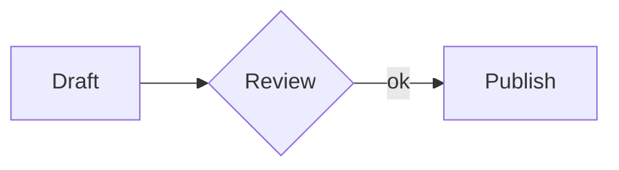
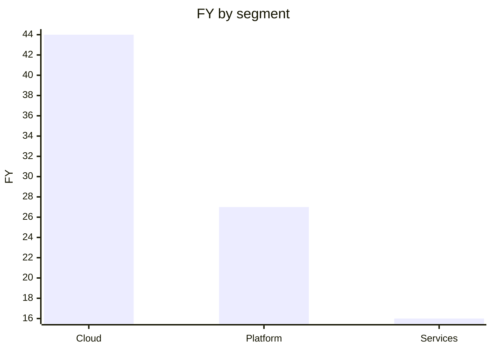

[](https://mcptoplist.com/server/io.github.geml-spec%2Fgeml) [](https://glama.ai/mcp/servers/geml-spec/geml) [](https://github.com/hashgraph-online/awesome-ai-plugins#development--workflow) [](https://github.com/mundimark/awesome-markdown#beyond-markdown---lets-fix-markdown-quirks--oddities-and-lets-fill-in--add-the-missing-parts-tables-footnotes-generic-blocks-etc)


<p align="center">
  <picture>
    <source media="(prefers-color-scheme: dark)" srcset="docs/assets/logo/geml-logo-dark.svg">
    
  </picture>
</p>

# GEML — General Expressive Markup Language（通用表达型标记语言）
[](https://www.npmjs.com/package/@geml/geml) [](https://modelcontextprotocol.io) [](https://github.com/geml-spec/geml/actions/workflows/ci.yml) [](https://github.com/geml-spec/geml/actions/workflows/geml-check.yml) [](spec/GEML-spec_CN.md) [](LICENSE) [](spec/LICENSE-spec.md)

*[English](README.md) | 中文*

GEML 是一种**轻量级标记语言，让人类与 AI agent（智能体，下文统称 agent）读写同一份文档**。<br>
**一种格式，两类读者。**
在 agent 驱动的软件开发与知识协作中，纯文本与 Markdown 缺乏确定性的区块边界：程序与模型交互时往往整篇读进来、整篇写回去，稍微好点的就定位靠行窗口反复试探，改写要把原文逐字复述一遍，Token 消耗随文档长度线性膨胀，操作变得臃肿。多轮改写之后，其他摘抄它的副本也开始失真。

**你不需要改动任何东西就能开始。** `geml list`、`geml find`、`geml get` 直接对你现有的 Markdown 寻址——不做任何转换、不产生新文件，你的 `.md` 还是 `.md`：

```sh
geml list    README_CN.md                              # 每一节，都是一个地址
geml get     README_CN.md '#核心特性-key-features'        # 只读一节，而不是整个文件
geml set     README_CN.md '#核心特性-key-features' --body # 写回一节
geml replace README_CN.md '旧文本' '新文本'              # 替换字面串，并告知落在哪一块
geml history save README_CN.md -m '收紧开头'            # 存一个版本到文件旁的 README_CN.md.gemlhistory
```

进入 agent 上下文的只有那一节——一两 KB，而不是整个文件，不管它长到多大。而每次保存都是一个版本，可以读回来，也可以退回去——退一个块，或整份文件。

▶ **[到 Playground 试一下](https://geml-spec.github.io/playground/)**——无需安装，也不用先读任何东西。

要比“一节”更细——单个块、单张图、单张表——就让 `.geml` 站在中间层：在那个粒度上编辑，你`--to md` 交付出来的永远不会与它漂移。

**块有自己的名字，块里的东西有自己的坐标。** 表里的一个单元格、`data` 块里的一个叶子、
`meta` 里的一个键——每一个的坐标都由结构本身给出，`get` 和 `set` 精确落在那个值上。

```sh
geml get doc.geml '#fy[2]["Q1"]'                     # 一个单元格
geml set doc.geml '#intake["fields"][1]["name"]'     # JSON 里的一个叶子
```

对人，它是清晰可读的纯文本；对 agent，它是可寻址、可校验、可溯源、可回退的**[“Doc-as-a-Base（文档即真相之源）”](https://geml-spec.github.io/manifesto-cn)**。

---

**GEML 极简。**
它是纯文本，脱离渲染器依然清爽；
全语言只有一种块语法；
原生提供可寻址、可校验、可引用的结构化表达。

它不为每种内容单独设一套迷你语法，而是把所有类型内容都以一个类型块容器承载。代码是块，表格、图形、公式、提示框、乃至元数据，都是块；一段散文也可以成块（`=== text`），只要你想按 id 指到它。未来要扩展也简单至极。形态都一样，所以这门语言好学到很难写错。

```
=== code {#hello lang=python}
print("hi")
===
```

```sh
geml get doc.geml '#hello'   # 按名字，只取这一块
```

块有名字，动词才有落点。完整语法见[1分钟学会](#one-minute)。

**目录：**[它解决什么](#problems) · [为什么需要新格式](#why-now) · [GEML有何不同](#whats-different) ·
[1分钟学会](#one-minute) · [Profile扩展体系](#profiles) ·
[即刻上手试试](#hands-on) · [搭配大模型使用](#with-an-llm) ·
[生态成熟度](#maturity) · [设计思路](#challenge) · [路线图](#roadmap) · [参与我们](#contributing) · [许可](#license)

<a id="problems"></a>
## 它解决什么

### 背景与解决的问题 (Problems Solved)

1. **上下文负载与 Token 膨胀**
   * **现状**：JSON/XML 等数据格式包含大量冗余标签与语法符号，Markdown 缺乏严格的结构化元数据与引用机制。
   * **方案**：优化标记密度与语法开销，只读写目标块，上下文占用不再随文档长度膨胀，实现 **AI Agent 轻负担读写**。

2. **AST 操作精度与解析确定性**
   * **现状**：非结构化文本在经过多轮 LLM 读写后容易出现格式破坏、语义偏移与解析幻觉。
   * **方案**：提供确定性的语法定义，支持直接映射为抽象语法树（AST），便于程序和 LLM 执行原子级（块）的增删改查。

3. **文档副本碎片化**
   * **现状**：多 Agent 协作或多流程共享内容时，依赖复制粘贴导致内容存在多个脱节的副本。
   * **方案**：基于 **单一数据源（Single Source of Truth）** 设计，通过标准化模块引用与数据绑定，消除冗余副本与版本分歧。

### 核心特性 (Key Features)

#### 1. AST 级精准结构化操作
* 统一的节点定义，支持将文档内容直接解析为类型化文档树（AST）。
* 允许 Agent 精确定位目标段落、属性或组件，支持局部 Patch 与幂等更新，避免全文重写。写入以字节切片落地并整篇重校验——树用于读取与校验，未触及的字节保证零改动。

#### 2. 低 Token 读写设计
* 省下的不是标记字符，而是没读的那部分：按 #id 命中语义完整的一块，其余内容根本不进上下文。
* 相同语义表达下显著降低 Prompt Token 开销，提升模型吞吐效率并降低推理成本。

#### 3. 单一数据源与模块化引用
* 原生支持跨文档、跨片段的组件化引用机制。
* 数据变动仅需更新源节点，引用端自动同步，防止文档版本失真。

#### 4. 双向读写鲁棒性
* 全语言只有一种块形态，生成侧易学难错，适配主流 LLM 的生成分布。
* 解析器具备严格的验证机制，提供明确的语法错误定位与修复反馈。

#### 5. 基于 Profile 的无感领域扩展
* 终结方言割裂：通过 `=== meta` 中的 `profile` 声明扩展特定领域词汇（如设计样式、交互表单、代码图谱、音视频轨），不发明新语法，也不破坏解析器。
* 静态类型与约束检查；在不认识该词汇表的环境中安全降级为标准块。

### 特性对比 (Comparison)

| 维度 | Markdown | JSON / YAML | GEML |
| :--- | :--- | :--- | :--- |
| **上下文开销（按块读写）** | 高（整篇进出） | 高（整篇 + 语法噪声） | **极低（只取目标块）** |
| **AST 精准操作** | 弱（缺乏严格语义节点） | 强 | **强（专为 Agent 读写优化）** |
| **人类可读性** | 高 | 中 | **高** |
| **单一数据源引用** | 不支持 | 需扩展协议 | **原生支持（模块化嵌入）** |
| **领域扩展机制** | 严重割裂（各家私造方言/语法补丁） | 依赖 Schema | **原生 Profile（零新语法 + 静态强校验）** |
| **写入安全** | 弱 | 中 | **强（坏写入落盘前被拒 + 单块回退）** |

---

<a id="why-now"></a>
## 为什么大模型时代需要一种全新的文本格式？

因为**文档的生产者和消费者变了**。

在传统软件工程中，文档要么是人类阅读的静态说明，要么是程序序列化的数据文件。

今天，人类与 AI Agent 已经开始在同一份文档上高频协作，当 AI Agent 成为文档的“第二个读者与协作者”时，这一平衡被彻底打破：
1. **上下文即稀缺算力**：Agent 的每一次整篇读写，都在消耗有限的注意力窗口与推理预算；
2. **人机协作需要同构载体**：人类需要直接看懂，Agent 需要精确按块读写；
3. **知识必须拥有单一真相源**：散落的 Prompt 与复制粘贴的 Markdown，注定会随着迭代而逐步腐化。

然而，我们现有的文本基础设施均非为此场景设计：

* **Markdown (为人排版)**：缺乏稳定的结构块与机器主键。Agent 哪怕只改一个参数，也必须读写整篇，不仅在多轮循环中**极度浪费上下文预算**，更极易引发文本格式与语义的漂移。
* **JSON / XML (为机器序列化)**：充斥着冗余的包裹语法与结构噪点，既阻断了人类的直观阅读，又在长上下文中白白消耗昂贵的 Token。
* **临时记忆与碎片文件 (缺乏单一真相源)**：上下文被拆散在对话历史与各处 Markdown 拷贝中，“副本自诞生就在漂移”，导致版本脱节与幻觉失真。

这三条的病根，恰恰是三者各自的优点：Markdown 的"永不报错、怎么写都行"成全了人的书写自由，也注定了机器无法信任它读到的结构；JSON/XML 的严格 schema 成全了机器的确定性，也注定了没人愿意在里面写散文。优点即病根，所以补丁修不动——给 Markdown 加上"坏引用必须报错"是对它契约的违背，给 JSON 剥掉包裹语法是对它本性的否定。当人与 agent 开始在同一份文本上高频协作，需要的不是两极之间的折中，而是把"人可读"与"机可操作"从第一天就写进同一条设计约束。

### 核心解法：**[“Doc-as-a-Base（文档即真相之源）”](https://geml-spec.github.io/manifesto-cn)**

GEML 不发明新的重型运行时，而是借鉴Roy Fielding博士提出的**[REST]( https://www.ics.uci.edu/~fielding/pubs/dissertation/rest_arch_style.htm )** 架构风格，为纯文本文档引入一组标准操作语义：

| 传统痛点 | GEML 对应能力 (四大定律) | 给开发者与 Agent 带来的实际价值 |
| :--- | :--- | :--- |
| **修改一处需全篇重写** | **寻址律 (Addressing)** | 给每个块赋予 `#id`，`get/set` 只读写目标块。**没被加载的东西不可能被改坏**，省下宝贵的上下文空间。 |
| **到处复制导致副本漂移** | **投射律 (Projection)** | `===embed`是动态求值而非复制粘贴，源头单一定义，彻底消除“同步多处副本”的无谓劳动。 |
| **坏格式/断引用污染下游** | **校验律 (Validation)** | 构建期自动核验引用与语法，**坏写入挡在落盘之前**，不等人工 review 介入拦截。 |
| **误改后只能全文件回滚** | **回退律 (Rollback)** | 伴生 `.gemlhistory` 支持**单块原子回退**，不推倒整篇，为 Agent 提供轻量级版本安全网。 |

> **文档需要的不再只是一个格式，而是一组动词。** GEML 让文档既保留纯文本的可读性，又具备确定性的块级操作能力。

> 💡 **深潜阅读：**
> 如果你对大模型时代工程文档面临的困境、以及我们为什么要重新设计一种纯文本格式感兴趣，请阅读我们博客上的完整文章：[**《为什么大模型时代需要一种全新的文本格式？》**](https://geml-spec.github.io/blog/2026/08/03/why-do-we-need-a-new-text-format-in-the-era-of-llms_cn)。

---

<a id="whats-different"></a>
## GEML 有何不同？

GEML 是刻意做小的——设计怎么想的、拒绝了什么、哪些还没定，都在[设计思路](#challenge)。

四样能力上一章已经立好：寻址、投射、校验、回退。这一章直接看各家格式在这四条上落在哪、GEML 划了哪些边界。

### 与其它格式的比较

四样能力在各自领域都有成熟方案；不寻常的是把它们同时装进一种纯文本格式：

| 流派 | 状态本质 | 可寻址 / 可引用 | 可投射 / 引用嵌入 | 可校验 | 历史管理 / 可溯源 |
| :--- | :--- | :--- | :--- | :--- | :--- |
| **Word / Docs** | 状态黑盒 | ❌ 无块级主键，接入靠平台 API | ❌ 只能复制粘贴 | ❌ 无校验机制 | ⚠️ 依赖平台服务端，不在文件内 |
| **Markdown / AsciiDoc** | 字符串流 | ⚠️ 标题锚点或方言 id，无读写动词 | ⚠️ 方言嵌入（Obsidian `![[…]]`、`include::`），断链无声 | ❌ 死链无声失效 | ❌ 格式内没有，必须依赖外部 Git |
| **JSON / XML** | 数据序列化 | ✔️ (id / schema) | ⚠️ 仅 XML 有（XInclude，外置） | ✔️ 依赖外部工具链 | ❌ 格式内没有，必须依赖外部 Git |
| **GEML** | **纯文本 + 块结构** | **✔️ 每块独立 `#id`（原生可引用）** | **✔️ `=== embed` 引用即取值（原生嵌入）** | **✔️ 构建期强校验报错** | **✔️ `.gemlhistory` 紧邻文件（原生可溯源）** |

逐项对比：[对比 CommonMark](https://geml-spec.github.io/compare/commonmark-cn) · [对比 XML 与 JSON](https://geml-spec.github.io/compare/xml-and-json-cn) · [7 种格式能力矩阵](https://geml-spec.github.io/compare/matrix-cn) · [awesome-markdown 里的 Markdown 变体与工具](https://geml-spec.github.io/illustrated/geml-vs-markdown-variants_CN.html)（HTML 页面）。

与 Markdown 的共存方案：GEML 当作**编辑侧的事实源**，而 Markdown 作为交付物。用 `geml <file> --to md|html` 单向投影，交付照旧是 `.md` / `.html`。**只协同，不锁定。**（投影有损：块 id 与绑表图表不会跟过去。）

**别信这张表，自己跑一遍。** 我就这么问的大模型：

> 你基于 claude 你自己在前面编辑 README 等文档的经历，描述下你处理文档的命令过程步骤（我看用到了 grep 之类的），以及是否缓存文档，以节省 token，我们来对照下，基于这个看 geml 有哪些是能够派上用场的

得到这样的结果 **[单次编辑的成本](https://geml-spec.github.io/benchmarks/addressing-cost-cn)**和**[真实一天的回放](https://geml-spec.github.io/benchmarks/mixed-toolchain-cn)**，你也可以贴给你的大模型，看看他给你的答案是什么。
PS: 我还在试能不能用上geml的codemap生成的上游链（被调用链）和下游链（调用链）功能来快速精确定位函数、调用点和修改项目代码,到时候我来贴个报告。

<a id="one-minute"></a>
## 1分钟学会

### 类型块

**一种形态，通吃所有类型。** 块的基本语法是 `=== type [属性]` … `===`（属性如 `{#id .class key=val}` 为可选），变的只有 `type`（以及正文怎么读）：

```
=== code {lang=python}
print("hi")
===

=== note {.intro}
解析过的散文，可用 *强调* 与 [[#budget]] 引用。
===

=== meta
title = "Budget plan"
===
```

连续的 `=`（≥3 个）开块，等长的一串闭块；更长的围栏可嵌套更短的。带 `#id` 的块还可以用**带标签围栏** `=== #id` 闭合，不必数围栏长度，长块因此更难写错（嵌套仍须更长的外围栏：块体里等长的裸 `===` 会提前闭块，带不带标签都一样）。类型决定正文如何解读：`raw`（原样：`code`、`diagram`、`math`、`table`）、`flow`（带内联标记的散文：`note`、`text`）、或 `data`（每行一个 `key=val`：`meta`）；`embed` 则根本没有正文，`src=` 指名它所代表的那个块。每个块都可携带属性对象 `{#id .class key=val}`，其中 `.class` 是*语义*标签，绝不作样式钩子。完整的内联语法（强调、链接、`[[#id]]` 自动引用、媒体、脚注、行内 `$公式$`）见[规范](spec/GEML-spec_CN.md)。

### 表格 —— 两种正文，一个模型

可视化写法：

```
=== table {#budget caption="年度成本"}
| Plan  | Months | Rate |
|-------|-------:|-----:|
| Basic |      1 |   30 |
| Pro   |      2 |   30 |
===
```

……或写成数据。表格装事实，它之上的一个 **`view`** 派生出**计算列**与**汇总行**：

```
=== table {#fy25 format=csv header=1}
Segment,  Q1, Q2, Q3, Q4
Cloud,     8, 10, 12, 14
Platform,  5,  6,  7,  9
Services,  3,  4,  4,  5
===

=== view {#fy25-report src=#fy25 compute="FY [%.1f] = Q1 + Q2 + Q3 + Q4; n = 1" summary="Segment = 'Total'; FY [%.1f] = sum(FY); n = sum(n)"}
===
```

*两种表格形态描述同一个模型。`FY` 列与 `Total` 行由那个 view 在构建期算出：*

| Segment   | Q1 | Q2 | Q3 | Q4 |   FY | n |
|-----------|---:|---:|---:|---:|-----:|--:|
| Cloud     |  8 | 10 | 12 | 14 | 44.0 | 1 |
| Platform  |  5 |  6 |  7 |  9 | 27.0 | 1 |
| Services  |  3 |  4 |  4 |  5 | 16.0 | 1 |
| **Total** |    |    |    |    | **87.0** | **3** |

`compute` 对各列逐行做 `+ - * / ( )` 运算；`summary` 用聚合 `sum / avg / min / max / count`（并可对聚合结果再做算术，如加权比率）生成表尾一行；列名后的 `[printf]` 控制数字显示。上面的 `n` 就是数行数的写法 —— `count` 数的是某一列的非空单元格，所以对一个常量列求和才是数行。


表格还支持用 `src="regions.csv"` 引入外部 CSV。

### 公式

```
=== math {#gauss caption="高斯积分"}
\int_{-\infty}^{\infty} e^{-x^2} dx = \sqrt{\pi}
===
```

$$\int_{-\infty}^{\infty} e^{-x^2} dx = \sqrt{\pi}$$

### 图形与图表 —— 托管 DSL，或为表格作图

GEML 从不解释图形正文，而是把它交给可插拔渲染器（未知 `format` 仅告警，正文原样保留）：

```
=== diagram {#flow format=mermaid caption="评审流程"}
graph LR
  A[Draft] --> B{Review} -->|ok| C[Publish]
===
```


```mermaid
graph LR
  A[Draft] --> B{Review} -->|ok| C[Publish]
```

图形还能**为一张表作图**，单一真相，列引用在构建期受校验，数据零拷贝：

```
=== diagram {format=geml-chart data=#fy25-report type=bar x=Segment y=FY}
===
```

*取自上面的 `#fy25-report` view —— `FY` 是计算列，所以图表绑的是派生它的那个
view，而不是基表：*


```mermaid
xychart-beta
  title "FY by segment"
  x-axis [Cloud, Platform, Services]
  y-axis "FY"
  bar [44, 27, 16]
```

### 数据 —— 存的是值，不是文字

每个块类型都在说明它装的是什么：`code` 装一段代码，`table` 装表格，`math` 装公式。`data` 装的是**数据值**，也是各种数据格式的归处——目前 `json`（默认）、`jsonl`，以及按声明子集读入的 `yaml`；`toml` 预留。带类型意味着正文会被**读进来**，而不只是展示出来：少一个逗号就构建失败，`geml get --json` 直接返回那个值，图表也能直接读它。

```
=== data {#log format=jsonl}
{"ts":"09:00","p95":41}
{"ts":"09:10","p95":58}
===

```

`jsonl` 正文一行一条记录，程序可以在文件尾盲追加。记录也可以留在自己的文件里：`src=ops/latency.jsonl#L900-999` 指明文件，并可选地指明一段行窗口——日志照旧被追加、`tail -f`，而文档是它**受校验、可寻址、可作图的那个视图**。

### 内嵌 —— 动态引用，不复制

一个块可以代表另一个块：同文档用 `src=#id`，跨文档用 `src=other.geml#id`。内嵌是渲染时对源头的**动态取值**——源头一改，所有内嵌处跟着变；源头没了，`geml check` 让构建当场变红。

```
=== embed {src=#fy25}
===
```

正文保持为空，目标写在 `src=` 里。
 
Markdown 里看不到投影效果。想亲眼看：装上[浏览器扩展](https://chromewebstore.google.com/detail/opmhfphgoidpnipphfgkhhjhmnmaenie)，打开 [sample.geml 的 raw 链接](https://raw.githubusercontent.com/geml-spec/geml-spec.github.io/main/public/playground/sample.geml)，翻到 **Transclusion** 一节——同文档投影（`src=#roadmap`）、跨文档投影、乃至跨文件链式解析（embed 引一张图，图又绑另一文件里的表）都在就地渲染：那里一个字都没写，改源头一处，投影处即变。
 
<a id="profiles"></a>
## Profile —— 领域词汇扩展，像搭乐高一样组合文档能力

想在文档里写交互表单、管理设计系统，或是嵌入整个代码库的调用图？
在传统 Markdown 里，这意味着各家私造插件（`:::note`、自定义 JSX 标签），最终沦为互不兼容的方言地狱。

GEML 的解法是 **Profile（应用层词汇表，规范 §8.6）**：**一行声明，按需给文档接入专业领域的结构化能力。**

```geml
=== meta
profile = "geml-style/v1 geml-form/v1"
===

==== form {#signup handler=subscribe}
=== form-field {name=email label="工作邮箱" type=text required pattern="[^@]+@acme\\.com"}
===
====

=== style-rule {#cta match="button.cta" bg="{{brand}}" radius="6px"}
===
```

### 扩展而不割裂

• 🧩 **像搭乐高一样按需混搭 (Mix & Match)**
核心语法极简收敛，而领域能力无限扩展。代码图谱、样式系统、表单约束、版本回退……一行 `profile = "..."` 即可组合多个专业领域的表达能力。

• ⚡ **无需编写插件，一秒接入全套工具链**
定义新的领域块**不需要开发解析器或写插件**。扩展块从诞生的第一秒起，天然具备全套基础设施支持：稳定的 `#id` 寻址、`geml get/set` 局部读写、CLI 动词、MCP 协议以及 AI Agent 的精准操控。

• 🛡️ **天然可移植，永不锁死 (Never Fractured)**
扩展了能力，却绝不破坏文档通用性。在任何未知或第三方工具中，文档依然保持 100% 结构完整与块级寻址能力，彻底告别 Markdown 换个平台就乱码崩溃的方言困境。

### 官方已落地的 Profile 矩阵

| Profile（使用指南） | 状态 | 用来做什么 | 赋予文档的专属能力 | 专属 CLI | 在线演示 / 示例 |
| :--- | :--- | :--- | :--- | :--- | :--- |
| [`geml-codemap/v1`](spec/profiles/geml-codemap/geml-codemap-guide_CN.md) | stable | 把代码库的调用图生成为一组 GEML 文档：每个方法一个块，能查谁调用它、它又调用了谁；前后端合成同一张图 | `code` 块上的 `anchor`、`name`、`entry-via` | `geml codemap build\|verify\|serve` | [可交互的调用图](https://geml-spec.github.io/playground/) · [`sample.geml`](https://geml-spec.github.io/playground/#ch=visual) |
| [`geml-media/v1`](spec/profiles/geml-media/geml-media-guide_CN.md) | draft | 用一份文档描述一条视频时间轴：素材、片段、字幕和配音轨道；可导出成网页播放，或用 ffmpeg 出成片 | `media`、`media-asset`、`media-clip`、`media-text` | `geml media build\|export\|lay\|todo` | [文档出视频（经 ffmpeg 出 MP4）](https://github.com/geml-spec/geml-spec.github.io/blob/main/public/examples/geml-media-demo/README.md) |
| [`geml-style/v1`](spec/profiles/geml-style/geml-style-guide_CN.md) | draft | 颜色、间距、布局写在单独的样式文档里，按规则作用到内容文档上，内容文档本身不用改 | `style-rule`、`style-state`、`style-screen`、`style-frame` | `geml style check` | [GitHub blob 页 1:1 复刻](https://github.com/geml-spec/geml-spec.github.io/blob/main/public/examples/style-demo/) |
| [`geml-history/v1`](spec/profiles/geml-history/geml-history-guide_CN.md) | stable | 在文档旁边的 `.gemlhistory` 里保存历史版本：能查看任意旧版、只退回某一个块，或整份回滚 | `history-revision`、`history-keyframe`、`history-blob` | `geml history save\|get\|restore` | [单块回退的常用操作](spec/profiles/geml-history/geml-history-guide_CN.md#常用) |
| [`geml-form/v1`](spec/profiles/geml-form/geml-form-guide_CN.md) | draft | 在文档里描述表单：有哪些字段、什么类型、是否必填、取值范围；浏览器扩展和 playground 会画出表单预览 | `form`、`form-field`、`form-group`、`form-options`、`form-note`，以及 `form-field` 上的 `pattern`、`min`、`max` 等约束属性 | — | [可交互的复杂表单示例](spec/proposals/0008-form-block-example/) |
| [`geml-translator/v1`](spec/profiles/geml-translator/geml-translator-guide_CN.md) | draft | 译文文档里不放译文，只引用原文并写明目标语言，打开时由浏览器扩展现场机翻；原文改了，译文跟着变 | `embed` 与 `meta` 上的 `translate-to` 属性 | — | — |

> 💡 **想看 Profile 实际跑起来？**
> • **`geml-media` 在线演示**：一份剪辑文档加一条命令（`geml media build ep01-cut.geml --out ep01.mp4 --burn-subs`），由 ffmpeg 对齐音视频、混音、烧录字幕，直接出成片（[去看](https://geml-spec.github.io/demos/media-cut)）。
> • **`geml-style` 在线演示**：内容留在 `page.geml` 里的纯文本，样式和布局放在 `github.style.geml`——渲染出 GitHub blob 页像素级 1:1 的复刻，不被任何 CSS 锁死（[去看](https://geml-spec.github.io/demos/style)）。
> • **表里每个 profile 名都链接到它的一页使用指南**：它做什么、第一条命令、常用操作。写代码的话，从 `geml-codemap` 开始。开发者也可以按规范轻松[定制自己的专属业务 Profile](spec/profiles/README.md)。

<a id="hands-on"></a>
## 下一步——即刻上手试试

▶ **[到 Playground 试写 GEML](https://geml-spec.github.io/playground/)**——左边编辑、右边实时渲染，引用一断，构建判定当场翻红。无需安装，也不用先读任何东西。

然后按你顺手的次序：

1. **在浏览器里看它渲染。** 装上**[浏览器扩展](https://chromewebstore.google.com/detail/opmhfphgoidpnipphfgkhhjhmnmaenie)**，打开任一 raw `.geml` 链接*（要 raw 文件本身，不是 GitHub 的 blob 页面，那个是 HTML）*：**[GEML 规范本身](https://raw.githubusercontent.com/geml-spec/geml/main/spec/in_geml_format/GEML-spec.geml)**（dogfood，规范本身就是一份 GEML，规模化渲染）、**[showcase](https://raw.githubusercontent.com/geml-spec/geml-spec.github.io/main/public/examples/showcase.geml)**（计算表、四张图、一条 Mermaid 流程、公式），或 **[playground/sample.geml](https://raw.githubusercontent.com/geml-spec/geml-spec.github.io/main/public/playground/sample.geml)** 看交互式代码图。
2. **看一份文档怎么排成一整页。** [样式演示](https://geml-spec.github.io/demos/style) 是 GitHub blob 页的 1:1 复刻——顶栏、文件树、面包屑、Preview/Code/Blame、下拉菜单——每一个字在 `page.geml`，每一个颜色和尺寸在 `github.style.geml`，而 viewer 两边都不认识。任何浏览器点开就能看——页面由 viewer 自己的代码画出来——生成它的 GEML 就在下面。
3. **在本地跑起来。** `npm i -g @geml/geml`（Node 22+），然后 `geml check` 一份文档，或对着你自己的仓库跑 `geml codemap build`。
4. **配好 Claude Code——一条命令。** `npx -y @geml/geml skill install` 把写作技能、CLI、MCP server 一次装到用户全局，所有项目通用；不改任何设置、不装 hook。[详情](#with-an-llm)。
5. **读语法。** **[完整规范](spec/GEML-spec_CN.md)**（中 / [English](spec/GEML-spec.md)）是规范性文本，短到可以一口气读完。
6. **或者看逐条图解。** **[GEML 图解](https://geml-spec.github.io/demos#illustrated-syntax)**（中英两版）——11 页自包含页面，每个块类型、每个 profile、以及 CLI 各一页：左边是 GEML，右边是处理器**实际**做了什么（`geml check` 诊断、`geml list` 地址、`--to html` 标记），每条规则都标了出处与状态。

<a id="with-an-llm"></a>
## 配合大模型与 agent 使用 GEML

目标只有一个：让你的模型**一次只改一个块，改完就校验**——而不是为改一段话重读、重发
整篇文档。做到它只需一步，看你用什么。

### 用 Claude Code、Gemini 或 Qwen——第一次跑这条

```sh
npx -y @geml/geml skill install
```

它把写作技能、`geml` CLI、MCP server 一次装到用户全局，所有项目通用。不改 `settings.json`，不装 hook；升级后重跑一次 `geml skill install` 即可。*（如偏好插件：`claude plugin
marketplace add geml-spec/geml`，再 `/plugin install geml@geml`，同一份技能、MCP
server 随包带上。）*

### 用 DeepSeek Harness——装这个 bundle

同一套东西打包成了 dsh bundle——geml MCP server 加写作、代码图谱两个技能：

```sh
dsh plugin --profile web add @geml/dsh-plugin   # web 是 dsh 默认启动的 profile；用别的 profile 就换成它的名字
```

已收录于 [dshmarket](https://dshmarket.com/p/geml-spec/geml--integrations-dsh-plugin/) 与 [awesome-dsh-plugin](https://awesome-dsh-plugin.com/p/geml-spec/geml--integrations-dsh-plugin/)，源码在 [integrations/dsh-plugin/](integrations/dsh-plugin/)。

### 用 Codex——装这个插件

同一套载荷再打一次包，这次是给 Codex 的：两个技能、MCP server，加一个 `SessionStart`
hook。在本仓库的检出目录里启动 Codex，它就出现在 `/plugins` 里（市场清单已提交在
`.agents/plugins/marketplace.json`）；不克隆也想装的话，`git-subdir` 配置在
[integrations/codex-plugin/](integrations/codex-plugin/)。

装好之后，在会话里说一句，这个项目就把 GEML 用作基础文档格式了：

> 项目用 geml 作为基础文档格式，其他格式按需用 geml 生成。

### 用别的大模型——把这段贴给它

读不到技能的模型，需要你把规则给它一次。把下面这段贴过去，并让 `geml check` 守住它
写回来的东西——CLI 装法是 `npm i -g @geml/geml`（需 Node 22+）。

> 把文档写成 GEML：每个块都是 `=== type [属性]` … `===`（类型见
> [1分钟学会](#one-minute)）。模型最容易写错的是这四条：闭合围栏必须是与开围栏
> **等长**的一串 `=`，正文里含 `===` 就得用更长的外围栏；标题只用 ATX `#`，没有 `---`
> frontmatter（元数据用 `=== meta`）；每个 `#id` 唯一，且每个引用（`[[#id]]`、
> `[text](#id)`、`[^id]`、`data=#id`）都必须能解析；不允许 raw HTML。规范见
> [`GEML-spec_CN.md`](spec/GEML-spec_CN.md)。

### 它会怎么用

```sh
geml list   doc.geml                                     # 先调它：每个块的地址、种类、行范围
geml find   "关键词" doc.geml                             # 搜块内容 → 地址（不是行号）
geml get    doc.geml '#hello'                            # 读取单个块（标题 id = 整节）
geml get    doc.geml '#hello' --intro                    # 一节切三段：--head | --intro | --body
geml set    doc.geml '#license' --in template.geml#mit   # 替换这个块，从另一文件 fork 内容
geml add    doc.geml --after '#intro' --in snippet.geml  # 插入片段（保留其自身 id）
geml revert doc.geml '#plan' --rev -1                    # 把单个块回退一版
geml check  doc.geml                                     # 只校验：诊断 + 退出码
```

任何一节都可以从三个粒度切取，`get` 和 `set` 都认：`--head` 是标题行，`--intro` 是它在第一个子标题之前说的话，`--body` 是它底下的全部——所以 `--body` 总是包含 `--intro`，没有子标题时两者相等。改一节的开头，不必把它的子节一起拉进上下文。

每个变更写前都会重新解析，若会破坏文档就拒写——这正是 agent 能无人值守编辑的原因。
其余动词（`delete`、`rename`、`history`、`--to md|html|geml` 转换、按类型或内容哈希
定位块）见 [parser README](geml-parser/README.md)。

### MCP 服务器

包里自带一个标准的 Model Context Protocol 服务器，让你的 agent**一次只改一个块**，而不是
重写整个文件——对 Markdown 与 GEML 同样生效。本地运行，支持 Windows、macOS、Linux；
`--root` 是服务器被限定的根目录（用 `.` 或 `${workspaceFolder}` 自动绑定当前工作区）。

**Claude Code** —— 一键安装（自动配置 skill、全局 CLI 与 MCP 注册）：

```sh
npx -y @geml/geml skill install
```

*（或通过 CLI 手动添加：`claude mcp add --scope user geml -- npx -y @geml/geml mcp --root .`）*

**Cursor** —— 在项目根目录添加 `.cursor/mcp.json`：

```json
{
  "mcpServers": {
    "geml": {
      "command": "npx",
      "args": ["-y", "@geml/geml", "mcp", "--root", "${workspaceFolder}"]
    }
  }
}
```

*（或在 Cursor Settings → Features → MCP 中添加：名称 `geml`，命令 `npx -y @geml/geml mcp --root .`）*

**Claude Desktop** —— 加到 `claude_desktop_config.json`：

```json
{
  "mcpServers": {
    "geml": {
      "command": "npx",
      "args": [
        "-y",
        "@geml/geml",
        "mcp",
        "--root",
        "/absolute/path/to/your/docs"
      ]
    }
  }
}
```

然后你照常提需求就行，比如「把 FY26 表里 Q3 那行改掉」，agent 会精确定位到那一个块。**你不用
记任何工具名**：每个都镜像一个 CLI 动词（`geml set` → `geml_set`），终端和 agent 共用同一套
词汇。

比「让模型直接重写文件」强的地方有两条保证：写入**落盘之前**先解析，若会破坏文档就带着
诊断被拒；而且每次写入**先记一条 `.gemlhistory` 修订**，所以一次坏编辑既*拦得住*、又
*撤得回*（`geml_revert` 只还原那一个块，文件其余部分逐字节不变）。所有路径都被限制在
`--root` 内，客户端无法放宽。

把 `--root` 指向一个建过代码图（`geml codemap build`）的仓库，同一个服务器还能回答「谁调
用了这个」：四个只读的 `geml_codemap_*` 工具，一个客户端入口而不是两个。全部工具与参数见
[docs/mcp-guide_CN.md](docs/mcp-guide_CN.md)。

<a id="maturity"></a>
## 生态成熟度

GEML 是一份小而年轻的规范，但已经**稳定**：已发布 **`1.0`**，可用来写真实文档（本仓库的规范本身就是一例）；有一套严格的一致性测试集、一个解析器的参考实现**（独立于规范的版本）**，以及一个开放的提案流程。

规范**只有一份**（§0–§9，另有附录 A/B），中英双语。`.gemlhistory` 伴生文件由
`geml-history/v1` **profile** 定义——它是规范之上的应用层，不属于规范本身，这也是
它为 MIT 而规范为 CC-BY 的原因（理由见 [`LICENSE-spec.md`](spec/LICENSE-spec.md)）：

| 文档 | English | 中文 |
|------|---------|------|
| 规范 | [`GEML-spec.md`](spec/GEML-spec.md) | [`GEML-spec_CN.md`](spec/GEML-spec_CN.md) |
| `geml-history/v1` profile | [`geml-history-profile.md`](spec/profiles/geml-history/geml-history-profile.md) | [`geml-history-profile_CN.md`](spec/profiles/geml-history/geml-history-profile_CN.md) |

本项目发布的全部 profile：[`spec/profiles/`](spec/profiles/README.md)。

### 版本与兼容性

- **自举**——[`GEML-spec.geml`](spec/in_geml_format/GEML-spec.geml) 是用 GEML 写成的规范本身，每次测试都要求被干净解析。
- **[一致性测试集](geml-parser/test/conformance/)** 支持不同实现的兼容性。
- **解析器的参考实现。** 当前单元测试 **1,700+** 项，一致性语料、往返序列化，以及端到端 CLI 运行，覆盖率由 CI 卡在行/语句/函数/分支均 ≥**95%**。
- **前向兼容写在语法里。** 处理器遇到不认识的构造必须优雅降级（规范 §8.2），所以新增一种块类型或图格式**不算**破坏性变更。类型注册表是开放的：未注册的类型名建议包含连字符（如 `acme-invoice`），把不含连字符的名字留给规范的未来版本（§8.5）。
- **如何声明合规。** 一个实现逐用例复刻出一致性测试集的结果后，即可声明自己「符合 GEML 1.0」（§8.5）。不需要许可，也不需要本仓库背书。
- **对外标识。** 扩展名 `.geml`（版本伴生文件 `.gemlhistory`），媒体类型 `text/vnd.geml`——厂商树名称；标准树的 `text/geml` 要等规范经 IETF 发布后才可申请。
- `.geml` URL 上的片段标识符指向携带该 id 的那一块（§0.6）——这与 HTML 页面的 #tag 含义不同。

<a id="challenge"></a>
## 设计时我们怎么想的

### 设计遵循什么

1. **人机同构，而非两极折中 (Human-Agent Isomorphism)**
   不是在“人类易读的 Markdown”与“机器可读的 JSON”之间和稀泥，而是把“人可无障碍直读”与“机器可确定性操作”作为同一条不可妥协的设计硬约束。人类看到的是清爽排版，Agent 与程序拿到的是强类型 AST 节点，彻底终结两套信息媒介的转换损耗。

2. **文档即数据库，而非字符流 (Doc-as-a-Base)**
   传统文档是一串扁平脆弱的字符流，修改一处往往需要整篇重写；GEML 把文档视为由结构化记录与稳定主键（`#id`）构成的微型数据库。每个区块拥有独立的生命周期、坐标系统与原子级 CRUD 操作接口，天然契合 Agent 的 O(1) 级精准读写。

3. **单一语法原语，词汇无界外延 (One Primitive, Infinite Vocabularies)**
   拒绝为每种内容发明专有语法补丁。全语言仅凭唯一的**类型块（Typed Block）原语**承载代码、数据、图表、计算与排版；通过 **Profile 机制**开放无限的领域词汇扩展，语法 100% 收敛冻结，词汇 100% 自由扩展，从根源上消灭方言割裂。

4. **消除复制动机，而非仅修补死链 (Transclusion over Duplication)**
   传统超链接是“路标”，诱导人们反复 copy-paste 导致分布式副本迅速漂移；GEML 的引用是“动态视窗”（`=== embed`）。一处定义，处处实时投影，从源头消灭冗余副本，捍卫唯一的“真相源（Single Source of Truth）”。

5. **像对待代码一样对待文档 (Compiler-Grade Integrity)**
   Markdown 的信条是“永不报错，凑合渲染”，这是 Agent 幻觉失控与知识腐化的温床；GEML 奉行严格的构建期静态强检。断掉的 `#id`、非法属性、隐式循环在构建期直接拦截（Non-zero exit），宁可构建报错，绝不把坏数据留给下游。

6. **以伴生历史捍卫 Local-First，而非云端锁定 (Local-First History over Cloud Lock-in)**
   数据的归宿在本地，版本的粒度在区块。GEML 拒绝将历史追溯绑架在中心化云端服务（如 Notion / Google Docs），也不强依赖笨重的全库 Git 提交。通过紧邻文档的伴生 `.gemlhistory`，让纯文本天然具备**本地优先（Local-First）的块级原子快照与秒级回退能力**（`geml revert doc.geml '#id'`），把数据主权与版本安全网牢牢留在本地。

### 于是拒绝了这些

| 拒绝的 | 为什么 |
|---|---|
| 自创图形语言 | 托管外部 DSL（Mermaid、Graphviz、D2…），格式只定义托管协议 |
| raw-HTML 逃生舱 | 语义保持可移植，不绑定任何后端或渲染器 |
| setext 标题 / `---` frontmatter | 只用 ATX `#`，消除与分隔线的歧义 |
| 复杂电子表格引擎 | 逐行公式与汇总够用；没有单元格寻址、查表、宏 |

<a id="roadmap"></a>
## 路线图

- [x] GEML `1.0` 规范，中英双语，配一致性测试集——外加定义 `.gemlhistory` 的 `geml-history/v1` profile
- [x] 参考实现 `@geml/geml`：解析器、CLI、块级 `.gemlhistory` 追踪
- [x] 官方 MCP server（`geml mcp`），接入 Claude Code / Cursor / Codex 等支持 MCP 的环境
- [x] codemap：把整个代码库的调用图写成 GEML
- [x] VS Code 插件已上架 Visual Studio Marketplace（publisher `geml`）
- [x] 生态集成：VS Code 语法高亮与引用检查、tree-sitter、Obsidian、Logseq（对活的 DB graph 双向同步）、浏览器 viewer、GitHub Action、LangChain / LlamaIndex，以及 agent 宿主插件——Claude Code、Codex、Grok、DeepSeek Harness，外加 Gemini CLI 与 Kimi Code 两份根清单
- [ ] Logseq 插件上架 Logseq 市场（[PR #893](https://github.com/logseq/marketplace/pull/893)）、Grok 插件上架 `xai-org/plugin-marketplace`
- [x] 第二个实现 [`geml-parser-rs/`](geml-parser-rs/)——Rust 编写、编译为 WebAssembly，只依据规范与一致性测试集写成，没有读过参考解析器的代码
- [ ] 他人写的实现——Python，或任何你顺手的语言；规范与一致性测试集都是公开的，我们乐意帮着对齐

---

<a id="contributing"></a>
## 参与我们

GEML 已是 `1.0`，但「稳定」是指**已有规则不会在你脚下变动**，不是设计已经定死。
目前有两个实现，但出自**同一位作者**，所以规范背后仍然只有**一套意见**。你的想法可以改动规范本身。
如果有兴趣参与，可以：

**一起来讨论**这几份还在草案阶段的提案：

- [GEP-0008 · `form` 块——可寻址的字段，惰性的提交目标](spec/proposals/0008-form-block.md)
- [GEP-0010 · 沿语言轴的投影——译文是视图，不是副本](spec/proposals/0010-language-projections.md)

还有别的想法？[发起一个讨论](https://github.com/geml-spec/geml/discussions/new/choose)。

<a id="integrations"></a>
或者**认领一件事**：

| 缺口 | 现状 | 要做的事 |
|---|---|---|
| **把技能装进更多 agent 工具** | 已按目录检测自动装 Gemini CLI、Qwen Code、AGENTS.md；MCP server 任何客户端都能接 | 照同一套加别家：**Trae**、**通义灵码**——各自的规则文件约定变得快，动手前先查官方文档，别照抄记忆 |
| **国产模型上的 primer 通过率** | 只在 Claude 上验过 | 拿 primer 让 DeepSeek / Qwen / Kimi 各写若干篇 GEML，用 `geml check` 统计一次过的比例，把总写错的规则报回来——primer 就该点名那几条 |
| **Obsidian 深度集成** | 能渲染，但尚未上架社区商店 | CodeMirror 层面的编辑与无缝双向渲染，以及上架本身。需要熟悉 Obsidian API 的人。 |
| **viewer 的其它浏览器** | Chrome 可用 | Firefox / Safari 移植。 |
| **RAG 集成打包** | LangChain / LlamaIndex 是参考实现 | 发到 PyPI；以及接其它框架（Haystack、DSPy…）。 |

- **用你的语言写一个规范的实现**——只照规范写一个新的 GEML 解析器（[怎么写一个解析器](docs/WRITING-A-PARSER_CN.md)）；[`geml-parser-rs/`](geml-parser-rs/) 就是这么写出来的，可以拿来对照
- **找出规范里有歧义的地方，这件事本身就是贡献**，不管那个解析器最后有没有发布。

或者**提个新建议**：

- 走 GEP：提案 + 规范改动 + 一致性用例，三件套一起落地（[流程](spec/proposals/README.md)）

或者**在这些场景用起来**：

| 场景 | 在哪 | 状态 |
|---|---|---|
| **不装任何东西先试** —— 左边编辑、右边实时渲染 | [Playground](https://geml-spec.github.io/playground/) | 可用 |
| **在浏览器里读** —— 打开任一 raw `.geml` 链接就地渲染：计算表格、图表、Mermaid、公式，诊断以横幅呈现 | [Chrome 应用商店](https://chromewebstore.google.com/detail/opmhfphgoidpnipphfgkhhjhmnmaenie) · [源码](integrations/chrome-geml-viewer/) | 可用 |
| **命令行** —— 文档的整个生命周期都可以用 geml 命令操作 | [`@geml/geml`](https://www.npmjs.com/package/@geml/geml)（源码 [`geml-parser/`](geml-parser/)） | 可用 |
| **用 codemap 帮你理解项目** —— 整个调用图写成 GEML 文档树，可交互浏览 | `geml codemap build`（[使用指南](spec/profiles/geml-codemap/geml-codemap-guide_CN.md) · [设计](docs/design/specs/geml-codemap/DESIGN-geml-code-graph.md)） | 可用 |
| **让 agent 按块改文档** —— 自带 MCP 服务器，agent 走的是和你一样的动词：读一块、改一块、校验、回退 | [`docs/mcp-guide_CN.md`](docs/mcp-guide_CN.md) | 可用 |
| **在 DeepSeek Harness 里用** —— geml MCP server + 写作、代码图谱两个技能，一个 bundle 装齐 | [`@geml/dsh-plugin`](https://www.npmjs.com/package/@geml/dsh-plugin) · [dshmarket](https://dshmarket.com/p/geml-spec/geml--integrations-dsh-plugin/) · [源码](integrations/dsh-plugin/) | 可用 |
| **在 Codex 里用** —— 同一套载荷再打一次包：两个技能、MCP server，加一个 `SessionStart` hook，从 `/plugins` 安装 | [`integrations/codex-plugin/`](integrations/codex-plugin/) | 本仓库内可用；尚未上公共插件目录 |
| **在 Grok 里用** —— 同一套载荷再来一次：两个技能加 MCP server | [`integrations/grok-plugin/`](integrations/grok-plugin/) | 本仓库内可用；`xai-org/plugin-marketplace` 的 PR 尚未提交 |
| **把 Logseq graph 同步成纯文本** —— Logseq 2.0 的 DB graph 持续同步成 GEML 文件，可寻址、对 git 友好，`restore` 是回去的路 | [`@geml/logseq-sync`](https://www.npmjs.com/package/@geml/logseq-sync) · [源码](integrations/logseq/) | watcher 已在 npm；插件目前装 release zip —— 市场上架（[PR #893](https://github.com/logseq/marketplace/pull/893)）尚未合并 |
| **喂给 RAG / agent 框架** —— 按块切分的加载器（每块一个 chunk，带 `block_id`）+ agent 编辑工具 | [`integrations/langchain+llamaindex/`](integrations/langchain+llamaindex/) | 参考实现 |
| **在编辑器里写 GEML** —— 语法高亮 + 构建期引用校验 | [Visual Studio Marketplace](https://marketplace.visualstudio.com/items?itemName=geml.geml) · [源码](integrations/vscode/) | 可用 |
| **在 Android Studio / IntelliJ 里写 GEML** —— 高亮、边写边报诊断、预览、结构视图、从 `.gemlhistory` 退回一个块 | [`integrations/intellij+androidstudio-plugin/`](integrations/intellij+androidstudio-plugin/) | 已构建；装自己打出来的 zip（Install Plugin from Disk），未上 JetBrains Marketplace |
| **在 Obsidian 里用上 GEML** —— 用参考解析器 + viewer 的渲染器，与网页同一条代码路径 | [`integrations/obsidian/`](integrations/obsidian/) | 已构建，未上架社区商店 |

上手前的三份文件：决策方式见 [`GOVERNANCE.md`](GOVERNANCE.md)，参与方式见 [`CONTRIBUTING.md`](CONTRIBUTING.md)，
文明吵架准则 [`CODE_OF_CONDUCT.md`](CODE_OF_CONDUCT.md)——核心只有一条规矩：对设计的反对可以多锋利都行，对人不行。

## 仓库结构

```
spec/                  规范的 .md 版（英 / 中）与 CC-BY 规范许可证，另有
                       profiles/（应用层——geml-history、geml-codemap、
                       geml-style、geml-form、geml-media、geml-translator，
                       每个都是参考文档加一页使用指南）与 proposals/（GEP），
                       两者均为 MIT
spec/in_geml_format/   dogfood：用 GEML 写成的规范本身，连带 .gemlhistory 伴生文件
geml-parser/           参考实现、渲染器、CLI + codemap 工具集（TypeScript, Node 22）
geml-parser-rs/        第二个实现：同一份规范的 Rust 实现，编译为 WebAssembly，
                       只依据规范与一致性测试集写成
integrations/          GEML 接入的所有地方：chrome-geml-viewer（浏览器扩展）、
                       geml-check-action（CI）、vscode、intellij+androidstudio-plugin、
                       obsidian、logseq（双向 vault 同步 + watcher）、tree-sitter（简报）、
                       langchain+llamaindex（RAG 加载器）、
                       windows-icon（资源管理器文件图标），以及四个 agent
                       宿主插件——claude-plugin、codex-plugin、grok-plugin、
                       dsh-plugin，以及 website（本仓库推给主页的东西）
.agents/、.claude-plugin/   插件市场清单，让插件从仓库检出即可出现
                       （Codex 的 /plugins、Claude Code 的 /plugin）
docs/                  指南（MCP、写一个解析器）、设计记录、发版手册、
                       图片资产（logo）
.claude/skills/        Claude 技能：GEML 写作，以及代码图
.github/               CI、安全扫描、发布与站点工作流（npm、MCP 注册表、VS Code、
                       viewer、网站），issue 模板（bug、GEP、新实现）与 PR 模板
（网站）               主页、playground、演示、博客、格式对比、基准测试、
                       宣言和图解页在它们自己的仓库 geml-spec/geml-spec.github.io
                       里；规范和各篇指南链接回本仓库，playground 的 bundle、代码图
                       和 logo 由 website 工作流推过去。本仓库在 geml-spec.github.io/geml/ 发布的只剩
                       site/——把旧路径转到新站的同一路径。
```

<a id="license"></a>
## 许可与治理

**代码为 MIT**（[`LICENSE`](LICENSE)）：本仓库除规范文档之外的一切，包括 `geml-parser/`、`geml-parser-rs/`、
`integrations/` 全部、`.claude/skills/`、`docs/`、`spec/profiles/` 下的 profile，以及 `spec/proposals/` 里的 GEP。

**规范文档为 CC-BY-4.0**（[`LICENSE-spec.md`](spec/LICENSE-spec.md) 里逐份列明）：
`spec/GEML-spec*` 与 `spec/in_geml_format/*`。主规范只有一份；`spec/profiles/` 下的 profile 属于应用层，为 MIT。规范不是软件，所以任何人
都可以不经许可构建一个兼容实现，并在通过[一致性测试集](geml-parser/test/conformance/)后声明
它「符合 GEML 1.0」。

**关于名字的使用。** 实现 GEML、用格式名给你的实现命名（`geml-rs`、`pygeml`、你所在语言包
管理器里的 `geml` 包），或声明「本工具可读写 GEML」，都不需要任何许可。只有两个请求，都不是
法律限制：一个实现通过一致性测试集之后再自称「符合 GEML 1.0」；以及不要让人误以为这个项目
写了它、为它背书或在维护它。规范正文本身的署名要求，CC-BY-4.0 已经写明。
