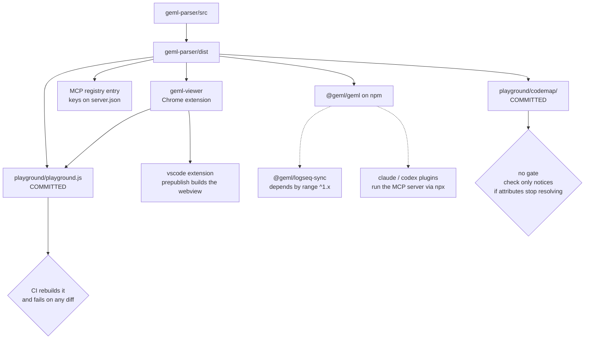

# Publishing

*English | [中文](PUBLISHING_CN.md)*

Seven things ship from this repository on six version tracks, and three of them
**bundle a copy of the parser** rather than depending on it at runtime. A parser
release is therefore not done when npm accepts it: everything carrying a copy is
shipping the old one until it is rebuilt and re-released.

This page exists because that has gone wrong more than once. A committed bundle
sat five versions behind while being the page a Show HN pointed at. A committed
code graph was regenerated only after `geml check` had been red on it for weeks.
Both were found by accident, not by a gate.

# What carries a copy of what

Only the dashed edges look after themselves. Every solid edge is a copy someone
has to remember.

# Before any release

| What | Needed for | One-time setup |
| --- | --- | --- |
| "Repo secret `NPM_TOKEN`" | "publishing @geml/geml and @geml/dsh-plugin from CI" | "npmjs.com -> Access Tokens -> Generate -> **Automation**; needs publish rights on the @geml scope. Nothing else is stored in the repo." |
| "GitHub OIDC" | "the MCP registry" | "none — `id-token: write` in the workflow is the whole of it; no secret" |
| "`contents: write`" | "attaching the viewer zip to its release" | "none — the default GITHUB\_TOKEN" |
| "Chrome Web Store developer account" | "putting the viewer in front of users" | "the workflow only attaches a zip to a GitHub release; the store upload is manual" |
| "VS Code Marketplace publisher + PAT" | "`vsce publish`" | "manual — outside this repo" |
| "Push access to the logseq mirror repo" | "the Logseq marketplace plugin" | "geml-spec/logseq-plugin-sync-vault-with-geml" |

And before any of it: **land the version bump on `main` first**. Every publish
path reads the tree, not your working copy.

# Artifact by artifact

## `@geml/geml` — parser, CLI, MCP server

- **Lands at** npmjs.com/package/@geml/geml, and the Model Context Protocol
  registry.
- **Version lives in six files.** `geml-parser/package.json`, `server.json`
  (twice), `package-lock.json` (twice), and the `claude-plugin` and
  `codex-plugin` manifests. The mcp suite guards the last two — its assertion
  reads *"installed plugins would never see this release"*, which is how the
  fifth and sixth were ever found.
- **How.** Actions -> *Publish to npm* -> Run workflow. Then Actions ->
  *Publish MCP Server*. Both are `workflow_dispatch`: publishing is a
  deliberate act, never a side effect of a push.
- **Watch for.** npm answers a duplicate version with a 403, so a second run on
  the same version fails loudly instead of clobbering — the MCP registry gives
  the same safety. The npm job installs with `npm install`, not `npm ci`,
  because the lockfile's own version field has historically trailed the release;
  bump the lockfile too and both stay true. `npm test` runs as a pre-publish
  gate, so a red suite cannot ship.
- **Confirm.** `npm view @geml/geml version` · the provenance badge on the npm
  page (the workflow publishes with `--provenance`) ·
  `npx -y @geml/geml@<version> --version --json` prints both parser and spec.

## `geml-viewer` — the Chrome extension

- **Lands at** a GitHub release asset first, the Chrome Web Store second.
- **Version** in `manifest.json`, `package.json` and `package-lock.json`
  (twice). Convention: one patch per parser release — 1.2.2 accompanied parser
  1.8.8 the same way.
- **How.** In `integrations/geml-viewer`:
  `npm version --no-git-tag-version <x.y.z>`, commit, land on main, then
  `git tag viewer-v<x.y.z> && git push origin viewer-v<x.y.z>`.
- **Watch for.** The tag MUST equal the manifest version — the job refuses
  otherwise, because the zip is named from the manifest and a mismatch would
  attach `geml-viewer-1.1.0.zip` to a `viewer-v1.1.1` release. The job builds
  the parser first, then runs the viewer's coverage gate; a release is the one
  build that must not ship a red suite.
- **Confirm.** The release carries `geml-viewer-<x.y.z>.zip` · load the unpacked
  zip and open a raw `.geml` · then the store listing's version, separately.

## `vscode` — the editor extension

- **Lands at** the VS Code Marketplace.
- **Version** in `package.json` and `package-lock.json` (twice).
- **How.** Manual `vsce publish` from `integrations/vscode`. Its
  `vscode:prepublish` runs `compile` and `build:webview`, and that webview build
  is `npm --prefix ../geml-viewer run build:vscode` — which is where the parser
  gets bundled in.
- **Watch for.** The parser must be built before packaging, or the webview build
  fails on a missing `dist/`. The bundle is deliberately NOT committed here
  (~8 MB), so there is no staleness to check and nothing for CI to guard.
- **Confirm.** The marketplace version · install it and open a `.geml` file.

## Claude and Codex plugins

- **Lands at** nowhere. **This repository is the marketplace** —
  `.claude-plugin/marketplace.json` and `.agents/plugins/marketplace.json` point
  at `./integrations/claude-plugin` and `./integrations/codex-plugin`.
- **How.** Merge to `main`. There is no publish step, which also means there is
  no publish gate: whatever lands is live for anyone who installs from the
  marketplace URL.
- **Watch for.** The version in each plugin manifest is advisory to users but
  load-bearing in CI — the mcp suite asserts it equals the parser's, so it moves
  with every parser release whether or not the plugin's own files changed.
- **Confirm.** Fetch the raw manifest and read its version · install the plugin
  in a fresh session and check a skill resolves.

## `@geml/dsh-plugin`

- **Lands at** npmjs.com/package/@geml/dsh-plugin.
- **Version** in its own `package.json`, on its own track — it does NOT follow
  the parser, unlike the other two plugins.
- **How.** Manual `npm publish` from `integrations/dsh-plugin`. It ships
  `cordis.patch.yml`, `skills/` and `LICENSE`.
- **Watch for.** Its vendored skill files are byte-identical copies of the
  claude and codex plugins' — when those are refreshed, this one needs a release
  even though the other two got theirs for free by riding the parser's version.
- **Confirm.** `npm view @geml/dsh-plugin version`.

## Logseq — plugin and watcher

- **Lands at** two places: the Logseq marketplace, via a release in the mirror
  repo `geml-spec/logseq-plugin-sync-vault-with-geml`, and npm for the watcher
  `@geml/logseq-sync`.
- **Version** in `package.json`, `plugin/package.json` and `package-lock.json`
  (three places). Plugin and watcher release together under one version; MAJOR
  tracks the Logseq major it speaks to.
- **How.** Mirror `integrations/logseq/` verbatim into the standalone repo — the
  mirror's root IS that directory — commit as
  `Sync Vault with GEML — mirror of geml-spec/geml integrations/logseq @ <sha>`,
  push, and only THEN tag `v<x.y.z>` there. The mirror's own `publish.yml`
  builds the plugin and attaches the marketplace zip.
- **Watch for.** **Mirror first, tag second.** The zip's name comes from
  `plugin/package.json` in the tagged checkout, so tagging a stale mirror
  attaches a zip named with the PREVIOUS version to the new release — and
  releases are immutable, so the tag is spent. The mirror carries source, not
  just releases, because the workflow builds there.
- **Confirm.** `gh release view v<x.y.z> -R geml-spec/logseq-plugin-sync-vault-with-geml`
  names `logseq-plugin-sync-vault-with-geml-v<x.y.z>.zip` · the mirror's
  `plugin/package.json` reads the new version.

# Order

1. **Bump** the parser in all six files, write the `CHANGELOG.md` entry, build.
2. **Regenerate what carries a copy**, before publishing anything:
   `npm --prefix integrations/geml-viewer run build:playground` for the bundle,
   and `geml codemap build` for `playground/codemap/` on **any** change to parser
   or viewer source, and on any version bump. This page used to say "whenever the
   parser gained or lost modules", which is far too narrow: the map is
   function-level, so each node carries a `src=…#L<a>-<b>` range and a
   `@geml/geml <version>` anchor. Inserting one function moves every range below
   it, and a bump restamps every anchor. Adding `slugify()` to `geml.ts` shifted
   the whole tail of the map by 50 lines and nothing said so. Use
   `geml codemap refresh playground/codemap --force` while the change is still
   uncommitted: without `--force` it compares against a commit and skips.
3. **Run the gates.** `node test/all.mjs` · `npm run coverage:check` · the
   per-package `npm ci --dry-run --ignore-scripts` · `geml check` over the
   repo's `.geml`. Take each exit code from the run itself — a `| tail` pipe
   reports tail's, not the command's.
4. **Land on main.** Every publish path reads the tree.
5. **Publish the parser**: *Publish to npm*, then *Publish MCP Server*.
6. **Bump and ship what bundles it**, each on its own track: viewer by tag,
   vscode by `vsce`, dsh by `npm publish`. The claude and codex plugins are
   already live — they shipped when the merge landed.
7. **Logseq only if its own code changed.** Its dependency is a range, so a new
   parser reaches it without a release.

> **A published GitHub release here is immutable.** Never delete one to fix it —
> deleting permanently burns its tag. Cut a NEW tag and
> `gh release create --latest`. The `-1` suffixes already in the tag list
> (`viewer-v1.2.2-1`, `v2.0.7-1`) are what that looks like when it happens.

# Traps, each of which has already cost something

| Trap | What it looks like | What catches it |
| --- | --- | --- |
| "The parser version has six homes" | "npm ships 1.9.0 while installed plugins still advertise 1.8.8" | "the mcp suite compares each plugin manifest to package.json" |
| "playground/playground.js is committed" | "the browser page parses with the old grammar while everything else has the new one" | "CI rebuilds it and fails on any git diff" |
| "playground/codemap/ is committed AND function-level" | "every `#L<a>-<b>` range below an inserted function points at the wrong lines — and the new function has no node at all" | "nothing — `codemap verify` passes on a stale map: it checks only that documents parse and references resolve — never that a range still matches its source" |
| "The viewer tag must equal manifest.json" | "a viewer-v1.2.4 release carrying geml-viewer-1.2.3.zip" | "release-viewer.yml refuses the mismatch" |
| "Logseq is mirrored — not tagged in place" | "tagging first builds the zip from a stale checkout and names it with the OLD version" | "nothing — mirror; verify the mirror's plugin/package.json; then tag" |
| "Lockfiles carry their own package's version" | "npm ci refuses and the CI lockfile job goes red" | "the per-package `npm ci --dry-run` job" |
| "\_index/refresh.json can fall out of format" | "`geml codemap refresh` refuses an untrusted or out-of-date recipe — the version gate is a security fix: v1 steps are structured argv spawned without a shell" | "hand-write it; refresh.mjs calls it a recipe no tool rewrites. An AUTO-mode build re-records one but indexes a test fixture and bakes in an absolute path to the machine that ran it" |
| "`codemap refresh` judges staleness by commit" | "it skips with *no source files changed since <sha>* while the source sits modified in the working tree — exactly when a developer needs it" | "nothing — pass `--force` whenever the change is not yet committed" |
| "The plugins have no publish gate" | "a broken skill is live the moment it merges" | "nothing — main IS the release for those two" |
