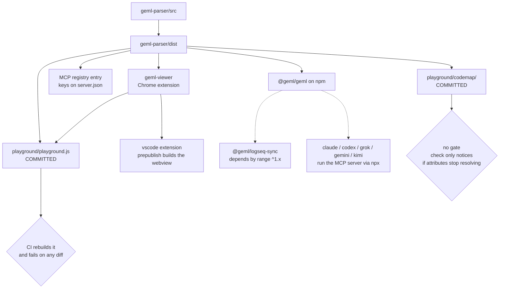

# Publishing

*English | [中文](PUBLISHING_CN.md)*

Eight things ship from this repository on six version tracks, and three of them
**bundle a copy of the parser** rather than depending on it at runtime. A parser
release is therefore not done when npm accepts it: everything carrying a copy is
shipping the old one until it is rebuilt and re-released.

This page exists because that has gone wrong more than once. A committed bundle
sat five versions behind while being the page a Show HN pointed at. A committed
code graph was regenerated only after `geml check` had been red on it for weeks.
Both were found by accident, not by a gate.

# What carries a copy of what

Only the dashed edges look after themselves. Every solid edge is a copy someone
has to remember.

# Before any release

| What | Needed for | One-time setup |
| --- | --- | --- |
| Repo secret `NPM_TOKEN` | publishing @geml/geml and @geml/dsh-plugin from CI | npmjs.com -> Access Tokens -> Generate -> **Automation**; needs publish rights on the @geml scope. Nothing else is stored in the repo. |
| GitHub OIDC | the MCP registry | none — `id-token: write` in the workflow is the whole of it; no secret |
| `contents: write` | attaching the viewer zip to its release | none — the default GITHUB\_TOKEN |
| Chrome Web Store developer account | putting the viewer in front of users | DONE (`opmhfphgoidpnipphfgkhhjhmnmaenie`). The workflow only attaches a zip to a GitHub release; the store upload stays manual. |
| Repo secret `VSCE_PAT` | publishing the extension to the VS Code Marketplace from CI | DONE — publisher `geml` exists and carries a listing. dev.azure.com -> User settings -> Personal access tokens -> New: **Organization = All accessible organizations** (a single-org token 401s), scope **Marketplace -> Manage**. Validate with `npx @vscode/vsce login geml` before storing it. |
| Repo secret `OVSX_PAT` | publishing the same .vsix to Open VSX from CI | DONE — Eclipse Foundation account, signed Publisher Agreement, namespace `geml`. open-vsx.org -> Profile -> Access Tokens. Validate with `npx ovsx verify-pat geml` (reads `OVSX_PAT` from the environment). |
| Nothing | listing `geml-check-action` on the GitHub Marketplace | a release with the Marketplace checkbox ticked in the GitHub UI; `action.yml` already carries the required `branding`. NOT LISTED YET. |
| Obsidian community-plugin submission | `integrations/obsidian` reaching Obsidian users without a manual copy | NOT SUBMITTED YET — the store wants its own repository with releases, so this one needs extraction before it can be applied for. |
| Push access to the logseq mirror repo | the Logseq marketplace plugin | geml-spec/logseq-plugin-sync-vault-with-geml |
| Nothing | the Gemini CLI extension gallery | DONE 2026-09-03 — GitHub topic `gemini-cli-extension` plus `gemini-extension.json` in the repository root. No account and no application: the gallery crawler finds the repo and validates it. |
| A GitHub pull request | listing the Grok plugin in xai-org/plugin-marketplace | NOT OPENED — fork, vendor `integrations/grok-plugin` into `external_plugins/geml`, add the drafted entry, run their `scripts/validate-catalog.py`. No xAI account is needed. |
| A forum.moonshot.ai account | a Kimi Code marketplace listing | NOT REQUESTED — `kimi.plugin.json` is in place, but the catalogs are Moonshot's own, so the listing is a request on their forum. |
| WorkBuddy certified-developer status | uploading the skills to SkillHub / ClawHub | NOT APPLIED FOR — the upload path is gated on it. |
| A hosted MCP endpoint | the ChatGPT directory's 'With MCP' route | does not exist and is not planned. Domain verification would be required too; the skills-only submission needs neither. |

And before any of it: **land the version bump on `main` first**. Every publish
path reads the tree, not your working copy.

# Artifact by artifact

## `@geml/geml` — parser, CLI, MCP server

- **Lands at** npmjs.com/package/@geml/geml, and the Model Context Protocol
  registry.
- **Version lives in NINE fields.** `geml-parser/package.json`, `server.json`
  (twice), `package-lock.json` (twice), and FOUR vendor manifests: `claude-plugin`,
  `codex-plugin`, the root `gemini-extension.json`, and
  `grok-plugin/.grok-plugin/plugin.json`. The mcp suite guards all four — its
  assertion reads *"installed plugins would never see this release"*, which is
  how the fifth and sixth were ever found; the seventh and eighth arrived with
  the agent-market manifests and this line trailed them until 1.10.0.
- **How.** Actions -> *Publish to npm* -> Run workflow. Then Actions ->
  *Publish MCP Server*. Both are `workflow_dispatch`: publishing is a
  deliberate act, never a side effect of a push.
- **Watch for.** npm answers a duplicate version with a 403, so a second run on
  the same version fails loudly instead of clobbering — the MCP registry gives
  the same safety. The npm job installs with `npm install`, not `npm ci`,
  because the lockfile's own version field has historically trailed the release;
  bump the lockfile too and both stay true. `npm test` runs as a pre-publish
  gate, so a red suite cannot ship.
- **Confirm.** `npm view @geml/geml version` · the provenance badge on the npm
  page (the workflow publishes with `--provenance`) ·
  `npx -y @geml/geml@<version> --version --json` prints both parser and spec.

## `geml-viewer` — the Chrome extension

- **Lands at** a GitHub release asset first, the Chrome Web Store second.
- **Version** in `manifest.json`, `package.json` and `package-lock.json`
  (twice). Convention: one patch per parser release — 1.2.2 accompanied parser
  1.8.8 the same way.
- **How.** In `integrations/geml-viewer`:
  `npm version --no-git-tag-version <x.y.z>`, commit, land on main, then
  `git tag viewer-v<x.y.z> && git push origin viewer-v<x.y.z>`.
- **Watch for.** The tag MUST equal the manifest version — the job refuses
  otherwise, because the zip is named from the manifest and a mismatch would
  attach `geml-viewer-1.1.0.zip` to a `viewer-v1.1.1` release. The job builds
  the parser first, then runs the viewer's coverage gate; a release is the one
  build that must not ship a red suite.
- **Confirm.** The release carries `geml-viewer-<x.y.z>.zip` · load the unpacked
  zip and open a raw `.geml` · then the store listing's version, separately.

## `vscode` — the editor extension

- **Lands at TWO marketplaces, from one file.**
  [Open VSX](https://open-vsx.org/extension/geml/geml) (namespace `geml`) is what
  Cursor, Windsurf, VSCodium and Antigravity resolve extensions from, and the
  [VS Code Marketplace](https://marketplace.visualstudio.com/items?itemName=geml.geml)
  (publisher `geml`) is what plain VS Code installs from. Both listings exist. The
  two can sit at different versions — a publish that succeeds on one and fails on
  the other leaves them apart until the next run, and that is normal, not damage.
- **Version** in `package.json` and `package-lock.json` (twice).
- **How.** Actions -> **Publish the VS Code extension** -> Run workflow. Inputs:
  `targets` (`both` | `marketplace` | `open-vsx`) and `dry_run`. It builds the
  three halves in order (parser dist -> the viewer's webview bundle -> compile and
  test the extension), packages ONE `.vsix`, keeps it as a run artifact, and
  publishes that same file to whichever targets were asked for. Tokens come from
  `VSCE_PAT` / `OVSX_PAT` through the environment, never on a command line.
  A first run with `dry_run` ticked builds and packages and publishes nothing.
- **Watch for.**
  - **A failure on the first target skips the second.** The steps carry no
    `always()`, so a Marketplace 401 fails the job and Open VSX never runs. If
    Marketplace succeeded and Open VSX failed, re-run with
    `targets=open-vsx` — a re-run of `both` dies on the duplicate version at the
    first step and never reaches the second.
  - **A 401 from the Marketplace is the PAT, not the listing.** The publisher
    exists; check the token's organization scope first (see the prerequisites).
  - Do not publish by hand from a working copy: the bytes are not reproducible.
    The workflow packages from a clean checkout of the pushed commit.
  - The webview bundle is deliberately NOT committed here (~8 MB), so there is no
    staleness for CI to guard — but it also means the parser must be built before
    packaging, which the workflow does and a manual run forgets.
  - Both registries refuse a duplicate version.
- **The version that matters is the one INSIDE the package.** The extension
  bundles the parser through `build:webview`, so re-packaging is how a parser fix
  reaches Cursor and Antigravity — an extension version that has not moved does
  not mean its users are current. 1.0.0 sat on Open VSX carrying a parser several
  releases old while the repository was already on 1.9.1.
- **Confirm.** `npx @vscode/vsce show geml.geml` names the Marketplace version ·
  `curl -s https://open-vsx.org/api/geml/geml` names the Open VSX version and the
  download count · install it and open a `.geml` file. Open VSX indexes a
  submission with a delay, so its API can answer with the previous version for a
  few minutes after a successful publish.

## Claude and Codex plugins

- **Lands at** nowhere. **This repository is the marketplace** —
  `.claude-plugin/marketplace.json` and `.agents/plugins/marketplace.json` point
  at `./integrations/claude-plugin` and `./integrations/codex-plugin`.
- **How.** Merge to `main`. There is no publish step, which also means there is
  no publish gate: whatever lands is live for anyone who installs from the
  marketplace URL.
- **Watch for.** The version in each plugin manifest is advisory to users but
  load-bearing in CI — the mcp suite asserts it equals the parser's, so it moves
  with every parser release whether or not the plugin's own files changed.
- **Confirm.** Fetch the raw manifest and read its version · install the plugin
  in a fresh session and check a skill resolves.

## `@geml/dsh-plugin`

- **Lands at** npmjs.com/package/@geml/dsh-plugin, and — separately — at the
  **awesome-dsh-plugin** list (`data/plugins`, entry accepted in PR #1310), which
  is what dshmarket reads. The npm publish is the release; the list entry is the
  listing, and only description/category changes need a new PR: the market tracks
  GitHub and npm on its own.
- **Version** in its own `package.json`, on its own track — it does NOT follow
  the parser, unlike the other two plugins.
- **How.** Manual `npm publish` from `integrations/dsh-plugin`. It ships
  `cordis.patch.yml`, `skills/` and `LICENSE`.
- **Watch for.** Its vendored skill files are byte-identical copies of the
  claude and codex plugins' — when those are refreshed, this one needs a release
  even though the other two got theirs for free by riding the parser's version.
- **Confirm.** `npm view @geml/dsh-plugin version`.

## Agent markets — one manifest per vendor

The same two skills and the same stdio MCP server, listed in someone else's
catalog. Nothing here is built or published: each vendor reads exactly one file,
and the work is the listing request. The files exist in this repo today; most of
the listings do not.

| Vendor | What it reads | How a listing is granted | Status |
| --- | --- | --- | --- |
| Claude Code · Codex | `integrations/claude-plugin` and `integrations/codex-plugin`, via the two root marketplace manifests | none — this repository IS the marketplace | live; see the plugins section above |
| DSH | `integrations/dsh-plugin` on npm; the GUI market indexes GitHub topics `dsh-plugin`, `agent-skills`, `claude-skills` | the awesome-dsh-plugin PR (accepted, #1310), plus those topics | live; see the dsh section above |
| Gemini CLI | `gemini-extension.json` — the crawler requires it in the ABSOLUTE root of the repository or the release archive, never a subdirectory | no application at all: add the `gemini-cli-extension` topic and the gallery crawler finds and validates the repo | manifest and topic in place 2026-09-03; NOT yet confirmed in the gallery |
| Grok (xAI) | `integrations/grok-plugin` — `.mcp.json`, `.grok-plugin/plugin.json`, `skills/` | a pull request to xai-org/plugin-marketplace that vendors the directory into `external_plugins/` and adds an entry to their `.grok-plugin/marketplace.json`; their validator runs in CI and a code owner reviews | files ready, entry drafted; PR NOT OPENED — `integrations/grok-plugin/SUBMISSION.md` |
| Kimi Code | `kimi.plugin.json` at the repository root | a listing request on forum.moonshot.ai; the official and curated catalogs are Moonshot's own | manifest in place; listing NOT REQUESTED |
| ChatGPT · OpenAI directory | the `skills/` tree, uploaded as a zip | portal submission at platform.openai.com/plugins, already written up in `integrations/codex-plugin/SUBMISSION.md` | NOT SUBMITTED. Skills-only is the only route open: 'With MCP' wants a HOSTED endpoint plus domain verification, and ours is a local stdio server |
| Qwen Code | nothing of its own | nothing to do — it installs Claude Code Marketplace and Gemini gallery extensions directly | reachable today, no work |
| GLM (Zhipu) | nothing of its own | no third-party submission path found; it consumes MCP servers and runs Claude-Code-compatible harnesses | reachable today through the MCP server |
| WorkBuddy SkillHub · ClawHub | a `SKILL.md` tree | uploading needs certified-developer status first | NOT APPLIED FOR |
| MCP aggregators (Glama · mcp.so · Smithery · PulseMCP) | `server.json`, the npm package, this repo | mostly automatic: they crawl GitHub and the official registry, so the action is CLAIMING a listing rather than creating one | unclaimed |

- **Watch for.** Two of these manifests carry a version that nothing in the build
  reads — the silent-lag failure `server.json` already cost us once. The mcp
  suite now pins `gemini-extension.json` and `grok-plugin/.grok-plugin/
  plugin.json` to the parser's version, and pins all three vendor launch commands
  to the Claude plugin's, so no vendor manifest can quietly start a different
  server.
- **Watch for.** `integrations/grok-plugin/skills/` is a fifth byte-identical
  copy of the packaged skill text. `skill-install.test.mjs` now guards it — and
  dsh's, which had been sitting outside that guard.
- **Deliberately minimal.** Neither root manifest ships skill text. Gemini has no
  skills concept: an extension carries the MCP server plus, optionally, a
  `GEMINI.md` context file — a sixth copy of the same prose to keep in step.
  Kimi does read `skills/`, but resolves those paths against a plugin root this
  monorepo does not have, and a path that silently resolves to nothing is worse
  in a market listing than a manifest that only claims the server. Grok's ships
  skills because its route vendors a whole directory, which is how the one
  existing third-party plugin there is built.
- **Confirm.** For anything auto-indexed, confirmation is the listing appearing,
  not the file existing: search the gallery or market for `geml` and record what
  you saw. A manifest in the repo proves nothing about a catalog.

## `@geml/logseq-sync` — the watcher

- **Lands at** npmjs.com/package/@geml/logseq-sync. This is the half that does the
  work: it watches the vault and runs the sync. Currently 2.2.0.
- **Version** in `integrations/logseq/package.json` and `package-lock.json`
  (three fields there: the root, `packages[""]`, and the `plugin` workspace —
  the watcher and the plugin move together).
- **How.** `npm publish` from `integrations/logseq`.
- **Watch for.** It depends on the parser by RANGE (`^1.x`), but the LOCKFILE
  pins one version with an integrity hash — and `npm ci`, which is what CI and
  every clean install use, installs what the lock says. So a parser release does
  NOT reach it on its own: measured on 1.10.0, the lock still resolved 1.9.1.
  Refreshing that pin is a release of its own, and it can only happen after the
  parser is on npm, because an unpublished version does not resolve:

  `
  npm publish @geml/geml            # first
  cd integrations/logseq && npm install @geml/geml@<version>
  git commit integrations/logseq/package-lock.json
  npm publish                       # then the watcher
  `

- **Confirm.** `npm view @geml/logseq-sync version` · and read the lock's
  `node_modules/@geml/geml` entry to see which parser it actually ships.

## The Logseq plugin — a mirror release AND a one-time marketplace PR

Two separate gates, and the second one is **not passed yet**.

- **Gate 1 — the release.** The plugin ships as a zip on a release in the mirror
  repo `geml-spec/logseq-plugin-sync-vault-with-geml`. Mirror
  `integrations/logseq/` **verbatim** into it — the mirror's root IS that
  directory — with the commit message
  `Sync Vault with GEML — mirror of geml-spec/geml integrations/logseq @ <sha>`,
  push, and only THEN tag `v<x.y.z>` there. The mirror's own `publish.yml` builds
  the plugin and attaches the marketplace zip. Version lives in
  `plugin/package.json`, whose `logseq.id` is
  `logseq-plugin-sync-vault-with-geml`. Latest release: v2.0.9.
- **Gate 2 — the listing.** Being in the Logseq marketplace requires a PR against
  `logseq/marketplace` adding the plugin's manifest. **Ours is PR #893, "Add
  plugin: Sync Vault with GEML", OPEN since 2026-08-26.** Until it merges the
  plugin is not discoverable in Logseq at all and users must install the zip by
  hand, however many releases the mirror has.
- **The asymmetry worth remembering.** That PR is ONE-TIME. Once merged, the
  marketplace entry points at the mirror repo's latest release, so every later
  version reaches users through Gate 1 alone. Before it merges, Gate 1 is
  necessary and not sufficient.
- **Watch for.** **Mirror first, tag second.** The zip is named from
  `plugin/package.json` in the tagged checkout, so tagging a stale mirror attaches
  a zip carrying the PREVIOUS version — and a release here is immutable, so that
  tag is burnt. The mirror carries SOURCE and not just releases, because the build
  happens over there.
- **Confirm.**
  `gh release view v<x.y.z> -R geml-spec/logseq-plugin-sync-vault-with-geml` names
  `logseq-plugin-sync-vault-with-geml-v<x.y.z>.zip` · the mirror's
  `plugin/package.json` reads the new version ·
  `gh pr view 893 -R logseq/marketplace` for the listing.

## `geml-check-action` — the GitHub Action

- **Lands at** the [GitHub Marketplace](https://github.com/marketplace?type=actions),
  and today at nothing: **it is not listed**. Users can already reference it by
  path (`geml-spec/geml/integrations/geml-check-action@main`), which is why the
  gap went unnoticed — a listing is discoverability, not capability.
- **Version.** None of its own. It has no `package.json`; it is `action.yml` plus
  a README, and it runs the published CLI.
- **How.** Listing is a checkbox, not a command: draft a release in the GitHub UI
  with **Publish this Action to the GitHub Marketplace** ticked. `action.yml`
  already carries the `branding` (icon `check-circle`, colour purple) the
  Marketplace requires, and a listing needs the action's file at the REPOSITORY
  ROOT — which this one is not. So listing it means either a subtree mirror (the
  shape the Logseq plugin already uses) or accepting the path reference as the
  only entry point.
- **Watch for.** The Marketplace refuses an action whose `action.yml` is not at
  the root of the tagged repository, and a tag it has published is as immutable as
  every other release here.
- **Confirm.** Nothing to confirm until it is listed.

## `obsidian` — not submitted

- **Lands at** the Obsidian community-plugin store eventually; **at nothing
  today**, by decision rather than by oversight. Its README says so, and the
  reason is in the manifest: the store lists plugins from their OWN repository
  with their own releases, and this one lives inside the monorepo.
- **Version** in `manifest.json` (0.1.0) and `package.json`.
- **How.** Not yet applicable. Submission is a PR to `obsidianmd/obsidian-releases`
  once the plugin has its own repository, its own release, and a rendering core
  extracted from the viewer rather than copied.
- **Watch for.** It is deliberately a VIEWER and not an editor, and it must not
  replace `.md` handling — the constraint that makes it safe to install alongside
  a vault, and the one a submission will be judged on.
- **Confirm.** Manual: copy `main.js` and `manifest.json` into
  `.obsidian/plugins/geml/` and enable it.

## What is deliberately not published

Three directories under `integrations/` have no channel on purpose. They are
listed here so the next reader does not read their absence as an omission.

- **`langchain+llamaindex`** — a reference integration with a `pyproject.toml`
  and no PyPI release, on purpose: it exists to be read and copied, and its
  README says so. Publishing it would make the repo answerable for a Python
  package's compatibility matrix.
- **`tree-sitter`** — a design brief, not a grammar. Its channel, when someone
  writes it, is npm plus the self-registration Neovim, Helix and Zed all use.
- **`windows-icon`** — an `install.ps1` a person runs on their own machine. No
  store, and nothing to version.

# Order

1. **Bump** the parser in all six files, write the `CHANGELOG.md` entry, build.
2. **Regenerate what carries a copy**, before publishing anything:
   `npm --prefix integrations/geml-viewer run build:playground` for the bundle,
   and `geml codemap build` for `playground/codemap/` on **any** change to parser
   or viewer source, and on any version bump. This page used to say "whenever the
   parser gained or lost modules", which is far too narrow: the map is
   function-level, so each node carries a `src=…#L<a>-<b>` range and a
   `@geml/geml <version>` anchor. Inserting one function moves every range below
   it, and a bump restamps every anchor. Adding `slugify()` to `geml.ts` shifted
   the whole tail of the map by 50 lines and nothing said so. Use
   `geml codemap refresh playground/codemap --force` while the change is still
   uncommitted: without `--force` it compares against a commit and skips.
3. **Run the gates.** `node test/all.mjs` · `npm run coverage:check` · the
   per-package `npm ci --dry-run --ignore-scripts` · `geml check` over the
   repo's `.geml`. Take each exit code from the run itself — a `| tail` pipe
   reports tail's, not the command's.
4. **Land on main.** Every publish path reads the tree.
5. **Publish the parser**: *Publish to npm*, then *Publish MCP Server*.
6. **Bump and ship what bundles it**, each on its own track: viewer by tag,
   vscode by `vsce` AND `ovsx` from one `.vsix`, dsh by `npm publish`. The claude
   and codex plugins are already live — they shipped when the merge landed.
7. **Logseq only if its own code changed** — and it is two artifacts, not one: the
   watcher by `npm publish`, the plugin by mirror-then-tag. Both depend on the
   parser by range, so a new parser reaches them without a release of their own.

> **A published GitHub release here is immutable.** Never delete one to fix it —
> deleting permanently burns its tag. Cut a NEW tag and
> `gh release create --latest`. The `-1` suffixes already in the tag list
> (`viewer-v1.2.2-1`, `v2.0.7-1`) are what that looks like when it happens.

# Traps, each of which has already cost something

| Trap | What it looks like | What catches it |
| --- | --- | --- |
| The parser version has six homes | npm ships 1.9.0 while installed plugins still advertise 1.8.8 | the mcp suite compares each plugin manifest to package.json |
| playground/playground.js is committed | the browser page parses with the old grammar while everything else has the new one | CI rebuilds it and fails on any git diff |
| playground/codemap/ is committed AND function-level | every `#L<a>-<b>` range below an inserted function points at the wrong lines — and the new function has no node at all | nothing — `codemap verify` passes on a stale map: it checks only that documents parse and references resolve — never that a range still matches its source |
| The viewer tag must equal manifest.json | a viewer-v1.2.4 release carrying geml-viewer-1.2.3.zip | release-viewer.yml refuses the mismatch |
| Logseq is mirrored — not tagged in place | tagging first builds the zip from a stale checkout and names it with the OLD version | nothing — mirror; verify the mirror's plugin/package.json; then tag |
| Lockfiles carry their own package's version | npm ci refuses and the CI lockfile job goes red | the per-package `npm ci --dry-run` job |
| \_index/refresh.json can fall out of format | `geml codemap refresh` refuses an untrusted or out-of-date recipe — the version gate is a security fix: v1 steps are structured argv spawned without a shell | hand-write it; refresh.mjs calls it a recipe no tool rewrites. An AUTO-mode build re-records one but indexes a test fixture and bakes in an absolute path to the machine that ran it |
| `codemap refresh` judges staleness by commit | it skips with *no source files changed since <sha>* while the source sits modified in the working tree — exactly when a developer needs it | nothing — pass `--force` whenever the change is not yet committed |
| Open VSX is the only listing, and it carries the parser | Cursor and Antigravity users sit on a package whose bundled parser is several releases old, because the extension version did not move | nothing — re-package and publish whenever the parser they should have changes, not only when the extension does |
| A mirror release is not a marketplace listing | the plugin has releases up to v2.0.9 and is still undiscoverable in Logseq | nothing — `logseq/marketplace` PR #893 has to merge once |
| The plugins have no publish gate | a broken skill is live the moment it merges | nothing — main IS the release for those two |
