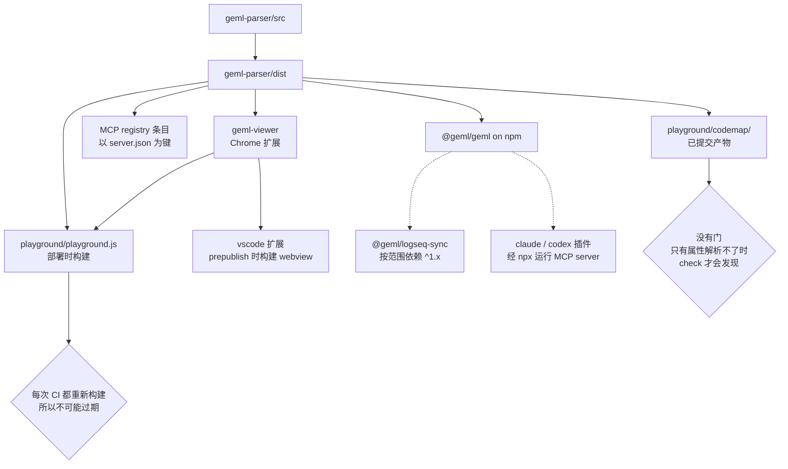

# 发布

*[English](PUBLISHING.md) | 中文*

这个仓库对外发八样东西，走六条版本轨道，其中**三样把解析器打包了一份拷贝进去**，
而不是运行时依赖它。所以解析器发版并不在 npm 接受的那一刻结束：每一个携带拷贝的
产物，在被重新构建并重新发布之前，交付给用户的仍是旧的那份。

这页存在，是因为这件事已经出过不止一次。一个已提交的 bundle 落后了五个版本，而它
正是 Show HN 指向的那个页面；一份已提交的代码图，是在 `geml check` 对它红了好几周
之后才被重新生成的。两次都是**偶然**发现的，不是被某道门拦住的。

# 谁携带了谁的拷贝

只有虚线那两条会自己照顾自己。每一条实线都是一份需要有人记得的拷贝。

# 发布之前

| 东西 | 用于 | 一次性设置 |
| --- | --- | --- |
| 仓库 secret `NPM_TOKEN` | 从 CI 发布 @geml/geml 与 @geml/dsh-plugin | npmjs.com -> Access Tokens -> Generate -> **Automation**；需要 @geml scope 的发布权限。仓库里不存别的东西。 |
| GitHub OIDC | MCP registry | 无 —— workflow 里的 `id-token: write` 就是全部，不需要任何 secret |
| `contents: write` | 把 viewer 的 zip 挂到它的 release 上 | 无 —— 默认的 GITHUB\_TOKEN |
| Chrome 应用商店开发者账号 | 让 viewer 真正到达用户 | 已完成（`opmhfphgoidpnipphfgkhhjhmnmaenie`）。workflow 只把 zip 挂到 GitHub release；上架商店仍是手工的。 |
| 仓库 secret `VSCE_PAT` | 从 CI 把扩展发到 VS Code Marketplace | 已完成 —— 发布者 `geml` 已存在且有列表页。dev.azure.com -> User settings -> Personal access tokens -> New：**Organization = All accessible organizations**（只授一个组织的 token 会 401），scope 选 **Marketplace -> Manage**。存之前先用 `npx @vscode/vsce login geml` 验一下。 |
| 仓库 secret `OVSX_PAT` | 从 CI 把同一个 .vsix 发到 Open VSX | 已完成 —— Eclipse Foundation 账号、已签 Publisher Agreement、namespace `geml`。open-vsx.org -> Profile -> Access Tokens。用 `npx ovsx verify-pat geml` 验（它从环境变量读 `OVSX_PAT`）。 |
| 不需要什么 | 把 `geml-check-action` 上架 GitHub Marketplace | 在 GitHub 界面里起一个 release 并勾上 Marketplace 复选框；`action.yml` 已带所需的 `branding`。**尚未上架。** |
| Obsidian 社区插件提交 | 让 `integrations/obsidian` 不靠手工拷贝就能到达 Obsidian 用户 | **尚未提交** —— 商店要求插件有自己的仓库和 release，所以这一个得先抽出去才能申请。 |
| logseq 镜像仓库的推送权限 | Logseq marketplace 插件 | geml-spec/logseq-plugin-sync-vault-with-geml |
| 不需要什么 | Gemini CLI 扩展画廊 | 已于 2026-09-03 完成 —— GitHub topic `gemini-cli-extension` 加仓库根目录的 `gemini-extension.json`。不需要账号也不需要申请：画廊爬虫自己找到并校验仓库。 |
| 一个 GitHub pull request | 把 Grok 插件列进 xai-org/plugin-marketplace | **未提交** —— fork，把 `integrations/grok-plugin` vendor 进 `external_plugins/geml`，加上已起草的条目，跑他们的 `scripts/validate-catalog.py`。不需要 xAI 账号。 |
| 一个 forum.moonshot.ai 账号 | Kimi Code 市场上架 | **未申请** —— `kimi.plugin.json` 已到位，但目录是 Moonshot 自己的，上架要在他们论坛上提请求。 |
| WorkBuddy certified-developer 资格 | 把技能上传到 SkillHub / ClawHub | **未申请** —— 上传路径卡在这上面。 |
| 一个托管的 MCP 端点 | ChatGPT 目录的 'With MCP' 路子 | 不存在，也不打算做。那条路还要域名验证；纯技能提交两样都不需要。 |

以及在这一切之前：**先把版本号落到 `main` 上**。每一条发布路径读的都是那棵树，不是
你的工作副本。

# 逐个产物

## `@geml/geml` —— 解析器、CLI、MCP server

- **落到** npmjs.com/package/@geml/geml，以及 Model Context Protocol registry。
- **版本住在六个文件里**：`geml-parser/package.json`、`server.json`（两处）、
  `package-lock.json`（两处），以及 `claude-plugin` 和 `codex-plugin` 的清单。
  最后两处由 mcp 测试守着 —— 它的断言原话是
  *"installed plugins would never see this release"*，第五、第六处就是这么被发现的。
- **怎么发。** Actions -> *Publish to npm* -> Run workflow；然后 Actions ->
  *Publish MCP Server*。两个都是 `workflow_dispatch`：发布是一个**刻意的动作**，
  绝不是 push 的副作用。
- **注意。** npm 对重复版本回 403，所以同一版本跑第二次会**大声失败**而不是覆盖，
  MCP registry 给的是同样的保护。npm 那个 job 用 `npm install` 而不是 `npm ci`，
  因为锁文件自身的版本字段历史上落后于 release；把锁文件一起升，两者就都成立。
  `npm test` 作为发布前的门先跑，所以红着的测试发不出去。
- **发后确认。** `npm view @geml/geml version` · npm 页面上的 provenance 徽章
  （workflow 带 `--provenance` 发布）· `npx -y @geml/geml@<版本> --version --json`
  会同时打印解析器版本与规范版本。

## `geml-viewer` —— Chrome 扩展

- **先落到** GitHub release 的资产，**再**上 Chrome 应用商店。
- **版本**在 `manifest.json`、`package.json` 与 `package-lock.json`（两处）。
  惯例：解析器每发一版，它升一个 patch —— 1.2.2 陪着解析器 1.8.8 就是这么来的。
- **怎么发。** 在 `integrations/geml-viewer` 里
  `npm version --no-git-tag-version <x.y.z>`，提交，落到 main，然后
  `git tag viewer-v<x.y.z> && git push origin viewer-v<x.y.z>`。
- **注意。** tag **必须**等于 manifest 里的版本 —— 不等的话 job 会拒绝，因为 zip
  的文件名取自 manifest，不一致会把 `geml-viewer-1.1.0.zip` 挂到 `viewer-v1.1.1`
  的 release 上。job 会先构建解析器，再跑 viewer 的覆盖率门：发布是那一次**绝不能
  带着红测试出门**的构建。
- **发后确认。** release 上有 `geml-viewer-<x.y.z>.zip` · 把 zip 以未打包扩展加载
  并打开一个 raw `.geml` · 商店列表页的版本是另一件事，单独确认。

## `vscode` —— 编辑器扩展

- **今天只落到一个市场，而且不是想当然的那个。**
  [**Open VSX**](https://open-vsx.org/extension/geml/geml) —— namespace `geml`、
  扩展名 `geml` —— 已上架，而且是**唯一**的渠道：Cursor、Windsurf、VSCodium 与
  Antigravity 都从那里解析扩展。**VS Code Marketplace 的账号还没申请**，所以纯 VS
  Code 用户根本没有可安装的列表页。设计上仍是「同一个 `.vsix` 发两边、两个账号两个
  token」，只是两个里现在只存在一个。
- **版本**在 `package.json` 与 `package-lock.json`（两处）。
- **怎么发。** **只打一次包**，然后把那**同一个文件**发两次 —— 两个 CLI 都接受
  `-i, --packagePath`（对着 `vsce` 与 `ovsx` 的 help 核实过）：

  `sh
  cd integrations/vscode
  npx --yes @vscode/vsce package                 # -> geml-<x.y.z>.vsix
  npx --yes @vscode/vsce publish -i geml-<x.y.z>.vsix
  npx --yes ovsx publish        -i geml-<x.y.z>.vsix -p <OPEN_VSX_TOKEN>
  `

  `vscode:prepublish` 会跑 `compile` 和 `build:webview`，而后者是
  `npm --prefix ../geml-viewer run build:vscode` —— 解析器就是在这一步被打包进去的。

- **注意。** **不要**不带包路径去跑 `vsce publish` 和 `ovsx publish`：那样每个都会
  自己构建一个 `.vsix`，于是同一个版本号下两个市场装的是**不同的字节**。打包前必须
  先构建解析器，否则 webview 构建会因为找不到 `dist/` 而失败。这里的 bundle
  **刻意不提交**（约 8 MB），所以没有陈旧问题，CI 也没有什么要守。两个登记处都会
  拒绝重复版本。
- **真正要紧的版本是包**里**那个。** 扩展通过 `build:webview` 把解析器打了进去，
  所以**重新打包才是解析器的修复抵达 Cursor 与 Antigravity 的唯一途径** —— 扩展版本
  号没动，不代表它的用户是新的。1.0.0 在 Open VSX 上挂着的那阵，里面的解析器已经落后
  好几个版本，而仓库早已是 1.9.1。
- **发后确认。** `curl -s https://open-vsx.org/api/geml/geml` 会给出版本号与下载量 ·
  装上并打开一个 `.geml` 文件。Open VSX 索引提交有延迟，所以发布成功后的几分钟内
  API 仍可能回答上一个版本。VS Code Marketplace 在账号建立之前没有什么可确认的。

## Claude 与 Codex 插件

- **落到**——哪也不落。**这个仓库自己就是 marketplace**：
  `.claude-plugin/marketplace.json` 与 `.agents/plugins/marketplace.json` 分别指向
  `./integrations/claude-plugin` 和 `./integrations/codex-plugin`。
- **怎么发。** 合进 `main`。**没有发布这一步**，也就意味着**没有发布这道门**：任何
  落到 main 的东西，对从 marketplace URL 安装的人来说立刻就是线上版本。
- **注意。** 插件清单里的版本对用户是参考信息，但在 CI 里是硬约束 —— mcp 测试断言它
  等于解析器的版本，所以哪怕插件自己一个文件没改，它也会随每次解析器发版而变动。
- **发后确认。** 取 raw 清单读它的版本 · 在一个全新会话里安装该插件，确认某个 skill
  能被解析到。

## `@geml/dsh-plugin`

- **落到** npmjs.com/package/@geml/dsh-plugin。
- **版本**在它自己的 `package.json`，走**自己的轨道** —— 与另外两个插件不同，它
  **不**跟随解析器。
- **怎么发。** 在 `integrations/dsh-plugin` 手工 `npm publish`。它发出去的是
  `cordis.patch.yml`、`skills/` 和 `LICENSE`。
- **注意。** 它 vendored 的 skill 文件与 claude、codex 两个插件是**逐字节相同**的
  拷贝 —— 那些文件一被刷新，它就需要一次发布，而另外两个因为跟着解析器的版本走，
  等于顺带就发了。
- **发后确认。** `npm view @geml/dsh-plugin version`。

## Agent 市场 —— 每个厂商一份清单

同样的两个技能、同样的 stdio MCP server，列进别人的目录里。这里没有任何东西需要构建
或发布：每个厂商只读一个文件，要做的活是**提交上架请求**。文件今天都在本仓库里；大部分
上架**没有**。

| 厂商 | 它读什么 | 上架怎么获批 | 状态 |
| --- | --- | --- | --- |
| Claude Code · Codex | `integrations/claude-plugin` 与 `integrations/codex-plugin`，经两份根市场清单 | 不需要 —— 本仓库**就是**那个市场 | 已生效；见上面的插件小节 |
| DSH | npm 上的 `integrations/dsh-plugin`；GUI 市场按 GitHub topic `dsh-plugin`、`agent-skills`、`claude-skills` 索引 | awesome-dsh-plugin 的 PR（已接受，#1310），加上那几个 topic | 已生效；见上面的 dsh 小节 |
| Gemini CLI | `gemini-extension.json` —— 爬虫要求它在仓库或 release 压缩包的**绝对根目录**，绝不能在子目录 | 完全不用申请：加上 `gemini-cli-extension` topic，画廊爬虫自己会找到并校验仓库 | 清单与 topic 已于 2026-09-03 到位；**尚未确认**出现在画廊里 |
| Grok (xAI) | `integrations/grok-plugin` —— `.mcp.json`、`.grok-plugin/plugin.json`、`skills/` | 向 xai-org/plugin-marketplace 提 PR，把该目录 vendor 进 `external_plugins/` 并在他们的 `.grok-plugin/marketplace.json` 加一条；他们的校验器在 CI 里跑，再由 code owner 审 | 文件已备好、条目已起草；**PR 未提交** —— 见 `integrations/grok-plugin/SUBMISSION.md` |
| Kimi Code | 仓库根的 `kimi.plugin.json` | 在 forum.moonshot.ai 上提上架请求；官方目录与精选目录都是 Moonshot 自己的 | 清单已到位；**上架未申请** |
| ChatGPT · OpenAI 目录 | `skills/` 树，打成 zip 上传 | 在 platform.openai.com/plugins 走门户提交，写法已记在 `integrations/codex-plugin/SUBMISSION.md` | **未提交**。只有「纯技能」这一条路走得通：'With MCP' 要一个**托管**端点加域名验证，而我们的是本地 stdio server |
| Qwen Code | 自己什么都不读 | 无事可做 —— 它直接装 Claude Code Marketplace 与 Gemini 画廊的扩展 | 今天即可触达，无需工作 |
| GLM（智谱） | 自己什么都不读 | 没找到第三方提交路径；它消费 MCP server，并跑兼容 Claude Code 的 harness | 今天即可通过 MCP server 触达 |
| WorkBuddy SkillHub · ClawHub | 一棵 `SKILL.md` 树 | 上传前先要拿到 certified-developer 资格 | **未申请** |
| MCP 聚合站（Glama · mcp.so · Smithery · PulseMCP） | `server.json`、npm 包、本仓库 | 基本自动：它们爬 GitHub 和官方注册表，所以要做的是**认领**条目而不是创建 | 未认领 |

- **注意。** 这里有两份清单携带了构建过程**没人读**的版本号 —— `server.json` 的静默
  滞后已经让我们付过一次代价。mcp 测试套件现在把 `gemini-extension.json` 和
  `grok-plugin/.grok-plugin/plugin.json` 钉到解析器版本上，并把三份厂商启动命令钉到
  Claude 插件那份上，这样没有哪份厂商清单能悄悄启动另一个 server。
- **注意。** `integrations/grok-plugin/skills/` 是打包技能文本的**第五份**逐字节拷贝。
  `skill-install.test.mjs` 现在守着它 —— 以及原先落在守卫之外的 dsh 那份。
- **有意做薄。** 两份根清单都不带技能文本。Gemini 没有技能这个概念：一个扩展带 MCP
  server，外加可选的 `GEMINI.md` 上下文文件 —— 那会是同一段散文的第六份拷贝。Kimi
  确实读 `skills/`，但它把那些路径相对一个本单仓没有的插件根去解析，而一条静默解析
  到空的路径，在市场条目里比一份只声明 server 的清单更糟。Grok 那份带技能，是因为
  它的路子是 vendor 整个目录 —— 那边唯一一个现存的第三方插件就是这么搭的。
- **确认。** 凡是自动索引的，确认的标准是**条目出现**，不是文件存在：去画廊或市场里
  搜 `geml`，并把看到的记下来。仓库里有一份清单，什么都不能证明。

## `@geml/logseq-sync` —— watcher

- **落到** npmjs.com/package/@geml/logseq-sync。这是真正干活的那一半：它监视 vault
  并执行同步。当前 2.0.9。
- **版本**在 `integrations/logseq/package.json` 与 `package-lock.json`。
- **怎么发。** 在 `integrations/logseq` 跑 `npm publish`。
- **注意。** 它按**范围**依赖解析器（`^1.x`），所以解析器发版不用它自己发版就能到达
  —— 这也是它成为**唯一不随每次解析器发版而移动**的产物的原因。
- **发后确认。** `npm view @geml/logseq-sync version`。

## Logseq 插件 —— 一个镜像 release 加一次性的市场 PR

两道独立的门，而**第二道还没过**。

- **第一道：release。** 插件以 zip 形式挂在镜像仓库
  `geml-spec/logseq-plugin-sync-vault-with-geml` 的 release 上。把
  `integrations/logseq/` **原样**镜像进去 —— 镜像仓库的根就是这个目录 —— 提交信息用
  `Sync Vault with GEML — mirror of geml-spec/geml integrations/logseq @ <sha>`，
  推送，**然后**才在那边打 `v<x.y.z>`。镜像仓库自己的 `publish.yml` 会构建插件并挂上
  marketplace zip。版本住在 `plugin/package.json`，其 `logseq.id` 为
  `logseq-plugin-sync-vault-with-geml`。最新 release：v2.0.9。
- **第二道：上架。** 要进 Logseq marketplace，必须向 `logseq/marketplace` 提一个把
  插件清单加进去的 PR。**我们的是 PR #893「Add plugin: Sync Vault with GEML」，
  自 2026-08-26 起仍处于 OPEN。** 在它合并之前，插件在 Logseq 里**根本搜不到**，
  用户只能手工安装 zip —— 镜像仓库发了多少个 release 都一样。
- **值得记住的不对称。** 那个 PR 是**一次性**的。一旦合并，市场条目指向镜像仓库的
  **最新** release，于是之后每个版本只走第一道门就能到达用户。而在它合并之前，第一
  道门是**必要但不充分**的。
- **注意。** **先镜像，后打 tag。** zip 的文件名取自被打 tag 的那次 checkout 里的
  `plugin/package.json`，所以对一个陈旧的镜像打 tag，会把一个**带着上一个版本号**的
  zip 挂到新 release 上 —— 而 release 不可变，那个 tag 就废了。镜像仓库携带的是
  **源码**而不只是 release，因为构建是在那边发生的。
- **发后确认。**
  `gh release view v<x.y.z> -R geml-spec/logseq-plugin-sync-vault-with-geml`
  里资产名为 `logseq-plugin-sync-vault-with-geml-v<x.y.z>.zip` · 镜像仓库的
  `plugin/package.json` 已是新版本 · 上架状态看
  `gh pr view 893 -R logseq/marketplace`。

## `geml-check-action` —— GitHub Action

- **落到** [GitHub Marketplace](https://github.com/marketplace?type=actions)，
  而今天落到**哪儿都没有**：**它没有上架**。用户已经可以按路径引用它
  （`geml-spec/geml/integrations/geml-check-action@main`），这也是这个缺口一直没被
  注意到的原因 —— 上架是可发现性，不是能力。
- **版本。** 它自己没有。没有 `package.json`；它就是 `action.yml` 加一份 README，
  跑的是已发布的 CLI。
- **怎么发。** 上架是勾一个复选框，不是跑一条命令：在 GitHub 界面里起草一个 release，
  勾上 **Publish this Action to the GitHub Marketplace**。`action.yml` 已经带着
  Marketplace 要求的 `branding`（图标 `check-circle`，颜色 purple），而上架要求
  action 的文件在**仓库根目录** —— 这一个不在。所以要上架，就得要么做一个子树镜像
  （Logseq 插件已经用的那个形状），要么接受路径引用是唯一入口。
- **注意。** Marketplace 会拒绝 `action.yml` 不在被打 tag 仓库根目录的 action，
  而它已发布的 tag 与这里其他 release 一样不可变。
- **发后确认。** 上架之前没什么可确认的。

## `obsidian` —— 未提交

- **落到** 将来的 Obsidian 社区插件商店；**今天落到哪儿都没有**，这是决定而不是疏漏。
  它的 README 说了，理由在 manifest 里：商店收录的插件来自**它们自己的**仓库、有自己
  的 release，而这一个住在单仓里。
- **版本**在 `manifest.json`（0.1.0）与 `package.json`。
- **怎么发。** 还不适用。提交是向 `obsidianmd/obsidian-releases` 提 PR，前提是插件有
  自己的仓库、自己的 release，以及一个从 viewer 里**抽出来**而不是拷过来的渲染核心。
- **注意。** 它有意只是**查看器**、不是编辑器，而且绝不能接管 `.md` 的处理 —— 这条约束
  才让它可以安心装在一个 vault 旁边，也是提交时会被拿来评判的那一条。
- **确认。** 手工：把 `main.js` 与 `manifest.json` 拷进 `.obsidian/plugins/geml/`
  然后启用它。

## 有意不发布的部分

`integrations/` 下有三个目录**故意**没有渠道。列在这里，是为了让下一个读者不要把它们
的缺席读成遗漏。

- **`langchain+llamaindex`** —— 一份参考集成，有 `pyproject.toml` 而没有 PyPI
  release，这是故意的：它存在的意义是被阅读和抄走，它的 README 也这么写。发布它就要
  让本仓库为一个 Python 包的兼容性矩阵负责。
- **`tree-sitter`** —— 一份设计简报，不是语法。等有人把它写出来，它的渠道是 npm 加上
  Neovim、Helix、Zed 三家共用的那套自注册。
- **`windows-icon`** —— 一个 `install.ps1`，人在自己机器上跑。没有商店，也没有什么
  可版本化的。

# 顺序

1. **升版本**：解析器的六个文件、`CHANGELOG.md` 条目、构建。
2. **重新生成携带拷贝的产物**，在发布任何东西之前：bundle 用
   `npm --prefix integrations/geml-viewer run build:playground`；
   `playground/codemap/` 在解析器或 viewer 源码**任何**改动、以及任何版本变动时，都
   要用 `geml codemap build` 重建。这一页原先写的是"在解析器增删了模块时"，那太窄了：
   这张图是**函数级**的，每个节点带 `src=…#L<a>-<b>` 行号区间和 `@geml/geml <版本>`
   锚。插入一个函数会移动它之后的每个区间，升版本会重盖每个锚。往 `geml.ts` 里加
   `slugify()` 就让整张图的尾部错位了 50 行，而没有任何东西说出来。改动尚未提交时要用
   `geml codemap refresh playground/codemap --force`：不加 `--force` 它会拿 commit
   比较，然后直接跳过。
3. **跑门**：`node test/all.mjs` · `npm run coverage:check` · 逐包的
   `npm ci --dry-run --ignore-scripts` · 对全库 `.geml` 跑 `geml check`。每个退出码
   都要**取自那次运行本身** —— `| tail` 管道报的是 tail 的退出码，不是命令的。
4. **落到 main**。每条发布路径读的都是那棵树。
5. **发解析器**：*Publish to npm*，然后 *Publish MCP Server*。
6. **升并发布携带它的产物**，各走各的轨道：viewer 打 tag、vscode 用**一个 `.vsix`**
   同时发 `vsce` 与 `ovsx`、dsh 用 `npm publish`。claude 与 codex 插件**已经上线了**
   —— 合并落地的那一刻就是发布。
7. **Logseq 只在它自己的代码变了时才发** —— 而且它是**两个**产物不是一个：watcher 用
   `npm publish`，插件用"先镜像后打 tag"。两者都按范围依赖解析器，新解析器不用它们
   发版就能到。

> **这里已发布的 GitHub release 是不可变的。** 绝不要为了修一个 release 而删除它 ——
> 删除会**永久烧掉它的 tag**。改为切一个**新** tag 并 `gh release create --latest`。
> tag 列表里已有的 `-1` 后缀（`viewer-v1.2.2-1`、`v2.0.7-1`）就是这件事发生过的样子。

# 陷阱，每一条都已经付过代价

| 陷阱 | 表现成什么样 | 什么能拦住 |
| --- | --- | --- |
| "解析器的版本有六个家" | "npm 上已是 1.9.0，而已安装的插件仍自报 1.8.8" | "mcp 测试逐个比对插件清单与 package.json" |
| "playground/playground.js 由 Deploy Pages 构建，不再提交" | "线上就是那次运行产出的东西——npm 安装或打包一挂，首页跟着发不出去" | "部署会明确失败；而且 `paths:` 现在包含 geml-parser/** 和 integrations/geml-viewer/**，改 parser 会真的触发重新部署，不会把页面留在旧 bundle 上" |
| "playground/codemap/ 是已提交产物，而且是函数级的" | "被插入的函数之后，每个 `#L<a>-<b>` 区间都指向错的行；而新函数根本没有节点" | "没有 —— `codemap verify` 在过期的图上照样通过：它只检查文档能解析、引用能解析，从不检查区间是否还对得上源码" |
| "viewer 的 tag 必须等于 manifest.json" | "一个 viewer-v1.2.4 的 release 挂着 geml-viewer-1.2.3.zip" | "release-viewer.yml 会拒绝这种不一致" |
| "Logseq 是镜像发布，不是就地打 tag" | "先打 tag 会用陈旧的 checkout 构建，zip 带上旧版本号" | "没有 —— 先镜像、核对镜像的 plugin/package.json、再打 tag" |
| "锁文件带着自身包的版本" | "npm ci 拒绝，CI 的锁文件 job 变红" | "逐包的 `npm ci --dry-run` job" |
| "\_index/refresh.json 可能不再符合当前格式" | "`geml codemap refresh` 拒绝一个不受信任或过期的配方 —— 版本闸是安全修复：v1 的步骤是结构化 argv，不经过 shell 直接 spawn" | "手写它；refresh.mjs 称它为没有工具会重写的配方。自动模式的 build 确实会重录一份，但它会索引测试夹具，并把运行它那台机器的绝对路径写进去" |
| "`codemap refresh` 按 commit 判断新旧" | "源码已改但未提交时它会以 *no source files changed since <sha>* 直接跳过 —— 而那正是开发者最需要它的时刻" | "没有 —— 改动尚未提交时一律加 `--force`" |
| "Open VSX 是唯一的列表页，而它装着解析器" | "Cursor 与 Antigravity 用户拿到的包里，解析器已落后好几个版本 —— 只因为扩展的版本号没动" | "没有 —— 只要他们该拿到的解析器变了就重新打包发布，不要只在扩展自己改动时才发" |
| "镜像 release 不等于上架" | "插件的 release 已经到 v2.0.9，在 Logseq 里却依然搜不到" | "没有 —— `logseq/marketplace` 的 PR #893 必须合并一次" |
| "两个插件没有发布门" | "一个坏掉的 skill 在合并的那一刻就上线了" | "没有 —— 对那两个来说 main 就是 release" |
