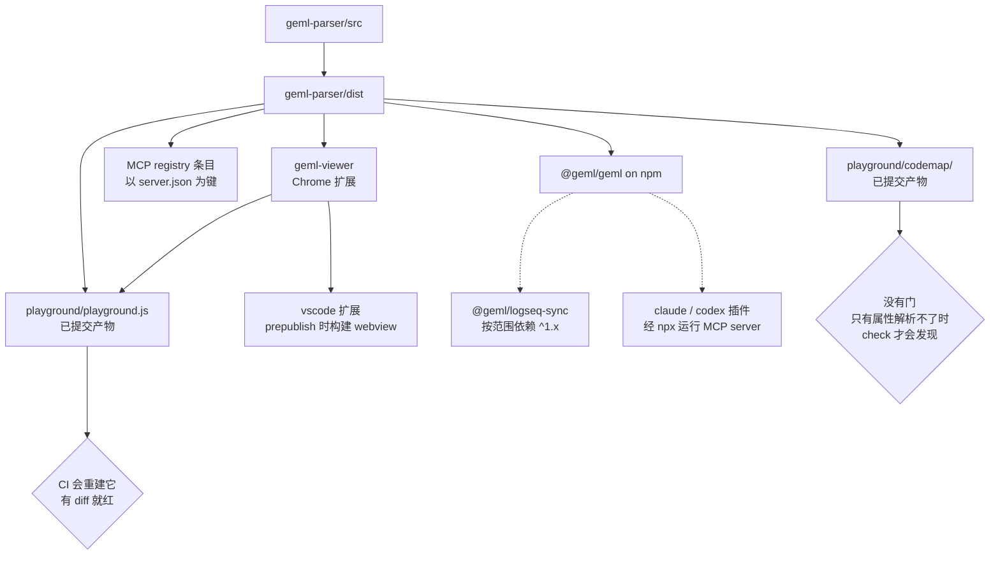

# 发布

*[English](PUBLISHING.md) | 中文*

这个仓库对外发八样东西，走六条版本轨道，其中**三样把解析器打包了一份拷贝进去**，
而不是运行时依赖它。所以解析器发版并不在 npm 接受的那一刻结束：每一个携带拷贝的
产物，在被重新构建并重新发布之前，交付给用户的仍是旧的那份。

这页存在，是因为这件事已经出过不止一次。一个已提交的 bundle 落后了五个版本，而它
正是 Show HN 指向的那个页面；一份已提交的代码图，是在 `geml check` 对它红了好几周
之后才被重新生成的。两次都是**偶然**发现的，不是被某道门拦住的。

# 谁携带了谁的拷贝

只有虚线那两条会自己照顾自己。每一条实线都是一份需要有人记得的拷贝。

# 发布之前

| 东西 | 用于 | 一次性设置 |
| --- | --- | --- |
| "仓库 secret `NPM_TOKEN`" | "发布 @geml/geml 与 @geml/dsh-plugin" | "npmjs.com -> Access Tokens -> Generate -> **Automation**；需要 @geml scope 的发布权限。仓库里不存别的东西。" |
| "GitHub OIDC" | "MCP registry" | "无 —— workflow 里的 `id-token: write` 就是全部，不需要任何 secret" |
| "`contents: write`" | "把 viewer 的 zip 挂到 release 上" | "无 —— 默认的 GITHUB\_TOKEN" |
| "Chrome 应用商店开发者账号" | "让 viewer 真正到达用户" | "workflow 只把 zip 挂到 GitHub release；上架商店是手工的" |
| "VS Code Marketplace 发布者账号 + PAT" | "`vsce publish`" | "手工，在本仓库之外" |
| "Open VSX token + namespace" | "Cursor / Windsurf / VSCodium / Antigravity —— 它们**不读** VS Code Marketplace" | "\*\*尚未建立。\*\*需要 Eclipse Foundation 账号；签署 Publisher Agreement；`ovsx create-namespace geml -p <token>`。本仓里既没有 `ovsx` 依赖也没有任何 token。" |
| "logseq 镜像仓库的推送权限" | "Logseq marketplace 插件" | "geml-spec/logseq-plugin-sync-vault-with-geml" |

以及在这一切之前：**先把版本号落到 `main` 上**。每一条发布路径读的都是那棵树，不是
你的工作副本。

# 逐个产物

## `@geml/geml` —— 解析器、CLI、MCP server

- **落到** npmjs.com/package/@geml/geml，以及 Model Context Protocol registry。
- **版本住在六个文件里**：`geml-parser/package.json`、`server.json`（两处）、
  `package-lock.json`（两处），以及 `claude-plugin` 和 `codex-plugin` 的清单。
  最后两处由 mcp 测试守着 —— 它的断言原话是
  *"installed plugins would never see this release"*，第五、第六处就是这么被发现的。
- **怎么发。** Actions -> *Publish to npm* -> Run workflow；然后 Actions ->
  *Publish MCP Server*。两个都是 `workflow_dispatch`：发布是一个**刻意的动作**，
  绝不是 push 的副作用。
- **注意。** npm 对重复版本回 403，所以同一版本跑第二次会**大声失败**而不是覆盖，
  MCP registry 给的是同样的保护。npm 那个 job 用 `npm install` 而不是 `npm ci`，
  因为锁文件自身的版本字段历史上落后于 release；把锁文件一起升，两者就都成立。
  `npm test` 作为发布前的门先跑，所以红着的测试发不出去。
- **发后确认。** `npm view @geml/geml version` · npm 页面上的 provenance 徽章
  （workflow 带 `--provenance` 发布）· `npx -y @geml/geml@<版本> --version --json`
  会同时打印解析器版本与规范版本。

## `geml-viewer` —— Chrome 扩展

- **先落到** GitHub release 的资产，**再**上 Chrome 应用商店。
- **版本**在 `manifest.json`、`package.json` 与 `package-lock.json`（两处）。
  惯例：解析器每发一版，它升一个 patch —— 1.2.2 陪着解析器 1.8.8 就是这么来的。
- **怎么发。** 在 `integrations/geml-viewer` 里
  `npm version --no-git-tag-version <x.y.z>`，提交，落到 main，然后
  `git tag viewer-v<x.y.z> && git push origin viewer-v<x.y.z>`。
- **注意。** tag **必须**等于 manifest 里的版本 —— 不等的话 job 会拒绝，因为 zip
  的文件名取自 manifest，不一致会把 `geml-viewer-1.1.0.zip` 挂到 `viewer-v1.1.1`
  的 release 上。job 会先构建解析器，再跑 viewer 的覆盖率门：发布是那一次**绝不能
  带着红测试出门**的构建。
- **发后确认。** release 上有 `geml-viewer-<x.y.z>.zip` · 把 zip 以未打包扩展加载
  并打开一个 raw `.geml` · 商店列表页的版本是另一件事，单独确认。

## `vscode` —— 编辑器扩展

- **一个包，落到两个市场。** VS Code Marketplace 服务 VS Code；**Open VSX**
  （open-vsx.org）服务用不了它的那些编辑器 —— Cursor、Windsurf、VSCodium 与
  Antigravity 都从那里解析扩展。同一个 `.vsix`、同一个 publisher 名，两个账号、
  两个 token。
- **版本**在 `package.json` 与 `package-lock.json`（两处）。
- **怎么发。** **只打一次包**，然后把那**同一个文件**发两次 —— 两个 CLI 都接受
  `-i, --packagePath`（对着 `vsce` 与 `ovsx` 的 help 核实过）：

  `sh
  cd integrations/vscode
  npx --yes @vscode/vsce package                 # -> geml-<x.y.z>.vsix
  npx --yes @vscode/vsce publish -i geml-<x.y.z>.vsix
  npx --yes ovsx publish        -i geml-<x.y.z>.vsix -p <OPEN_VSX_TOKEN>
  `

  `vscode:prepublish` 会跑 `compile` 和 `build:webview`，而后者是
  `npm --prefix ../geml-viewer run build:vscode` —— 解析器就是在这一步被打包进去的。

- **注意。** **不要**不带包路径去跑 `vsce publish` 和 `ovsx publish`：那样每个都会
  自己构建一个 `.vsix`，于是同一个版本号下两个市场装的是**不同的字节**。打包前必须
  先构建解析器，否则 webview 构建会因为找不到 `dist/` 而失败。这里的 bundle
  **刻意不提交**（约 8 MB），所以没有陈旧问题，CI 也没有什么要守。两个登记处都会
  拒绝重复版本。
- **Open VSX 在本仓尚未建立。** 没有 `ovsx` 依赖、没有 token、没有 namespace ——
  全仓搜 `ovsx`/`open-vsx` 零命中。一次性成本是一个 Eclipse Foundation 账号加一份
  签署过的 Publisher Agreement；在付掉它之前，每个 Cursor 与 Antigravity 用户用的
  都是自己旁加载的那个版本。
- **发后确认。** VS Code Marketplace 上的版本 · Open VSX 列表页的版本（单独确认）·
  装上并打开一个 `.geml` 文件。

## Claude 与 Codex 插件

- **落到**——哪也不落。**这个仓库自己就是 marketplace**：
  `.claude-plugin/marketplace.json` 与 `.agents/plugins/marketplace.json` 分别指向
  `./integrations/claude-plugin` 和 `./integrations/codex-plugin`。
- **怎么发。** 合进 `main`。**没有发布这一步**，也就意味着**没有发布这道门**：任何
  落到 main 的东西，对从 marketplace URL 安装的人来说立刻就是线上版本。
- **注意。** 插件清单里的版本对用户是参考信息，但在 CI 里是硬约束 —— mcp 测试断言它
  等于解析器的版本，所以哪怕插件自己一个文件没改，它也会随每次解析器发版而变动。
- **发后确认。** 取 raw 清单读它的版本 · 在一个全新会话里安装该插件，确认某个 skill
  能被解析到。

## `@geml/dsh-plugin`

- **落到** npmjs.com/package/@geml/dsh-plugin。
- **版本**在它自己的 `package.json`，走**自己的轨道** —— 与另外两个插件不同，它
  **不**跟随解析器。
- **怎么发。** 在 `integrations/dsh-plugin` 手工 `npm publish`。它发出去的是
  `cordis.patch.yml`、`skills/` 和 `LICENSE`。
- **注意。** 它 vendored 的 skill 文件与 claude、codex 两个插件是**逐字节相同**的
  拷贝 —— 那些文件一被刷新，它就需要一次发布，而另外两个因为跟着解析器的版本走，
  等于顺带就发了。
- **发后确认。** `npm view @geml/dsh-plugin version`。

## `@geml/logseq-sync` —— watcher

- **落到** npmjs.com/package/@geml/logseq-sync。这是真正干活的那一半：它监视 vault
  并执行同步。当前 2.0.9。
- **版本**在 `integrations/logseq/package.json` 与 `package-lock.json`。
- **怎么发。** 在 `integrations/logseq` 跑 `npm publish`。
- **注意。** 它按**范围**依赖解析器（`^1.x`），所以解析器发版不用它自己发版就能到达
  —— 这也是它成为**唯一不随每次解析器发版而移动**的产物的原因。
- **发后确认。** `npm view @geml/logseq-sync version`。

## Logseq 插件 —— 一个镜像 release 加一次性的市场 PR

两道独立的门，而**第二道还没过**。

- **第一道：release。** 插件以 zip 形式挂在镜像仓库
  `geml-spec/logseq-plugin-sync-vault-with-geml` 的 release 上。把
  `integrations/logseq/` **原样**镜像进去 —— 镜像仓库的根就是这个目录 —— 提交信息用
  `Sync Vault with GEML — mirror of geml-spec/geml integrations/logseq @ <sha>`，
  推送，**然后**才在那边打 `v<x.y.z>`。镜像仓库自己的 `publish.yml` 会构建插件并挂上
  marketplace zip。版本住在 `plugin/package.json`，其 `logseq.id` 为
  `logseq-plugin-sync-vault-with-geml`。最新 release：v2.0.9。
- **第二道：上架。** 要进 Logseq marketplace，必须向 `logseq/marketplace` 提一个把
  插件清单加进去的 PR。**我们的是 PR #893「Add plugin: Sync Vault with GEML」，
  自 2026-08-26 起仍处于 OPEN。** 在它合并之前，插件在 Logseq 里**根本搜不到**，
  用户只能手工安装 zip —— 镜像仓库发了多少个 release 都一样。
- **值得记住的不对称。** 那个 PR 是**一次性**的。一旦合并，市场条目指向镜像仓库的
  **最新** release，于是之后每个版本只走第一道门就能到达用户。而在它合并之前，第一
  道门是**必要但不充分**的。
- **注意。** **先镜像，后打 tag。** zip 的文件名取自被打 tag 的那次 checkout 里的
  `plugin/package.json`，所以对一个陈旧的镜像打 tag，会把一个**带着上一个版本号**的
  zip 挂到新 release 上 —— 而 release 不可变，那个 tag 就废了。镜像仓库携带的是
  **源码**而不只是 release，因为构建是在那边发生的。
- **发后确认。**
  `gh release view v<x.y.z> -R geml-spec/logseq-plugin-sync-vault-with-geml`
  里资产名为 `logseq-plugin-sync-vault-with-geml-v<x.y.z>.zip` · 镜像仓库的
  `plugin/package.json` 已是新版本 · 上架状态看
  `gh pr view 893 -R logseq/marketplace`。

# 顺序

1. **升版本**：解析器的六个文件、`CHANGELOG.md` 条目、构建。
2. **重新生成携带拷贝的产物**，在发布任何东西之前：bundle 用
   `npm --prefix integrations/geml-viewer run build:playground`；
   `playground/codemap/` 在解析器或 viewer 源码**任何**改动、以及任何版本变动时，都
   要用 `geml codemap build` 重建。这一页原先写的是"在解析器增删了模块时"，那太窄了：
   这张图是**函数级**的，每个节点带 `src=…#L<a>-<b>` 行号区间和 `@geml/geml <版本>`
   锚。插入一个函数会移动它之后的每个区间，升版本会重盖每个锚。往 `geml.ts` 里加
   `slugify()` 就让整张图的尾部错位了 50 行，而没有任何东西说出来。改动尚未提交时要用
   `geml codemap refresh playground/codemap --force`：不加 `--force` 它会拿 commit
   比较，然后直接跳过。
3. **跑门**：`node test/all.mjs` · `npm run coverage:check` · 逐包的
   `npm ci --dry-run --ignore-scripts` · 对全库 `.geml` 跑 `geml check`。每个退出码
   都要**取自那次运行本身** —— `| tail` 管道报的是 tail 的退出码，不是命令的。
4. **落到 main**。每条发布路径读的都是那棵树。
5. **发解析器**：*Publish to npm*，然后 *Publish MCP Server*。
6. **升并发布携带它的产物**，各走各的轨道：viewer 打 tag、vscode 用**一个 `.vsix`**
   同时发 `vsce` 与 `ovsx`、dsh 用 `npm publish`。claude 与 codex 插件**已经上线了**
   —— 合并落地的那一刻就是发布。
7. **Logseq 只在它自己的代码变了时才发** —— 而且它是**两个**产物不是一个：watcher 用
   `npm publish`，插件用"先镜像后打 tag"。两者都按范围依赖解析器，新解析器不用它们
   发版就能到。

> **这里已发布的 GitHub release 是不可变的。** 绝不要为了修一个 release 而删除它 ——
> 删除会**永久烧掉它的 tag**。改为切一个**新** tag 并 `gh release create --latest`。
> tag 列表里已有的 `-1` 后缀（`viewer-v1.2.2-1`、`v2.0.7-1`）就是这件事发生过的样子。

# 陷阱，每一条都已经付过代价

| 陷阱 | 表现成什么样 | 什么能拦住 |
| --- | --- | --- |
| "解析器的版本有六个家" | "npm 上已是 1.9.0，而已安装的插件仍自报 1.8.8" | "mcp 测试逐个比对插件清单与 package.json" |
| "playground/playground.js 是已提交产物" | "浏览器页面用旧文法解析，而别处都是新的" | "CI 重建它，有 git diff 就红" |
| "playground/codemap/ 是已提交产物，而且是函数级的" | "被插入的函数之后，每个 `#L<a>-<b>` 区间都指向错的行；而新函数根本没有节点" | "没有 —— `codemap verify` 在过期的图上照样通过：它只检查文档能解析、引用能解析，从不检查区间是否还对得上源码" |
| "viewer 的 tag 必须等于 manifest.json" | "一个 viewer-v1.2.4 的 release 挂着 geml-viewer-1.2.3.zip" | "release-viewer.yml 会拒绝这种不一致" |
| "Logseq 是镜像发布，不是就地打 tag" | "先打 tag 会用陈旧的 checkout 构建，zip 带上旧版本号" | "没有 —— 先镜像、核对镜像的 plugin/package.json、再打 tag" |
| "锁文件带着自身包的版本" | "npm ci 拒绝，CI 的锁文件 job 变红" | "逐包的 `npm ci --dry-run` job" |
| "\_index/refresh.json 可能不再符合当前格式" | "`geml codemap refresh` 拒绝一个不受信任或过期的配方 —— 版本闸是安全修复：v1 的步骤是结构化 argv，不经过 shell 直接 spawn" | "手写它；refresh.mjs 称它为没有工具会重写的配方。自动模式的 build 确实会重录一份，但它会索引测试夹具，并把运行它那台机器的绝对路径写进去" |
| "`codemap refresh` 按 commit 判断新旧" | "源码已改但未提交时它会以 *no source files changed since <sha>* 直接跳过 —— 而那正是开发者最需要它的时刻" | "没有 —— 改动尚未提交时一律加 `--force`" |
| "一个 `.vsix` 有两个市场" | "VS Code 那边已是新版，而 Cursor 与 Antigravity 用户还停在旧版 —— 他们读的是 Open VSX，永远看不到" | "没有 —— 用 `-i` 把**同一个**打好的包发到两边" |
| "镜像 release 不等于上架" | "插件的 release 已经到 v2.0.9，在 Logseq 里却依然搜不到" | "没有 —— `logseq/marketplace` 的 PR #893 必须合并一次" |
| "两个插件没有发布门" | "一个坏掉的 skill 在合并的那一刻就上线了" | "没有 —— 对那两个来说 main 就是 release" |
