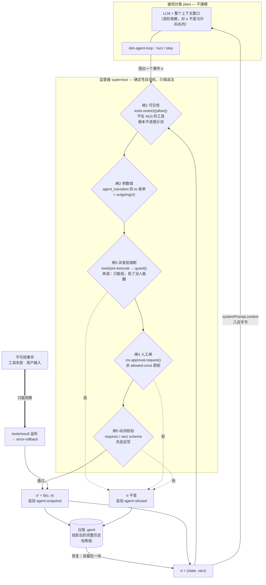
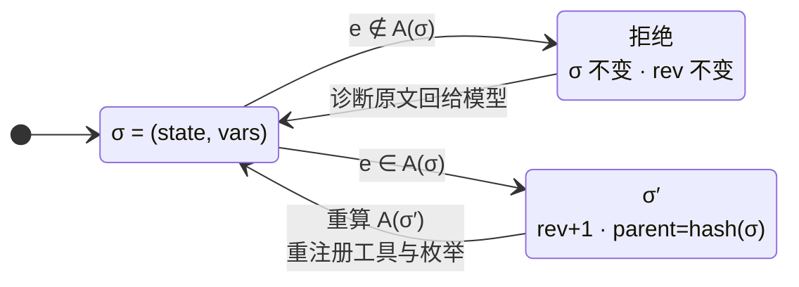

# GEML Agent Runtime（`geml-agent-runtime`）— 设计文档

日期：2026-09-14 · 状态：**已批准（2026-09-14），实施中** · 基线：`main` @ `41a83eb`
前置阅读：`integrations/geml-agent-runtime/README.md`（这个 bundle 的形态；改造前它叫 `dsh-plugin`）、`spec/GEML-spec.md` §3.2 与 §8.6、`spec/profiles/README.md`、`spec/profiles/geml-history/`（哈希链先例）、`spec/proposals/0005-data-block.md`（盲追加约定）。
宿主：DeepSeek Harness `0.1.5-rc.1`（npm `@deepseek-ai/dsh*`）与 pi agent `0.85.1`（npm `@earendil-works/pi-coding-agent`、`@earendil-works/pi-agent-core`，MIT）。本文引用的每个接口名都取自这两家发布包的 `.d.ts` 与随包文档，不是从博客转述的。

---

## 0. 一句话

用一份 GEML 文档描述 agent 的状态图——状态、跃迁、变量、每个状态下可见的工具——挂在一个 harness 上做监督器：模型在任一时刻只看得见当前状态允许的工具与跃迁；每次状态变化先校验后落地，成为一条带哈希链的 GEML 快照记录；会话恢复时只读最后一条快照，不重放推理。

监督器本身与宿主无关（`src/core/`，纯函数 + 一个 `Supervisor` 对象），宿主适配器只做接线：DeepSeek Harness 一个 Cordis 插件，pi agent 一个扩展。门控逻辑只有一份，不许各自抄。

## 1. 出发点

### 1.1 用户提出的五个问题 → 本设计的落点

| # | 问题 | 传统 harness | 本设计（GEML 状态图 + 宿主 harness） | 落在宿主的哪个缝（DSH · pi agent） |
|---|---|---|---|---|
| 1 | 状态回滚 | 提示词求模型回滚，底层脏读 | 补丁与跃迁先经 JSON Schema 与守卫校验，失败**不落地**；`agent_rollback` 与 `rollback-on-error` 把指针拨回上一个有效修订；台账只追加不改写 | 动词体内先校验；`tools/result` · `tool_result` 观察 |
| 2 | 沙箱隔离 | 容器硬抗，逻辑越权难防 | 载入时静态检查状态图；运行时按当前状态用**单调守卫**在派发前熔断越权调用，命令根本到不了 shell | `ToolRuntime.guard()` · `tool_call → {block}` |
| 3 | 工具冲突 | 全局函数池概率盲猜 | `restrict({allow})` 按状态收窄模型**可见**的工具集；`agent_transition` 的 `to` 枚举只含当前合法目标 | `ToolRuntime.restrict()` + 按状态重注册 · `setActiveTools()`（枚举域的差别见 §6.5） |
| 4 | 断点续跑 | 重灌全量 token | 快照 = `{rev, state, vars, hash}` 几百字节；进入 `pause`/`final` 状态结束回合（`exec.concludeTurn()` · `AgentToolResult.terminate`）；恢复只读台账最后一块——恢复的是**合法动作集**，不是 agent 行为（§1.4） | `agent/session-start {source:'resume'}` + `systemPrompt.context()` · `session_start` + `before_agent_start` |
| 5 | 事件持久化 | 非结构化日志 | 每次推进追加一个 `agent-snapshot` 块到 `.geml` 台账（GEP-0005 盲追加），带 `rev/cause/parent/hash`；`geml-agent verify` 确定性重算整条链 | 自有 GEML 台账文件；pi agent 另把每块镜像成会话自定义条目（§1.3） |

### 1.2 为什么落在这两个 harness 上是自然的

**DSH**（调研 rc.1 类型声明得到的事实）：

- Cordis 微内核：插件是 `apply(ctx, config)` + `inject` 数组；一切注册（`ctx.on`、`ctx.tools.register`、`ctx.systemPrompt.section`）都返回 disposer，挂在调用者的 fiber 上；通过 `agent.ctx` 注册的东西随 agent 销毁自动回收。「级联销毁与环境净化」是内核语义，插件不用自己写。
- 工具管线：`tools/pre-execute`（waterfall）→ 单调 `guard` → 审批 → `tools/execute` → `tools/post-execute` → `tools/result`。guard **只能拒绝不能放行**，后注册的监听器无法把拒绝翻回允许——这正是「静态守卫」需要的方向性。
- `restrict()`/`register()` 按调用上下文分层：经 `agent.ctx` 调用只影响该 agent；scoped 注册遮蔽全局；restriction 过滤的是继承面，**不过滤 scope 自己的注册**——我们自己的 `agent_*` 工具永不被自己的限制误伤。
- 会话是事件溯源、append-only，原则「模型可见 ⟺ 已记录」。

**pi agent**（0.85.1 的 `.d.ts` 与随包 `docs/`）：

- 扩展是 `export default function (pi: ExtensionAPI)`，`pi.on(event, handler)` + `registerTool / registerCommand / registerProvider`。事件加注册表，不是 IoC 微内核：`on` 与 `registerTool` **都不返回 disposer**，也没有 per-agent 作用域——扩展是**会话级**的，一个会话一份 σ。
- `setActiveTools(names)` 就是门①，而且 `activeToolNames` 是 `LaneConfiguration` 的一部分，**跟着会话持久化**；DSH 的 `restrict` 只活在进程里。
- `tool_call` 处理器返回 `{ block: true, reason, terminate }` 就是门③，按加载序链式调用。
- `ctx.ui.confirm / select / input` 内建，就是门④，不需要另挂审批服务；但 `ctx.hasUI` 在 `-p` 与 json 模式下为假（随包文档原话：扩展照跑，但不能提问）。
- `appendEntry(customType, data)` 把扩展状态写进会话，文档明写**不参与 LLM 上下文**；会话条目是一棵树（`parentId`），有 `fork` / `getBranch()`。这两条直接决定了 §1.3 与 §5.4 在 pi agent 上长什么样。
- 可测性对等或更好：`createAgentSession({ customTools, sessionManager: SessionManager.inMemory() })` 加 `DefaultResourceLoader({ extensions: [factory] })`，不必像 DSH 那样先去探 testkit 挂不挂审批服务。
- 它自己的 `skills/` 约定就是「递归找 SKILL.md 文件夹」，与本 bundle 已有的 `skills/` 布局一字不差——同一个包既能送监督器扩展，也能送那两个 GEML 技能。

### 1.3 宿主差异：自定义状态能不能进会话日志

记录源在两个宿主上都是 GEML 台账（§5.4）。差别在**恢复时读谁**，而这是宿主的持久化层定的，不是选型偏好。

**DSH：不能写。** 这是硬约束，核对 rc.1 与 rc.2（`next` 标签）的实现得到：

- `@deepseek-ai/dsh-session-persistence` 读日志时，遇到不在 `KNOWN_SESSION_EVENT_TYPES`（仓内生成的封闭清单）里且未标 `ignorable: true` 的事件类型，**直接拒绝重建会话**（原话："refusing to interpret the log — it was likely written by a newer harness"）。
- `Session.append()` 构造的信封是 `{type, seq, time, data, surfaceOp?, sourceEventSeqs?}`——**没有任何入口能设置 `ignorable`**。rc.1、rc.2 相同。

写了自定义事件，会话一持久化就再也恢复不了。所以在 DSH 上状态**不进会话日志**，只进自有的 GEML 台账文件，恢复也只读它。这不违反「模型可见 ⟺ 已记录」：模型看到的只有工具结果与运行时上下文快照，两者都由 DSH 自己记录。会话日志管对话，GEML 台账管状态——和 `.geml`/`.gemlhistory` 分热路径与冷路径是同一个道理。等 DSH 暴露 ignorable 写入口，再把快照镜像进会话日志（供 Web 时间线用），台账仍是记录源。

**pi agent：能写，而且必须写。** `appendEntry(customType, data)` 正是给这件事用的，文档明写自定义条目不参与 LLM 上下文。必须写的理由不是省事，是**正确性**：pi agent 的会话是一棵树（条目带 `parentId`，`ctx.fork(entryId)` 从任一条目分叉，`session_start` 带 `reason: "fork"`），而一个平铺追加的文件表达不了树。恢复因此读**当前分支**上的条目（`ctx.sessionManager.getBranch()`）；台账文件同时照写，作审计产物与跨宿主的交换格式。fork 出的会话有自己的 id、自己的台账文件，内容由继承来的条目重放生成：两条链共享分叉点之前的前缀，各自往后长。

「分支上每条轨迹各带一份 σ」在 §1.4 的框架里是顺理成章的——监督器的状态是历史在它自己字母表上的投影，历史分叉，投影就分叉——但它不是本设计最初建模的对象。这是 pi agent 这条线上独有的、可以做实验的部分。

### 1.4 这不是 agent 的模型，是监督自动机

一个 LLM agent 不是有限状态机：它下一步做什么取决于整个上下文窗口，对本设计定义的 `state`/`vars` 而言它不是一阶马尔科夫的，甚至不是任何有限阶的。`state + vars` 不是 agent 行为的充分统计量，本设计也不假装它是。

状态图建模的对象是**监督器**（Ramadge–Wonham 意义上的 supervisory control）：被控对象是 LLM 加它的全部历史，任意、不建模；监督器是一个确定性自动机，与之并行运行，只限制此刻**允许发生的事件集**（可见工具、合法跃迁、可写变量）。监督器的状态是历史在**它自己定义的事件字母表**上的投影——跃迁、补丁、回滚——台账就是这条投影后的完整历史，自动机把它精确压缩成 `rev/state/vars`。它给出的保证是**安全性质**（哪些动作序列不可能发生），不是收敛，不是行为预测。

#### 1.4.1 事件字母表与允许集

**字母表 Σ** 只有六类事件，模型吐的 token、它的推理、用户说的话都**不在里面**，监督器看不见也不管：

| 事件 | 可控？ | 谁触发 |
|---|---|---|
| `agent_transition(to)` | 可控 | 模型 |
| `agent_set(patch)` | 可控 | 模型 |
| `agent_rollback(target)` | 可控 | 模型 |
| 外部工具调用（按名字） | 可控 | 模型 |
| 外部工具**失败** | **不可控** | 环境 |
| 用户输入 | **不可控** | 人 |

可控即"监督器能让它不发生"；不可控只能观察并事后响应——这正是 `rollback-on-error` 是**响应**而不是**阻止**的形式依据。

**允许集** `A(σ)`，σ = (`state`, `vars`)，一行说完：

> `A(σ)` = 当前状态声明的工具 ∩ 已注册工具 ⋃ 守卫在当前 `vars` 下成立的那些出边 ⋃ 当前状态允许写的变量

`vars` 必须算进 σ，因为 `requires` 让允许集依赖变量取值：光知道在哪个节点，算不出允许集。取值空间无限而允许集只经守卫谓词依赖它，所以等价类有限，自动机是有限的。

#### 1.4.2 机制（与任何具体状态图无关）



五道闸每一道都只把事件从"可能发生"里拿掉，没有一道能把一个事件**加进**允许集——这是"监督器只做减法"在实现上的样子。闸 3 之所以用 DSH 的单调 `guard()` 而不是 `tools/pre-execute` 的返回值，正因为前者结构上无法放行：后注册的监听器翻不回一个已被拒的调用。

闭环靠**投影**闭上：完整历史几万 token，投影到 Σ 上只剩一串 `enter/set/transition/rollback`，就是台账；自动机把它压成几百字节的 σ 再喂回模型。恢复走同一条边——读台账最后一块，不重放推理。

#### 1.4.3 监督器自己的一步



两条出边穷尽了一个事件的全部去向，这是 §5.2「拒绝不产生快照」和 §5.4 哈希链的共同来源：`rev` 只在 `Advanced` 一侧增长，所以链上每一环都对应一次**真实发生**的状态变化，被拒的尝试记在 `agent-refused` 里而不占修订号。

由此三条措辞必须准确：

- **恢复**恢复的是监督器状态：恢复后**合法动作集**与挂起前完全相同。agent 的行为取决于 DSH 重放的对话（可能经过压缩），可以不同。任何「行为一致」的说法都不成立，文档不写。
- **`vars` 是模型选择写下的历史摘要**，不是历史。业务上依赖历史的规则（「别付两次」）必须由状态图作者显式投影进变量——`paid` 标志、幂等键——这是自动机建模的经典手法，运行时不替他做。
- **守卫只看 `vars`**：路径对守卫不可见，除非被投影进变量。台账保有完整路径，将来可加历史守卫（对 `cause`/`state` 序列的约束，即高阶监督器）；本期不做，字母表与台账已为它留好数据。

## 2. 目标与边界

**做**：

- profile `geml-agent/v1`：五个块类型与属性（§4），注册进 `geml-parser/src/profiles.ts`，文档在 `spec/profiles/geml-agent/`（中英）。
- 纯函数核心库（不依赖任何宿主，不碰 fs/process）：解析与静态检查状态图；快照、修订、哈希链；补丁与跃迁的校验和应用；台账的渲染、读取与校验。
- 监督器对象（`core/supervisor.ts`，同样与宿主无关）：持有 σ，对外只回答「此刻允许什么」——允许的全局工具集、门③的判定、三个动词的参数 schema 与执行、错误回滚、提示词两段文本。三个动词的每条拒绝路径都在这里，宿主适配器只翻译不判断。
- 两个宿主适配器，同一个 npm 包：
  - **DSH**：一个 Cordis 插件 bundle。把现有的 `integrations/dsh-plugin` **原地改造**为 `integrations/geml-agent-runtime/`（`git mv`），npm 包从 `@geml/dsh-plugin` 改名为 `@geml/agent-runtime`。原有两行（geml MCP server、`skills/` 下的两个技能）保留不动，新增运行时一行；bundle 从「纯配置」变成「配置 + 代码」。三个 scoped 工具、按状态的 restrict + guard、提示词注入、暂停与恢复、错误回滚、台账落盘。
  - **pi agent**：一个扩展。`package.json` 加 `pi.extensions` 指向它，`skills/` 直接落在它的技能约定上（递归找 `SKILL.md`），所以同一个包既送监督器也送那两个 GEML 技能。接线与逐门差异见 §6.5。
- CLI `geml-agent`：`check`、`snapshot`、`verify`、`export`、`init`、`run`（薄启动器，§7）。
- 一个可跑的示例状态图（退款审批流）与 README（中英）。

**不做（本期）**：

- 不改 GEML 规范、不写 GEP：五个类型的体要么 raw（JSON）要么 flow（prose），GEML 不需要读体内任何新语法（`spec/proposals/README.md` 的判据：「GEML 要不要读块体？」——不要）。
- 不做表达式守卫语言：守卫就是 JSON Schema，且是 DSH 工具注册表自己用的那个子集。
- 不做并行/复合状态、定时器跃迁、事件驱动的自动跃迁：跃迁只由模型调用 `agent_transition`，或由 `rollback-on-error` 触发回滚。
- 不做 Web UI 面板。
- 不接管 agent loop：循环仍是宿主自己的（DSH `dsh-agent-loop`、pi agent `AgentHarness`），适配器只在缝上挂钩。

### 2.1 已知边界（写在前面，README 照抄）

这是一个状态机加一本台账，挂在 harness 上。它约束的是**建模过的那部分世界**，以下三条不是它能做的，文档不得暗示能做：

- **回滚只及声明变量与控制状态。** 台账能把 `approved` 拨回 `false`，拨不回已经打出去的退款。外部副作用要靠状态图作者自己写补偿跃迁（compensation），运行时不替他发明。
- **隔离是按状态的能力门控，不替代 sandbox。** 不该出现的工具不出现、出现了也在派发前被拒；但一个被放行的 `bash` 里写什么，它管不了，那仍是 DSH sandbox 的事。两层互补。
- **恢复便宜的是状态，不是对话。** 几百字节恢复的是「我在哪、能做什么」；对话历史仍由宿主的会话日志按它自己的规则重放。
- **门的强度随宿主变，宣称以最弱的那个为准。** 五道门不是每个宿主都能一样强：pi agent 的 `registerTool` 不返回 disposer，门②的 `to` 枚举只能收窄到「这份状态图里的状态」，「σ 当下的合法目标」退给门⑤拒绝、由每回合的提示词说明（§6.5 有逐门对照）。README 写门的强度时按最弱的宿主写。

适用面因此是**可枚举的流程**——审批、KYC、工单分级、运维 runbook；开放式任务（写代码、做研究）枚举不出状态，硬套只会把 LLM agent 的灵活性杀掉。这个项目真正新的部分是工程学上的：状态图与台账都是 GEML 文档，可寻址（`geml get '#pay'`）、可验证（`geml check`）、可版本（`.gemlhistory`）、台账带哈希链且能盲追加。它让「谁在什么时候允许了什么」有一个可 diff 的载体，不是把 agent 的收敛问题解决了。

## 3. 总体架构

```
   编写                     运行（DSH 进程内，每个 agent 一份）                        审计
refund.geml ──▶ loadStatechart ──▶ agent/session-start ─┬─ agent.ctx.tools.register   agent_transition
(geml-agent/v1)   (E/W 诊断)        startup | resume     │                             agent_set
                                                         │                             agent_rollback
                                                         ├─ agent.ctx.tools.restrict   {allow: 当前状态 tools}
                                                         ├─ agent.ctx.tools.guard      越权 → deny reason
                                                         ├─ agent.ctx.systemPrompt.section   当前状态的指令原文
                                                         ├─ agent.ctx.systemPrompt.context   快照（几百字节）
                                                         └─ agent.ctx.on('tools/result')     rollback-on-error
                                                                    │
                                                                    ▼  每次变更盲追加一块
                                              <ledgerDir>/<sessionId>.geml ◀── geml check / geml-agent verify
                                                                               geml get ledger.geml '#rev-7'
```

四层，各有一个清楚的输入输出：

1. **词汇层**（`spec/profiles/geml-agent/`）：文档怎么写、`geml check` 放行哪些名字。
2. **核心库**（`src/core/*`）：文本进、值出。`Statechart`、`Snapshot`、`Ledger` 三个模型和它们的纯函数。CLI 与插件共用一份。
3. **监督器**（`src/core/supervisor.ts`）：把核心库的纯函数收成一个持有 σ 的对象，只回答「此刻允许什么」；它不知道自己挂在谁身上。
4. **宿主适配器**（`src/hosts/dsh/`、`src/hosts/pi/`）：只做翻译。唯一碰文件系统的模块是 `src/host-fs.ts`。
5. **CLI**（`src/cli.ts`）：离线动词 + `run` 启动器。

五道门（§1.4.2）落在两个宿主上的接线，逐门一行：

| 门 | 监督器给出 | DSH | pi agent |
|---|---|---|---|
| ① 可见性 | `allowedGlobals(names)` → `{allow}` 或 `{deny}` | `agent.ctx.tools.restrict()` | `pi.setActiveTools()` |
| ② 参数域 | `specs()` → 三个动词的 JSON Schema | 每次刷新重注册 scoped 工具 | 加载时注册一次，枚举收窄到整份状态图 |
| ③ 熔断 | `deny(toolName)` → 原因或 undefined | `agent.ctx.tools.guard()` | `pi.on("tool_call") → {block}` |
| ④ 人工闸 | `invoke()` 调适配器给的 `approve()` | `ctx.approval.request()`（缺服务即拒） | `ctx.ui.confirm()`（`hasUI` 为假即拒） |
| ⑤ 动词校验 | `invoke()`，先校验后落地 | 同一份 | 同一份 |
| 暂停 | `invoke()` 返回 `concludesTurn` | `exec.concludeTurn()` | `AgentToolResult.terminate` |
| 台账 | `invoke()` 返回要追加的块 | 追加到 `.geml` 文件 | 文件 + `pi.appendEntry()` |

## 4. `geml-agent/v1` 词汇表

### 4.1 一份完整的状态图文档

```
=== meta
title   = "Refund approval"
profile = "geml-agent/v1"
tools   = "read_file grep"
===

=== agent-vars {#vars}
{
  "type": "object",
  "additionalProperties": false,
  "properties": {
    "order":    { "type": "string",  "description": "Order id" },
    "amount":   { "type": "number",  "default": 0 },
    "approved": { "type": "boolean", "default": false }
  }
}
===

=== agent-state {#intake initial vars="order amount"}
Collect the order id and the refund amount from the user. Do not judge yet.
===

=== agent-state {#review vars="approved"}
Check the order against the refund policy in [[#policy]]. Set `approved`, then move on.
===

=== agent-state {#pay tools="pay_refund" vars=none rollback-on-error}
Execute the refund exactly once. If the tool fails, the variables roll back to this state's entry.
===

=== agent-state {#wait-human pause}
Amounts above the threshold need a human. Nothing to do until they answer.
===

=== agent-state {#done final}
Summarize what happened and stop.
===

=== data {#has-order format=json}
{ "type": "object", "required": ["order", "amount"] }
===

=== data {#is-approved format=json}
{ "type": "object", "required": ["approved"], "properties": { "approved": { "const": true } } }
===

=== agent-transition {#to-review from=#intake to=#review requires=#has-order}
The order id and the amount are known.
===

=== agent-transition {#to-pay from=#review to=#pay requires=#is-approved approval}
Policy allows the refund. A human must approve this step.
===

=== agent-transition {#to-wait from=#review to=#wait-human}
The amount is above the threshold; hand over to a human.
===

=== agent-transition {#resume-pay from=#wait-human to=#pay requires=#is-approved}
The human confirmed.
===

=== agent-transition {#finish from=#pay to=#done}
The refund went through.
===

## Refund policy {#policy}

Refunds under 200 need no approval. …
```

一份普通的 GEML 文档：`geml check` 通过，`geml get refund.geml '#pay'` 取一个状态，`geml set` 改一个状态，`.gemlhistory` 记它的修订，viewer 渲染成可读页面。状态指令里的 `[[#policy]]` 由核心引用检查覆盖。

### 4.2 类型与属性

| 类型 | 体模式 | 属性 | 含义 |
|---|---|---|---|
| `agent-vars` | raw（JSON） | — | 变量的 JSON Schema，**object 根**，限于 §4.4 的子集。至多一个；没有则无变量。`default` 给初值，缺省不设值。 |
| `agent-state` | **flow**（prose） | `initial` `final` `pause` `tools` `vars` `rollback-on-error` | 一个状态。体是该状态下给模型的指令，按字节原文注入系统提示词。 |
| `agent-transition` | **flow**（prose） | `from` `to` `requires` `approval` | 一条跃迁。体是对模型的说明，进入 `agent_transition` 的工具描述。 |
| `agent-snapshot` | raw（JSON） | `rev` `state` `cause` `parent` `hash` `at` `call` `from` `restores` | 台账里的一条修订；体是变量值（canonical JSON 单行）。 |
| `agent-refused` | raw（JSON） | `rev` `at` `tool` `call` | 台账里的一次拒绝；体是 `{"reason", "diagnostics"}`。 |

属性细则：

- `tools`：空格分隔的**全局**工具名。缺省继承 meta 的 `tools`；两者都缺省 = 不限制；字面值 `none` = 除 `agent_*` 外什么都不可见。
- `vars`：该状态下 `agent_set` 允许写的变量名。缺省 = 全部；`none` = 只读状态（不注册 `agent_set`）。名字必须在 `agent-vars` 的 `properties` 里。
- `initial`：恰好一个。`final`：终态，不得有出边，进入即结束回合。`pause`：进入即结束回合，等下一条输入（人工回复、webhook）后从这里继续。
- `rollback-on-error`：该状态内任何**外部**工具（非 `agent_*`）返回错误时，变量与状态回到本状态的入口修订（§5.3）。
- `from` / `to`：`#id` 形式（GEML 属性里引用块的既有惯例，同 `diagram {data=#id}`），指向 `agent-state`。
- `requires`：`#id`，指向一个 `data {format=json}` 块，体是 JSON Schema；当前变量整体满足它跃迁才放行。用 `data` 块而不再造类型，是因为它本来就是一份数据、`geml check` 替我们验 JSON、多条跃迁可以共用。
- `approval`：跃迁前经 DSH 审批服务取一次性许可；服务不在或未获 `allowed-once` → 跃迁被拒（fail closed）。

`geml-parser/src/profiles.ts` 的登记：

```ts
"geml-agent/v1": {
  types: ["agent-vars", "agent-state", "agent-transition", "agent-snapshot", "agent-refused"],
  bodies: { "agent-state": "flow", "agent-transition": "flow" },
  attrs: {
    "agent-state":      ["initial", "final", "pause", "tools", "vars", "rollback-on-error"],
    "agent-transition": ["from", "to", "requires", "approval"],
    "agent-snapshot":   ["rev", "state", "cause", "parent", "hash", "at", "call", "from", "restores"],
    "agent-refused":    ["rev", "at", "tool", "call"],
  },
}
```

### 4.3 静态检查（`geml-agent check`；插件载入时同一函数）

先 `parse`；核心诊断里有 error → 拒绝载入（一个引用不到的 `[[#policy]]` 也算）。然后本层：

| 码 | 级别 | 条件 |
|---|---|---|
| `agent-no-initial` / `agent-many-initial` | E | 不是恰好一个 `initial` |
| `agent-bad-ref` | E | `from` / `to` / `requires` 不是 `#id` 形式，或没指向正确类型的块 |
| `agent-final-outgoing` | E | 终态有出边 |
| `agent-dup-edge` | E | 两条跃迁 `from`、`to` 完全相同（`agent_transition` 以目标状态为参数，重边无法区分） |
| `agent-vars-schema` | E | `agent-vars` 多于一个，或体不是子集内的 object schema |
| `agent-requires-schema` | E | `requires` 目标的值不是子集内的 schema |
| `agent-unknown-var` | E | `vars=` 的名字不在 schema `properties` |
| `agent-unreachable` | W | 从 initial 沿出边不可达的状态 |
| `agent-dead-end` | W | 非终态没有出边 |
| `agent-unknown-tool` | W | 仅插件载入时：`tools=` 的名字不在当前工具注册表（离线 `check --tools a,b` 也能查） |

### 4.4 JSON Schema 子集

与 `@deepseek-ai/dsh-tools` 的 `assertSupportedJsonSchema` 完全相同的子集：任意 JSON 根；单个标量 `type`（`object array string number integer boolean null`）；`properties` / `required` / 布尔 `additionalProperties`；`items`；类型正确的标量 `enum` / `const`；恰一分支的 `oneOf`；注解 `title description default examples`。**不支持的关键字是错误而不是忽略**——`minimum` 写了不生效比报错更危险。核心库自带一份实现（约 150 行，`src/core/schema.ts`），并有一致性测试：同一批 schema 在我们的实现和 dsh-tools 的实现上判定一致。这样 CLI 不依赖 DSH，而插件端模型拿到的 `agent_set` 参数 schema 与我们校验用的是同一子集。

## 5. 运行时状态模型

### 5.1 快照

```ts
interface Snapshot {
  v: 1;                          // 快照 schema 版本
  rev: number;                   // 0 起，连续
  state: string;                 // 当前状态 id（不带 #）
  vars: Record<string, JsonValue>;
  cause: 'enter' | 'transition' | 'patch' | 'rollback' | 'error-rollback';
  parent?: string;               // 上一修订的 hash；rev 0 没有
  hash: string;                  // "sha256:" + sha256(canonical({ v, rev, parent: parent ?? null, state, vars }))
  at: string;                    // ISO-8601 UTC
  call?: string;                 // 触发它的 DSH callId；error-rollback 时是失败的那次外部调用
  from?: string;                 // transition / rollback / error-rollback 的来源状态
  restores?: number;             // rollback / error-rollback 恢复到的 rev
}
```

`canonical` = 键按码点排序、无空白的 JSON（`.gemlhistory` 同款）。哈希把 `rev` 与 `parent` 算进去，所以是链而不只是内容指纹：换序、删块、改任一块都会断。

### 5.2 三个变更动词（纯函数：`(statechart, snapshot, input) → { next: Snapshot } | { refused: Refusal }`）

- `applyPatch(sc, snap, patch, call)`：`patch` 的键 ⊆ 当前状态 `vars` 允许集 ⊆ schema `properties`；`merged = {...snap.vars, ...patch}` 整体过 `agent-vars` schema；通过 → `cause: 'patch'`。拒绝带路径化诊断（`$.amount: expected number, got string`）。
- `applyTransition(sc, snap, transitionId, call)`：跃迁存在且 `from === snap.state`；有 `requires` 则当前 `vars` 过其 schema；通过 → `cause: 'transition'`，`state = to`，`from = snap.state`。
- `applyRollback(sc, snap, target, call)`：`target` 是 rev 数字或 `'checkpoint'`；恢复目标修订的 `state` 与 `vars`，`cause: 'rollback'`，`restores = target`。**checkpoint** = 当前状态的入口修订：台账里最后一个 `cause ∈ {enter, transition, rollback, error-rollback}` 的修订。

拒绝不产生快照、不改 rev，但落一个 `agent-refused` 块（§5.4）——守卫拦下的每一次都在台账里。

### 5.3 错误回滚

状态带 `rollback-on-error` 时，插件在 `agent.ctx` 上监听 `tools/result`：`result.isError` 且工具名不以 `agent_` 开头 → `applyRollback(sc, snap, checkpointRev, exec.callId)`，`cause: 'error-rollback'`；再经 `agent.inject()` 给模型一条上下文：`tool pay_refund failed; variables rolled back to rev 3 (state #pay)`。DSH 已把该工具的错误作为 `tool/result` 记录，模型同时看到失败原因与回滚事实，不需要它「假装回滚」。

### 5.4 台账文档（记录源）

路径 `<ledgerDir>/<sessionId>.geml`。适配器在会话开始时创建，之后只**盲追加**块（GEP-0005：文档是块的平铺序列，在文件末尾追加一个完整块无需读文件）。

```
=== meta
title           = "geml-agent ledger"
profile         = "geml-agent/v1"
session         = "session-2026-09-14-…"
statechart      = "C:/work/refund/agent.geml"
statechart-hash = "sha256:…"
created         = "2026-09-14T12:00:00Z"
===

=== agent-snapshot {#rev-0 rev=0 state=#intake cause=enter hash="sha256:…" at="2026-09-14T12:00:00Z"}
{"amount":0,"approved":false}
===

=== agent-snapshot {#rev-1 rev=1 state=#intake cause=patch parent="sha256:…" hash="sha256:…" at="…" call="call_01"}
{"amount":120,"approved":false,"order":"A-17"}
===

=== agent-refused {#refused-1 rev=1 at="…" tool=agent_transition call="call_02"}
{"reason":"transition #to-pay: requires #is-approved failed","diagnostics":["$.approved: expected const true, got false"]}
===
```

- `state=#intake`：属性值就是字符串 `#intake`，与状态图里的 `from=` / `to=` 同一写法。
- 每块的 id 是 `#rev-N` / `#refused-N`，所以 `geml get ledger.geml '#rev-7'` 直接取第 7 次修订，`geml find` 能定位。
- `geml check` 验它是合法 GEML（raw 体不验 JSON）；`geml-agent verify` 验链。
- **pi agent 上每块写两处**：文件照写，同时 `pi.appendEntry("geml-agent/snapshot", { block })`。条目里存的就是这块的**渲染文本**，所以「当前分支的台账」= meta ++ 分支上各条目的 `block` 拼接，可以原样喂给同一个 `readLedger`/`resumeRun`——不为 pi agent 另写一套读法。理由见 §1.3。
- **恢复**：DSH `agent/session-start {source:'resume'}` · pi agent `session_start {reason:'resume'|'fork'}` → 拿到台账文本（DSH 读文件；pi agent 那边读当前分支的条目，没有条目时退回读文件），取 `rev` 最大的快照，核对 `statechart-hash`：一致 → 就地恢复；不一致但当前 `state` 仍存在于新状态图 → 继续运行，台账追加一行 `%% statechart changed: <old> → <new>`，日志警告；当前状态已不存在 → 不激活状态图，向模型说明一句，agent 以普通方式运行。
- **`verify(ledger, statechart?)`**：`rev` 连续；每块 `parent` 等于前一块 `hash`；每块 `hash` 重算一致；`cause` 与 `from` / `restores` 自洽（transition 必有 `from`；rollback 必有 `restores < rev`）；给了状态图则每个 `state` 存在、每次 transition 对应一条真实边。任何一项不满足都是 error，退出码 1。

### 5.5 `clear` 与 `compact`

`agent/session-start` 的 `source` 还有两种值。`clear`（用户清空会话）→ 在同一台账上追加 `cause: 'enter'`、`from = 旧状态`、`state = initial`、`vars` 重置为 `default` 的新快照，rev 继续递增——清空是一次有记录的事件，不是抹掉历史。`compact`（上下文压缩）→ 状态不变，什么都不做；下一步的运行时上下文快照会把状态重新摆到模型眼前，这正是压缩后不漂移的机制。

## 6. 宿主适配器

两个适配器都只做三件事：把宿主的生命周期事件翻译成「开一个监督器」，把监督器的判断翻译成宿主的 API，把宿主的工具事件翻译成监督器的字母表。σ 与全部判断都在 §3 那张表的中间一列，不在这里。

### 6.1 DSH：包与挂载

```yaml
# integrations/geml-agent-runtime/cordis.patch.yml —— package.json 的 dsh.bundle.patch 指向它。
# 前两行原样来自 @geml/dsh-plugin 1.0.4，第三行是本设计新增的。
- insert:
    - id: mcp-geml
      name: '@deepseek-ai/dsh-mcp-client'
      config:
        serverName: geml
        transport: stdio
        command: npx
        args: ['-y', '@geml/geml', 'mcp', '--root', '.']

    - id: skill-geml
      name: '@deepseek-ai/dsh-skill-filesystem'
      config:
        providerName: geml
        includeDefaultRoots: false
        customSkillDirs:
          - !!js "process.getBuiltinModule('node:url').fileURLToPath(new URL('skills/', baseUrl))"

    - id: geml-agent
      name: '@geml/agent-runtime'
      config:
        statechart: .geml/agent.geml                     # 相对路径按会话 cwd 解析；绝对路径原样
        ledgerDir: !!js dshHomePath('geml-agent')  # DSH 规则：部署可变的值必须是 Config 字段，不得写死在代码里
        onMissing: skip                            # skip | fail —— cwd 下没有状态图时，跳过（agent 照常）或让该 agent 启动失败
```

包里带代码之后，安装是否要 `allowBuilds` 审批取决于有没有安装期脚本：我们发的是预编译的 `dist/`，`package.json` 不写任何 lifecycle 脚本、不带原生依赖，所以仍然不需要。

```ts
export const name = 'geml-agent';
export const inject = ['tools', 'agents', 'systemPrompt'];      // approval 是可选服务：用到时读 agent.ctx.approval，为空即 fail closed
export interface Config { statechart?: string; ledgerDir: string; onMissing?: 'skip' | 'fail' }
export const Config: z<Config>;                                   // schemastery，与 tool-todo 同款
export function apply(ctx: Context, config: Config): void;
```

安装与现有 dsh-plugin 一样：`dsh plugin --profile web add @geml/agent-runtime`。区别是本包**有代码**：`dependencies` 只有 `@geml/geml`（解析 GEML）与 `@deepseek-ai/schemastery`；`peerDependencies` 钉 `@deepseek-ai/cordis ^4.0.2` 与 `@deepseek-ai/dsh-{tools,agent,session,system-prompt,llm,user-approval} ^0.1.5-rc.1`——版本漂了报 peer 冲突，而不是运行时静默错位。

### 6.2 DSH：生命周期（全部在 `agent/session-start` 一处挂）

`ctx.on('agent/session-start', ({ agent, source }) => …)` 在每个 agent 第一回合之前触发一次，`source` 区分 `startup | resume | clear | compact`。做的事：

1. 解析状态图路径（相对 → `agent.session.header.cwd`，缺则 `process.cwd()`），读文件；不存在按 `onMissing`。`loadStatechart` 有 E → 记日志，按 `onMissing` 处理；W → 记日志继续。
2. 初始化或恢复快照（§5.4、§5.5），创建/追加台账。
3. 在 **`agent.ctx`** 上注册全部效果（随 agent 销毁一起回收，注册后不再持有任何全局状态）：
   - 三个工具（§6.3）；
   - `systemPrompt.section({ name: 'geml-agent:state', order: 400, text: () => 当前状态体原文 })`——persona（0）之后、plan-policy（500）之前；
   - `systemPrompt.context({ name: 'geml-agent:snapshot', order: 130, text: () => renderContext(sc, snap) })`——DSH 把动态上下文记成 user-role 快照，内容变了才记一次；
   - `tools.guard(exec => visible(exec.name) ? undefined : \`tool ${exec.name} is not available in state #${state} (rev ${rev})\`)`；
   - `on('tools/result', …)`（§5.3）；
   - `on('tools/change', …)`：重算 allow 交集并重下 restriction——MCP 等外部工具可能晚于我们注册，名字那时才可用。
4. `applyRestriction()`：`allow = state.tools ∩ 当前全局注册名`；状态有限制但交集为空 → `deny = 全部全局名`（`restrict` 不接受空 allow）；全局一个工具都没有 → 不下限制。每次状态变化：dispose 旧的 → 再 `agent.ctx.tools.restrict(...)`。同一时刻只持有一条 restriction。
5. 状态变化后重注册 `agent_transition`（枚举变了）：dispose → register。这会触发 `tools/change`，第 3 步的监听器用一个「正在重下」标志避免自激（测试覆盖）。

### 6.3 DSH：三个 scoped 工具

| 工具 | 参数（JSON Schema，按当前状态生成） | 行为 |
|---|---|---|
| `agent_transition` | `{ to: { enum: [当前状态出边的 to 列表] } }`；描述逐条列出 `#id → #to: 体文本`，标注 `requires` / `approval` | §5.2 `applyTransition`。带 `approval` 的跃迁先 `agent.ctx.approval.request({ agent, toolName, callId, reason })`，不是 `allowed-once` 即拒。成功 → 追加台账、重下 restriction、重注册自己；目标是 `pause` / `final` → `exec.concludeTurn()`。返回 `{ from, to, rev, hash }`。 |
| `agent_set` | `{ [var]: propertySchema }`，只含当前状态 `vars` 允许的键，`additionalProperties: false` | `applyPatch`。返回 `{ rev, hash, vars }`。`vars=none` 的状态、以及没有 `agent-vars` 的状态图，都不注册它。 |
| `agent_rollback` | `{ to: { oneOf: [ { type: 'integer' }, { const: 'checkpoint' } ] } }` | `applyRollback`。返回 `{ rev, restores, state, hash }`。 |

三者共同点：`output.schema` 声明返回值（DSH 对每次成功结果强制校验）；参数由我们自己按 §4.4 校验（注册表只保证 JSON 化，`defineTool` 才带校验，我们不用它，因为参数 schema 是运行时按状态生成的）；拒绝以 `isError` 工具错误把诊断原文还给模型，同时追加 `agent-refused`；不声明 `isConcurrencySafe`——三者互斥并形成顺序屏障，两次并发 `agent_set` 必然串行。

### 6.4 DSH：模型每步看到的快照

```
[geml-agent] state #review · rev 3 · sha256:9f2a…
vars: {"order":"A-17","amount":120,"approved":false}
transitions: #to-pay → #pay (requires #is-approved, needs approval) · #to-wait → #wait-human
tools here: read_file grep · settable vars: approved
```

几百字节，每步重算。压缩或恢复之后，模型不需要任何历史就知道自己在哪、能做什么、下一步有哪几条路。

### 6.5 pi agent：扩展

pi agent 的扩展是 `export default function (pi: ExtensionAPI)`，随会话加载一次：`pi.on` 与 `pi.registerTool` 都不返回 disposer，也没有 per-agent 作用域。监督器因此挂在**会话**上，一个会话一份 σ；`session_start` 每次触发都重开（`reason` 决定是新开、恢复还是分叉）。

```
   编写                     运行（pi agent 进程内，每个会话一份）                          审计
refund.geml ──▶ loadStatechart ──▶ 工厂体（加载时）─┬─ pi.registerTool ×3      agent_transition / agent_set / agent_rollback
(geml-agent/v1)   (E/W 诊断)                        │                          （to 的枚举 = 这份状态图的全部状态）
                                   session_start ───┼─ pi.setActiveTools       当前状态的工具 ++ 三个动词
                                                    ├─ pi.on('tool_call')      越权 → { block, reason }
                                                    ├─ pi.on('before_agent_start')  状态指令原文 + 快照，接在 systemPrompt 后
                                                    └─ pi.on('tool_result')    rollback-on-error
                                                                 │
                                                                 ▼  每块写两处
                                    <ledgerDir>/<sessionId>.geml + pi.appendEntry('geml-agent/snapshot')
```

逐门对照，差异有三处，都写在这里免得以后当惊喜：

| 门 | pi agent 的接线 | 与 DSH 的差别 |
|---|---|---|
| ① 可见性 | `pi.setActiveTools([...当前状态的工具, ...σ 用得上的动词])`；`getAllTools()` 给出可命名的集合 | `activeToolNames` 属于 `LaneConfiguration`，**跟着会话持久化**，恢复时不必重下。另外这道门在 pi agent 上还要多干一件事：DSH 在 `vars=none` 的状态里根本不注册 `agent_set`（`specs()` 返回 null），pi agent 的注册是永久的，所以「σ 用不上的动词」也只能靠活跃集拿掉。代价见下 |
| ② 参数域 | `to` 的枚举在**工厂体里**按整份状态图生成，一次性注册 | **弱一档**：pi agent 的 `registerTool` 无 disposer，中途重注册不保证生效，所以枚举是「这份状态图里的状态」而不是「σ 当下的合法目标」；后者退给门⑤拒绝，并由每回合的提示词逐条列出 |
| ③ 熔断 | `pi.on("tool_call") → { block: true, reason }` | 等价。pi agent 的处理器按加载序链式调用，`block` 同样只能拒不能放 |
| ④ 人工闸 | `ctx.ui.confirm(title, message)`；`ctx.hasUI === false`（`-p` / json 模式）时**不问，直接拒** | 不需要 DSH 那种「回合外会抛」的适配；fail closed 的触发条件从「审批服务没挂」换成「没有可交互的 UI」 |
| ⑤ 动词校验 | 同一个 `Supervisor.invoke()` | 不变 |
| σ 到模型眼前 | `before_agent_start` 把状态指令与快照接在系统提示词后面 | **第三处差异**：DSH 的 `systemPrompt.context()` 每步重算，pi agent 的 `before_agent_start` 每个**用户回合**触发一次。一个回合内模型连续调工具时，提示词里的快照会旧——但每个动词的返回值都带着 `{rev, state, hash}`，工具集也跟着变，所以回合内的增量由工具结果承担。用 `context` 事件往消息里插也行，但那会碰到「插在工具结果之后要不要换角色」的问题，不值得 |

暂停与终态：`AgentToolResult.terminate` 与 DSH 的 `exec.concludeTurn()` 等价——跃迁进 `pause` / `final` 的那一次调用把它置真，这批工具结束后 agent 停下来等人。

**门①的代价。** pi agent 随包文档写明：**非增量**地更换活跃工具集要重发整张工具表，并且可能让 provider 的提示词前缀缓存失效（原生延迟加载只对增量变化生效）。而「按状态门控」每次跃迁干的正好是非增量替换。省这笔钱的唯一办法是常驻工具超集、单靠门③拦，代价是模型看得见自己调不动的工具——那等于放弃门①。默认按门①走；`visibility: "active-tools" | "guard-only"` 作为配置项留给愿意换的人，两条路径的门③都照拦，所以放弃的只有「看不见」，不是「拦不住」。

**分发。** 同一个 npm 包：`package.json` 加 `pi` 清单（`extensions` 指向编译出的扩展，`skills` 指向已有的 `skills/`），`keywords` 加 `pi-package`。pi agent 的宿主包按它的要求进 `peerDependencies` 且范围写 `"*"`、不打包；两家宿主的 peer 都标 `optional`，装哪个都不会为另一个报警。用户侧一条命令：`pi install npm:@geml/agent-runtime`。

## 7. CLI `geml-agent`

| 动词 | 作用 | 退出码 |
|---|---|---|
| `check <flow.geml> [--tools a,b]` | §4.3 静态检查，诊断格式与 `geml check` 一致 | 0 / 1（有 E）/ 2（用法） |
| `snapshot <ledger.geml> [--json]` | 打印最后一条快照 | 同上 |
| `verify <ledger.geml> [--statechart flow.geml]` | §5.4 链校验 | 同上 |
| `export <ledger.geml> --to md` | 修订表 + 每步变量 diff，给人读 | 同上 |
| `init [dir]` | 写一份示例 `agent.geml`（退款流）；已存在则拒绝覆盖 | 同上 |
| `run [--profile headless] "<task>"` | 薄启动器：找到 `dsh`（PATH，否则 `npx -y @deepseek-ai/dsh`）→ `dsh plugin --profile <p> add @geml/agent-runtime`（幂等）→ `dsh --profile <p> "<task>"`，透传退出码。不复制 DSH 任何逻辑。 | 透传 |

`run` 是唯一有外部依赖的动词。测试用 PATH 上的 `dsh` 替身（`.cmd` + 带 shebang 的 POSIX 脚本，两份都要）记录参数序列并断言。`--statechart` 参数是否能经 `dsh --patch` 覆盖层传入，待核实该 flag 的确切用法；核实前 `run` 只支持默认路径 `.geml/agent.geml`（相对 cwd）。

## 8. 模块切分与目录

```
integrations/geml-agent-runtime/            ← git mv 自 integrations/dsh-plugin/
  package.json              @geml/agent-runtime（原 @geml/dsh-plugin）· bin geml-agent · type module · engines node>=22 · dsh.bundle.patch · pi.extensions + pi.skills · keywords pi-package · files: dist skills cordis.patch.yml LICENSE
  cordis.patch.yml          三行：mcp-geml、skill-geml（原有）+ geml-agent（新增）
  skills/                   原样保留：geml/SKILL.md、geml-code-graph/SKILL.md（技能文本仍是三处拷贝之一，上游改了要同步）
  tsconfig.json             tsc → dist/（与 geml-parser 同款设置）
  src/
    core/
      statechart.ts         loadStatechart(source, file) → { statechart, diagnostics }；Statechart / State / Transition 类型
      schema.ts             §4.4 子集：assertSchema、validate(schema, value) → string[]
      snapshot.ts           Snapshot、canonical、hashOf、applyPatch / applyTransition / applyRollback、checkpointOf
      ledger.ts             renderMeta / renderSnapshot / renderRefused（纯文本）；readLedger(source) → { meta, snapshots, refusals, diagnostics }；verify()
      prompt.ts             renderContext(sc, snap)、describeTransitions(sc, state)
      tools.ts              三个动词的参数与输出 schema（ToolSpec，宿主无关）
      run.ts                Run：持有全部快照历史；三个动词 + 错误回滚 + 重进；startRun / resumeRun
      supervisor.ts         Supervisor：持有 σ；allowedGlobals / deny / specs / invoke / onToolResult / prompt —— 两个适配器唯一的判断来源
    host-fs.ts              读状态图、创建与盲追加台账 —— 唯一 import node:fs 的模块
    hosts/dsh/
      plugin.ts             name / inject / Config / apply；attach(agent, source)
      approval.ts           gateFor(ctx)：审批服务缺失、抛异常、非 allowed-once 一律拒
      launch.ts             run 动词的 dsh 定位与启动
    hosts/pi/
      extension.ts          默认导出的扩展工厂：三个工具、session_start 开监督器、tool_call / tool_result / before_agent_start
      ledger-entries.ts     分支条目 ⇄ 台账文本（§5.4）
    cli.ts                  动词分发
    index.ts                只导出宿主无关的核心库；两个宿主各是一个 exports 子路径（./dsh、./pi），这样只装一家 harness 的人不会被解析到另一家的包上
  test/
    核心库    schema · statechart · snapshot · ledger · prompt · run · tools-spec · supervisor
    宿主      plugin（DSH testkit 真 agent）· dsh-parity · approval · pi（假 ExtensionAPI）· pi-parity（真包的形状）
    其它      cli · launch · smoke · purity（core 不许 import node:fs）
    helpers/harness.mjs   fixtures/refund.geml
  examples/refund/agent.geml
  README.md  README.zh.md  SECURITY.md  LICENSE
spec/profiles/geml-agent/geml-agent-profile.md (+ _CN)
geml-parser/src/profiles.ts                    +1 条目（+ 测试）
spec/profiles/README.md                         +1 行
integrations/test-all.mjs                       不改：有 test 脚本即被自动发现
```

**对 parser 的依赖是真实的发布依赖。** `geml check` 要放行 `agent-*` 名字，`profiles.ts` 必须先登记并随 parser 发一个 minor（1.11.0）；runtime 的 `dependencies` 才能写 `"@geml/geml": "^1.11.0"`。开发期在 runtime 目录 `npm install ../../geml-parser`（`file:` 链接）指向工作树；这一步在实施计划里是 A 期的第一项。

`core/*` 的约束与 `verbs.ts` 相同：不 import `node:fs`、不碰 `process`、不打印；测试用一条 `grep` 钉住。

## 9. 测试策略

- **核心库**（`node --test`，无外部依赖）：§4.3 每个码一正一反；快照哈希用固定 fixture 钉死（算法改了测试必红）；三个动词的每条拒绝路径；台账 round-trip（render → `parse` → read → 同值）；`verify` 对篡改各一例——改 vars、换序、删中间块、改 parent。
- **CLI**：spawn `dist/cli.js`，与 parser 的 `test/*.test.mjs` 同款写法；`run` 用 PATH shim。
- **DSH 管线**（真 DSH 包，不接模型）：`@deepseek-ai/dsh-agent-loop-testkit` 的 `mountAgentLoopTestDependencies` + `mountAgentLoopTestHarness` 起一个**生产 AgentLoop 的真 agent**，装本插件，然后直接 `ctx.tools.execute({ name: 'agent_transition', arguments, agent, callId, signal })` 走完整管线。断言：越权工具被 guard 拒（原因文本）；`tools.schemas(agentScope)` 只含当前状态的工具；跃迁后 `agent_transition` 枚举变化；进入 `pause` 的结果带 `concludesTurn`；台账多了对应的块；`agents.resume` 后快照与恢复前一致；`rollback-on-error` 在一个人为失败的工具后把 vars 拨回。接真实模型的端到端跑法（`dsh --profile headless`）写进 README，不进 CI。
- **pi agent 扩展**：它的 `ExtensionAPI` 是一个纯对象接口（没有内核、没有服务容器），所以用一个记录调用的假实现驱动扩展，断言五道门的每条路径——被门③拦的调用、`setActiveTools` 每次跃迁后的集合、`hasUI` 为假时审批直接拒、进 `pause` 的结果带 `terminate`、`appendEntry` 的块与文件里的块逐字一致、分支条目重放出的台账能被 `resumeRun` 接住。另有一个 `pi-parity` 测试对着**真包**的类型与导出钉住我们依赖的那部分形状（与 `dsh-parity` 同样的用意：宿主改了接口要在这里红，不要在用户那里红）。
- **跨平台**：路径一律 `path.join`；台账写 LF；shim 两份；台账追加用单次 `appendFileSync`；测试不假设 git 身份、不依赖大小写敏感。

## 10. 分期

| 期 | 交付 | 完成判据 |
|---|---|---|
| A | parser：profile 登记 + 测试 + `spec/profiles/geml-agent/` 文档；runtime：核心库 + CLI `check / snapshot / verify / export / init` | `geml check examples/refund/agent.geml` 0 error；核心库分支覆盖 ≥ 95%；示例台账 `verify` 通过 |
| B | DSH 插件 + bundle patch + testkit 管线测试 | testkit 用例全绿；`dsh --profile headless` 手工跑通退款流，台账附在 PR 里 |
| C | `run` 启动器、README（中英，含 §2.1）、CHANGELOG、parser 发版 1.11.0 后把 `file:` 换回版本范围；**改名善后**：全库 `dsh-plugin` 引用改指新名（README/README_CN/CHANGELOG/`docs/PUBLISHING{,_CN}.geml`/技能同步脚本）、`@geml/dsh-plugin` 在 npm 上 `npm deprecate` 指向新名（外部动作，由你执行）、awesome-dsh-plugin 列表条目改名（外部 PR） | 一条命令起跑：`npx -y @geml/agent-runtime run "refund order A-17 for 120"` |
| D | 监督器与宿主解耦（`core/supervisor.ts`）+ pi agent 适配器：`pi` 清单、三个工具、五道门、台账双写与分支恢复、假 `ExtensionAPI` 测试与 `pi-parity` | 原有 DSH 用例的**断言一条不改**（只改 import 路径）且全绿；pi agent 用例覆盖五道门、分支恢复与两处台账的逐字一致；`pi install npm:@geml/agent-runtime` 后 `pi` 起得来（真模型端到端仍在 README，不进 CI） |

每期一份实施计划；每期结束跑一次全量、提交。

## 11. 备选方案与取舍

- **快照进会话日志**——放弃，§1.3 是硬约束。将来可行时作为镜像加回，台账仍是记录源。
- **`data` 块 + `role=agent-vars` 属性代替 `agent-vars` 类型**：能让 `geml check` 验 JSON，但把「这块是什么」藏进属性；类型名即模型是 GEML 的路子（GEP-0005：*every type names a model*）。`requires` 反而用 `data` 块，因为它就是一份可复用的数据。
- **`agent-state` 用 raw 体**：更简单，但失去 `[[#ref]]` 检查、`{{meta}}` 插值与可读渲染。prose 就该是 flow；提示词取原文用 `unitSpans` / `sliceUnit` 按字节切，不经序列化，所以模型看到的字节与作者写的一致。
- **key=val 体声明变量**（借 §4 的属性值类型推断）：GEML 味很足，但表达不了 enum / 必填 / 嵌套，而 `agent_set` 的参数最终必须是 JSON Schema——不再造第二套类型系统。
- **表达式守卫**（`when="amount > 100"`）：一门小语言就是一个新的攻击面与二义性来源；JSON Schema 已能表达 const / enum / required / oneOf，够本期用。
- **接管 agent loop**（用状态机替代 ReAct）：DSH 把 loop 做成插件，理论上可换；但本期价值在「约束」不在「重写」，且 testkit 只驱动官方 loop。
- **pi agent 上每个目标状态注册一个工具**（`agent_to_pay`、`agent_to_refunded`……），用 `setActiveTools` 只放出合法的那几个——这样门②在它上面也能精确到 σ。放弃：动词表随状态图膨胀，台账里 `tool=` 记的名字会因宿主而异，profile 的 `agent-refused.tool` 也就不再是同一个词汇表。宁可门②弱一档、在文档里写明，也不让两个宿主的台账长得不一样。
- **pi agent 上只用会话条目、不写台账文件**：恢复够用，但丢掉了这个项目的产物本身——一份可 `geml get '#rev-7'`、可 `geml check`、可 diff、可交给另一个宿主验证的 GEML 文档。条目是恢复源，文件是产物，两者都要。

## 12. 风险与开放问题

1. **DSH 处于 rc**。接口以 `0.1.5-rc.1` 为准（`restrict` / `guard` / `concludeTurn` / `agent/session-start` 均已存在）；升级由 peerDependency 范围报错，不静默漂移。
2. **`tools/change` 自激**：重注册 `agent_transition` 触发 `tools/change`，监听器再重下 restriction。用标志位收敛，测试覆盖。
3. **无工作区的 web 会话 `header.cwd` 为空**：相对路径退回 `process.cwd()`，README 写明。
4. **`approval` 需要开着的回合**：`agent_transition` 在回合内执行，满足。但审批策略为 `never`（`DSH_PERMISSION_MODE=danger-full-access` 时）会把所有 `approval` 跃迁拒掉——这是正确的 fail closed，文档说明。
5. **台账并发**：同一 session 同一时刻只有一个进程写；fork 出的子会话有自己的 id → 自己的台账。跨进程共享 `ledgerDir` 无锁，接受。
6. **状态图热改**：运行中改 `agent.geml` 不重载（DSH HMR 默认关）；恢复时按 §5.4 三分法处理。
7. **`--patch` 覆盖层**：`run --statechart` 依赖它，flag 的确切用法尚未核实（§7）。
8. **parser 先发版**：A 期含一次 `@geml/geml` minor 发布，走 `docs/PUBLISHING.geml` 的八处版本文件流程。
9. **改名是对外可见的**：`@geml/dsh-plugin` 已发布到 npm 并进了 awesome-dsh-plugin 列表。npm 不支持别名，只能 `deprecate` 旧名指向新名；已装旧包的用户要手动 `dsh plugin remove @geml/dsh-plugin` 再 `add @geml/agent-runtime`。README 写迁移两行。
10. **`applyRollback` / `checkpointRev` 需要整条快照历史**，不是当前快照：插件要么在内存里持有本会话的全部快照，要么每次回滚重新解析台账（O(文件大小)，随运行时长增长）。B 期实施计划必须选定一种并写明。
11. **恢复取 `max(rev)`，且信任之前先 `verifyLedger`。** 台账是按文档顺序读出的；正常台账两者一致，但顺序被破坏时只有 `verify` 看得出来。
12. **dsh-tools 子集一致性测试是 B 期的任务**（设计 §4.4 承诺过）：同一批 schema 在本实现与 `assertSupportedJsonSchema` 上判定一致。`required` 无 `properties` 正是它要抓的那类分歧——本实现接受（§4.1 的示例守卫依赖它），若 dsh-tools 拒绝，B 期必须在此处对齐。
13. **pi agent 的三件事只读过类型与随包文档，没有实测**，D 期的假 `ExtensionAPI` 测不了它们，必须在真 `pi` 上验：① 每次跃迁换活跃工具集对提示词前缀缓存的真实代价；② `hasUI` 为假时 `ctx.ui.confirm` 是抛还是返回默认值（我们按「拒」处理，若它抛，适配器要包 try/catch——已经包了，但语义要确认）；③ fork 之后 `getBranch()` 给的是分支视图还是全树（决定哈希链的 `parent` 从哪算）。三条都在 README 的验证清单里。
14. **pi agent 是 0.85.1，没有 semver 或稳定性承诺**（随包两篇主文档里唯一的 "Experimental" 说的是别的东西）。DSH 那边是 `0.1.5-rc.1`，更早。两家都可能动接口，所以两家各有一份 parity 测试，且宿主包都是 optional peer——装哪个都不拖另一个。
15. **pi agent 不含权限系统**（随包 `security.md`：以启动它的用户权限运行，边界靠容器化），且 `containerization.md` 明写「扩展在 pi 进程所在处运行」——Gondolin 微 VM 只路由内建工具，我们注册的工具仍在宿主上跑。§2.1 第二条（门控不替代 sandbox）在 pi agent 上一字不改地成立。

## 13. 待你拍板的决策

| # | 决策 | 我的选择 | 备选 |
|---|---|---|---|
| D1 | 名字（**已定**） | 项目 `geml-agent-runtime` · 目录 `integrations/geml-agent-runtime/`（`git mv` 自 `dsh-plugin`）· npm `@geml/agent-runtime`（原 `@geml/dsh-plugin` 弃用）· bin `geml-agent` · profile `geml-agent/v1` | — |
| D9 | 新包起始版本 | `0.1.0`（peer 钉的 DSH 本身是 rc，1.0 留给 DSH 出正式版之后） | 沿用 `1.1.0` 表示与 dsh-plugin 的延续 |
| D2 | 状态记录源 | GEML 台账文件；pi agent 上每块另镜像成会话条目，并以**当前分支的条目**为恢复源（§1.3、§5.4） | 只进会话条目（DSH 上不可能，且丢掉可 diff 的产物） |
| D3 | 变量声明 | `agent-vars` 类型，体为 JSON Schema | `data` 块 + `role=` |
| D4 | 守卫 | JSON Schema（`requires=#data`） | 表达式语言 |
| D5 | 语言 | TypeScript → `dist/`；两家宿主都是 optional peer（DSH 钉 rc.1，pi agent 按其要求写 `"*"`） | 纯 JS ESM |
| D6 | 进入 `pause` / `final` 自动结束回合 | 是（DSH `exec.concludeTurn()` · pi agent `AgentToolResult.terminate`） | 由模型自己停 |
| D7 | 台账目录 | Config 必填，bundle patch 给 `dshHomePath('geml-agent')` | 工作区 `.geml-agent/` |
| D8 | 拒绝也入台账（`agent-refused`） | 是 | 只记日志 |
| D10 | pi agent 上门①的默认策略 | `active-tools`：每次跃迁重下活跃工具集，接受提示词前缀缓存失效的代价（门①是本设计的卖点之一） | `guard-only`：常驻超集只靠门③拦，省缓存但模型看得见调不动的工具——留作配置项 |

每期一份实施计划，落在 `docs/design/plans/`。
