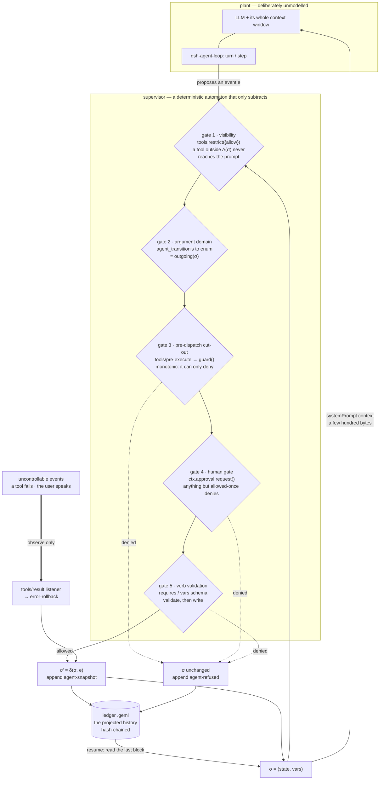

# @geml/agent-runtime — a supervisor for DeepSeek Harness agents

English | [中文](README.zh.md)

A **statechart written in GEML** decides, at every moment, which tools an agent
can see, which transitions it may take, and which variables it may write. Every
change is validated before it lands and appended to a **hash-chained ledger** —
itself an ordinary GEML document you can read, address, diff and verify.

This is not a model of the agent. It is a **supervisor** in the
Ramadge–Wonham sense: the agent (an LLM plus its whole context) is the plant,
left unmodelled; the supervisor runs beside it and only ever *removes* events
from what may happen next. What it buys you is a safety property — certain
action sequences cannot occur — not convergence, and not a prediction of what
the model will do.



The supervisor's state is `σ = (state, vars)`, and the allowed set is one line:

> `A(σ)` = the tools this state declares ∩ the registered tools, ⋃ the outgoing
> transitions whose guard holds against the current `vars`, ⋃ the variables this
> state may write.

## Status

| | |
|---|---|
| Shipping now | The `geml-agent/v1` vocabulary, the core library (statechart loading and static checks, hash-chained snapshots, ledger render/read/verify), and the `geml-agent` CLI. |
| Not yet | The harness plugin that enforces the statechart at runtime — the gates above are designed against DeepSeek Harness `0.1.5-rc.1`'s real hooks, but the plugin row is not in this bundle yet. |
| Also in this bundle | The GEML MCP server and the authoring and code-graph skills (see [Install](#install)). |

Design: [`docs/design/specs/2026-09-14-geml-agent-runtime-design.md`](../../docs/design/specs/2026-09-14-geml-agent-runtime-design.md).
Vocabulary: [`spec/profiles/geml-agent/`](../../spec/profiles/geml-agent/geml-agent-profile.md).

## A statechart

```geml
=== meta
profile = "geml-agent/v1"
tools   = "read_file grep"
===

=== agent-vars {#vars}
{ "type": "object", "additionalProperties": false, "properties": {
    "order":    { "type": "string" },
    "amount":   { "type": "number",  "default": 0 },
    "approved": { "type": "boolean", "default": false } } }
===

=== agent-state {#intake initial vars="order amount"}
Collect the order id and the refund amount. Do not judge yet.
===

=== agent-state {#pay tools="pay_refund" vars=none rollback-on-error}
Execute the refund exactly once.
===

=== data {#is-approved format=json}
{ "type": "object", "required": ["approved"], "properties": { "approved": { "const": true } } }
===

=== agent-transition {#to-pay from=#review to=#pay requires=#is-approved approval}
Policy allows the refund. A human must approve this step.
===
```

In `#pay` the model sees exactly one external tool, may write nothing, and any
failure rolls the variables back to where the state was entered. `geml check`
validates the document like any other GEML; `geml get agent.geml '#pay'` reads
one state; `.gemlhistory` versions it.

Run `geml-agent init` to write this example (the full version) into the current
directory.

## What it does not do

It constrains only the part of the world it models. These three are not
oversights:

- **A rollback restores declared variables and the control state, never an
  external side effect.** The ledger can set `approved` back to `false`; it
  cannot un-send a refund. Compensation is the statechart author's to write.
- **Tool gating is not a sandbox.** It decides which tools the model may call
  in a state; what an allowed `bash` then does is the harness sandbox's
  business. The two layers are complementary.
- **Resuming restores the state, not the conversation.** A few hundred bytes
  bring back where the run is and what may happen next; the transcript is
  replayed by the harness under its own rules.

The fit is therefore **enumerable processes** — approvals, KYC, ticket triage,
operations runbooks. Open-ended work (writing code, doing research) has no
enumerable state, and forcing one on it removes the flexibility the agent is
for.

## CLI

```
geml-agent check <flow.geml> [--tools a,b]        static checks (exit 1 on errors)
geml-agent snapshot <ledger.geml> [--json]        the last revision
geml-agent verify <ledger.geml> [--statechart f]  hash chain and consistency
geml-agent export <ledger.geml> --to md           revision table with per-step diffs
geml-agent init [dir]                             write the example agent.geml
geml-agent run [--profile name] <task>            add the bundle to a dsh profile and run the task there
```

Only `run` reaches outside this package: it finds `dsh` on PATH (falling back to
`npx -y @deepseek-ai/dsh`), adds the bundle to the profile — `headless` unless
you name another — and hands the task over, passing dsh's exit code back. If the
add fails it prints dsh's own words and the two commands to run by hand, and
never starts the task under a profile that is not carrying the supervisor.

`check` reports eleven diagnostics of its own on top of `geml check`'s —
no initial state, a transition leaving a final state, a guard that is not a
schema, a variable no `agent-vars` declares, an unreachable state, and so on.

`verify` recomputes the whole chain: contiguous revisions, every `parent`
equal to the previous hash, every hash recomputed from its content, and — given
the statechart — every recorded transition matching a declared edge. Deleting a
**trailing** run of blocks is the one edit the chain cannot detect.

## Install

```sh
dsh plugin --profile web add @geml/agent-runtime
```

Verify the layer without booting, then boot:

```sh
dsh --profile web --dump-config   # shows a "# == @geml/agent-runtime" layer
dsh --profile web
```

The bundle contributes two rows today: the **GEML MCP server**
(`npx -y @geml/geml mcp --root .`, confined to the session's project directory,
so the model edits one block at a time instead of rewriting files) and the two
**skills** under `skills/` — authoring and code-graph. Override either by `id`
in your profile's `cordis.patch.yml`, restating every key the row needs.

The CLI alone, without the harness:

```sh
npx -y @geml/agent-runtime init
npx -y @geml/agent-runtime check agent.geml
```

## Development

```sh
npm install        # links @geml/geml from ../../geml-parser
npm test           # tsc + node --test
```

`src/core/` is a pure library — no `node:fs`, no `process`, no `console` (a
test pins it) — so the CLI and the future harness plugin share one
implementation. `src/host-fs.ts` is the only module that touches the file
system.
