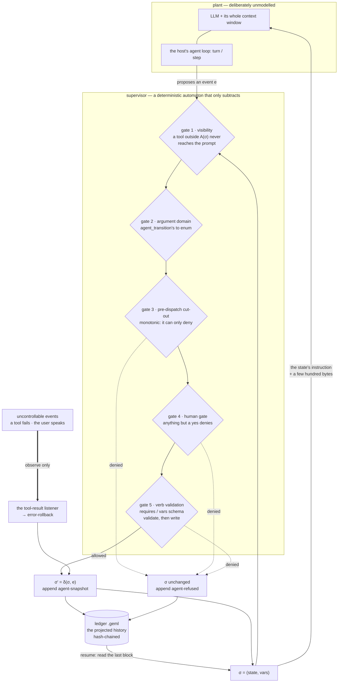

# @geml/agent-runtime — a supervisor for coding agents

English | [中文](README.zh.md)

A **statechart written in GEML** decides, at every moment, which tools an agent
can see, which transitions it may take, and which variables it may write. Every
change is validated before it lands and appended to a **hash-chained ledger** —
itself an ordinary GEML document you can read, address, diff and verify.

This is not a model of the agent. It is a **supervisor** in the
Ramadge–Wonham sense: the agent (an LLM plus its whole context) is the plant,
left unmodelled; the supervisor runs beside it and only ever *removes* events
from what may happen next. What it buys you is a safety property — certain
action sequences cannot occur — not convergence, and not a prediction of what
the model will do.



Only the mechanism is the host's; every decision above is one module
(`src/core/supervisor.ts`) that neither host has a copy of:

| | DeepSeek Harness | pi agent |
|---|---|---|
| gate 1 · visibility | `agent.ctx.tools.restrict()` | `pi.setActiveTools()` |
| gate 2 · argument domain | the verbs are re-registered per state, so the enum is `outgoing(σ)` | registered once per session, so the enum is every target in the statechart; gate 5 refuses the rest |
| gate 3 · cut-out | `agent.ctx.tools.guard()` | `tool_call` → `{ block, reason }` |
| gate 4 · human gate | `ctx.approval.request()` — no service, a throw, or anything but `allowed-once` denies | `ctx.ui.confirm()` — and no UI at all (`-p`, json) denies |
| gate 5 · verb validation | the same module | the same module |
| pause / final ends the turn | `exec.concludeTurn()` | `AgentToolResult.terminate` |
| σ reaches the model | a prompt section + a per-step context block | the system prompt, rebuilt once per user turn |
| the ledger | `<ledgerDir>/<session>.geml` | the same file, plus one session entry per block — which is what makes a forked session inherit the chain |

The supervisor's state is `σ = (state, vars)`, and the allowed set is one line:

> `A(σ)` = the tools this state declares ∩ the registered tools, ⋃ the outgoing
> transitions whose guard holds against the current `vars`, ⋃ the variables this
> state may write.

## Status

| | |
|---|---|
| Shipping now | The `geml-agent/v1` vocabulary; the core library (statechart loading and static checks, hash-chained snapshots, ledger render/read/verify, the supervisor itself); the `geml-agent` CLI; and both host adapters — a Cordis plugin for DeepSeek Harness `0.1.5-rc.1` and an extension for pi agent `0.85.x`. |
| Tested without a model | Every gate, on both hosts: the DSH adapter against a real agent from `dsh-agent-loop-testkit`, the pi agent adapter against a double that runs its own pipeline order and its own argument validator. A run against a live model is a manual step, below. |
| Not yet measured | What per-state gating costs pi agent's prompt-prefix cache. Its own docs say that a non-additive change to the active tool set resends the whole tool list and may invalidate the cached prefix, which is what every transition does. `GEML_AGENT_VISIBILITY=guard-only` trades gate 1 away to avoid it; gate 3 still refuses the call. |
| Also in this bundle | The GEML MCP server and the authoring and code-graph skills (see [Install](#install)). |

Design: [`docs/design/specs/2026-09-14-geml-agent-runtime-design.md`](../../docs/design/specs/2026-09-14-geml-agent-runtime-design.md).
Vocabulary: [`spec/profiles/geml-agent/`](../../spec/profiles/geml-agent/geml-agent-profile.md).

## A statechart

This is the workflow `geml-agent init` writes, abridged — the one that governs
a coding session:

```geml
=== meta
profile = "geml-agent/v1"
tools   = "read grep find ls"
===

=== agent-vars {#vars}
{ "type": "object", "additionalProperties": false, "properties": {
    "goal":       { "type": "string" },
    "plan":       { "type": "string" },
    "command":    { "type": "string" },
    "tests-pass": { "type": "boolean", "default": false } } }
===

=== agent-state {#explore initial vars="goal touched"}
Read the code before proposing anything. This state admits no way to change the
repository.
===

=== agent-state {#implement tools="read edit write grep ls" vars=none}
Make the change. `edit` and `write` exist here and nowhere else, and `bash`
does not exist here at all.
===

=== data {#tests-green format=json}
{ "type": "object", "required": ["tests-pass"], "properties": { "tests-pass": { "const": true } } }
===

=== agent-transition {#to-review from=#verify to=#review requires=#tests-green}
The command passed. Hand it to a person.
===
```

In `#implement` the model can edit but cannot run anything; in `#verify` it can
run but cannot edit. Neither is a rule in a prompt that the model may forget or
argue with — the tools are simply not in the request. `geml check` validates the
document like any other GEML; `geml get agent.geml '#implement'` reads one
state; `.gemlhistory` versions it.

`geml-agent init` writes the full version into the current directory, and
`geml-agent init --template refund` writes an approval workflow instead.

## What it does not do

It constrains only the part of the world it models. These three are not
oversights:

- **A rollback restores declared variables and the control state, never an
  external side effect.** The ledger can set `approved` back to `false`; it
  cannot un-send a refund. Compensation is the statechart author's to write.
- **Tool gating is not a sandbox.** It decides which tools the model may call
  in a state; what an allowed `bash` then does is the harness sandbox's
  business. The two layers are complementary.
- **Resuming restores the state, not the conversation.** A few hundred bytes
  bring back where the run is and what may happen next; the transcript is
  replayed by the harness under its own rules.
- **A gate is only as strong as the host's weakest mechanism for it**, and the
  table above says which. Gate 2 is the live example: on pi agent, the `to` enum names
  every target in the statechart rather than only the ones reachable from `σ`,
  because a pi agent tool cannot be re-registered mid-session. The move is still
  refused — by gate 5, one step later, and recorded as a refusal.

The fit is therefore **whatever has an enumerable order**, which is not the
same as work whose *content* is enumerable. Approvals, KYC and ticket triage
are the easy case: the steps themselves are known in advance.

Writing code is the interesting one. What the agent will write is not
enumerable and should not be — but the **phases** are: you read before you
plan, plan before you edit, and run the tests before you claim they pass. The
shipped `agent.geml` models exactly that and nothing finer. A state per file or
per function would be the failure mode: it spends the model's judgement on
paperwork and buys nothing, because the order of those steps carries no
meaning. If a step's position in the order does not matter, it does not deserve
a state.

## CLI

```
geml-agent check <flow.geml> [--tools a,b]        static checks (exit 1 on errors)
geml-agent snapshot <ledger.geml> [--json]        the last revision
geml-agent verify <ledger.geml> [--statechart f]  hash chain and consistency
geml-agent export <ledger.geml> --to md           revision table with per-step diffs
geml-agent init [dir] [--template coding|refund]  a starting agent.geml (default: coding)
geml-agent run [--profile name] <task>            add the bundle to a dsh profile and run the task there
```

Only `run` reaches outside this package: it finds `dsh` on PATH (falling back to
`npx -y @deepseek-ai/dsh`), adds the bundle to the profile — `headless` unless
you name another — and hands the task over, passing dsh's exit code back. If the
add fails it prints dsh's own words and the two commands to run by hand, and
never starts the task under a profile that is not carrying the supervisor.

`check` reports eleven diagnostics of its own on top of `geml check`'s —
no initial state, a transition leaving a final state, a guard that is not a
schema, a variable no `agent-vars` declares, an unreachable state, and so on.

`verify` recomputes the whole chain: contiguous revisions, every `parent`
equal to the previous hash, every hash recomputed from its content, and — given
the statechart — every recorded transition matching a declared edge. Deleting a
**trailing** run of blocks is the one edit the chain cannot detect.

## Start on a repository

What it looks like to use this on a project, end to end. Five minutes, and
nothing here is published yet, so step 1 builds the package from this checkout.

**Dependencies.** Node 22 or newer, and a harness: [pi agent](https://pi.dev)
(`npm install -g @earendil-works/pi-coding-agent`) or DeepSeek Harness. Plus an
API key for whichever model you point the harness at — the supervisor never
sees it.

```sh
# 1. build an installable tarball (bundles the parser, which is not on npm yet)
cd integrations/geml-agent-runtime && npm install && npm run pack:local

# 2. install it — the CLI globally, the supervisor into your harness
npm install -g ./geml-agent-runtime-0.1.0.tgz
pi install /absolute/path/to/geml-agent-runtime-0.1.0.tgz

# 3. in the repository you want to work on
cd ~/code/my-project
geml-agent init                      # writes agent.geml: the coding workflow
geml-agent check agent.geml          # 0 = it will load

# 4. work
pi "make the failing test in test/user.test.ts pass"
```

From step 4 on it is an ordinary session, except that the tool list the model
gets is the one the current state declares. In `#explore` that is `read grep
find ls` — the model cannot edit, and cannot run a command, until it has
recorded a goal and a plan and moved to `#implement`. Ask it to commit before
the tests have run and the transition is refused with the reason, in words,
and the refusal is in the ledger.

The ledger lands in `<session dir>/geml-agent/<session>.geml`. Read it with
`geml-agent export <ledger> --to md`, check it with `geml-agent verify`.

**Edit `agent.geml` to fit your project.** It is the whole configuration: the
states, the tools each one admits, the variables, and the guards. The shipped
one makes four claims — no edit before a plan, no command while editing, no
"done" without a recorded test result, and a human on the last step. If your
project wants a different order, that is a text edit, not a code change.

### See the whole thing run, without an API key

```sh
npm run walkthrough
```

That starts a REAL pi agent session against a throwaway project with a failing
test, driven by a scripted model (`examples/scripted-model.js`) so it needs no
credentials and says the same thing every time. Everything else is real — pi
agent's loop, its tool pipeline, the `bash` calls actually run. It prints which
tools the model was offered at each step, what the gates refused, and the
ledger that came out. It is the shortest way to decide whether this shape of
constraint is one you want.

## Install

### DeepSeek Harness

```sh
dsh plugin --profile web add @geml/agent-runtime
```

Verify the layer without booting, then boot:

```sh
dsh --profile web --dump-config   # shows a "# == @geml/agent-runtime" layer
dsh --profile web
```

The bundle contributes three rows: the **supervisor**
(`@geml/agent-runtime/dsh`, which attaches per agent and does nothing at all
when the session's working directory holds no `agent.geml` — that is
`onMissing: skip`), the **GEML MCP server** (`npx -y @geml/geml mcp --root .`,
confined to the session's project directory, so the model edits one block at a
time instead of rewriting files) and the two **skills** under `skills/` —
authoring and code-graph. Override any of them by `id` in your profile's
`cordis.patch.yml`, restating every key the row needs.

### pi agent

```sh
pi install npm:@geml/agent-runtime
```

The same tarball is a pi package: its `pi.extensions` points at the supervisor
and its `pi.skills` at the same two skills, which already sit one `SKILL.md`
folder each — pi agent's own convention.

The statechart is read when the extension loads, because the three verbs have
to be registered before the first session starts and their schemas come from
it. That is why the path is an environment variable and not a flag — flags are
not parsed yet at that point:

```sh
GEML_AGENT_STATECHART=agent.geml pi      # the default, relative to the cwd
GEML_AGENT_LEDGER_DIR=/var/ledgers pi    # default: <session dir>/geml-agent
GEML_AGENT_VISIBILITY=guard-only pi      # keep the tool list static (see Status)
```

No statechart, no registrations and no listeners: `pi` behaves exactly as it
does without this package.

Three things about pi agent are read from its published types and docs rather than
measured, and a run against a live model is where to check them: what per-state
gating costs the prompt-prefix cache; whether `ctx.ui.confirm` throws or
returns a default when there is no UI (either way this adapter denies); and
whether `getBranch()` after a fork returns the branch or the whole tree (the
`hash`/`parent` chain is computed from what it returns, and `geml-agent verify`
is what would catch it).

The CLI alone, without the harness:

```sh
npx -y @geml/agent-runtime init
npx -y @geml/agent-runtime check agent.geml
```

## Development

```sh
npm install        # links @geml/geml from ../../geml-parser
npm test           # tsc + node --test
```

`src/core/` is a pure library — no `node:fs`, no `process`, no `console`, and
no host package either (tests pin all of it) — so the CLI and both adapters
share one implementation. `src/host-fs.ts` is the only module that touches the
file system.

The layout follows from that: `src/core/supervisor.ts` decides, and
`src/hosts/dsh/` and `src/hosts/pi/` only translate. Neither adapter may import
the other's host — they are optional peer dependencies, so an install with one
harness must never resolve the other's packages, and a test enforces it. Each
host also has a parity test (`dsh-parity`, `pi-parity`) that asserts the shapes
this package depends on against the installed packages: when a host moves, the
suite goes red here rather than in someone's session.
