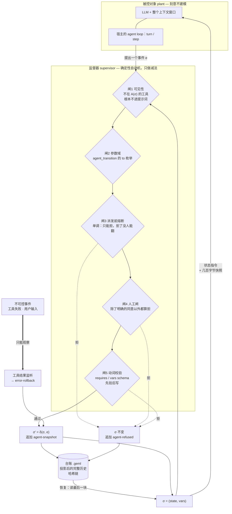

# @geml/agent-runtime — coding agent 的监督器

[English](README.md) | 中文

一份**用 GEML 写的状态图**决定 agent 此刻能看见哪些工具、能走哪些跃迁、能改哪些
变量。每次变化先校验后落地，并追加进一本**带哈希链的台账**——台账本身就是一份
普通 GEML 文档，可读、可寻址、可 diff、可校验。

这不是对 agent 的建模，而是一个 Ramadge–Wonham 意义上的**监督器**：被控对象是
LLM 加它的整个上下文，任意、不建模；监督器在旁边并行运行，只做一件事——把事件
从"接下来可能发生"里拿掉。它买到的是**安全性质**：某些动作序列不可能发生。不是
收敛，也不是对模型行为的预测。



上面每一道闸的**判断**都只有一份（`src/core/supervisor.ts`），两个宿主各自只提供
**机制**，谁也没有第二份拷贝：

| | DeepSeek Harness | pi agent |
|---|---|---|
| 闸1 可见性 | `agent.ctx.tools.restrict()` | `pi.setActiveTools()` |
| 闸2 参数域 | 动词按状态重注册，枚举就是 `outgoing(σ)` | 每会话只注册一次，枚举是状态图里的全部目标；其余交给闸5 拒 |
| 闸3 熔断 | `agent.ctx.tools.guard()` | `tool_call` → `{ block, reason }` |
| 闸4 人工闸 | `ctx.approval.request()`——没挂服务、抛异常、非 `allowed-once` 都算拒 | `ctx.ui.confirm()`——连 UI 都没有（`-p`、json）也算拒 |
| 闸5 动词校验 | 同一份 | 同一份 |
| 进 pause / final 结束回合 | `exec.concludeTurn()` | `AgentToolResult.terminate` |
| σ 怎么到模型眼前 | 一段提示词 section + 每步一次的 context | 系统提示词，每个用户回合重建一次 |
| 台账 | `<ledgerDir>/<session>.geml` | 同一个文件，外加每块一条会话条目——分叉出去的会话就是靠它继承整条链的 |

监督器的状态是 `σ = (state, vars)`，允许集一行说完：

> `A(σ)` = 当前状态声明的工具 ∩ 已注册工具，⋃ 守卫在当前 `vars` 下成立的那些
> 出边，⋃ 当前状态允许写的变量。

## 状态

| | |
|---|---|
| 现在可用 | `geml-agent/v1` 词汇表；核心库（状态图载入与静态检查、哈希链快照、台账渲染/读取/校验、监督器本身）；`geml-agent` CLI；两个宿主适配器——DeepSeek Harness `0.1.5-rc.1` 的 Cordis 插件与 pi agent `0.85.x` 的扩展。 |
| 不接模型也测过 | 五道闸在两个宿主上各测一遍：DSH 侧用 `dsh-agent-loop-testkit` 起真 agent，pi agent 侧用一个按它自己的管线顺序、并且用它自己的参数校验器（typebox）跑的替身。接真模型跑一遍是手工步骤，见下。 |
| 还没实测 | 按状态门控在 pi agent 上对提示词前缀缓存的真实代价。它自己的文档写明：非增量地更换活跃工具集要重发整张工具表、可能让缓存前缀失效——而每次跃迁干的正好是这件事。`GEML_AGENT_VISIBILITY=guard-only` 可以把闸1 换掉省这笔钱，闸3 照拦。 |
| bundle 里还带着 | GEML MCP server，以及写作与代码图谱两个技能（见[安装](#安装)）。 |

设计：[`docs/design/specs/2026-09-14-geml-agent-runtime-design.md`](../../docs/design/specs/2026-09-14-geml-agent-runtime-design.md)。
词汇表：[`spec/profiles/geml-agent/`](../../spec/profiles/geml-agent/geml-agent-profile_CN.md)。

## 一份状态图

下面是 `geml-agent init` 写出来的那份（节选）——管一次 coding 会话的那份：

```geml
=== meta
profile = "geml-agent/v1"
tools   = "read grep find ls"
===

=== agent-vars {#vars}
{ "type": "object", "additionalProperties": false, "properties": {
    "goal":       { "type": "string" },
    "plan":       { "type": "string" },
    "command":    { "type": "string" },
    "tests-pass": { "type": "boolean", "default": false } } }
===

=== agent-state {#explore initial vars="goal touched"}
先把代码读明白再提方案。这个状态里没有任何能改动仓库的途径。
===

=== agent-state {#implement tools="read edit write grep ls" vars=none}
动手改。`edit` 和 `write` 只在这里有，而 `bash` 在这里根本不存在。
===

=== data {#tests-green format=json}
{ "type": "object", "required": ["tests-pass"], "properties": { "tests-pass": { "const": true } } }
===

=== agent-transition {#to-review from=#verify to=#review requires=#tests-green}
命令过了，交给人。
===
```

在 `#implement` 里模型能改文件但执行不了任何命令；在 `#verify` 里能执行但改不了
文件。这两条都不是写在提示词里、模型可以忘掉或者跟你讲道理的规矩——那些工具压根
不在请求里。`geml check` 像验任何 GEML 一样验它；`geml get .geml/agent.geml '#implement'`
取一个状态；`.gemlhistory` 给它记版本。

`geml-agent init` 把完整版写到当前目录；`geml-agent init --template refund` 写的
则是一份审批流程。

## 它不做什么

它只约束它建模了的那部分世界。下面三条不是疏漏：

- **回滚恢复的是声明变量与控制状态，不是外部副作用。** 台账能把 `approved`
  拨回 `false`，拨不回已经打出去的退款。补偿跃迁要状态图作者自己写。
- **工具门控不是沙箱。** 它决定模型在某个状态里能调哪些工具；被放行的 `bash`
  里干了什么，那是 harness 沙箱的事。两层互补。
- **恢复恢复的是状态，不是对话。** 几百字节带回"在哪、能做什么"；对话由 harness
  按它自己的规则重放。
- **一道闸的强度按宿主最弱的那个机制算**，上面那张表写的就是哪一个。闸2 是现成的
  例子：pi agent 上 `to` 的枚举是状态图里的全部目标，而不是只有 `σ` 当下能到的那几个，
  因为它的工具不能在会话中途重注册。但这一步仍然会被拒——晚一道闸，由闸5 拒，
  并且照样记进台账。

因此适用面是**顺序可枚举的事**——注意这跟「内容可枚举」不是一回事。审批、KYC、
工单分级是容易的那一类：步骤本身事先就知道。

写代码是有意思的那一类。agent 会写出什么，不可枚举，也不该枚举——但**阶段**是可
枚举的：先读再想，先有计划再动文件，先真跑测试再说测试过了。自带那份 `.geml/agent.geml`
建模的就是这个，不再细。细到一个文件一个状态、一个函数一个状态，那就是失败模式：
把模型的判断力花在填表上，而且什么都没买到——因为那些步骤的先后本来就不承载意义。
一个步骤排在哪儿无所谓，它就不配拥有一个状态。

## CLI

```
geml-agent check <flow.geml> [--tools a,b]        静态检查（有 error 退出 1）
geml-agent snapshot <ledger.geml> [--json]        最后一条修订
geml-agent verify <ledger.geml> [--statechart f]  哈希链与自洽性
geml-agent export <ledger.geml> --to md           修订表，逐步变量 diff
geml-agent init [dir] [--template coding|refund]  写出一份起步的 agent.geml（默认 coding）
geml-agent run [--profile name] <task>            把 bundle 加进某个 dsh profile，并在那里跑这个任务
```

只有 `run` 会伸到这个包外面：它在 PATH 上找 `dsh`（找不到就退回
`npx -y @deepseek-ai/dsh`），把 bundle 加进 profile（不指定就是 `headless`），
然后把任务交过去，并把 dsh 的退出码原样传回。加失败时它把 dsh 自己的话打出来，
再给出手工执行的两条命令，绝不在一个没装监督器的 profile 上把任务跑起来。

`check` 在 `geml check` 之上另报十一条自己的诊断——没有初始状态、终态有出边、
守卫不是 schema、`vars` 里的名字 `agent-vars` 没声明、状态不可达，等等。

`verify` 重算整条链：修订号连续、每个 `parent` 等于前一块的哈希、每个哈希按内容
重算、并且——给了状态图时——每次记录的跃迁都对应一条声明过的边。删掉**末尾**
一段块是这条链唯一检测不出的改动。

## 在一个项目上开始用

从零到跑起来，五分钟。东西还没发 npm，所以第一步是从这份检出里打包。

**依赖**：Node 22 以上，加一个 harness——[pi agent](https://pi.dev)
（`npm install -g @earendil-works/pi-coding-agent`）或者 DeepSeek Harness；再加
你给 harness 配的模型 key——监督器不碰它。

`pi install` 收的是包**目录**、`npm:` 源或者 `git:` 源，**不是 `.tgz`**。喂它一个
tarball，它会照单收下、写进 `settings.json`，然后此后每次启动都报
`Unknown file extension ".tgz"`。已经踩了的话，`pi remove <同一个路径>` 就好。

```sh
# 1. 打一个能装的包（把还没发布的解析器打进去）
cd integrations/geml-agent-runtime && npm install && npm run pack:local

# 2. 装：两个安装器要的东西不一样，pack:local 跑完会把两个路径都打出来
npm install -g ./geml-agent-runtime-0.1.0.tgz        # CLI：要 tarball
pi install /绝对路径/geml-agent-runtime-pkg          # pi agent：要一个目录

# 3. 到你要干活的仓库里
cd ~/code/my-project
geml-agent init                     # 写出 .geml/agent.geml：默认就是「写代码」这套流程
geml-agent check .geml/agent.geml   # 0 表示它能载入

# 4. 干活
pi "把 test/user.test.ts 里那个挂掉的用例修好"
```

第 4 步之后就是一次普通会话，唯一的差别是：模型拿到的工具表是**当前状态**声明的
那一份。在 `#explore` 里那是 `read grep find ls`——它改不了文件，也执行不了命令，
除非先记下目标和计划、跃迁到 `#implement`。让它在测试没跑之前就收工，跃迁会被拒，
理由用人话给出，并且这条拒绝进台账。

台账落在 `<会话目录>/geml-agent/<session>.geml`。`geml-agent export <台账> --to md`
读它，`geml-agent verify` 验它。

**`.geml/agent.geml` 就是全部配置，按你的项目改它。** 状态、每个状态放哪些工具、变量、
守卫，全在里面。自带这份做了四个约束：没计划不许改文件、改文件时不许执行命令、
没有真实测试结果不许说完成、最后一步交给人。你的项目要别的顺序，那是改一段文本，
不是改代码。

### 不用 API key，先把整条路看一遍

```sh
npm run walkthrough
```

它会起一个**真的** pi agent 会话，对着一个临时项目（里面有个挂掉的测试），由一个
脚本化的模型（`examples/scripted-model.js`）驱动，所以不需要任何凭证，而且每次输出
一样。除了模型，其它全是真的——pi agent 自己的循环、它的工具管线，`bash` 是真跑的。
它会打印每一步模型**实际拿到**的工具表、每道闸拒了什么、以及最后那本台账。想判断
这种约束形态是不是你要的，这是最短的路。

## 安装

### DeepSeek Harness

```sh
dsh plugin --profile web add @geml/agent-runtime
```

先不启动、只验证这一层，再启动：

```sh
dsh --profile web --dump-config   # 应能看到 "# == @geml/agent-runtime" 这一层
dsh --profile web
```

bundle 贡献三行：**监督器**（`@geml/agent-runtime/dsh`，按 agent 挂载；会话的工作
目录里没有 `.geml/agent.geml` 时它什么都不做——这就是 `onMissing: skip`）、**GEML MCP
server**（`npx -y @geml/geml mcp --root .`，限定在会话自己的项目目录内，于是模型
一次改一个块而不是重写整个文件），以及 `skills/` 下的两个**技能**——写作与代码
图谱。要覆盖哪一行，在你 profile 的 `cordis.patch.yml` 里按 `id` 重写，注意把该行
需要的每个键都写全。

### pi agent

```sh
pi install npm:@geml/agent-runtime
```

同一个包就是一个 pi package：`pi.extensions` 指向监督器，`pi.skills` 指向同样那
两个技能——它们本来就是一个技能一个 `SKILL.md` 文件夹，正是 pi agent 自己的约定。

状态图在**扩展加载时**读一次，因为三个动词必须在第一个会话开始之前注册好，而它们
的 schema 来自状态图。这也是为什么路径是环境变量而不是命令行 flag——那个时刻 flag
还没解析：

```sh
GEML_AGENT_STATECHART=.geml/agent.geml pi      # 默认值，相对当前目录
GEML_AGENT_LEDGER_DIR=/var/ledgers pi    # 默认 <会话目录>/geml-agent
GEML_AGENT_VISIBILITY=guard-only pi      # 工具表保持不变（见"状态"）
```

没有状态图时：不注册、不监听，`pi` 的行为和没装这个包完全一样。

pi agent 这边有三件事只读过它发布的类型与随包文档、没有实测，接真模型跑的时候正是要看
它们：按状态门控对提示词前缀缓存的代价；没有 UI 时 `ctx.ui.confirm` 是抛异常还是
返回默认值（两种情况本适配器都按拒处理）；以及 fork 之后 `getBranch()` 给的是分支
还是整棵树（`hash`/`parent` 是按它返回的东西算的，出问题由 `geml-agent verify`
抓）。

不装 harness，只用 CLI：

```sh
npx -y @geml/agent-runtime init
npx -y @geml/agent-runtime check agent.geml
```

## 开发

```sh
npm install        # 把 @geml/geml 链到 ../../geml-parser
npm test           # tsc + node --test
```

`src/core/` 是纯函数库——不碰 `node:fs`、`process`、`console`，也不 import 任何
宿主的包（这几条都有测试钉着）——所以 CLI 和两个适配器共用同一份实现。
`src/host-fs.ts` 是唯一碰文件系统的模块。

目录结构就是从这条规矩来的：`src/core/supervisor.ts` 做判断，`src/hosts/dsh/` 与
`src/hosts/pi/` 只做翻译。两个适配器谁都不许 import 对方的宿主——宿主包都是可选
peer，只装了一家 harness 的人绝不能被解析到另一家的包上，这条有测试拦着。每个宿主
还各有一份 parity 测试（`dsh-parity`、`pi-parity`），拿我们依赖的形状去对已安装的
包做断言：宿主改了接口，红在这儿，而不是红在用户的会话里。
