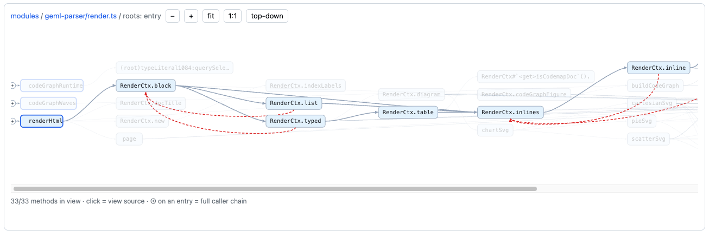

# geml-codemap guide

> **Status** stable · **Declare** `profile = "geml-codemap/v1"` (`geml codemap build` writes it) · **Limits** languages other than TypeScript/JavaScript need an indexer installed

## What it does

It writes a codebase's call graph as GEML documents. Every method is a block with an id,
and the `#calls` / `#called-by` tables link it both ways: what it calls, and who calls it.
The tool is called codemap (`geml codemap`). The name geml-code-graph appears only where it is literal: the output directory `.geml-code-graph/`, the diagram format, and the Claude skill.



## Try it

Install the CLI (Node 22+), then run the other two at the root of your repository:

```sh
npm i -g @geml/geml
geml codemap build    # detects the languages, indexes them, writes .geml-code-graph/
geml codemap serve    # serves the graph at http://localhost:8140/ and opens your browser
```

What each language needs:

- **TypeScript / JavaScript**: nothing. `build` fetches the scip indexer through npx, so the first run needs the network.
- **Java, C, Python, Go, Kotlin**: [Joern](https://docs.joern.io/installation). Unzip it and pass the folder, `geml codemap build --joern ~/joern/joern-cli`, or put it on PATH.
- **Rust**: `rust-analyzer` on PATH.

A repository with a frontend and a backend in different languages still becomes one graph.
Measured on Apache Flink: 13,585 Java files, ~81,000 methods, 266,821 call edges.

## Everyday use

Find a method, then list who calls it; swap `#called-by` for `#calls` to see what it calls.
Here on a small TypeScript project named `demo`:

```console
$ geml codemap find add
add	demo.geml#add	src/math.ts#L1-3

1 match(es) for "add" across 1 name(s).
$ geml get .geml-code-graph/demo.geml '#called-by'
=== table {#called-by format=csv}
from,         to,           kind, site
#main,        #formatTotal, call, src/main.ts:4
#formatSum,   #add,         call, src/format.ts:8
#total,       #add,         call, src/math.ts:6
#formatTotal, #total,       call, src/format.ts:4
===
```

What the columns mean, and how far to trust an edge, is in §4 and §8 of the reference.

After a commit, bring the graph up to date. `refresh` replays the build the first run recorded,
and does nothing when no source file changed:

```sh
geml codemap refresh
```

The Claude skill has an optional hook that runs it after every commit.

Put the graph inside any GEML document with one block:

```geml
=== diagram {format=geml-code-graph src=.geml-code-graph/index.geml}
===
```

Agents ask the same questions over MCP: `geml mcp --root .` adds four read-only `geml_codemap_*` tools when the root holds a graph.

**More:** [Reference](geml-codemap-profile.md) · [Illustrated](https://geml-spec.github.io/illustrated/09-profile-codemap.html) · [Demo](https://geml-spec.github.io/demos/codemap) · [Skill](../../../integrations/claude-plugin/skills/geml-code-graph/SKILL.md)
